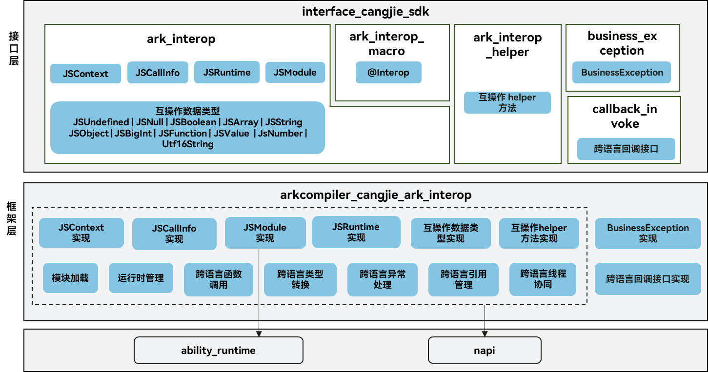
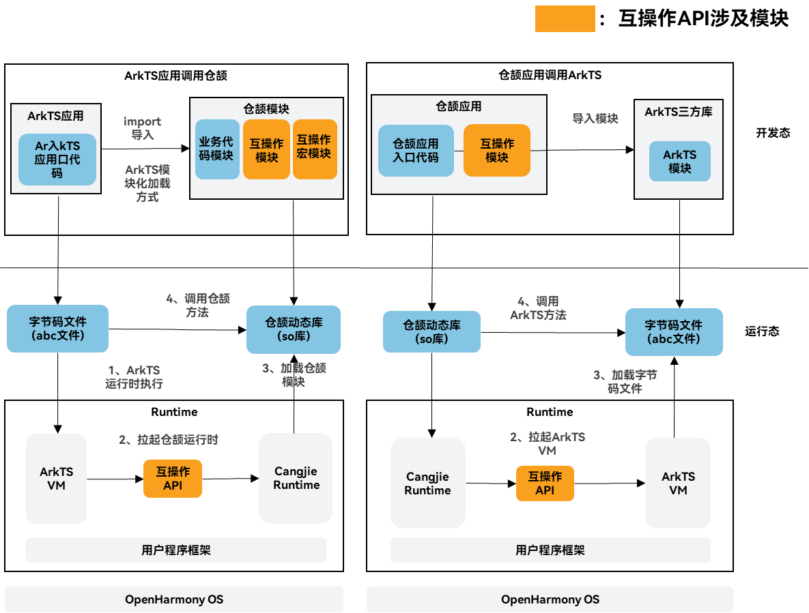

# 仓颉-ArkTS互操作接口

## 简介

仓颉ArkTS互操作库API，用于提供仓颉与ArkTS跨语言互操作能力，包含仓颉互操作库接口、互操作宏接口以及公共能力接口，期望给开发者提供兼顾开发效率和运行效率的跨语言互操作解决方案，提供简洁的互操作开发范式，降低跨语言互通开销。整体架构如下图所示：



**架构图说明**

针对互操作场景诉求，仓颉提供ark_interop互操作库来实现与ArkTS的互操作。

- 互操作库主要提供以下类型映射：

    | **仓颉类型**                                                 | **仓颉互操作库类型** | **ArkTS  类型** |
    | ------------------------------------------------------------ | -------------------- | --------------- |
    | Unit                                                         | JSUndefined          | undefined       |
    | 无                                                           | JSNull               | null            |
    | Bool                                                         | JSBoolean            | boolean         |
    | Int8、Int16、Int32、Int64、UInt8、UInt16、UInt32、UInt64、Float16、Float32、Float64 | JSNumber             | number          |
    | String                                                       | JSString             | string          |
    | class、interface                                             | JSObject             | object          |
    | Array                                                        | JSArray              | Array           |
    | BigInt                                                       | JSBigInt             | bigint          |
    | func                                                         | JSFunction           | function        |
    | 无                                                           | JSSymbol             | symbol          |

- 互操作库还提供以下的关键数据结构：

    - JSValue: 用于表示来自ArkTS中的对象（如数字、字符串、对象、函数），是仓颉与ArkTS类型转换的桥梁。
    - JSModule: JSModule的目标是提供符号导出能力（导出到ArkTS）。配合自定义静态初始化函数，在动态库被加载时把导出目标注册到全局表，并由ArkTS引擎来执行导出。
    - JSRuntime: 仓颉创建的 ArkTS 运行时。
    - JSContext: 用于表示与ArkTS互操作的上下文，提供模块加载、JSValue创建等能力。
    - JSCallInfo: 用于表示当发生来自于ArkTS互操作调用时 调用的参数集合。

- 互操作库通过C语言互操作调用ArkTS虚拟机和napi提供的接口完成互操作功能。

说明：当前开放的仓颉互操作接口仅支持standard设备。

## 公共能力

本仓库还提供了公共能力的接口，比如：JSON序列化和反序列化接口、C语言互操作接口、通用异常接口、回调接口、API Level接口。

- JSON序列化和反序列化接口：用于对JSON数据的处理，实现String,JsonValue,DataModel之间的相互转换。
- C语言互操作接口：提供了管理C互操作对象的工具类。
- 通用异常接口：提供了通用的异常类BusinessException。
- 回调接口：提供了用于函数回调参数的工具类。
- API Level接口：提供了API Level的接口，用于获取当前API Level。


## 目录

```text
arkcompiler/cangjie_ark_interop
├── ohos                   # 仓颉互操作API及公共能力代码
|   ├── ark_interop        # 仓颉互操作库
|   ├── ark_interop_helper # 仓颉互操作库工具类
|   ├── ark_interop_macro  # 仓颉互操作库宏
|   ├── business_exception # 仓颉公共能力，提供异常类
|   ├── callback_invoke    # 仓颉公共能力， 提供回调工具类
|   ├── encoding           # 仓颉公共能，提供JSON库
|   ├── ffi                # 仓颉公共能力，提供C语言互操作库
|   ├── labels             # 仓颉公共能力，提供api level标签
|   ├── utf16string        # 仓颉互操作库提供的utf16字符串处理类
├── doc                    # 仓颉文档，包括API参考、应用开发指南、仓颉编程语言用户手册
|   ├── API_Reference      # 仓颉API参考
|   ├── Dev_Guide          # 仓颉开发指南
|   ├── release-notes      # 仓颉发布说明
|   ├── User_Manual        # 仓颉用户手册
├── figures                # 本README需要使用的图片
├── test                   # 仓颉互操作测试用例
```

## 约束

## 使用场景

包含仓颉-ArkTS互操作库，用于仓颉-ArkTS互操作。json库/APILevel/C语言互操作库为基础功能库，提供给仓颉API/仓颉UI等子系统等公共能力。

在OpenHarmony应用开发中，存在使用仓颉与ArkTS混合开发的诉求，例如以下场景：

- 场景一：在使用ArkTS开发时，通过跨语言互操作调用仓颉开发的代码模块，发挥仓颉高性能高并发优势，提升应用性能体验；

详细的例子请参考：[在 ArkTS 中加载仓颉模块](https://gitcode.com/openharmony-sig/arkcompiler_cangjie_ark_interop/blob/master/doc/User_Manual/source_zh_cn/FFI/cangjie-arkts/arkts_import_cangjie.md)

- 场景二：在使用仓颉开发时，通过跨语言互操作调用ArkTS库，复用ArkTS丰富的库生态；

详细的例子请参考：[仓颉应用中使用 ArkTS 模块](https://gitcode.com/openharmony-sig/arkcompiler_cangjie_ark_interop/blob/master/doc/User_Manual/source_zh_cn/FFI/cangjie-arkts/using_arkts_module.md)

同时针对互操作带来的开发复杂度，仓颉提供声明式互操作宏ark_interop_macro，使开发者可以使用宏“@Interop[ArkTS]”标注仓颉代码中需要导出给ArkTS使用的函数或类型，在编译阶段自动生成互操作“胶水层”代码及ArkTS接口声明，减少开发者手写互操作代码的复杂度。详细的例子请参考：[仓颉- ArkTS 声明式互操作宏](https://gitcode.com/openharmony-sig/arkcompiler_cangjie_ark_interop/blob/master/doc/User_Manual/source_zh_cn/FFI/cangjie-arkts/interoperability_macro.md)。



模块说明：

- 互操作库：开发者通过调用互操作提供的API，实现跨语言参数传递、函数调用等能力。
- 互操作宏：开发者使用互操作宏来标注需要被ArkTS代码调用的仓颉接口，能够自动生成互操作“胶水”代码及ArkTS接口声明。

## 开发者文档

[API文档](https://gitcode.com/openharmony-sig/arkcompiler_cangjie_ark_interop/blob/master/doc/API_Reference/source_zh_cn/arkinterop/cj-apis-ark_interop.md)

[开发指南](https://gitcode.com/openharmony-sig/arkcompiler_cangjie_ark_interop/blob/master/doc/Dev_Guide/summary_cjnative_ohos.md)

## 参与贡献

欢迎广大开发者贡献代码、文档等，具体的贡献流程和方式请参见[参与贡献](https://gitcode.com/openharmony/docs/blob/master/zh-cn/contribute/%E5%8F%82%E4%B8%8E%E8%B4%A1%E7%8C%AE.md)。

## 相关仓

[arkui_napi](https://gitee.com/openharmony/arkui_napi)

[ability_runtime](https://gitee.com/openharmony/ability_ability_runtime)