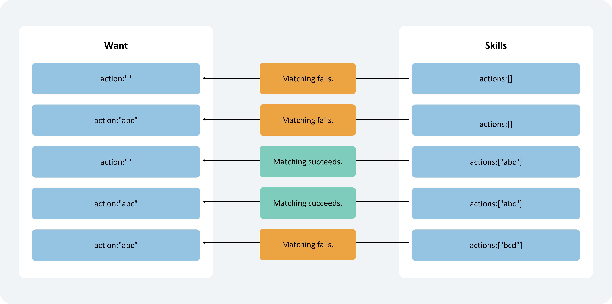
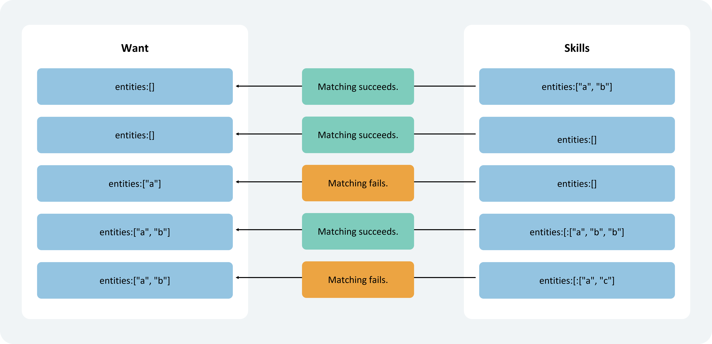
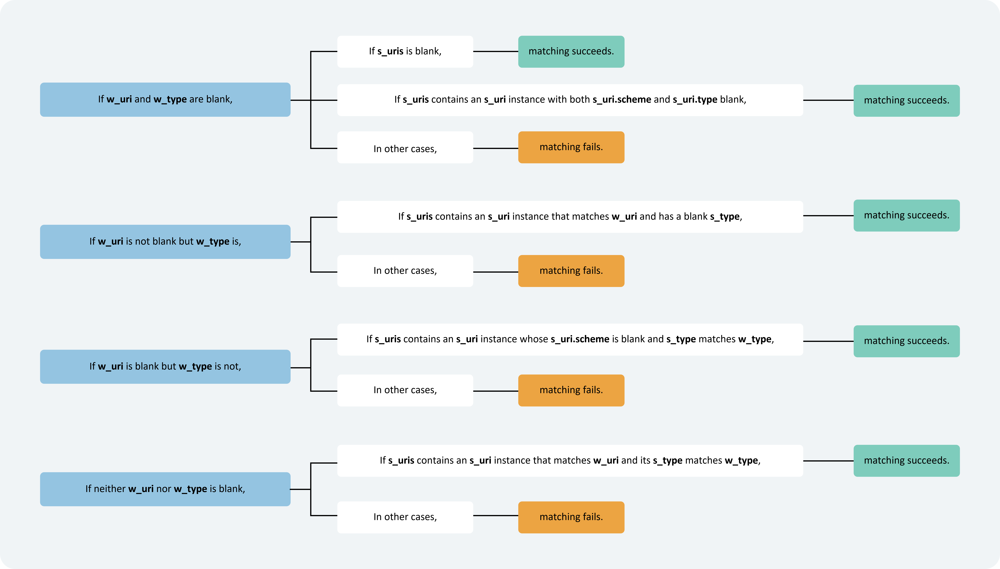

# Explicit Want vs. Implicit Want Matching Rules

When launching a target application component, matching is performed through either an explicit [Want](../../../API_Reference/source_en/apis/AbilityKit/cj-apis-ability.md#class-want) or an implicit [Want](../../../API_Reference/source_en/apis/AbilityKit/cj-apis-ability.md#class-want). The matching rules described in this chapter define how the parameters set in the [Want](../../../API_Reference/source_en/apis/AbilityKit/cj-apis-ability.md#class-want) passed by the caller align with the configuration file declared by the target application component.

## Explicit Want Matching Principle

The matching principle for explicit [Want](../../../API_Reference/source_en/apis/AbilityKit/cj-apis-ability.md#class-want) is as follows:

| Name        | Type                     | Matched | Required | Rules                                                                 |
| ----------- | ------------------------ | ------- | -------- | --------------------------------------------------------------------- |
| deviceId    | String                   | Yes     | No       | If left empty, only matches application components on the local device. |
| bundleName  | String                   | Yes     | Yes      | If abilityName is specified but bundleName is not, matching fails.    |
| moduleName  | String                   | Yes     | No       | If left empty and multiple modules with duplicate component names exist within the same application, the first one is matched by default. |
| abilityName | String                   | Yes     | Yes      | This field must be set to indicate explicit matching.                 |
| uri         | String                   | No      | No       | Ignored during system matching but passed as a parameter to the target component. |
| type        | String                   | No      | No       | Ignored during system matching but passed as a parameter to the target component. |
| action      | String                   | No      | No       | Ignored during system matching but passed as a parameter to the target component. |
| entities    | Array&lt;String&gt;      | No      | No       | Ignored during system matching but passed as a parameter to the target component. |
| flags       | UInt32                   | No      | No       | Not involved in matching; passed directly to the system for runtime information (e.g., URI data authorization). |
| parameters  | String                   | No      | No       | Not involved in matching; custom data is passed directly to the target component. |

## Implicit Want Matching Principle

The matching principle for implicit [Want](../../../API_Reference/source_en/apis/AbilityKit/cj-apis-ability.md#class-want) is as follows:

| Name        | Type                     | Matched | Required | Rules                                                                 |
| ----------- | ------------------------ | ------- | -------- | --------------------------------------------------------------------- |
| deviceId    | String                   | Yes     | No       | Cross-device implicit invocation is currently unsupported.           |
| abilityName | String                   | No      | No       | This field must be left empty to indicate implicit matching.         |
| bundleName  | String                   | Yes     | No       | Matches the target component within the specified application package. |
| moduleName  | String                   | Yes     | No       | Matches the target component within the specified module.             |
| uri         | String                   | Yes     | No       | See [URI and Type Matching Rules for Want Parameters](#uri-and-type-matching-rules-for-want-parameters). |
| type        | String                   | Yes     | No       | See [URI and Type Matching Rules for Want Parameters](#uri-and-type-matching-rules-for-want-parameters). |
| action      | String                   | Yes     | No       | See [Action Matching Rules for Want Parameters](#action-matching-rules-for-want-parameters). |
| entities    | Array&lt;String&gt;      | Yes     | No       | See [Entities Matching Rules for Want Parameters](#entities-matching-rules-for-want-parameters). |
| flags       | UInt32                   | No      | No       | Not involved in matching; passed directly to the system for runtime information (e.g., URI data authorization). |
| parameters  | String                   | Yes     | No       | Custom data is passed directly to the target component. Currently supports matching using the `linkFeature` key. If `linkFeature` is non-empty, priority is given to `linkFeature` matching. |

From the definition of implicit Want, we can deduce:

- The `want` parameter passed by the caller specifies the operation to be performed and provides relevant data and application type constraints.
- The `skills` configuration of the target component declares its capabilities (via the [skills tag](../cj-start/basic-knowledge/module-configuration-file.md#skills-tag) in the [module.json5 configuration file](../cj-start/basic-knowledge/module-configuration-file.md)).

The system matches the caller's `want` parameters (including `action`, `entities`, `uri`, `type`, and `parameters`) against the `skills` configuration of installed target components (including `actions`, `entities`, `uris`, and `type`). If none of the five attributes are configured, implicit matching fails.

- When the `linkFeature` field in `parameters` is non-empty, the system prioritizes `linkFeature` matching.
  - If `linkFeature` matches successfully and `uri` or `type` is configured in `want`, the system proceeds to match `uri` and `type`. If both match, implicit matching succeeds; otherwise, it fails. If `uri` and `type` are not configured in `want`, implicit matching succeeds.
  - If `linkFeature` matching fails, no further attribute matching is performed, and matching fails.
- When `linkFeature` is unconfigured or empty, the application selector displays the target component to the user only if `action`, `entities`, `uri`, and `type` all match successfully.

### Action Matching Rules for Want Parameters

The system matches the `action` in the caller's `want` against the `actions` in the target component's `skills` configuration.

- If the caller's `action` is empty and the target component's `actions` are empty, `action` matching fails.
- If the caller's `action` is non-empty and the target component's `actions` are empty, `action` matching fails.
- If the caller's `action` is empty and the target component's `actions` are non-empty, `action` matching succeeds.
- If the caller's `action` is non-empty and the target component's `actions` are non-empty and include the caller's `action`, `action` matching succeeds.
- If the caller's `action` is non-empty and the target component's `actions` are non-empty but exclude the caller's `action`, `action` matching fails.

    **Figure 1** Action Matching Rules for Want Parameters

    

### Entities Matching Rules for Want Parameters

The system matches the `entities` in the caller's `want` against the `entities` in the target component's `skills` configuration.

- If the caller's `entities` are empty and the target component's `entities` are non-empty, `entities` matching succeeds.
- If the caller's `entities` are empty and the target component's `entities` are empty, `entities` matching succeeds.
- If the caller's `entities` are non-empty and the target component's `entities` are empty, `entities` matching fails.
- If the caller's `entities` are non-empty and the target component's `entities` are non-empty and include the caller's `entities`, `entities` matching succeeds.
- If the caller's `entities` are non-empty and the target component's `entities` are non-empty but do not fully include the caller's `entities`, `entities` matching fails.

  **Figure 2** Entities Matching Rules for Want Parameters

  

### URI and Type Matching Rules for Want Parameters

When the caller sets `uri` and `type` in the `want` parameter to launch a component, the system iterates through the list of installed components and matches each against the `uris` array in the target component's `skills` configuration. If any `uris` entry matches the caller's `uri` and `type`, matching succeeds.

In practice, `uri` and `type` can coexist in four scenarios, each with specific matching rules:

1. **Both `uri` and `type` are empty in the caller's `want`:**
   - If the target component's `uris` array is empty, matching succeeds.
   - If the target component's `uris` array contains an entry with both `scheme` and `type` empty, matching succeeds.
   - Otherwise, matching fails.

2. **`uri` is non-empty, `type` is empty in the caller's `want`:**
   - If the target component's `uris` array is empty, matching fails.
   - If the target component's `uris` array contains an entry where `uri` matches and `type` is empty, matching succeeds; otherwise, it fails.
   - If the above fails and the `uri` is a file path, the system derives the MIME type from the file extension. If this type matches the `type` in the `skills` file, matching succeeds.

3. **`uri` is empty, `type` is non-empty in the caller's `want`:**
   - If the target component's `uris` array is empty, matching fails.
   - If the target component's `uris` array contains an entry where `scheme` is empty and `type` matches, matching succeeds; otherwise, it fails.

4. **Both `uri` and `type` are non-empty in the caller's `want`:**
   - If the target component's `uris` array is empty, matching fails.
   - If the target component's `uris` array contains an entry where both `uri` and `type` match, matching succeeds; otherwise, it fails.

**Leftmost URI Matching:** When the target component's `uris` array configures only `scheme`, or `scheme` and `host`, or `scheme`, `host`, and `port`, the caller's `uri` must match these leftmost fields in sequence for successful matching.

**Figure 3** Matching Rules When Both `uri` and `type` Are Non-Empty

For simplicity:
- The caller's `uri` is referred to as `w_uri`; each entry in the target component's `uris` is `s_uri`.
- The caller's `type` is `w_type`; the `type` in `s_uri` is `s_type`.

**Figure 4** Detailed Matching Rules for `uri` and `type`

### URI Matching Rules

Detailed matching rules:
1. If `s_uri.scheme` is empty, matching succeeds only if `w_uri` is empty; otherwise, it fails.
2. If `s_uri.host` is empty, matching succeeds if `w_uri` and `s_uri.scheme` match; otherwise, it fails.
3. If `s_uri.port` is empty, matching succeeds if `w_uri` and `s_uri.scheme` + `host` match; otherwise, it fails.
4. If `s_uri.path`, `pathStartWith`, and `pathRegex` are all empty, matching succeeds if `w_uri` and `s_uri.scheme` + `host` + `port` match; otherwise, it fails.
5. If `s_uri.path` is non-empty, matching succeeds if `w_uri` matches the **full path expression** of `s_uri`; otherwise, `pathStartWith` is checked.
6. If `s_uri.pathStartWith` is non-empty, matching succeeds if `w_uri` includes the **prefix expression** of `s_uri`; otherwise, `pathRegex` is checked.
7. If `s_uri.pathRegex` is non-empty, matching succeeds if `w_uri` satisfies the **regular expression** of `s_uri`; otherwise, it fails.

> **Note:**
> - **Prefix URI Expression:** `scheme://`, `scheme://host`, or `scheme://host:port`.
> - **Full Path Expression:** `scheme://host:port/path`.
> - **Prefix Expression:** `scheme://host:port/pathStartWith`.
> - **Regular Expression:** `scheme://host:port/pathRegex`.
> - System-reserved URIs use `ohos` as the scheme prefix (e.g., `ohosclock://`). Third-party components must avoid conflicting with these.

### Type Matching Rules

> **Note:**
> These rules apply only when `type` is non-empty in the `want` parameter. For empty `type`, refer to [URI and Type Matching Rules](#uri-and-type-matching-rules-for-want-parameters).

Detailed rules:
1. If `s_type` is empty, matching fails.
2. If `s_type` or `w_type` is the wildcard `*/*`, matching succeeds.
3. If `s_type` ends with `*` (e.g., `prefixType/*`), matching succeeds if `w_type` includes `prefixType/`; otherwise, it fails.
4. If `w_type` ends with `*` (e.g., `prefixType/*`), matching succeeds if `s_type` includes `prefixType/`; otherwise, it fails.

### linkFeature Matching Rules

> **Note:**
> These rules apply when the `want` parameter's `parameters` includes a non-empty `linkFeature` key.

The system matches the caller's `linkFeature` (`w_linkFeature`) against the `uris` in the target component's `skills` configuration.

1. **If `uri` and `type` are empty in `want`:**
   - Only `linkFeature` is matched. If `w_linkFeature` matches `s_uri.linkFeature`, matching succeeds; otherwise, it fails.
2. **If `uri` or `type` is non-empty in `want`:**
   - `linkFeature`, `uri`, and `type` are matched sequentially (see [URI and Type Matching Rules](#uri-and-type-matching-rules-for-want-parameters)). If all three match, matching succeeds; otherwise, it fails.
