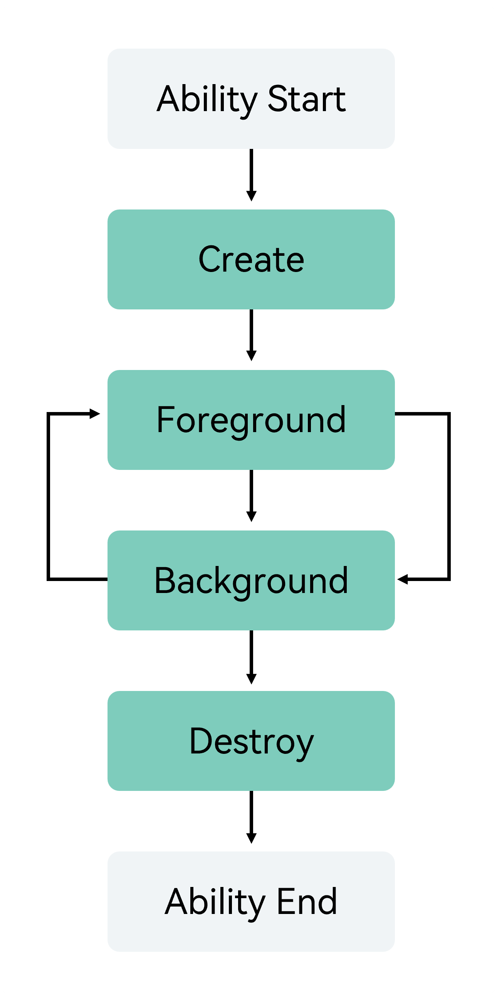

# UIAbility Component Lifecycle

## Overview

When users open, switch, or return to an application, the [UIAbility](../../../API_Reference/source_zh_cn/apis/AbilityKit/cj-apis-ability.md#class-uiability) instances within the application transition between different states in their lifecycle. The UIAbility class provides a series of callbacks that notify when a UIAbility instance's state changes, including creation and destruction of the UIAbility instance, or transitions between foreground and background states.

The UIAbility lifecycle consists of four states: Create, Foreground, Background, and Destroy, as illustrated below.

**Figure 1** UIAbility Lifecycle States

<!-- ToBeReviewd -->

## Lifecycle State Descriptions

### Create State

The Create state is triggered when the [UIAbility](../../../API_Reference/source_zh_cn/apis/AbilityKit/cj-apis-ability.md#class-uiability) instance is created during the application loading process. The system invokes the [onCreate()](../../../API_Reference/source_zh_cn/apis/AbilityKit/cj-apis-ability.md#func-oncreatewant-launchparam) callback. You can perform page initialization operations in this callback, such as variable definition and resource loading, for subsequent UI display.

<!-- compile -->

```cangjie
internal import kit.AbilityKit.UIAbility
internal import kit.AbilityKit.Want

class MainAbility <: UIAbility {
    public override func onCreate(want: Want, launchParam: LaunchParam): Unit {
      // Page initialization
    }
    // ...
}
```

> **Note:**
>
> [Want](../../../API_Reference/source_zh_cn/apis/AbilityKit/cj-apis-ability.md#class-want) is a carrier for information transfer between objects and can be used for inter-component communication within an application. For detailed information about Want, refer to [Information Carrier Want](cj-want-overview.md).

### WindowStageCreate and WindowStageDestroy States

After the [UIAbility](../../../API_Reference/source_zh_cn/apis/AbilityKit/cj-apis-ability.md#class-uiability) instance is created and before it enters the Foreground state, the system creates a WindowStage. Upon WindowStage creation, the [onWindowStageCreate()](../../../API_Reference/source_zh_cn/apis/AbilityKit/cj-apis-ability.md#func-onwindowstagecreatewindowstage) callback is invoked, where you can set up UI loading and subscribe to WindowStage events.

**Figure 2** WindowStageCreate and WindowStageDestroy States

<!-- ToBeReviewd -->

In the onWindowStageCreate() callback, use the [loadContent()](../../../API_Reference/source_zh_cn/arkui-cj/cj-apis-window.md#class-windowstage) method to specify the page to be loaded by the application. Additionally, you can call the [on('windowStageEvent')](../../../API_Reference/source_zh_cn/arkui-cj/cj-apis-window.md#func-onwindowcallbacktype-callback1argumentwindowstageeventtype) method to subscribe to [WindowStage events](../../../API_Reference/source_zh_cn/arkui-cj/cj-apis-window.md#enum-windowstageeventtype) (focus gain/loss, foreground/background transitions, interactive/non-interactive states).

> **Note:**
>
> The timing of [WindowStage events](../../../API_Reference/source_zh_cn/arkui-cj/cj-apis-window.md#enum-windowstageeventtype) may vary across different development scenarios.

<!-- compile -->

```cangjie
import kit.AbilityKit.UIAbilityContext
import kit.AbilityKit.UIAbility
import kit.ArkUI.{WindowStage, WindowCallbackType, WindowStageEventType}
import ohos.base.{AppLog, Callback1Argument, BusinessException}

class WindowStageCallback <: Callback1Argument<WindowStageEventType> {
    public override func invoke(arg: WindowStageEventType) {
        match (arg) {
            case WindowStageEventType.SHOWN => // Transition to foreground
                AppLog.info("windowStage foreground.")
            case WindowStageEventType.ACTIVE => // Focus gained
                AppLog.info("windowStage active.")
            case WindowStageEventType.INACTIVE => // Focus lost
                AppLog.info("windowStage inactive.")
            case WindowStageEventType.HIDDEN => // Transition to background
                AppLog.info("windowStage background.")
            case WindowStageEventType.RESUMED => // Interactive state
                AppLog.info("windowStage resumed.")
            case WindowStageEventType.PAUSED => // Non-interactive state
                AppLog.info("windowStage paused.")
            case _ => ()
        }
    }
}

class MainAbility <: UIAbility {
    // ...
    public override func onWindowStageCreate(windowStage: WindowStage): Unit {
        // Subscribe to WindowStage events (focus gain/loss, foreground/background transitions, interactive/non-interactive states)
        try {
            windowStage.on(WindowStageEvent, WindowStageCallback())
        } catch (e: BusinessException) {
            AppLog.error("Failed to enable the listener for window stage event changes. Cause: ${e.message}");
        }
        // Set up UI loading
        windowStage.loadContent("EntryView")
    }
}
```

> **Note:**
>
> For WindowStage usage, refer to [Window Development Guide](../../../API_Reference/source_zh_cn/arkui-cj/cj-apis-window.md).

### Foreground and Background States

The Foreground and Background states are triggered when the [UIAbility](../../../API_Reference/source_zh_cn/apis/AbilityKit/cj-apis-ability.md#class-uiability) instance transitions to the foreground and background, respectively, corresponding to the [onForeground()](../../../API_Reference/source_zh_cn/apis/AbilityKit/cj-apis-ability.md#func-onforeground) and [onBackground()](../../../API_Reference/source_zh_cn/apis/AbilityKit/cj-apis-ability.md#func-onbackground) callbacks.

The `onForeground()` callback is invoked before the UI of the UIAbility becomes visible, such as when the UIAbility transitions to the foreground. In this callback, you can request system resources or reacquire resources released in `onBackground()`.

The `onBackground()` callback is invoked after the UI of the UIAbility becomes completely invisible, such as when the UIAbility transitions to the background. In this callback, you can release resources that are unnecessary when the UI is invisible or perform time-consuming operations, such as state preservation.

For example, if an application requires user location data and has obtained the necessary permissions, the location service can be enabled in the `onForeground()` callback to retrieve current location information before the UI is displayed.

When the application transitions to the background, the location service can be stopped in the `onBackground()` callback to conserve system resources.

<!-- compile -->

```cangjie
import kit.AbilityKit.UIAbility

class MainAbility <: UIAbility {
    // ...

    public override func onForeground(): Unit {
        // Request system resources or reacquire resources released in onBackground()
    }

    public override func onBackground(): Unit {
        // Release unnecessary resources or perform time-consuming operations
        // such as state preservation
    }
}
```

When a UIAbility instance is already created and configured with the [singleton](cj-uiability-launch-type.md#singleton启动模式) launch mode, invoking the [startAbility()](../../../API_Reference/source_zh_cn/apis/AbilityKit/cj-apis-ability.md#func-startabilitywant) method to launch this UIAbility instance again will only trigger the [onNewWant()](../../../API_Reference/source_zh_cn/apis/AbilityKit/cj-apis-ability.md#func-onnewwantwant-launchparam) callback, bypassing the [onCreate()](../../../API_Reference/source_zh_cn/apis/AbilityKit/cj-apis-ability.md#func-oncreatewant-launchparam) and [onWindowStageCreate()](../../../API_Reference/source_zh_cn/apis/AbilityKit/cj-apis-ability.md#func-onwindowstagecreatewindowstage) lifecycle callbacks. In this callback, you can update resources and data to be loaded for subsequent UI display.

<!-- compile -->

```cangjie
import kit.AbilityKit.{UIAbility, Want, LaunchParam}

class MainAbility <: UIAbility {
    // ...
    public override func onNewWant(want: Want, launchParam: LaunchParam): Unit {
        // Update resources and data
    }
}
```

### Destroy State

The Destroy state is triggered when the [UIAbility](../../../API_Reference/source_zh_cn/apis/AbilityKit/cj-apis-ability.md#class-uiability) instance is destroyed. In the onDestroy() callback, you can release system resources, save data, and perform other cleanup operations.

For example, calling the [terminateSelf()](../../../API_Reference/source_zh_cn/apis/AbilityKit/cj-apis-ability.md#func-terminateself) method to terminate the current UIAbility instance will execute the onDestroy() callback and complete the destruction of the UIAbility instance.

<!--RP1-->
Similarly, when a user closes the UIAbility instance via the recent tasks list, the onDestroy() callback is executed, and the UIAbility instance is destroyed.

> **Note:**
>
> When debugging an application in developer mode, if a user removes a task of the debugging application from the recent tasks list, the process of the debugging application will be forcibly terminated.

<!--RP1End-->

<!-- compile -->

```cangjie
import kit.AbilityKit.UIAbility

class MainAbility <: UIAbility {
    // ...

    public override func onDestroy(): Unit {
        // Release system resources, save data, etc.
    }
}
```