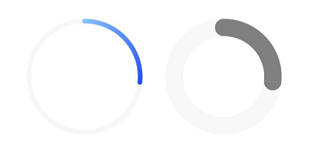
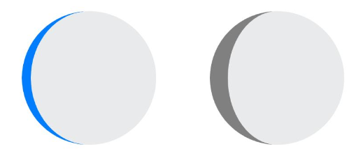
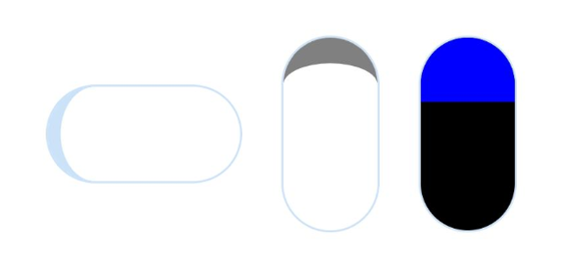
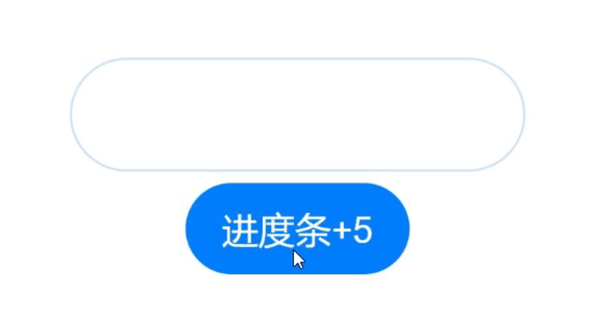

# Progress Bar (Progress)

Progress is a component that displays the current progress of a target operation. For specific usage, please refer to [Progress](../../../API_Reference/source_zh_cn/arkui-cj/cj-information-display-progress.md).

## Creating a Progress Bar

Progress is created by calling the interface in the following form:

```cangjie
Progress(value!: Float64, total!: Float64 = 100.0, `type`!: ProgressType = ProgressType.Linear)
```

Where:
- `value` sets the initial progress value
- `total` sets the total length of the progress
- `ProgressType` sets the style of the progress bar

```cangjie
Progress(value: 24.0, total: 100.0, `type`: ProgressType.Linear) // Creates a linear progress bar with total length 100 and initial progress value 24
```


## Setting Progress Bar Styles

Progress has 5 optional types. The style can be set via `ProgressType`, which includes:
- `ProgressType.Linear` (Linear style)
- `ProgressType.Ring` (Ring style without scales)
- `ProgressType.ScaleRing` (Ring style with scales)
- `ProgressType.Eclipse` (Circular style)
- `ProgressType.Capsule` (Capsule style)

- Linear style progress bar (default type)

  ```cangjie
  Progress(value: 20.0, total: 100.0, `type`: ProgressType.Linear)
      .width(200)
      .height(50)
  Progress(value: 20.0, total: 100.0, `type`: ProgressType.Linear)
      .width(50)
      .height(200)
  ```

  

- Ring style progress bar without scales

  ```cangjie
  // Left to right: 1st ring progress bar with default blue gradient foreground and default strokeWidth of 2.vp
  Progress(value: 40.0, total: 150.0, `type`: ProgressType.Ring)
      .width(100)
      .height(100)
  // Left to right: 2nd ring progress bar
  Progress(value: 40.0, total: 150.0, `type`: ProgressType.Ring)
      .width(100)
      .height(100)
      .color(Color.GRAY) // Sets progress bar foreground color to gray
      .style(strokeWidth: 15.vp) // Sets strokeWidth to 15.vp
  ```

  

- Ring style progress bar with scales

  ```cangjie
  Progress(value: 20.0, total: 150.0, `type`: ProgressType.ScaleRing)
      .width(100)
      .height(100)
      .backgroundColor(Color.BLACK)
      .style(scaleCount: 20, scaleWidth: 5.vp) // Sets total scale count to 20 and scale width to 5.vp
  Progress(value: 20.0, total: 150.0, `type`: ProgressType.ScaleRing)
      .width(100)
      .height(100)
      .backgroundColor(Color.BLACK)
      .style(strokeWidth: 15.vp, scaleCount: 20, scaleWidth: 5.vp) // Sets progress bar width to 15.vp, total scale count to 20, and scale width to 5.vp
  Progress(value: 20.0, total: 150.0, `type`: ProgressType.ScaleRing)
      .width(100)
      .height(100)
      .backgroundColor(Color.BLACK)
      .style(strokeWidth: 15.vp, scaleCount: 20, scaleWidth: 3.vp) // Sets progress bar width to 15.vp, total scale count to 20, and scale width to 3.vp
  ```

  

- Circular style progress bar

  ```cangjie
  // Left to right: 1st circular progress bar with default blue foreground
  Progress(value: 10.0, total: 150.0, `type`: ProgressType.Eclipse)
      .width(100)
      .height(100)
  // Left to right: 2nd circular progress bar with gray foreground
  Progress(value: 20.0, total: 150.0, `type`: ProgressType.Eclipse)
      .color(Color.GREY)
      .width(100)
      .height(100)
  ```

  

- Capsule style progress bar

> **Note:**
>
> - The progress display at the rounded ends is similar to `ProgressType.Eclipse` style.
>
> - The middle section displays progress as rectangular bars, similar to `ProgressType.Linear` style.
>
> - Automatically switches to vertical display when component height exceeds width.

  ```cangjie
  Progress(value: 10.0, total: 150.0, `type`: ProgressType.Capsule)
      .width(100)
      .height(50)
  Progress(value: 20.0, total: 150.0, `type`: ProgressType.Capsule)
      .width(50)
      .height(100)
      .color(Color.GREY)
  Progress(value: 50.0, total: 150.0, `type`: ProgressType.Capsule)
      .width(50)
      .height(100)
      .color(Color.BLUE)
      .backgroundColor(Color.BLACK)
  ```

  

## Usage Example

Updating current progress value, such as in an application installation progress bar. Clicking a Button can increase `progressValue`, and the `value` property assigns `progressValue` to the Progress component, triggering a refresh to update the current progress.

<!-- run -->

```cangjie
package ohos_app_cangjie_entry
import kit.ArkUI.*
import ohos.arkui.state_macro_manage.*

@Entry
@Component
class EntryView {
    @State
    var progressValue: Float64 = 0.0 // Sets initial progress value to 0
    func build() {
        Column() {
            Column() {
                Progress(value: 0.0, total: 100.0, `type`: ProgressType.Capsule)
                    .width(200)
                    .height(50)
                    .value(this.progressValue)
                Row()
                    .width(100.percent)
                    .height(5)
                Button("Progress +5").onClick {
                    evt =>
                    this.progressValue += 5.0
                    if (this.progressValue > 100.0) {
                        this.progressValue = 0.0
                    }
                }
            }
        }
        .width(100.percent)
        .height(100.percent)
    }
}
```

