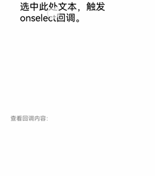
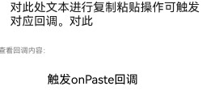
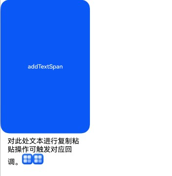

# Rich Text Editor (RichEditor)

RichEditor is a component that supports mixed text-image layout and interactive text editing, typically used for responding to user input operations involving mixed content, such as comment sections that allow both text and images. For specific usage, please refer to [RichEditor](../../../reference/source_en/arkui-cj/cj-text-input-richeditor.md).

## Creating a RichEditor Component Without Attribute String Construction

Creating a RichEditor component without attribute string construction is generally used for displaying simple text-image information, such as contact details, or in scenarios requiring uniform content formatting, such as certain code editors.

<!-- run -->

```cangjie
package ohos_app_cangjie_entry
import kit.ArkUI.*
import kit.LocalizationKit.*
import ohos.arkui.state_macro_manage.*

@Entry
@Component
class EntryView {
    var controller: RichEditorController = RichEditorController()
    var option: RichEditorTextSpanOptions = RichEditorTextSpanOptions()

    func build() {
        Column() {
            Column() {
                RichEditor(this.controller)
                    .onReady({=>
                        this.controller.addTextSpan(value:"Creating a RichEditor component without attribute string construction")
                    })
            }.width(200)
        }.height(200)
    }
}
```


## Setting Properties

### Configuring Custom Selection Menu

Use [bindSelectionMenu](../../../reference/source_en/arkui-cj/cj-text-input-richeditor.md#func-bindselectionmenuricheditorspantype-custombuilder-responsetype-selectionmenuoptions) to set a custom selection menu.

The component comes with a default text selection menu that includes copy, cut, and select-all functions. Users can employ this property to define custom menus, such as translating English text, bolding fonts, and other rich menu functionalities.

When custom menus are excessively long, it is recommended to nest a Scroll component internally to avoid keyboard obstruction.

<!-- run -->

```cangjie
package ohos_app_cangjie_entry
import kit.ArkUI.*
import kit.LocalizationKit.*
import ohos.arkui.state_macro_manage.*
import ohos.hilog.*
import ohos.arkui.component.CopyOptions as MyCopyOptions
import std.collection.ArrayList

@Entry
@Component
class EntryView {
    let controller: TextController = TextController()
    @Builder
    func RightClickTextCustomMenu() {
        Menu() {
            MenuItemGroup(header: "", footer: "") {=>
                MenuItem(startIcon: @r(app.media.startIcon),   endIcon: @r(app.media.startIcon), content: @r(app.media.startIcon), labelInfo: @r(app.media.startIcon) )
                    .onChange ({ selected =>
                        // Use the closeSelectionMenu interface to close the menu
                        this.controller.closeSelectionMenu()
                    })
                MenuItem(startIcon: @r(app.media.startIcon),   endIcon: @r(app.media.startIcon), content: @r(app.media.startIcon), labelInfo: @r(app.media.startIcon) )
                MenuItem(startIcon: @r(app.media.startIcon),   endIcon: @r(app.media.startIcon), content: @r(app.media.startIcon), labelInfo: @r(app.media.startIcon) )
            }
        }.backgroundColor(0XF0F0F0)
    }
    func build() {
        Scroll() {
            Column {
                RichEditor(RichEditorController())
                    .bindSelectionMenu(spantype: RichEditorSpanType.Text, content: {=>}, responseType: ResponseType.LongPress,
                        options: SelectionMenuOptions( onDisappear: {
                            => Hilog.info(0, " ", "Triggered when the custom selection menu closes")
                        },
                        onAppear: {
                            => Hilog.info(0, " ", "Triggered when the custom selection menu appears"))
            }
        }
    }
}
```


## Adding Events

### Adding a Callback Triggered After Component Initialization

Use [onReady](../../../reference/source_en/arkui-cj/cj-text-input-richeditor.md#func-onreadyvoidcallback) to add a callback triggered after component initialization.

This callback can effectively display rich content, including text, images, and emojis, after component initialization. For example, when using the RichEditor component to display news, this callback can trigger fetching text-image data from a server. The retrieved data can then be populated into the component, ensuring the complete news content is quickly rendered on the page after initialization.

<!-- run -->

```cangjie
package ohos_app_cangjie_entry
import kit.ArkUI.*
import kit.LocalizationKit.*
import ohos.arkui.state_macro_manage.*

@Entry
@Component
class EntryView {
    var controller: RichEditorController = RichEditorController()
    var option: RichEditorTextSpanOptions = RichEditorTextSpanOptions()

    func build() {
        Column() {
            Column() {
                RichEditor(this.controller)
                    .onReady({=>
                        this.controller.addTextSpan(value:"The onReady callback content is pre-set text within the component")
                })
            }.width(200)
        }.height(200)
    }
}
```


### Adding a Callback Triggered When Component Content is Selected

Use [onSelect](../../../reference/source_en/arkui-cj/cj-text-input-richeditor.md#func-onselectcallbackricheditorselectionunit) to add a callback triggered when component content is selected.

This callback can enhance operational experience after text selection. For example, after selecting text, the callback can trigger a pop-up menu for modifying text styles or analyze and process the selected text to provide input suggestions, thereby improving text editing efficiency and convenience.

The callback can be triggered in two ways: 
1. Via left mouse button selection—pressing the left button to select and releasing it to trigger the callback.
2. Via touch selection—using a finger to select and releasing it to trigger the callback.

<!-- run -->

```cangjie
package ohos_app_cangjie_entry
import kit.ArkUI.*
import kit.LocalizationKit.*
import ohos.arkui.state_macro_manage.*

@Entry
@Component
class EntryView {
    var controller: RichEditorController = RichEditorController()
    var controller1: RichEditorController = RichEditorController()
    var option: RichEditorTextSpanOptions = RichEditorTextSpanOptions()

    func build() {
        Column() {
            Column() {
                RichEditor(this.controller)
                    .onReady({=>
                        this.controller.addTextSpan(value:"Select this text to trigger the onselect callback.")
                    })
                    .onSelect({value1: RichEditorSelection=>
                        this.controller.addTextSpan(value:"1234")
                    }).width(200).height(200)
                Text("View callback content:").fontSize(10).fontColor(Color.Gray).width(200)
                RichEditor(this.controller1)
                    .width(200)
                    .height(200)
            }.width(200)
        }.height(200)
    }
}
```



### Adding Callbacks Triggered Before and After Text-Image Changes

Use [onDidChange](../../../reference/source_en/arkui-cj/cj-text-input-richeditor.md#func-ondidchangeondidchangecallback) to add a callback triggered after text-image changes. This callback is suitable for content saving and synchronization. For example, after a user completes content editing, this callback can automatically save the latest content locally or synchronize it to a server. It is also useful for content state updates and rendering. For instance, in a to-do list application, after a user edits a to-do description in rich text format, this callback can update the display style of the to-do item in the list.

<!-- run -->

```cangjie
package ohos_app_cangjie_entry
import kit.ArkUI.*
import kit.LocalizationKit.*
import ohos.arkui.state_macro_manage.*

@Entry
@Component
class EntryView {
    var controller: RichEditorController = RichEditorController()
    var controller1: RichEditorController = RichEditorController()
    var rangeBefore: TextRange = TextRange(10,13)
    var rangeAfter: TextRange = TextRange(15,18)

    func build() {
        Column() {
            Column() {
                RichEditor(this.controller)
                    .onReady({=>
                        this.controller.addTextSpan(value:"Before text-image changes, trigger callback.\nAfter text-image changes, trigger callback.")
                    })
                    .onDidChange({ rangeBefore: TextRange, rangeAfter: TextRange=>
                        this.controller1.addTextSpan(value:"\nAfter text-image changes, trigger callback:\nrangeBefore:" + "1234" +
                            "\nrangeAfter：" + "2345")
                        }).width(180)
                Text("View callback content:").fontSize(10).fontColor(Color.Gray).width(70)
                RichEditor(this.controller1).width(200).height(500)
            }.width(200).height(200)
        }
    }
}
```


### Adding Callbacks Triggered Before and After Input Method Content Entry

Before input method content entry, use [aboutToIMEInput](../../../reference/source_en/arkui-cj/cj-text-input-richeditor.md#func-abouttoimeinputcallbackricheditorinsertvaluebool) to trigger a callback. After input method content entry is completed, use [onIMEInputComplete](../../../reference/source_en/arkui-cj/cj-text-input-richeditor.md#func-onimeinputcompletecallbackricheditortextspanresultunit) to trigger a callback.

These callback mechanisms are suitable for intelligent input assistance. For example, before a user starts entering text, the callback can provide word suggestions. After the user completes input, the callback can perform automated error correction or format conversion.

<!-- run -->

```cangjie
package ohos_app_cangjie_entry
import kit.ArkUI.*
import kit.LocalizationKit.*
import ohos.arkui.state_macro_manage.*

@Entry
@Component
class EntryView {
    var controller: RichEditorController = RichEditorController()
    var controller1: RichEditorController = RichEditorController()

    func build() {
        Column() {
            Column() {
                RichEditor(this.controller)
                    .onReady({=>
                        this.controller.addTextSpan(value:"Before input method content entry, trigger callback.\nAfter input method content entry is completed, trigger callback.")
                    })
                    .aboutToIMEInput({value:   RichEditorInsertValue=>
                        this.controller1.addTextSpan(value:"Before input method content entry, trigger callback:\n123")
                        return true;
                    })
                    .onIMEInputComplete({value: RichEditorTextSpanResult=>
                        this.controller1.addTextSpan(value:"After input method content entry is completed, trigger callback:\n456")
                    }).width(200).height(200)

                Text("View callback content:").fontSize(10).fontColor(Color.Gray).width(200)
                RichEditor(this.controller1).width(200).height(200)
            }.width(200).height(200)
        }
    }
}
```


### Adding a Callback Triggered Before Pasting is Completed

Use [onPaste](../../../reference/source_en/arkui-cj/cj-text-input-richeditor.md#func-onpastepasteeventcallback) to add a callback triggered before pasting is completed.

This callback is suitable for content format processing. For example, when a user copies text containing HTML tags, the callback can include code to convert it into a format supported by the RichEditor component, stripping unnecessary tags or retaining only plain text.

Since the component's default paste behavior is limited to plain text and cannot handle image pasting, developers can use this method to implement mixed text-image paste functionality, replacing the component's original paste behavior.

<!-- run -->

```cangjie
package ohos_app_cangjie_entry
import kit.ArkUI.*
import kit.LocalizationKit.*
import ohos.arkui.state_macro_manage.*

@Entry
@Component
class EntryView {
    var controller: RichEditorController = RichEditorController()
    var controller1: RichEditorController = RichEditorController()
    func build() {
        Column() {
            Column() {
                RichEditor(this.controller)
                    .onReady({=>
                        this.controller.addTextSpan(value:"Copy and paste operations on this text will trigger corresponding callbacks.")
                    })
                    .onPaste({value1:PasteEvent=>
                        this.controller1.addTextSpan(value:"Trigger onPaste callback\n")
                    }).width(300).height(70)
                Text("View callback content:").fontSize(10).fontColor(Color.Gray).width(300)
                RichEditor(this.controller1)
                    .width(300).height(70).width(200)
            }.height(200)
        }
    }
}
```



## Adding Text Content

In addition to directly entering content within the component, you can also use [addTextSpan](../../../reference/source_en/arkui-cj/cj-text-input-richeditor.md#func-addtextspanresourcestr-richeditortextspanoptions) to add text content.

This interface enables diverse text styling, such as creating mixed-style text.

If the component is in focus with a blinking cursor, the cursor position will update after adding text content via addTextSpan, blinking to the right of the newly added text.

<!-- run -->

```cangjie
package ohos_app_cangjie_entry

import kit.ArkUI.*
import ohos.arkui.state_macro_manage.*

@Entry
@Component
class EntryView {
    var controller: RichEditorController = RichEditorController()
    var controller1: RichEditorController = RichEditorController()

    func build() {
        Column() {
            Button("addTextSpan")
                .width(200)
                .height(300)
                .fontSize(13)
                .onClick{ evt =>
                    this.controller.addTextSpan(value:"Add a new paragraph of text.")
                }
            RichEditor(this.controller)
                .width(200)
                .height(200)
        }.width(100.percent)
    }
}
```


## Adding Image Content

Use [addImageSpan](../../../reference/source_en/arkui-cj/cj-text-input-richeditor.md#func-addimagespanstring-richeditorimagespanoptions) to add image content.

This interface can enrich content and enhance visual presentation, such as adding images to news articles or data visualization graphics to documents.

If the component is in focus with a blinking cursor, the cursor position will update after adding image content via addImageSpan, blinking to the right of the newly added image.

<!-- run -->

```cangjie
package ohos_app_cangjie_entry
import kit.ArkUI.*
import kit.LocalizationKit.*
import ohos.arkui.state_macro_manage.*

@Entry
@Component
class EntryView {
    var controller: RichEditorController = RichEditorController()
    var controller1: RichEditorController = RichEditorController()
    func build() {
        Column() {
            Column() {
                Button("addTextSpan")
                    .width(200)
                    .height(300)
                    .fontSize(13)
                    .onClick{ evt =>
                        this.controller.addImageSpan(value: @r(app.media.startIcon),
                        options: RichEditorImageSpanOptions(
                            imageStyle: RichEditorImageSpanStyle(
                                size: (24.vp, 24.vp)
                            )
                        ))
                    }
                RichEditor(this.controller)
                    .onReady({=>
                        this.controller.addTextSpan(value:"Copy and paste operations on this text will trigger corresponding callbacks.")}).width(200).height(200)
            }.width(200).height(300)
        }
    }
}
```

