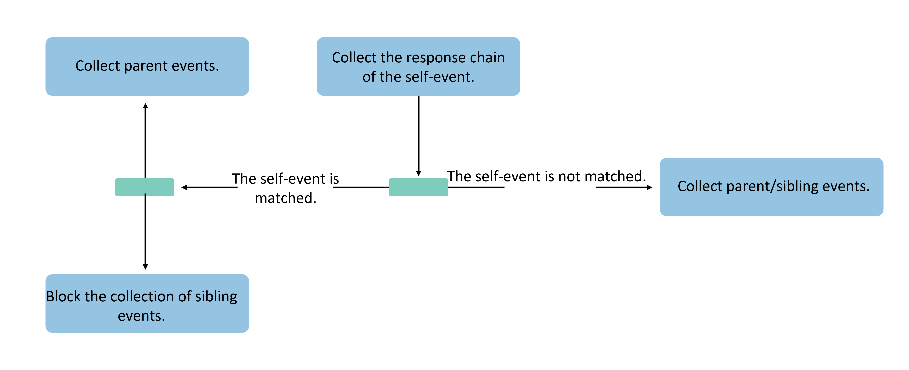
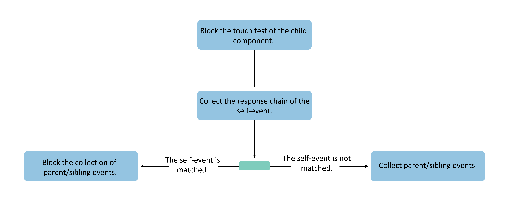
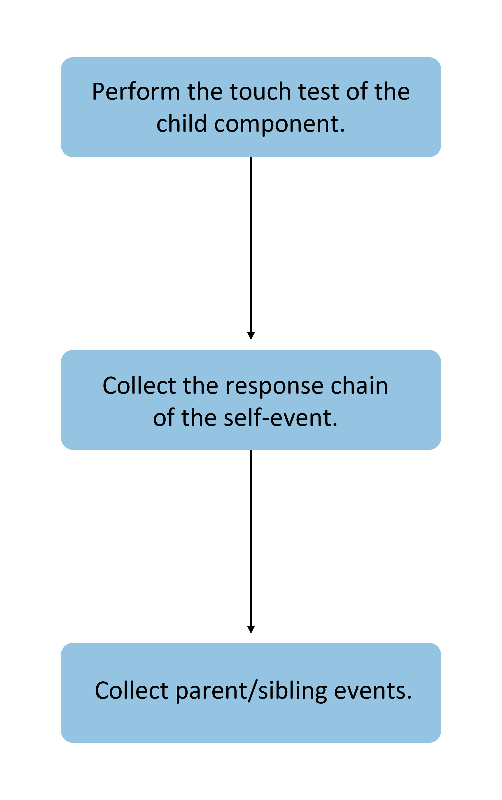

# Event Distribution

## Overview

Event distribution refers to the process where ArkUI receives touch events generated by user operations, performs touch testing, and distributes the touch events to various components to form events.

Touch events serve as the input for touch testing. Based on different user operation methods, they can be categorized into Touch-type touch events and Mouse-type touch events.

- **Touch-type touch events** refer to touch-generated touch events, with input sources including: finger (finger sliding on screen), pen (stylus sliding on screen), mouse (mouse operations), and touchpad (touchpad operations). These can trigger touch events, click events, drag events, and gesture events.

- **Mouse-type touch events** refer to touch events generated by mouse operations, with input sources including: mouse (mouse operations), touchpad (touchpad operations), and joystick (joystick operations). These can trigger touch events, click events, drag events, gesture events, and mouse events.

Regardless of whether they are Touch-type or Mouse-type touch events, the final triggered events are determined by touch testing to decide which component they are ultimately distributed to. Touch testing determines the generation of the ArkUI event response chain, the distribution of touch events, and the triggering of component-bound events.

## Touch Testing

Touch testing refers to the process where ArkUI receives the initial event of a Touch-type or Mouse-type touch event (e.g., an event generated when a finger or mouse cursor is pressed), performs component response area testing and judgment based on the coordinates of the received event, and collects the event response chain.

Developers can influence the touch testing process by setting the following attributes:

- `hitTestBehavior`: Touch testing control
- `interceptTouch`: Custom event interception
- `responseRegion`: Touch hot zone settings
- `enabled`: Disable control
- Security components
- Other attribute settings: transparency/component offline

### Basic Touch Testing Process

The basic touch testing process is as follows: After receiving the initial event, the system traverses the component tree from top to bottom and from right to left, collecting gestures and events bound to each component. This information is then bubbled up level by level to parent components for integration, ultimately constructing a complete event response chain.


As shown in the figure, when the initial event is distributed to a component, the component collects its own bound gestures and events, then passes the collected results to the parent component until the root node is reached. If a component is transparent, has been removed from the component tree, or the event coordinates are not within the component's response hot zone, the collection process will not be triggered, and the parent component will receive an empty feedback. Otherwise, all components will perform the collection of gestures and events and provide feedback to the parent component.

### Touch Testing Control

Developers can configure touch testing control to block touch testing for the component itself or other components.

- `HitTestMode.Default`: The default effect when the `hitTestBehavior` attribute is not configured. If the component itself is hit, it blocks sibling components but does not block child components.



- `HitTestMode.None`: The component itself does not receive events but does not block sibling or child components from continuing touch testing.


- `HitTestMode.Block`: Blocks touch testing for child components. If the component itself is hit during touch testing, it blocks touch testing for sibling and parent components.



- `HitTestMode.Transparent`: The component itself performs touch testing while not blocking sibling or parent components.



### Disable Control

Components with [disable control](../../../reference/source_en/arkui-cj/cj-universal-attribute-enable.md) enabled will not initiate the touch testing process for themselves or their child components. Instead, they will directly return to the parent component to continue touch testing.

### Touch Hot Zone Settings

[Touch hot zone settings](../../../reference/source_en/arkui-cj/cj-universal-attribute-touchtarget.md) affect touch testing for touchscreen/mouse-type events. According to the [basic touch testing process](#触摸测试基本流程), only when the event coordinates hit the component's touch hot zone will the gestures and events bound to the component be collected and enter the event response chain. Developers can adjust the component's touch hot zone to control the touch testing process. If the touch hot zone is set to 0 or defined as a non-touchable area, the event will be directly passed back to the parent node for subsequent touch testing.

### Security Components

The current impact of security components on touch testing is as follows: If a component's [z-order](../../../Dev_Guide/source_en/arkui-cj/cj-layout-development-stack-layout.md#z序控制) is higher than that of a security component and it covers the security component, the security component's event will directly return to the parent node to continue touch testing.

## Event Response Chain Collection

The event response chain is the result of touch testing. ArkUI event response chain collection follows a post-order traversal with right-subtree priority (based on the sequential hierarchy of component layout). The pseudo-code implementation is:

```cangjie
ForEach(item,itemGeneratorFunc: {
        node.rbegin(), node.rend() =>
        item.TouchTest()
        })
node.collectEvent()
```

Example of event response chain collection: For the component tree shown in the figure below, if the `hitTestBehavior` attribute is set to default for all components and the user's tap action occurs on component 5, the final collected response chain and its sequence will be 5, 3, 1.

Because component 3's `hitTestBehavior` attribute is set to `Default`, it blocks sibling nodes after collecting the event, so the left subtree of component 1 is not collected.

