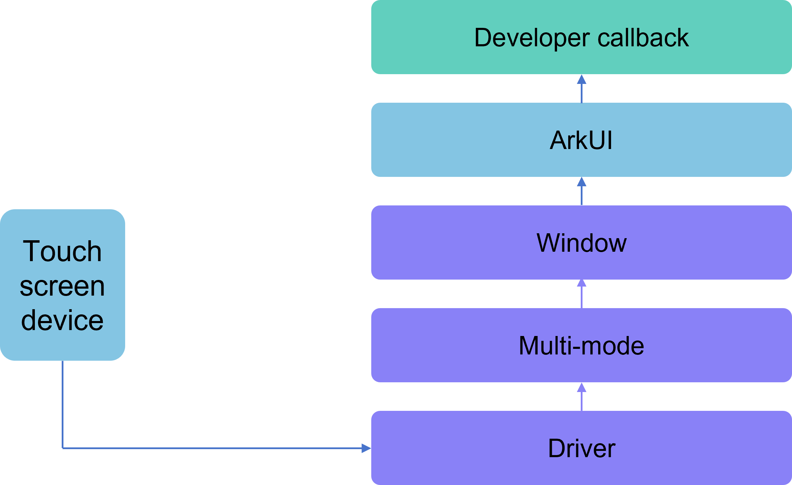

# Touch Events

Touch events refer to callback events triggered when a finger/stylus presses, slides, or lifts on a component. These include [Click Events](#click-events), [Drag Events](./../../../API_Reference/source_en/arkui-cj/cj-universal-event-drag.md), and [Touch Events](#touch-events). The principle of touch events is illustrated below:

**Figure 1** Touch Event Principle  



## Click Events

A click event occurs when a finger or stylus completes a full press-and-lift action. When a click event occurs, the following callback function is triggered:

```cangjie
func onClick(callback: (ClickEvent)->Unit): This
```

The `event` parameter provides the coordinate position of the click event relative to the window or component, as well as the event source of the click.

For example, using a button's click event to control the display and hiding of an image.

<!-- run -->

```cangjie
package ohos_app_cangjie_entry
import kit.ArkUI.*
import ohos.arkui.state_macro_manage.*
import ohos.resource_manager.*

@Entry
@Component
class EntryView {
    @State var flag = true
    @State var btnMsg: String = 'show'

    func build() {
        Column {
            Button(this.btnMsg)
                .width(80)
                .height(30)
                .margin(30)
                .onClick({ event =>
                    if (this.flag) {
                        this.btnMsg = 'hide'
                    } else {
                        this.btnMsg = 'show'
                    }
                    // Clicking the Button controls the Image's display and disappearance
                    this.flag = !this.flag
                })
            if (this.flag) {
                Image(@r(app.media.startIcon))
                    .width(200)
                    .height(200)
            }
        }
        .height(100.percent)
        .width(100.percent)
    }
}
```

**Figure 2** Controlling Image Display/Hiding via Button Click Event  


## Touch Events

When a finger or stylus touches a component, different actions trigger corresponding event responses, including press (Down), slide (Move), and lift (Up) events:

```cangjie
public func onTouch(callback: (TouchEvent)->Unit): This
```

- `event.type` as `TouchType.Down`: Indicates a finger press.
- `event.type` as `TouchType.Up`: Indicates a finger lift.
- `event.type` as `TouchType.Move`: Indicates a finger holding and moving.
- `event.type` as `TouchType.Cancel`: Indicates interruption/cancellation of the current finger operation.

Touch events can be triggered simultaneously by multiple fingers. The `event` parameter provides information such as the triggering finger's position, unique identifier, currently changed finger, and input device source.

<!-- run -->

```cangjie
package ohos_app_cangjie_entry
import kit.ArkUI.*
import ohos.arkui.state_macro_manage.*

@Entry
@Component
class EntryView {
    @State var text: String = ""
    @State var eventType: String = ""

    func build() {
        Column {
            Button('Touch')
                .height(40)
                .width(100)
                .onTouch({ event =>
                    this.eventType = match (event.eventType) {
                        case TouchType.Down => 'Down'
                        case TouchType.Up => 'Up'
                        case TouchType.Move => 'Move'
                        case TouchType.Cancel => 'Move'
                        case TouchType.Unknown => "Unknown"
                        case _ => ""
                    }
                    this.text = 'TouchType:' + this.eventType + '\nDistance between touch point and touch element:\nx: '
                        + event.touches[0].x.toString() + '\n' + 'y: ' + event.touches[0].y.toString()
                        + '\nComponent globalPos:(' + event.target.area.globalPosition.x.value.toString()
                        + ',' + event.target.area.globalPosition.y.value.toString() + ')\nwidth:'
                        + event.target.area.width.value.toString() + '\nheight:' + event.target.area.height.value.toString()
                })
            Button('Touch')
                .height(50)
                .width(200)
                .margin(20)
                .onTouch({ event =>
                    this.eventType = match (event.eventType) {
                        case TouchType.Down => 'Down'
                        case TouchType.Up => 'Up'
                        case TouchType.Move => 'Move'
                        case TouchType.Cancel => 'Move'
                        case TouchType.Unknown => "Unknown"
                        case _ => ""
                    }
                    this.text = 'TouchType:' + this.eventType + '\nDistance between touch point and touch element:\nx: '
                        + event.touches[0].x.toString() + '\n' + 'y: ' + event.touches[0].y.toString()
                        + '\nComponent globalPos:(' + event.target.area.globalPosition.x.value.toString()
                        + ',' + event.target.area.globalPosition.y.value.toString() + ')\nwidth:'
                        + event.target.area.width.value.toString() + '\nheight:' + event.target.area.height.value.toString()
                })
            Text(this.text)
        }
        .width(100.percent)
        .padding(30)
    }
}
```

