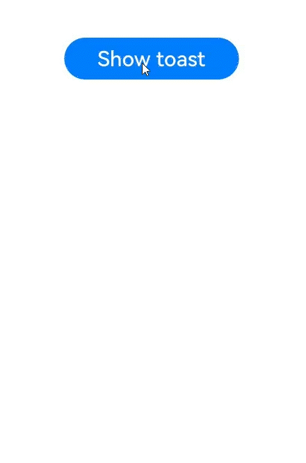

# Toast Feedback  

Toast is a temporary message prompt used to display brief operational feedback or status information to users. It typically pops up briefly at the bottom or top of the screen and automatically disappears after a short duration. The primary purpose of Toast is to provide concise, non-intrusive feedback without disrupting the user's current workflow.  

## Usage Guidelines  

- **Use Toast judiciously** rather than overwhelming users with frequent reminders.  

  Toast is suitable for common scenarios such as:  
  - Providing immediate feedback after a user action (e.g., success or failure notifications).  
  - Notifying users of application state changes.  

- **Optimize text density**—Toast has limited display time, so avoid lengthy text.  

  Toast text should be clear and readable, with font size and color consistent with the application's theme. Additionally, Toast should not contain interactive elements like buttons or links.  

- **Avoid forced placement and excessive pop-ups**.  

  As a lightweight in-app notification, Toast should not obstruct other UI elements (e.g., overlapping pop-up content) or confuse users about its origin. Avoid:  
  - Frequent, back-to-back Toast messages without intervals.  
  - Replacing one Toast with another in quick succession.  
  - Display durations exceeding **3 seconds**, which may disrupt user interactions.  

- **Adhere to the system's default positioning**.  

  By default, Toast appears at the **bottom** of the interface with a safe margin. As a system-level feedback mechanism, follow the default behavior to prevent overlaps with other pop-up components. Adjustments may be made for special scenarios.  

## Toast Display Modes  

Toast supports two display modes:  
- **DEFAULT** (displays within the application).  
- **TOP_MOST** (displays above the application).  

For **TOP_MOST** Toast, a full-screen sub-window (matching the main window size on terminals) is created before display. The Toast's layout is calculated and rendered within this sub-window. Key differences between the modes are:  

| Difference          | DEFAULT                          | TOP_MOST                                                                 |
|---------------------|----------------------------------|--------------------------------------------------------------------------|
| Sub-window Creation | No                               | Yes                                                                      |
| Hierarchy          | Renders within the main window (same hierarchy, typically low). | Renders in a sub-window (higher than the main window and most pop-ups but below soft keyboards and permission dialogs). |
| Soft Keyboard Handling | Always shifts up by the keyboard height. | Shifts only if obscured, maintaining an 80.vp gap between Toast and keyboard. |

 <!--run-->

```cangjie
package ohos_app_cangjie_entry

import kit.ArkUI.*
import ohos.arkui.state_macro_manage.*

@Entry
@Component
class EntryView{
    func build(){
        Row(){
            Blank().height(20.percent)
            Button(){
                Text("DEFAULT Toast")
                .fontSize(20)
                .fontWeight(FontWeight.Bold)

            }.onClick({
                evt =>
                PromptAction.showToast(
                        message: "OK, I'm a DEFAULT toast", duration: 2000,
                        bottom: "80.vp", showMode: ToastShowMode.Default)
            }).align(Alignment.Center)

            Button(){
                Text("TOP_MOST Toast")
                .fontSize(20)
                .fontWeight(FontWeight.Bold)
            }.onClick({
                evt =>
                PromptAction.showToast(
                        message: "OK, I'm a TOP_MOST toast", duration: 2000,
                        bottom: "85.vp", showMode: ToastShowMode.TopMost)
            })
        }
    }
}
```

  

## Creating a Toast  

Ideal for short-lived, auto-dismissing prompts.  

 <!--run-->

```cangjie
package ohos_app_cangjie_entry

import kit.ArkUI.*
import ohos.arkui.state_macro_manage.*

@Entry
@Component
class EntryView{

    func build(){
        Column(){
            Button("Show toast").fontSize(20)
            .onClick{
                    =>
                    PromptAction.showToast(message: "Hello World", duration: 2000)
            }
        }.size(width: 100.percent, height: 100.percent).justifyContent(FlexAlign.Center)
    }
}
```

