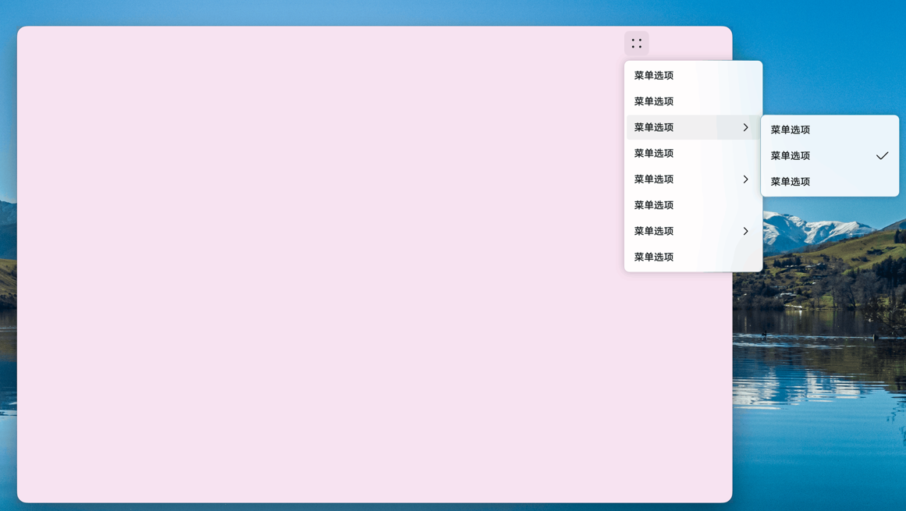

# Popup Overview  

A popup generally refers to a UI interface that automatically appears when an application is launched or is triggered by user actions. It is used to briefly display information requiring user attention or pending operations.  

## Types of Popups  

Based on user interaction scenarios, popups can be categorized into **modal popups** and **non-modal popups**, distinguished by whether the user must respond to them.  

- **Modal Popup:** A strong interaction form that interrupts the user's current workflow, requiring the user to respond before proceeding with other operations. It is typically used for scenarios where important information must be conveyed to the user.  

- **Non-Modal Popup:** A weak interaction form that does not affect the user's current operations. The user may choose not to respond, and such popups usually have a time limit, disappearing automatically after a set duration. They are generally used for scenarios where users need to perform functional operations in addition to being informed.  

> **Note:**  
>  
> Currently, a modal popup can be converted into a non-modal popup by setting specific properties.  

## Usage Scenarios  

Developers can select the appropriate popup for page development based on actual application scenarios.  

| Popup Name | Application Scenario |  
| :--- | :--- |  
| [Dialog](cj-dialog-base-overview.md) | When displaying information or operations that users currently need or must focus on, such as confirming app exit, this popup should be prioritized. |  
| [Menu](cj-popup-and-menu-components-menu.md) | When binding executable operations to a specified component, such as long-pressing an icon to display action options, this popup should be prioritized. |  
| [Popup](cj-popup-and-menu-components-popup.md) | When providing hints for a specified component, such as clicking a question mark icon to display a help tip, this popup should be prioritized. |  
| [bindContentCover/bindSheet](cj-modal-overview.md) | When a new interface needs to overlay an existing one without the latter disappearing, such as clicking a thumbnail to view a larger image, this popup should be prioritized. |  
| [Toast](cj-create-toast.md) | When providing simple feedback for the user's current operation in a small window, such as notifying successful file saving, this popup should be prioritized. |  

## Specifications and Constraints  

- When multiple popup components appear sequentially, the later ones will have a higher layer priority than the earlier ones. Upon exiting, they will close in descending order of layer priority. Layer adjustment is not supported.  
- On mobile devices, popups in sub-window mode currently cannot extend beyond the main window. However, on 2-in-1 devices, modal popups may require display beyond the main window. Developers can achieve this by setting `showInSubWindow` to `true`. The effect is shown below:  

  