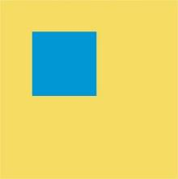
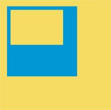

# Drawing Custom Graphics with Canvas

Canvas provides a canvas component for custom graphics rendering. Developers can use the `CanvasRenderingContext2D` and `OffscreenCanvasRenderingContext2D` objects to draw on the Canvas component, supporting basic shapes, text, images, and more.

## Drawing Custom Graphics with Canvas Component

Custom graphics can be drawn on the canvas in three ways:

- Using the [`CanvasRenderingContext2D`](../../../API_Reference/source_zh_cn/arkui-cj/cj-canvas-drawing-canvasrenderingcontext2d.md) object to draw on the Canvas.

    <!-- run -->

  ```cangjie
  package ohos_app_cangjie_entry

  import kit.ArkUI.*
  import ohos.arkui.state_macro_manage.*

  @Entry
  @Component
  class EntryView {
      // Configures parameters for the CanvasRenderingContext2D object, including antialiasing (true enables antialiasing).
      var settings: RenderingContextSettings = RenderingContextSettings(antialias: true)
      // Creates a CanvasRenderingContext2D object for drawing on the canvas.
      var context: CanvasRenderingContext2D = CanvasRenderingContext2D(this.settings)
      func build() {
          Flex(FlexParams(direction: FlexDirection.Column, alignItems: ItemAlign.Center, justifyContent: FlexAlign.Center)
          ) {
              // Invokes the CanvasRenderingContext2D object on the canvas.
              Canvas(this.context)
                  .width(100.percent)
                  .height(100.percent)
                  .backgroundColor(0XF5DC62)
                  .onReady(
                      {
                          =>
                          // Drawing content can be added here.
                          this.context.lineWidth(0.6)
                          this.context.strokeRect(50, 50, 200, 150);
                      }
                  )
          }.width(100.percent).height(100.percent)
      }
  }
  ```

  

- Offscreen drawing involves rendering content to a buffer first, converting it to an image, and then drawing it to the Canvas in one step, improving rendering speed. The process is:

  1. Use the `transferToImageBitmap` method to create an `ImageBitmap` object from the most recently rendered image on the offscreen canvas.
  2. Use the `transferFromImageBitmap` method of the `CanvasRenderingContext2D` object to display the given `ImageBitmap` object.

  For details, refer to the [`OffscreenCanvasRenderingContext2D`](../../../API_Reference/source_zh_cn/arkui-cj/cj-canvas-drawing-canvasrenderingcontext2d.md#class-canvasrenderingcontext2d) object.

    <!-- run -->

  ```cangjie
  package ohos_app_cangjie_entry

  import kit.ArkUI.*
  import ohos.arkui.state_macro_manage.*

  @Entry
  @Component
  class EntryView {
      // Configures parameters for CanvasRenderingContext2D and OffscreenCanvasRenderingContext2D objects, including antialiasing (true enables antialiasing).
      private let settings: RenderingContextSettings = RenderingContextSettings(antialias: true)
      private let context: CanvasRenderingContext2D = CanvasRenderingContext2D(this.settings)
      // Creates an OffscreenCanvas object with specified width and height for offscreen drawing.
      private let offCanvas: OffscreenCanvas = OffscreenCanvas(600.0, 600.0)
      func build() {
          Flex(FlexParams(direction: FlexDirection.Column, alignItems: ItemAlign.Center, justifyContent: FlexAlign.Center)) {
              // Invokes the CanvasRenderingContext2D object on the canvas.
              Canvas(this.context)
                  .width(100.percent)
                  .height(100.percent)
                  .backgroundColor(0XF5DC62)
                  .onReady(
                      {
                          =>
                          let offContext = this.offCanvas.getContext(contextType: ContextType.type_2d, options: this.settings)
                          // Drawing content can be added here.
                          offContext.strokeRect(50, 50, 200, 150)
                          // Displays the offscreen-rendered image on the regular canvas.
                          let image = this.offCanvas.transferToImageBitmap()
                          this.context.lineWidth(5)
                          this.context.transferFromImageBitmap(image)
                      }
                  )
          }.width(100.percent).height(100.percent)
      }
  }
  ```

  

  > **Note:**
  >
  > When drawing on the Canvas component using `CanvasRenderingContext2D` and `OffscreenCanvasRenderingContext2D` objects, the invoked interfaces are the same. Unless otherwise specified, the unit for interface parameters is vp.

## Initializing the Canvas Component

`onReady(() -> Unit)` is an event callback triggered when the Canvas component is initialized or resized. After this event is called, the exact width and height of the Canvas component can be obtained, allowing further use of `CanvasRenderingContext2D` and `OffscreenCanvasRenderingContext2D` objects to invoke relevant APIs for graphics rendering.

 <!-- run -->

```cangjie
package ohos_app_cangjie_entry

import kit.ArkUI.*
import ohos.arkui.state_macro_manage.*

Canvas(this.context)
.width(100.percent)
.height(100.percent)
.backgroundColor(0XF5DC62)
.onReady({
  =>
  this.context.fillStyle(0X0097D4)
  this.context.fillRect(50, 50, 100, 100)
})
```



## Canvas Component Drawing Methods

After invoking the `onReady()` lifecycle interface of the Canvas component, developers can directly use the Canvas component for drawing. Alternatively, they can define a `Path2d` object separately to construct an ideal path and use the Canvas component for drawing after `onReady()` is called.

- Directly invoke relevant APIs using `CanvasRenderingContext2D` and `OffscreenCanvasRenderingContext2D` objects.

    <!-- run -->

  ```cangjie
  package ohos_app_cangjie_entry

  import kit.ArkUI.*
  import ohos.arkui.state_macro_manage.*

  @Entry
  @Component
  class EntryView {
      private let settings: RenderingContextSettings = RenderingContextSettings(antialias: true)
      private let context: CanvasRenderingContext2D = CanvasRenderingContext2D(this.settings)

      func build() {
          Flex(FlexParams(direction: FlexDirection.Column, alignItems: ItemAlign.Center, justifyContent: FlexAlign.Center)) {
              Canvas(this.context)
                  .width(100.percent)
                  .height(100.percent)
                  .backgroundColor(0XF5DC62)
                  .onReady(
                      {
                          =>
                          this.context.beginPath()
                          this.context.moveTo(50, 50)
                          this.context.lineTo(280, 160)
                          this.context.stroke()
                      }
                  )
          }.width(100.percent).height(100.percent)
      }
  }
  ```

  

- Define a `Path2d` object separately to construct a path, then use the `stroke` or `fill` methods of `CanvasRenderingContext2D` and `OffscreenCanvasRenderingContext2D` objects for drawing. For details, refer to `Path2d`.

    <!-- run -->

  ```cangjie
  package ohos_app_cangjie_entry

  import kit.ArkUI.*
  import ohos.arkui.state_macro_manage.*

  @Entry
  @Component
  class EntryView {
      private let settings: RenderingContextSettings = RenderingContextSettings(antialias: true)
      private let context: CanvasRenderingContext2D = CanvasRenderingContext2D(this.settings)

      var region: Path2D = Path2D()
      func build() {
          Flex(FlexParams(direction: FlexDirection.Column, alignItems: ItemAlign.Center, justifyContent: FlexAlign.Center)) {
              Canvas(this.context)
                  .width(100.percent)
                  .height(100.percent)
                  .backgroundColor(0XF5DC62)
                  .onReady(
                      {
                          =>
                          this.region.arc(100.0, 75.0, 50.0, 0.0, 6.28)
                          this.context.stroke(this.region)
                      }
                  )
          }.width(100.percent).height(100.percent)
      }
  }
  ```

  

## Common Methods of the Canvas Component

The `OffscreenCanvasRenderingContext2D` and `CanvasRenderingContext2D` objects provide numerous properties and methods for drawing text, graphics, and processing pixels, serving as the core of the Canvas component. Common interfaces include [`fill`](../../../API_Reference/source_zh_cn/arkui-cj/cj-canvas-drawing-canvasrenderingcontext2d.md#func-fill) (fills a closed path), [`clip`](../../../API_Reference/source_zh_cn/arkui-cj/cj-canvas-drawing-canvasrenderingcontext2d.md#func-clip) (sets the current path as the clipping path), [`stroke`](../../../API_Reference/source_zh_cn/arkui-cj/cj-canvas-drawing-canvasrenderingcontext2d.md#func-stroke) (performs stroke operations), etc. They also provide properties like [`fillStyle`](../../../API_Reference/source_zh_cn/arkui-cj/cj-canvas-drawing-canvasrenderingcontext2d.md#func-fillstylecanvasgradient) (specifies the fill color), [`globalAlpha`](../../../API_Reference/source_zh_cn/arkui-cj/cj-canvas-drawing-canvasrenderingcontext2d.md#func-globalalphafloat64) (sets transparency), and [`strokeStyle`](../../../API_Reference/source_zh_cn/arkui-cj/cj-canvas-drawing-canvasrenderingcontext2d.md#func-strokestylecanvasgradient) (sets the stroke color) to modify rendering styles. Below are some common use cases:

- Drawing basic shapes.

  Use [`arc`](../../../API_Reference/source_zh_cn/arkui-cj/cj-canvas-drawing-canvasrenderingcontext2d.md#func-arcfloat64-float64-float64-float64-float64-bool) (draws an arc), [`ellipse`](../../../API_Reference/source_zh_cn/arkui-cj/cj-canvas-drawing-canvasrenderingcontext2d.md#func-ellipsefloat64-float64-float64-float64-float64-float64-float64-bool) (draws an ellipse), [`rect`](../../../API_Reference/source_zh_cn/arkui-cj/cj-canvas-drawing-canvasrenderingcontext2d.md#func-rectfloat64-float64-float64-float64) (creates a rectangular path), etc., to draw basic shapes.

    <!-- run -->

  ```cangjie
  package ohos_app_cangjie_entry

  import kit.ArkUI.*
  import ohos.arkui.state_macro_manage.*
  import std.math.MathExtension

  @Entry
  @Component
  class EntryView {
  private let settings: RenderingContextSettings = RenderingContextSettings(antialias: true)
  private let context: CanvasRenderingContext2D = CanvasRenderingContext2D(this.settings)

  func build() {
      Flex(FlexParams(direction: FlexDirection.Column, alignItems: ItemAlign.Center, justifyContent: FlexAlign.Center)) {
              Canvas(this.context)
              .width(100.percent)
              .height(100.percent)
              .backgroundColor(0XF5DC62)
              .onReady({
                  =>
                      // Draws a rectangle.
                      this.context.beginPath()
                      this.context.rect(100, 50, 100, 100)
                      this.context.stroke()
                      // Draws a circle.
                      this.context.beginPath()
                      this.context.arc(150.0, 250.0, 50.0, 0.0, 6.28)
                      this.context.stroke()
                      // Draws an ellipse.
                      this.context.beginPath()
                      this.context.ellipse(150.0, 450.0, 50.0, 100.0, Float64.GetPI() * 0.25, Float64.GetPI() * 0.0, Float64.GetPI() * 2.0)
                      this.context.stroke()
              })
      }.width(100.percent).height(100.percent)
  }
  }
  ```

  

- Text rendering.

  Use [`fillText`](../../../API_Reference/source_zh_cn/arkui-cj/cj-canvas-drawing-canvasrenderingcontext2d.md#func-filltextstring-float64-float64) (fills text) and [`strokeText`](../../../API_Reference/source_zh_cn/arkui-cj/cj-canvas-drawing-canvasrenderingcontext2d.md#func-stroketextstring-float64-float64) (strokes text) for text rendering. In the example, the font is set to a bold 50-pixel "sans-serif", and `fillText` is called to render "Hello World!" at (50, 100). Then, `strokeStyle` is set to red, `lineWidth` to 0.7, and `strokeText` is called to render the outline of "Hello World!" at (50, 120).

    <!-- run -->

  ```cangjie
  package ohos_app_cangjie_entry

  import kit.ArkUI.*
  import ohos.arkui.state_macro_manage.*

  @Entry
  @Component
  class EntryView {
      private let settings: RenderingContextSettings = RenderingContextSettings(antialias: true)
      private let context: CanvasRenderingContext2D = CanvasRenderingContext2D(this.settings)

      func build() {
          Flex(FlexParams(direction: FlexDirection.Column, alignItems: ItemAlign.Center, justifyContent: FlexAlign.Center)) {
              Canvas(this.context)
                  .width(100.percent)
                  .height(100.percent)
                  .backgroundColor(0XF5DC62)
                  .onReady({
                      =>
                      // Text fill.
                      this.context.font(size: 50.px, weight: FontWeight.Bolder, family: "sans-serif")
                      this.context.fillText("Hello World!", 50, 100)
                      // Text stroke.
                      this.context.strokeStyle(0Xff0000)
                      this.context.lineWidth(0.7)
                      this.context.font(size: 50.px, weight: FontWeight.Bolder, family: "sans-serif")
                      this.context.strokeText("Hello World!", 50, 120)
                      }
                  )
          }.width(100.percent).height(100.percent)
      }
  }
  ```

  

- Drawing images and processing pixel data.You can use interfaces such as [drawImage](../../../API_Reference/source_zh_cn/arkui-cj/cj-canvas-drawing-canvasrenderingcontext2d.md#func-drawimageimagebitmap-float64-float64) (image drawing) and [putImageData](../../../API_Reference/source_zh_cn/arkui-cj/cj-canvas-drawing-canvasrenderingcontext2d.md#func-putimagedataimagedata-float64-float64) (filling a new rectangular area with [ImageData](../../../API_Reference/source_zh_cn/arkui-cj/cj-common-types.md#class-imagedata)) to draw images. For image pixel information processing, you can use interfaces like [createImageData](../../../API_Reference/source_zh_cn/arkui-cj/cj-canvas-drawing-canvasrenderingcontext2d.md#func-createimagedataimagedata) (creating a new ImageData object), [getPixelMap](../../../API_Reference/source_zh_cn/arkui-cj/cj-canvas-drawing-canvasrenderingcontext2d.md#func-getpixelmapfloat64-float64-float64-float64) (creating a [PixelMap](../../../API_Reference/source_zh_cn/apis/ImageKit/cj-apis-image.md#class-pixelmap) object from pixels in a specified area of the current canvas), and [getImageData](../../../API_Reference/source_zh_cn/arkui-cj/cj-canvas-drawing-canvasrenderingcontext2d.md#func-getimagedatafloat64-float64-float64-float64) (creating an ImageData object from pixels in a specified area of the current canvas).

    <!-- run -->

  ```cangjie
  package ohos_app_cangjie_entry

  import kit.ArkUI.*
  import ohos.arkui.state_macro_manage.*

  @Entry
  @Component
  class EntryView {
      private let settings: RenderingContextSettings = RenderingContextSettings(antialias: true)
      private let context: CanvasRenderingContext2D = CanvasRenderingContext2D(this.settings)
      private var offCanvas: OffscreenCanvas = OffscreenCanvas(600.0, 600.0)
      private let img: ImageBitmap = ImageBitmap("resource://RAWFILE/1234.jpg")
      func build() {
          Flex(FlexParams(direction: FlexDirection.Column, alignItems: ItemAlign.Center, justifyContent: FlexAlign.Center)) {
              Canvas(this.context)
                  .width(100.percent)
                  .height(100.percent)
                  .backgroundColor(0XF5DC62)
                  .onReady(
                      {
                      =>
                          let offContext = this.offCanvas.getContext(contextType: ContextType.type_2d, options: this.settings)
                          // Use the drawImage interface to draw the image starting at (0, 0) with a width and height of 130
                          offContext.drawImage(this.img, 0, 0, 130, 130)
                          // Use the getImageData interface to obtain the drawing content within the canvas component area, starting at (50, 50) with a width and height of 130
                          let imagedata = offContext.getImageData(50, 50, 130, 130)
                          // Use the putImageData interface to draw the obtained ImageData starting at (150, 150)
                          offContext.putImageData(imagedata, 150, 150)
                          // Draw the offscreen content onto the canvas component
                          let image = this.offCanvas.transferToImageBitmap()
                          this.context.transferFromImageBitmap(image)
                      }
                  )
          }.width(100.percent).height(100.percent)
      }
  }
  ```

  

- Other Methods.

  The Canvas also provides other types of methods. Gradient-related methods include: [createLinearGradient](../../../API_Reference/source_zh_cn/arkui-cj/cj-canvas-drawing-canvasrenderingcontext2d.md#func-createlineargradientfloat64-float64-float64-float64) (creating a linear gradient), [createRadialGradient](../../../API_Reference/source_zh_cn/arkui-cj/cj-canvas-drawing-canvasrenderingcontext2d.md#func-createradialgradientfloat64-float64-float64-float64-float64-float64) (creating a radial gradient), etc.

    <!-- run -->

  ```cangjie
  package ohos_app_cangjie_entry

  import kit.ArkUI.*
  import ohos.arkui.state_macro_manage.*

  Canvas(this.context)
      .width(100.percent)
      .height(100.percent)
      .backgroundColor(0XF5DC62)
      .onReady(
          {
              =>
              // Create a radial gradient CanvasGradient object
              let grad = this.context.createRadialGradient(200, 200, 50, 200, 200, 200)
              // Set gradient stop values for the CanvasGradient object, including offset and color
              grad.addColorStop(0.0, 0XE87361)
              grad.addColorStop(0.5, 0XFFFFF0)
              grad.addColorStop(1.0, 0XBDDB69)
              // Fill the rectangle with the CanvasGradient object
              this.context.fillStyle(grad)
              this.context.fillRect(0, 0, 400, 400)
          }
      )
  ```

  

## Scenario Examples

- Regular Basic Shape Drawing.

    <!-- run -->

  ```cangjie
  package ohos_app_cangjie_entry

  import kit.ArkUI.*
  import ohos.arkui.state_macro_manage.*

  @Entry
  @Component
  class EntryView {
      private let settings: RenderingContextSettings = RenderingContextSettings(antialias: true)
      private let context: CanvasRenderingContext2D = CanvasRenderingContext2D(this.settings)

      func build() {
          Flex(FlexParams(direction: FlexDirection.Column, alignItems: ItemAlign.Center, justifyContent: FlexAlign.Center)) {
              Canvas(this.context)
                  .width(100.percent)
                  .height(100.percent)
                  .backgroundColor(0XF5DC62)
                  .onReady(
                      {
                      =>
                          // Set the fill style, with the fill color set to blue
                          this.context.fillStyle(0X0097D4)
                          // Draw a rectangle with a width and height of 200, starting at the top-left vertex (50, 50)
                          this.context.fillRect(50, 50, 200, 200)
                          // Clear an area with a width of 150 and height of 100, starting at the top-left vertex (70, 70)
                          this.context.clearRect(70, 70, 150, 100)
                      }
                  )
          }.width(100.percent).height(100.percent)
      }
  }
  ```

  

- Irregular Shape Drawing.

    <!-- run -->

  ```cangjie
  package ohos_app_cangjie_entry

  import kit.ArkUI.*
  import ohos.arkui.state_macro_manage.*

  @Entry
  @Component
  class EntryView {
      private let settings: RenderingContextSettings = RenderingContextSettings(antialias: true)
      private let context: CanvasRenderingContext2D = CanvasRenderingContext2D(this.settings)

      // Use the Path2D interface to construct a pentagon
      var path: Path2D = Path2D()
      func build() {
          Flex(FlexParams(direction: FlexDirection.Column, alignItems: ItemAlign.Center, justifyContent: FlexAlign.Center)) {
              Canvas(this.context)
                  .width(100.percent)
                  .height(100.percent)
                  .backgroundColor(0XF5DC62)
                  .onReady(
                      {
                      =>
                      path.moveTo(150, 50)
                      path.lineTo(50, 150)
                      path.lineTo(100, 250)
                      path.lineTo(200, 250)
                      path.lineTo(250, 150)
                      path.closePath()
                      // Set the fill color to blue
                      this.context.fillStyle(0X0097D4)
                      // Use the fill method to draw the pentagon described by Path2D inside the canvas component
                      this.context.fill(path)
                      }
                  )
          }.width(100.percent).height(100.percent)
      }
  }
  ```

  