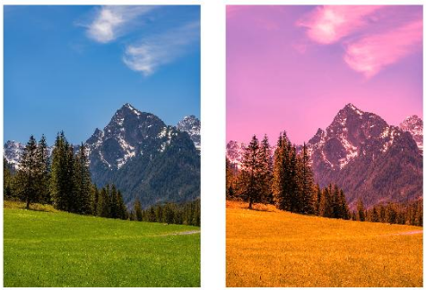
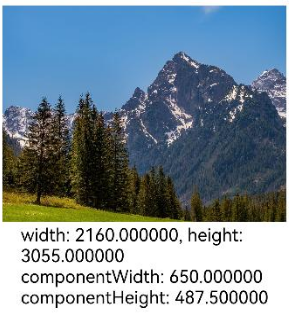

# Displaying Images (Image)

Developers often need to display images in applications, such as icons in buttons, network images, local images, etc. To display images in applications, the Image component must be used. The Image component supports multiple image formats, including png, jpg, bmp, svg, gif, and heif. For specific usage, please refer to the [Image](../../../API_Reference/source_zh_cn/arkui-cj/cj-image-video-image.md) component.

The Image component is created by calling an interface, which is invoked as follows:

```cangjie
Image(src: String | AppResource | PixelMap | ImageContent)
```

This interface retrieves images through the image data source and supports rendering and displaying both local and network images. Here, `src` is the data source of the image. For loading methods, please refer to [Loading Image Resources](#loading-image-resources).

## Loading Image Resources

The Image component supports loading two types of resources: archived images and multimedia pixel maps.

### Archived Image Data Sources

Archived image data sources can be categorized into local resources, network resources, Resource resources, media library resources, and base64.

- **Local Resources**

  Create a folder and place local images anywhere within the `cangjie` folder.

  The Image component can display images by referencing the local image path (the root directory is the `cangjie` folder).

  ```cangjie
  Image('file://media/images/view.jpg')
  .width(200)
  ```

- **Network Resources**

  To load network images, the `ohos.permission.INTERNET` permission must be requested. In this case, the `src` parameter of the Image component is the URL of the network image.

  Currently, the Image component only supports loading simple network images.

  When the Image component loads a network image for the first time, it requests the network resource. For subsequent loads, it reads the image from the cache by default.

  Network images must comply with the RFC 9113 standard; otherwise, loading will fail. If the downloaded network image exceeds 10MB or multiple network images are downloaded at once, it is recommended to use the [HTTP](../network/cj-http-request.md) tool to pre-download them in advance. This improves image loading performance and facilitates data management on the application side.

  ```cangjie
  Image("https://www.example.com/example.jpg") // Replace with the actual URL in practice
  ```

- **Resource Resources**

  Using the resource format allows images to be referenced across packages/modules. Images in the `resources` folder can be read and converted to the `AppResource` format via the `@r` resource interface. The directory structure of the `resources` folder is shown below:

  

  Invocation method:

  ```cangjie
  Image(@r(app.media.startIcon))
  ```

- **Media Library (file://media/storage)**

  Supports strings prefixed with `file://`.

  The URL format obtained from the media library typically looks like this:

  ```cangjie
  Image('file://media/Photos/5')
  .width(200)
  ```

## Displaying Vector Graphics

The Image component can display vector graphics (images in SVG format). For SVG tag documentation, please refer to [SVG Instructions](../../../API_Reference/source_zh_cn/apis/ImageKit/cj-apis-image.md#svg-tag-instructions).

SVG images can use the `fillColor` property to change the drawing color.

```cangjie
Image(@r(app.media.cloud))
  .width(50)
  .fillColor(Color.BLUE)
```

The original SVG image is shown below:


The SVG image after setting the drawing color is shown below:


### Referencing Bitmaps in Vector Graphics

If the SVG image source loaded by the Image component contains references to local bitmaps, the path of the SVG image source should be set to the project path with `cangjie` as the root directory. Meanwhile, the path of the local bitmap should be set to a relative path at the same level as the SVG image source.

The method for setting the SVG image source path in the Image component is as follows:

```cangjie
Image('resource://rawfile/icon.svg')
  .width(50)
  .height(50)
```

The SVG image source specifies the local bitmap path via the `xmlns:xlink` attribute of the `<image>` tag. The local bitmap path is set to a relative path at the same level as the SVG image source:

```cangjie
<svg width="200" height="200">
  <image width="200" height="200" xmlns:xlink="sky.svg">
</svg>
```

An example of the file project path is shown below:


## Adding Attributes

Setting attributes for the Image component can make image display more flexible and achieve custom effects. Below are examples of commonly used attributes. For a complete list of attributes, see [Image](../../../API_Reference/source_zh_cn/arkui-cj/cj-image-video-image.md).

### Setting Image Scaling Types

Use the `objectFit` property to scale the image within a frame of fixed height and width.

<!-- run -->

```cangjie
package ohos_app_cangjie_entry
import kit.ArkUI.*
import ohos.arkui.state_macro_manage.*
import ohos.resource_manager.*

@Entry
@Component
class EntryView {
    let scroller: Scroller = Scroller()
    func build() {
        Scroll(this.scroller) {
            Column() {
                Row() {
                    Image(@r(app.media.example))
                        .width(160)
                        .height(120)
                        .border(width: 1)
                        // Maintain aspect ratio to shrink or enlarge, ensuring the image is fully displayed within the boundaries.
                        .objectFit(ImageFit.Contain)
                        .margin(15)
                        .overlay(title: 'Contain', align: Alignment.Bottom, offset: ContentOffset(x: 0.0, y: 20.0))
                    Image(@r(app.media.example))
                        .width(160)
                        .height(120)
                        .border(width: 1)
                        // Maintain aspect ratio to shrink or enlarge, ensuring the image covers the boundaries.
                        .objectFit(ImageFit.Cover)
                        .margin(15)
                        .overlay(title: 'Cover', align: Alignment.Bottom, offset: ContentOffset(x: 0.0, y: 20.0))
                }
                Row() {
                    Image(@r(app.media.example))
                        .width(160)
                        .height(120)
                        .border(width: 1)
                        // Adaptive display.
                        .objectFit(ImageFit.Auto)
                        .margin(15)
                        .overlay(title: 'Auto', align: Alignment.Bottom, offset: ContentOffset(x: 0.0, y: 20.0))
                    Image(@r(app.media.example))
                        .width(160)
                        .height(80)
                        .border(width: 1)
                        // Enlarge or shrink without maintaining aspect ratio, filling the display boundaries.
                        .objectFit(ImageFit.Fill)
                        .margin(15)
                        .overlay(title: 'Fill', align: Alignment.Bottom, offset: ContentOffset(x: 0.0, y: 20.0))
                }
                Row() {
                    Image(@r(app.media.example))
                        .width(160)
                        .height(120)
                        .border(width: 1)
                        // Maintain aspect ratio, shrinking the image or keeping it unchanged.
                        .objectFit(ImageFit.ScaleDown)
                        .margin(15)
                        .overlay(title: 'ScaleDown', align: Alignment.Bottom, offset: ContentOffset(x: 0.0, y: 20.0))
                    Image(@r(app.media.example))
                        .width(160)
                        .height(80)
                        .border(width: 1)
                        // Display at original size.
                        .objectFit(ImageFit.None)
                        .margin(15)
                        .overlay(title: 'None', align: Alignment.Bottom, offset: ContentOffset(x: 0.0, y: 20.0))
                }
            }
        }
    }
}
```


### Image Interpolation

When the original image has low resolution and is displayed enlarged, it may appear blurry with jagged edges. In this case, the `interpolation` property can be used to interpolate the image, making it appear clearer.

<!-- run -->

```cangjie
package ohos_app_cangjie_entry

import kit.ArkUI.*
import ohos.arkui.state_macro_manage.*
import ohos.resource_manager.*

@Entry
@Component
class EntryView {
    func build() {
        Column() {
            Row() {
                Image(@r(app.media.grass))
                    .width(40.percent)
                    .interpolation(ImageInterpolation.None)
                    .borderWidth(1)
                    .overlay(title: "Interpolation.None", align: Alignment.Bottom, offset: ContentOffset(x: 0.0, y: 20.0
                    ))
                    .margin(10)
                Image(@r(app.media.grass))
                    .width(40.percent)
                    .interpolation(ImageInterpolation.Low)
                    .borderWidth(1)
                    .overlay(title: "Interpolation.Low", align: Alignment.Bottom, offset: ContentOffset(x: 0.0, y: 20.0)
                    )
                    .margin(10)
            }
                .width(100.percent)
                .justifyContent(FlexAlign.Center)

            Row() {
                Image(@r(app.media.grass))
                    .width(40.percent)
                    .interpolation(ImageInterpolation.Medium)
                    .borderWidth(1)
                    .overlay(title: "Interpolation.Medium", align: Alignment.Bottom,
                        offset: ContentOffset(x: 0.0, y: 20.0))
                    .margin(10)
                Image(@r(app.media.grass))
                    .width(40.percent)
                    .interpolation(ImageInterpolation.High)
                    .borderWidth(1)
                    .overlay(title: "Interpolation.High", align: Alignment.Bottom, offset: ContentOffset(x: 0.0, y: 20.0
                    ))
                    .margin(10)
            }
                .width(100.percent)
                .justifyContent(FlexAlign.Center)
        }.height(100.percent)
    }
}
```


### Setting Image Repeat Styles

Use the `objectRepeat` property to set the repeat style of the image. For repeat styles, please refer to the [ImageRepeat](../../../API_Reference/source_zh_cn/arkui-cj/cj-common-types.md#enum-imagerepeat) enumeration.

<!-- run -->

```cangjie
package ohos_app_cangjie_entry

import kit.ArkUI.*
import ohos.arkui.state_macro_manage.*
import ohos.resource_manager.*

@Entry
@Component
class EntryView {
    func build() {
        Column(10) {
            Row(5) {
                Image(@r(app.media.ic_public_favor_filled_1))
                    .width(110)
                    .height(115)
                    .border(width: 1)
                    .objectRepeat(ImageRepeat.XY)
                    .objectFit(ImageFit.ScaleDown)
                    // Repeat the image on both horizontal and vertical axes.
                    .overlay(title: 'ImageRepeat.XY', align: Alignment.Bottom, offset: ContentOffset(x: 0.0, y: 20.0))
                Image(@r(app.media.ic_public_favor_filled_1))
                    .width(110)
                    .height(115)
                    .border(width: 1)
                    .objectRepeat(ImageRepeat.Y)
                    .objectFit(ImageFit.ScaleDown)
                    // Repeat image drawing only on the vertical axis
                    .overlay(title: 'ImageRepeat.Y', align: Alignment.Bottom, offset: ContentOffset(x: 0.0, y: 20.0))
                Image(@r(app.media.ic_public_favor_filled_1))
                    .width(110)
                    .height(115)
                    .border(width: 1)
                    .objectRepeat(ImageRepeat.X)
                    .objectFit(ImageFit.ScaleDown)
                    // Repeat image drawing only on the horizontal axis
                    .overlay(title: 'ImageRepeat.X', align: Alignment.Bottom, offset: ContentOffset(x: 0.0, y: 20.0))
            }
        }
        .height(150)
        .width(100.percent)
        .padding(8)
    }
}
```


### Setting Image Rendering Mode

Use the `renderMode` property to set the image rendering mode to original color or grayscale.

 <!-- run -->

```cangjie
package ohos_app_cangjie_entry

import kit.ArkUI.*
import ohos.arkui.state_macro_manage.*
import ohos.resource_manager.*

@Entry
@Component
class EntryView {
    func build() {
        Column(10) {
            Row(50) {
                Image(@r(app.media.example))
                    // Set image rendering mode to original color
                    .renderMode(ImageRenderMode.Original)
                    .width(100)
                    .height(100)
                    .border(width: 1)
                    // overlay is a universal property for displaying descriptive text on components
                    .overlay(title: 'Original', align: Alignment.Bottom, offset: ContentOffset(x: 0.0, y: 20.0))
                Image(@r(app.media.example))
                    // Set image rendering mode to grayscale
                    .renderMode(ImageRenderMode.Template)
                    .width(100)
                    .height(100)
                    .border(width: 1)
                    .overlay(title: 'Template', align: Alignment.Bottom, offset: ContentOffset(x: 0.0, y: 20.0))
            }
        }
        .height(150)
        .width(100.percent)
        .padding(top: 20, right: 10)
    }
}
```


### Setting Image Decoding Size

Use the `sourceSize` property to set the image decoding size, reducing the image resolution.

The original image size is 1280*960. This example decodes the image to 40*40 and 90*90.

 <!-- run -->

```cangjie
package ohos_app_cangjie_entry

import kit.ArkUI.*
import ohos.arkui.state_macro_manage.*
import ohos.resource_manager.*

@Entry
@Component
class EntryView {
    func build() {
        Column() {
            Row(50) {
                Image(@r(app.media.example))
                    .sourceSize(40, 40)
                    .objectFit(ImageFit.ScaleDown)
                    .aspectRatio(1)
                    .width(25.percent)
                    .border(width: 1)
                    .overlay(title: 'width:40 height:40', align: Alignment.Bottom, offset: ContentOffset(x: 0.0, y: 40.0))
                Image(@r(app.media.example))
                    .sourceSize(90, 90)
                    .objectFit(ImageFit.ScaleDown)
                    .width(25.percent)
                    .aspectRatio(1)
                    .border(width: 1)
                    .overlay(title: 'width:90 height:90', align: Alignment.Bottom, offset: ContentOffset(x: 0.0, y: 40.0))
            }
            .height(150)
            .width(100.percent)
            .padding(20)
        }
    }
}
```


### Adding Filter Effects to Images

Use `colorFilter` to modify pixel colors and apply filter effects to images.

 <!-- run -->

```cangjie
package ohos_app_cangjie_entry

import kit.ArkUI.*
import ohos.arkui.state_macro_manage.*
import ohos.resource_manager.*

@Entry
@Component
class EntryView {
    let colorFilter = ColorFilter([1.0, 1.0, 0.0, 0.0, 0.0, 0.0, 1.0, 0.0, 0.0, 0.0, 0.0, 0.0, 1.0, 0.0, 0.0, 0.0, 0.0,
        0.0, 1.0, 0.0])
    func build() {
        Column() {
            Row() {
                Image(@r(app.media.example))
                    .width(40.percent)
                    .margin(10)
                Image(@r(app.media.example))
                    .width(40.percent)
                    .colorFilter(colorFilter)
                    .margin(10)
            }
            .width(100.percent)
            .justifyContent(FlexAlign.Center)
        }
    }
}
```



### Synchronous Image Loading

Normally, image loading is asynchronous to avoid blocking the main thread and affecting UI interaction. However, in specific cases where image refresh causes flickering, the `syncLoad` property can be used to load images synchronously, preventing flickering. Not recommended for long image loading times as it may cause the page to become unresponsive.

```cangjie
Image(@r(app.media.icon))
  .syncLoad(true)
```

## Event Invocation

By binding the `onComplete` event to the Image component, essential image information can be obtained upon successful loading. If image loading fails, the `onError` callback can also be bound to retrieve the result.

 <!-- run -->

```cangjie
package ohos_app_cangjie_entry

import kit.ArkUI.*
import ohos.arkui.state_macro_manage.*
import ohos.resource_manager.*
import kit.PerformanceAnalysisKit.Hilog

@Entry
@Component
class EntryView {
    @State var widthValue: Float64 = 0.0
    @State var heightValue: Float64 = 0.0
    @State var componentWidth: Float64 = 0.0
    @State var componentHeight: Float64 = 0.0
    func build() {
        Column() {
            Row() {
                Image(@r(app.media.example))
                    .width(200)
                    .height(150)
                    .margin(15)
                    .onComplete({msg: CJImageComplete =>
                        this.widthValue = msg.width
                        this.heightValue = msg.height
                        this.componentWidth = msg.componentWidth
                        this.componentHeight = msg.componentHeight
                    })
                    .onError({evt =>
                        AppLog.info("load image fail")
                    })
                    .overlay(
                        title: '\nwidth: ${this.widthValue}, height: ${this.heightValue}\ncomponentWidth: ${this.componentWidth}\ncomponentHeight: ${this.componentHeight}',
                        align: Alignment.Bottom,
                        offset: ContentOffset( x: 0.0, y: 60.0 )
                    )
            }
        }
    }
}
```


