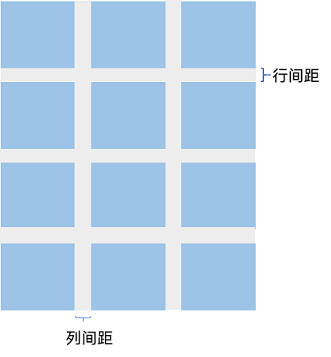

# Creating Grids (Grid/GridItem)

## Overview

A grid layout consists of cells divided by "rows" and "columns," enabling diverse layouts by specifying the cells where "items" are placed. Grid layouts excel at evenly dividing pages and controlling child component proportions, making them a crucial adaptive layout solution. Common use cases include 9-grid image displays, calendars, calculators, etc.

ArkUI provides the [Grid](../../../API_Reference/source_zh_cn/arkui-cj/cj-scroll-swipe-grid.md) container component and its child component [GridItem](../../../API_Reference/source_zh_cn/arkui-cj/cj-scroll-swipe-griditem.md) for constructing grid layouts. Grid sets layout parameters, while GridItem defines child component characteristics. The Grid component supports generating child components through [conditional rendering](./rendering_control/cj-rendering-control-ifelse.md), [loop rendering](./rendering_control/cj-rendering-control-foreach.md), and [lazy loading](./rendering_control/cj-rendering-control-lazyforeach.md).

## Layout and Constraints

The Grid component serves as a grid container where each entry corresponds to a GridItem component, as shown in Figure 1.

**Figure 1** Relationship Between Grid and GridItem Components


> **Note:**
>
> Child components of Grid must be GridItem components.

Grid layouts are two-dimensional. The Grid component supports customizing row/column counts and size proportions, spanning child components across multiple rows/columns, and providing both vertical and horizontal layout capabilities. When the container's size changes, all child components and spacing adjust proportionally, enabling adaptive layouts. These features allow diverse grid styles, as illustrated in Figure 2.

**Figure 2** Grid Layout Examples


If width/height properties are set for Grid, those values determine its dimensions. Otherwise, Grid defaults to its parent component's size.

Based on row/column count and proportion settings, Grid layouts fall into three scenarios:

1. **Both row/column counts and proportions set**: Grid displays only fixed rows/columns; excess items are hidden, and scrolling is disabled. *(Recommended approach)*

2. **Only one of row/column counts/proportions set**: Items arrange along the specified direction, with scrolling for overflow.

3. **Neither row/column counts nor proportions set**: Items arrange along the layout direction, with row/column counts determined by multiple attributes. Excess items beyond capacity are hidden, and scrolling is disabled.

## Setting Arrangement Methods

### Configuring Row/Column Counts and Proportions

The `rowsTemplate` and `columnsTemplate` properties define grid layout arrangements. Their values are strings combining spaces and "number+fr" segments, where:
- The number of "fr" units determines row/column counts.
- The preceding numbers calculate width/height proportions.

**Figure 3** Row/Column Proportion Example


Figure 3 shows a 3x3 grid where:
- Vertically: 3 equal parts (1fr each row)
- Horizontally: 4 parts (1fr for 1st column, 2fr for 2nd, 1fr for 3rd)

Implementation:

```cangjie
Grid() {
  ...
}
.rowsTemplate("1fr 1fr 1fr")
.columnsTemplate("1fr 2fr 1fr")
```

> **Note:**
>
> When `rowsTemplate`/`columnsTemplate` are set, these Grid properties become ineffective: `layoutDirection`, `maxCount`, `minCount`, `cellLength`. Refer to [Grid Attributes](../../../API_Reference/source_zh_cn/arkui-cj/cj-scroll-swipe-grid.md#组件属性).

### Setting Main Axis Direction

Without row/column configurations, use `layoutDirection` to set the main axis direction, combined with `minCount`/`maxCount` to constrain grid counts.

**Figure 4** Main Axis Direction Illustration


- `Row`: Left-to-right arrangement, wrapping to next row when full.
- `Column`: Top-to-bottom arrangement, wrapping to next column when full.

Example with `maxCount=3` limiting main axis units:

```cangjie
Grid() {
  ...
}
.maxCount(3)
.layoutDirection(GridDirection.Row)
```

> **Note:**
>
> - `layoutDirection` only works without `rowsTemplate`/`columnsTemplate`.
> - With only `rowsTemplate`, main axis is horizontal.
> - With only `columnsTemplate`, main axis is vertical.

## Displaying Data in Grid Layouts

Grids organize elements in two dimensions, as shown in Figure 5.

**Figure 5** General Office Services


Grid displays GridItem children in 2D layouts:

```cangjie
Grid() {
    GridItem() {
        Text("Meeting")
          ...
    }

    GridItem() {
        Text("Check-in")
          ...
    }

    GridItem() {
        Text("Vote")
          ...
    }

    GridItem() {
        Text("Print")
          ...
    }
}
.rowsTemplate("1fr 1fr")
.columnsTemplate("1fr 1fr")
```

For structurally similar GridItems, prefer `ForEach` to reduce code duplication:

```cangjie
package ohos_app_cangjie_entry
import kit.ArkUI.*
import ohos.arkui.state_macro_manage.*
import ohos.resource_manager.*

@Entry
@Component
class EntryView {
    @State var services: Array<String> = ["Meeting", "Vote", "Check-in", "Print"]
    func build() {
            Column() {
                Grid() {
                    ForEach(this.services, itemGeneratorFunc: {service: String, _: Int64 =>
                        GridItem() {
                            Text(service)
                        }}
                    )
                }
                .rowsTemplate("1fr 1fr")
                .columnsTemplate("1fr 1fr")
            }
    }
}
```

## Setting Row/Column Gaps

Horizontal spacing between grid units is row gap; vertical spacing is column gap (Figure 6).

**Figure 6** Grid Gaps



Use `rowsGap` and `columnsGap` to set spacing. For Figure 5's calculator:
- Row gap: 15vp
- Column gap: 10vp

```cangjie
Grid() {
  ...
}
.columnsGap(10)
.rowsGap(15)
```

## Building Scrollable Grids

Scrollable grids are common in file managers, shopping/video lists (Figure 7). When only one of `rowsTemplate`/`columnsTemplate` is set, grids become scrollable in the overflow direction.

**Figure 7** Horizontally Scrollable Grid


- `columnsTemplate` set: Vertical scrolling
- `rowsTemplate` set: Horizontal scrolling

Implementation for Figure 7:

```cangjie
package ohos_app_cangjie_entry
import kit.ArkUI.*
import ohos.arkui.state_macro_manage.*
import ohos.resource_manager.*

@Entry
@Component
class EntryView {
    @State var services: Array<String> = ["Live", "Import"]
    func build() {
            Column(5) {
                Grid() {
                    ForEach(this.services, itemGeneratorFunc: {service: String, _: Int64 =>
                        GridItem() {
                            // Add content
                        }
                        .width(25.percent)
                        }
                    )
                }
                .rowsTemplate("1fr 1fr")
                .rowsGap(15)
        }
    }
}
```

## Controlling Scroll Position

Similar to "back to top" in news lists, scroll control is useful for grid features like calendar pagination (Figure 8).

**Figure 8** Calendar Pagination


Bind a [Scroller](../../../API_Reference/source_zh_cn/arkui-cj/cj-scroll-swipe-scroll.md#scroll) object to Grid for scroll control, e.g., using [scrollPage](../../../API_Reference/source_zh_cn/arkui-cj/cj-scroll-swipe-scroll.md#func-scrollpagebool) for page turns.

Initialize Scroller:

```cangjie
var scroller: Scroller = Scroller()
```

Calendar "Next Page" button implementation:

```cangjie
package ohos_app_cangjie_entry
import kit.ArkUI.*
import ohos.arkui.state_macro_manage.*
import ohos.resource_manager.*

@Entry
@Component
class EntryView {
    var scroller: Scroller = Scroller()
    func build() {
        Column() {
            Grid(this.scroller) {
              // Add content
            }
            .columnsTemplate("1fr 1fr 1fr 1fr 1fr 1fr 1fr")
            .height(85.percent)

            Row() {
              Row() {
                  Button("Previous")
                  .onClick{ evt =>
                      this.scroller.scrollPage(false)
                  }.width(100)
              }.width(50.percent)
              .justifyContent(FlexAlign.Center)

              Row() {
                  Button("Next")
                  .onClick{ evt =>
                      this.scroller.scrollPage(true)
                  }.width(100)
              }.width(50.percent)
              .justifyContent(FlexAlign.Center)
            }
            .height(15.percent)
        }.height(100.percent)
    }
}
```

## Performance Optimization

For small datasets, [loop rendering](./rendering_control/cj-rendering-control-foreach.md) suffices. For large scrollable grids, use [lazy loading](./rendering_control/cj-rendering-control-lazyforeach.md) to load data on demand, improving performance.

Refer to [Lazy Loading](./rendering_control/cj-rendering-control-lazyforeach.md) for implementation details.

With lazy loading, set `cachedCount` to preload GridItems (only effective in LazyForEach). This caches items before/after the visible area (count = `cachedCount` × columns), releasing others.

```cangjie
Grid() {
    LazyForEach(this.dataSource, itemGeneratorFunc: {dataSource: T, _: Int64 =>
        GridItem() {
        }
    })
}
.cachedCount(3)
```

> **Note:**
>
> Higher `cachedCount` increases CPU/memory usage. Balance performance and user experience based on actual needs.