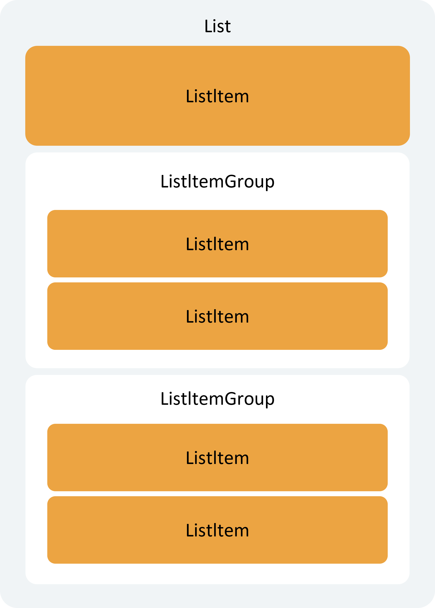
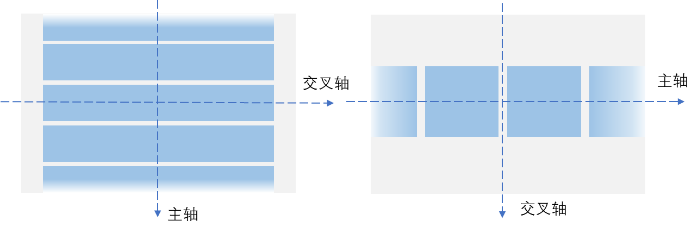
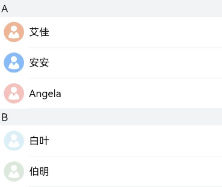
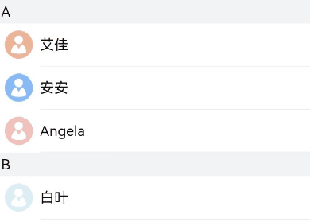
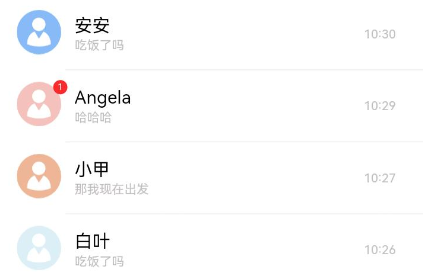
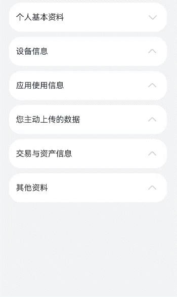

# Creating Lists (List)

## Overview

A list is a complex container that automatically provides scrolling functionality when the number of list items reaches a certain threshold and the content exceeds the screen size. It is suitable for presenting homogeneous data types or datasets, such as images and text. Displaying data collections in lists is a common requirement in many applications (e.g., contact lists, music playlists, shopping lists, etc.).

Using lists enables the efficient and structured display of scrollable information. By arranging child components—[ListItemGroup](../../../API_Reference/source_zh_cn/arkui-cj/cj-scroll-swipe-listgroup.md) or [ListItem](../../../API_Reference/source_zh_cn/arkui-cj/cj-scroll-swipe-listitem.md)—linearly in vertical or horizontal directions within the [List](../../../API_Reference/source_zh_cn/arkui-cj/cj-scroll-swipe-list.md) component, individual views for rows or columns in the list can be provided. Alternatively, you can use [loop rendering](./rendering_control/cj-rendering-control-foreach.md) to iterate over a set of rows or columns, or mix any number of individual views with ForEach structures to build a list. The List component supports rendering control methods such as conditional rendering, loop rendering, and lazy loading to generate child components.

## Layout and Constraints

As a container, a list automatically arranges its child components along its scrolling direction. Adding or removing components from the list will reorder the child components.

As shown in **Figure 1**, in a vertical list, the List automatically arranges ListItemGroup or ListItem vertically.

ListItemGroup is used for grouped display of list data, and its child components are also ListItems. ListItem represents a single list item and can contain a single child component.

**Figure 1** Relationship Between List, ListItemGroup, and ListItem Components



> **Note:**
>
> The child components of List must be ListItemGroup or ListItem. ListItem and ListItemGroup must be used in conjunction with List.

### Layout

In addition to providing vertical and horizontal layout capabilities and adaptive scrolling when content exceeds the screen, List also offers layout capabilities for adaptive arrangement of items along the cross axis.

Using vertical layout capabilities, you can build single-column or multi-column vertical scrolling lists, as shown in **Figure 2**.

**Figure 2** Vertical Scrolling Lists (Left: Single Column; Right: Multiple Columns)


Using horizontal layout capabilities, you can build single-row or multi-row horizontal scrolling lists, as shown in **Figure 3**.

**Figure 3** Horizontal Scrolling Lists (Left: Single Row; Right: Multiple Rows)


Grid and WaterFlow can also achieve single-column or multi-column layouts. However, if each column has equal width and no cross-row or cross-column layout is needed, List is recommended over Grid and WaterFlow.

### Constraints

The main axis direction of a list refers to the arrangement direction of the child component columns and is also the scrolling direction of the list. The axis perpendicular to the main axis is called the cross axis, and its direction is orthogonal to the main axis.

As shown in **Figure 4**, the main axis of a vertical list is the vertical direction, and the cross axis is the horizontal direction. For a horizontal list, the main axis is the horizontal direction, and the cross axis is the vertical direction.

**Figure 4** Main Axis and Cross Axis of a List



If the List component has a specified size along its main or cross axis, the size in that direction will be the set value.

If the List component does not have a specified size along its main axis, and the total size of its child components along the main axis is smaller than the parent component's size, the List's main axis size will automatically adapt to the total size of the child components.

As shown in **Figure 5**, when a vertical list B does not have a specified height, and its parent component A has a height of 200.vp, if the total height of all its child components C is 150.vp, then the height of list B will be 150.vp.

**Figure 5** Example 1 of Main Axis Height Constraint (**A**: Parent Component of List; **B**: List Component; **C**: All Child Components of List)


If the total size of the child components along the main axis exceeds the parent component's size, the List's main axis size will adapt to the parent component's size.

As shown in **Figure 6**, for a vertical list B without a specified height, if its parent component A has a height of 200.vp and the total height of all its child components C is 300.vp, the height of list B will be 200.vp.

**Figure 6** Example 2 of Main Axis Height Constraint (**A**: Parent Component of List; **B**: List Component; **C**: All Child Components of List)


If the List component does not have a specified size along its cross axis, its size will default to adapting to the parent component's size.

## Development Layout

### Setting the Main Axis Direction

The main axis of the List component defaults to the vertical direction, meaning that by default, you do not need to manually set the List direction to build a vertical scrolling list.

For horizontal scrolling lists, set the listDirection property of List to Axis.Horizontal. listDirection defaults to Axis.Vertical, meaning the main axis is vertical by default.

```cangjie
List() {
  // ...
}
.listDirection(Axis.Horizontal)
```

### Setting Cross Axis Layout

The cross axis layout of the List component can be configured using the lanes and alignListItem properties. The lanes property determines the number of list items arranged along the cross axis, while alignListItem sets the alignment of child components along the cross axis.

The lanes property of the List component is typically used to adaptively build lists with varying numbers of rows or columns across different device sizes, enabling a "develop once, deploy everywhere" scenario. The declaration method for the lanes property is described in [Declaration Method](../../../API_Reference/source_zh_cn/arkui-cj/cj-scroll-swipe-list.md#func-lanesint32). For a vertical list, setting lanes to 2 means building a two-column vertical list, as shown in the right image of Figure 2. The default value for lanes is 1, meaning a vertical list defaults to a single column.

```cangjie
List() {
  // ...
}
.lanes(2)
```

When using ".lanes(minLength: Length, maxLength: Length)" to declare the property, the number of rows or columns is adaptively determined based on minLength and maxLength relative to the List component's size.

```cangjie
List() {
  // ...
}
.lanes(minLength: 200, maxLength: 300)
```

For example, suppose a vertical list has lanes set to minLength: 200, maxLength: 300. In this case:

- When the List component width is 300.vp, since minLength is 200.vp, the list will have one column.
- When the List component width changes to 400.vp, meeting twice the minLength, the list will adaptively switch to two columns.

Similarly, for a vertical list, setting alignListItem to ListItemAlign.Center means the list items are center-aligned horizontally. The default value for alignListItem is ListItemAlign.Start, meaning list items are aligned to the start of the cross axis by default.

```cangjie
List() {
  // ...
}
.alignListItem(ListItemAlign.Center)
```

## Displaying Data in Lists

List views display collections of items vertically or horizontally, providing scrolling functionality when rows or columns exceed the screen size, making them suitable for displaying large datasets. In its simplest form, a List statically creates the content of its ListItems.

**Figure 7** City List


<!-- run -->

```cangjie
package ohos_app_cangjie_entry

import kit.ArkUI.*
import ohos.arkui.state_macro_manage.*

@Entry
@Component
public class EntryView {
    func build() {
        List() {
            ListItem() {
                Text('Beijing').fontSize(24)
            }

            ListItem() {
                Text('Hangzhou').fontSize(24)
            }

            ListItem() {
                Text('Shanghai').fontSize(24)
            }
        }
        .backgroundColor(0xfff1f3f5)
        .alignListItem(ListItemAlign.Center)
    }
}
```

Since a ListItem can only have one root node component and does not support using multiple components in a flat structure, if a list item consists of multiple component elements, these elements must be combined into a container component or a custom component.

**Figure 8** Example of a Contact List Item


As shown in **Figure 8**, each contact in the contact list has an avatar and a name. In this case, the Image and Text components must be encapsulated within a Row container.

```cangjie
List() {
    ListItem() {
        Row() {
            Image(@r(app.media.iconE))
                .width(40)
                .height(40)
                .margin(10)
            Text('Xiao Ming').fontSize(20)
        }
    }
    ListItem() {
        Row() {
            Image(@r(app.media.iconF))
                .width(40)
                .height(40)
                .margin(10)
            Text('Xiao Hong').fontSize(20)
        }
    }
}
```

## Iterating List Content

Typically, applications dynamically create lists from data collections. Using [loop rendering](./rendering_control/cj-rendering-control-foreach.md), data can be iteratively fetched from a data source, and corresponding components can be created during each iteration, reducing code complexity.

Cangjie provides loop rendering capabilities for components through [ForEach](./rendering_control/cj-rendering-control-foreach.md). For example, in a simple contact list, the contact names and avatar data are stored in the contacts array as a Contact class structure. Using ForEach nested within ListItem replaces multiple flat, similar ListItems, thereby reducing repetitive code.

<!-- run -->

```cangjie
package ohos_app_cangjie_entry

import kit.ArkUI.*
import ohos.arkui.state_macro_manage.*
import ohos.resource_manager.*

public class Contact {
    var name: String
    var icon: AppResource

    public init(name: String, icon: AppResource) {
        this.name = name
        this.icon = icon
    }
}

@Entry
@Component
public class EntryView {
    private var contacts: Array<Contact> = [Contact('Xiao Ming', @r(app.media.iconE)), Contact('Xiao Hong', @r(app.media.iconF))]
    func build() {
        List() {
            ForEach(this.contacts, itemGeneratorFunc: { item: Contact, _: Int64 =>
                    ListItem() {
                        Row() {
                            Image(item.icon)
                                .width(40)
                                .height(40)
                                .margin(10)
                            Text(item.name).fontSize(20)
                        }
                            .width(100.percent)
                            .justifyContent(FlexAlign.Start)
                    }
                },
                keyGeneratorFunc: {item: Contact, idx: Int64 => idx.toString()}
            )
        }.width(100.percent)
    }
}
```

## Customizing List Styles

### Setting Content Spacing

When initializing a list, if you need to add spacing between list items, you can use the space parameter. For example, to add a 10.vp spacing along the main axis between each list item:

```cangjie
List(space: 10) {
  // ...
}
```

### Adding Dividers

Dividers are used to separate interface elements, making individual elements easier to identify. As shown in **Figure 9**, when list items have icons (e.g., Bluetooth icons) on the left, the icons themselves provide sufficient distinction, so the divider can start after the icon.

**Figure 9** Setting List Divider Styles


The List component provides the divider property to add dividers between list items. When setting the divider property, you can configure the thickness and color of the divider using the strokeWidth and color properties.

The startMargin and endMargin properties set the distance from the divider to the start and end edges of the list, respectively.

```cangjie
List() {
  // ...
}
.divider(strokeWidth: 1, color: 0xffe9f0f0, startMargin: 60, endMargin: 10)
```

This example means drawing a 1.vp thick divider starting 60.vp from the list's start edge and ending 10.vp from the end edge, achieving the divider style shown in **Figure 9**.

> **Note:**
>
> - The width of the divider creates spacing between ListItems. If the content spacing set for the List is smaller than the divider width, the spacing between ListItems will use the divider width.
> - When the List has multiple columns, the startMargin and endMargin of the divider apply to each column.
> - The List component's divider is drawn between two ListItems. No divider is drawn above the first ListItem or below the last ListItem.

### Adding Scrollbars

When the height (or width) of list items exceeds the screen height (or width), the list can scroll vertically (or horizontally). For pages with extensive content, users can quickly navigate by dragging the scrollbar, as shown in **Figure 10**.

**Figure 10** List Scrollbar


When using the List component, the display of scroll bars can be controlled via the `scrollBar` property. The value type of `scrollBar` is [BarState](../../../API_Reference/source_zh_cn/arkui-cj/cj-common-types.md#enum-barstate). When set to `BarState.Auto`, scroll bars are displayed on demand. In this mode, the control appears when touching the scroll bar area, allowing users to drag the scroll bar up/down for quick content browsing. The scroll bar thickens during dragging and automatically disappears after 2 seconds of inactivity.

```cangjie
List() {
    // ...
}
.scrollBar(BarState.Auto)
```

## Supporting Grouped Lists

Grouped data display in lists enhances structural clarity and search efficiency, thereby improving usability. Grouped lists are widely used in real-world applications, such as the contact list shown in Figure 11.

**Figure 11** Grouped Contact List



The `ListItemGroup` component can be used within the `List` component to create two-dimensional lists by grouping items.

One or more `ListItemGroup` components can be directly used in a `List`. By default, `ListItemGroup` spans the full width of the `List`. During initialization, the `header` parameter can set the header component for the list group.

<!-- run -->

```cangjie
package ohos_app_cangjie_entry

import kit.ArkUI.*
import ohos.arkui.state_macro_manage.*
import ohos.resource_manager.*

@Entry
@Component
public class EntryView {
    @Builder
    public func itemHead(text: String) {
        // Header component for list groups, corresponding to the A, B, etc., group labels in the contact list
        Text(text)
            .fontSize(20)
            .backgroundColor(0xfff1f3f5)
            .width(100.percent)
            .padding(5)
    }

    func build() {
        List() {
            ListItemGroup(
                ListItemGroupParams(header: {=> bind(this.itemHead, this)("a")}),
                { =>
                    // Loop-render ListItems for group A
                }
            )

            ListItemGroup(
                ListItemGroupParams(header: {=> bind(this.itemHead, this)("b")}),
                { =>
                    // Loop-render ListItems for group B
                }
            )
        }
    }
}
```

If multiple `ListItemGroup` components share a similar structure, their data can be organized into an array, and `ForEach` can be used to loop-render multiple groups. For example, in a contact list, combine the contact data `contacts` (refer to [Iterating List Content](#iterating-list-content)) and corresponding group titles into an array `contactsGroups`. Then, loop-render `contactsGroups` with `ForEach` to implement a multi-group contact list. Refer to the sample code in [Adding Sticky Headers](#adding-sticky-headers).

## Adding Sticky Headers

Sticky headers are a common pattern for positioning header elements in alphabetical lists. As shown in Figure 12, when scrolling section A in a contact list, the header of section B remains positioned below A. When scrolling section B begins, its header sticks to the top until all B items are scrolled through, after which it is replaced by the next header.

Sticky headers clarify data representation and purpose, helping users locate information without excessive scrolling between headers and content.

**Figure 12** Sticky Headers



The `sticky` property of the `List` component, used with `ListItemGroup`, determines whether the header sticks to the top or the footer sticks to the bottom.

Set `sticky` to `StickyStyle.Header` for sticky header effects. For sticky footers, initialize `ListItemGroup` with the `footer` parameter and set `sticky` to `StickyStyle.Footer`.

<!-- run -->

```cangjie
package ohos_app_cangjie_entry

import ohos.arkui.state_macro_manage.*
import ohos.resource_manager.*
import kit.ArkUI.*

public class Contact {
    var name: String
    var icon: AppResource

    public init(name: String, icon: AppResource) {
        this.name = name
        this.icon = icon
    }
}

public class ContactGroup {
    var title: String
    var contacts: Array<Contact>

    public init(title: String, contacts: Array<Contact>) {
        this.title = title
        this.contacts = contacts
    }
}

@Entry
@Component
public class EntryView {
    // Define grouped contact data array contactsGroups
    private var contactsGroups : Array<ContactGroup> = [
            ContactGroup('A', [Contact('Ai Jia', @r(app.media.iconA)),Contact('An An', @r(app.media.iconB)),Contact('Angela', @r(app.media.iconC))]),
            ContactGroup('B', [Contact('Bai Ye', @r(app.media.iconD)),Contact('Bo Ming', @r(app.media.iconE))])
        ]

    @Builder
    func itemHead(text: String) {
        // Header component for list groups
        Text(text)
          .fontSize(20)
          .backgroundColor(0xfff1f3f5)
          .width(100.percent)
          .padding(5)
    }

    func build() {
        List() {
            // Loop-render ListItemGroup, where contactsGroups contains grouped contacts and titles
            ForEach(this.contactsGroups, itemGeneratorFunc: { itemGroup: ContactGroup, _: Int64 =>
                    ListItemGroup(ListItemGroupParams(header: {=> bind(this.itemHead, this)(itemGroup.title)}), { =>
                                // Loop-render ListItem
                                ForEach(itemGroup.contacts, itemGeneratorFunc: { item: Contact, _:Int64 =>
                                        ListItem() {
                                            // ...
                                        }
                                    },
                                    keyGeneratorFunc: {item: Contact, idx: Int64 => idx.toString()}
                                )
                            })
                },
                keyGeneratorFunc: {itemGroup: ContactGroup, idx: Int64 => idx.toString()}
            )
        }.sticky(StickyStyle.Header) // Enable sticky headers
    }
}
```

## Controlling Scroll Position

Controlling scroll position is common in applications like news feeds, where users may want to quickly jump to the bottom or top of a long list. As shown in Figure 13, this can be achieved by binding a `Scroller` to the `List`.

**Figure 13** Returning to List Top


During `List` initialization, bind a [Scroller](../../../API_Reference/source_zh_cn/arkui-cj/cj-scroll-swipe-scroll.md) object via the `scroller` parameter to control scrolling. For example, clicking a "Back to Top" button can trigger `scrollToIndex(0)`.

First, create a `Scroller` object:

```cangjie
var listScroller: Scroller = Scroller()
```

Bind it to the `List` and use `scrollToIndex(0)` to return to the top:

```cangjie
Stack(Alignment.Bottom) {
    List(space: 20, scroller: this.listScroller) {
        // ...
    }
}

Button() {
    // ...
}
.onClick({ event =>
    this.listScroller.scrollToIndex(0)
})
```

## Responding to Scroll Position

Many apps need to monitor scroll position changes. For example, a contact list may update a sidebar alphabet index as users scroll through different letter groups (Figure 14).

Multi-level categorization, like in shopping apps, also benefits from scroll position monitoring.

**Figure 14** Alphabet Index Responding to Contact List Scroll


The `onScrollIndex` event of `List` can synchronize the `AlphabetIndexer` component's selected letter based on the current `firstIndex`.

<!-- run -->

```cangjie
package ohos_app_cangjie_entry

import kit.ArkUI.*
import ohos.arkui.state_macro_manage.*
import ohos.resource_manager.*

@Entry
@Component
public class EntryView {
    let alphabets = ['#', 'A', 'B', 'C', 'D', 'E', 'F', 'G', 'H', 'I', 'J', 'K','L', 'M', 'N', 'O', 'P', 'Q', 'R', 'S', 'T', 'U', 'V', 'W', 'X', 'Y', 'Z']
    @State var selectedIndex: UInt32 = 0;
    private var listScroller:Scroller = Scroller()

    func build() {
        Stack(Alignment.End) {
            List(scroller: this.listScroller) {}
                .onScrollIndex({ firstIndex, scrollState =>
                    // Update selectedIndex based on firstIndex
                })

            // Alphabet indexer component
            AlphabetIndexer(arrayValue: this.alphabets, selected: 0)
                .selected(this.selectedIndex)
        }
    }
}
```

> **Note:**
>
> `ListItemGroup` counts as one index value; internal `ListItem` indices are not calculated separately.

## Responding to List Item Swipe

Swipe actions, like delete in messaging apps (Figure 15), are implemented via `ListItem`'s `swipeAction` property.

**Figure 15** Swipe-to-Delete List Item


The `swipeAction` property accepts `SwipeActionOptions`, where `end` defines the trailing swipe component (e.g., delete button). Pass the item index to delete the corresponding data on click.

- Build the trailing component:

    ```cangjie
    @Builder
    func itemEnd(index: Int64) {
      Button(ButtonOptions(shape: ButtonType.Circle)) {
        Image(@r(app.media.ic_public_delete_filled))
          .width(20)
          .height(20)
      }
      .onClick({ event =>
        this.message.remove(index) // Remove item from data source
      })
    }
    ```

- Bind `swipeAction` to `ListItem`:

    ```cangjie
    ListItem(){
        Text('1111').height(20)
    }
    .swipeAction(end: { => bind(this.itemEnd, this)(index)})
    ```

## Adding Badges to List Items

Badges non-intrusively highlight notifications or areas of interest. For example, unread message counts appear as badges on contact avatars (Figure 16).

**Figure 16** Badges on List Items



The [Badge](../../../API_Reference/source_zh_cn/arkui-cj/cj-information-display-badge.md) component wraps another component (e.g., `Image`) and displays a count or indicator at a specified position (`position`).

```cangjie
ListItem(){
  Badge(
    BadgeParams(count: 1, style: BadgeStyle(color: 0xfa2a2d, badgeSize: 16),
        position: BadgePosition.RightTop),{ =>
        Image(@r(app.media.startIcon))
    })
}
```

## Pull-to-Refresh and Load-More

The pull-to-refresh and load-more functionalities are widely used in mobile applications, such as content refreshing and loading in news feeds. Both operations work by responding to [touch events](../../../API_Reference/source_zh_cn/arkui-cj/cj-universal-event-touch.md), displaying a refresh or loading view at the top or bottom, and hiding it upon completion.

Taking pull-to-refresh as an example, its implementation mainly involves three steps:

1. Monitor the finger press event and record the initial position value.
2. Monitor the finger drag event, calculate the difference between the current and initial positions. A positive value indicates downward movement, with a predefined maximum movement threshold.
3. Monitor the finger release event. If the movement reaches the maximum threshold, trigger data loading and display the refresh view, then hide it after loading completes.

> **Note:**
>
> For pull-to-refresh operations, it is recommended to use the [Refresh](../../../API_Reference/source_zh_cn/arkui-cj/cj-scroll-swipe-refresh.md) component.

## List Editing

The edit mode for lists has broad applications, commonly seen in to-do management, file management, and memo recording. In edit mode, adding and deleting list items are fundamental functionalities, which essentially involve modifying the underlying data collection.

## Handling Long Lists

[Loop rendering](./rendering_control/cj-rendering-control-foreach.md) is suitable for short lists. When building long lists with numerous items, directly using loop rendering loads all elements at once, resulting in prolonged page startup times and degraded user experience. Therefore, it is recommended to use [Lazy Data Loading](./rendering_control/cj-rendering-control-lazyforeach.md) (LazyForEach) to implement on-demand iterative loading, thereby improving list performance.

For detailed implementation of lazy loading optimization for long lists, refer to the example in the [Lazy Data Loading](./rendering_control/cj-rendering-control-lazyforeach.md) section.

When using lazy loading for list rendering, to enhance scrolling experience and reduce white flashes during swiping, the List component provides the `cachedCount` parameter to set the number of cached list items, which only takes effect with LazyForEach.

```cangjie
List() {
  // ...
}.cachedCount(3)
```

For vertical lists:

- If lazy loading is applied to `ListItem`, in single-column mode, `cachedCount` items are cached before and after the displayed `ListItem`. In multi-column mode, `cachedCount * column count` items are cached.
- If lazy loading is applied to `ListItemGroup`, regardless of single or multi-column mode, `cachedCount` `ListItemGroup` items are cached before and after the displayed ones.

> **Note:**
>
> Increasing `cachedCount` raises CPU and memory overhead. Adjust based on actual performance and user experience requirements.
>
> When using lazy loading, list items outside the display area and cache range are destroyed.

## Collapse and Expand

Collapsing and expanding list items are widely used in scenarios like information display and form filling.

**Figure 17** Collapsing and Expanding List Items



The implementation workflow for collapsing and expanding list items is as follows:

1. Define the list item data structure.

    ```cangjie
    open class ItemInfo {
        var index: Int64
        var name: String
        var label: String
        var `type`: String = ''

        init(index: Int64, name: String, label: String, `type`: String) {
            this.index = index
            this.name = name
            this.label = label
            this.`type` = `type`
        }
    }

    public class ItemGroupInfo <: ItemInfo {
        var children: Array<ItemInfo>

        init(index: Int64, name: String, label: String, children: Array<ItemInfo>) {
            super(index, name, label, '')
            this.children = children
        }
    }
    ```

2. Construct the list structure.

    ```cangjie
    @State var routes: Array<ItemGroupInfo> = [
        ItemGroupInfo(
            0,
            'basicInfo',
            'Basic Personal Information',
            [
                ItemInfo(0, 'Nickname', 'xxxx', 'Text'),
                ItemInfo(1, 'Avatar', "resource://rawfile/startIcon.png", 'Image'),
                ItemInfo(2, 'Age', 'xxxx', 'Text'),
                ItemInfo(3, 'Birthday', 'xxxxxxxx', 'Text'),
                ItemInfo(4, 'Gender', 'xxxxxx', 'Text')
            ]
        ),
        ItemGroupInfo(1, 'equipInfo', 'Device Information', []),
        ItemGroupInfo(2, 'appInfo', 'App Usage Information', []),
        ItemGroupInfo(3, 'uploadInfo', 'Data You Uploaded', []),
        ItemGroupInfo(4, 'tradeInfo', 'Transaction and Asset Information', []),
        ItemGroupInfo(5, 'otherInfo', 'Other Information', [])
    ]
    @State var expandedItems: ObservedArray<Float32> = ObservedArray<Float32>([0.0, 0.0, 0.0, 0.0, 0.0, 0.0])

    func build() {
        Column() {
            // ...
            List(space: 10) {
                ForEach(
                    this.routes,
                    itemGeneratorFunc: { itemGroup: ItemGroupInfo, _: Int64 =>
                        ListItemGroup(
                            ListItemGroupParams(header: {=> bind(this.ListItemGroupHeader, this)(itemGroup)},
                                footer: {=>}, space: 0, style: ListItemGroupStyle.CARD)) {
                                    if (this.expandedItems[itemGroup.index] == 180.0) {
                                        ForEach(itemGroup.children, itemGeneratorFunc: { item: ItemInfo, _: Int64 =>
                                            ListItem(ListItemOptions(style: ListItemStyle.CARD)) {
                                                    Row() {
                                                        Text(item.name)
                                                        Blank()
                                                        if (item.`type` == 'Image') {
                                                            Image(item.label)
                                                                .height(20)
                                                                .width(20)
                                                        } else {
                                                            Text(item.label)
                                                        }
                                                        Image(@r(sys.media.ohos_ic_public_arrow_right))
                                                            .fillColor(@r(sys.color.ohos_id_color_fourth))
                                                            .height(30)
                                                            .width(30)
                                                    }
                                                    .width(100.percent)
                                            }.width(100.percent)
                                        })
                                    }
                            }
                    }
                )
            }.width(100.percent)
        }
        .width(100.percent)
        .height(100.percent)
        .justifyContent(FlexAlign.Start)
        .backgroundColor(@r(sys.color.ohos_id_color_sub_background))
    }
    ```

3. Control the expansion state of each list item by changing its status, and implement animation effects during expansion/collapse using `animation` and `animateTo`.

    ```cangjie
    @Builder
    func ListItemGroupHeader(itemGroup: ItemGroupInfo) {
        Row() {
            Text(itemGroup.label)
            Blank()
            Image(@r(sys.media.ohos_ic_public_arrow_down))
                .fillColor(@r(sys.color.ohos_id_color_fourth))
                .height(30)
                .width(30)
                .animationStart(AnimateParam(curve: Curve.EaseInOut, duration: 500))
                .rotate(this.expandedItems[itemGroup.index])
                .animationEnd()
        }
        .width(100.percent)
        .padding(10)
        .onClick({
            event => this.expandedItems[itemGroup.index] = 180.0 - this.expandedItems[itemGroup.index]
        })
    }
    ```