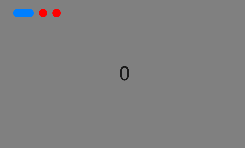
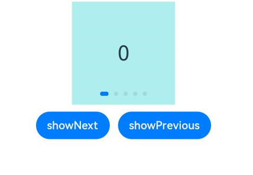

# Creating a Swiper

The [Swiper](../../../API_Reference/source_zh_cn/arkui-cj/cj-scroll-swipe-swiper.md) component provides sliding/swiping display capabilities. As a container component, Swiper can display its child components in a carousel when multiple children are set. This feature is commonly used for showcasing recommended content on application homepages.

For complex page scenarios, Swiper's preloading mechanism can be utilized to leverage the main thread's idle time for pre-building and layout rendering of components, optimizing the sliding experience.

## Layout and Constraints

As a container component, if Swiper has its own size properties set, these dimensions will remain effective throughout the carousel display. If size properties are not set, there are two scenarios: 
1. If `prevMargin` or `nextMargin` properties are set, Swiper's size will follow its parent component.
2. If neither `prevMargin` nor `nextMargin` is set, Swiper will automatically determine its size based on child components.

## Loop Playback

Loop playback is controlled by the `loop` property, which defaults to `true`.

When `loop` is `true`, users can continue swiping forward from the first page or backward from the last page. When `loop` is `false`, swiping beyond the first or last page is disabled.

- loop=true

  ```cangjie
  Swiper() {
    Text('0')
      .width(90.percent)
      .height(100.percent)
      .backgroundColor(Color.GRAY)
      .textAlign(TextAlign.Center)
      .fontSize(30)

    Text('1')
      .width(90.percent)
      .height(100.percent)
      .backgroundColor(Color.GREEN)
      .textAlign(TextAlign.Center)
      .fontSize(30)

    Text('2')
      .width(90.percent)
      .height(100.percent)
      .backgroundColor(Color.PINK)
      .textAlign(TextAlign.Center)
      .fontSize(30)
  }
  .width(100.percent)
  .height(30.percent)
  .loop(true)
  ```

  

- loop=false

  ```cangjie
  Swiper() {
    // ...
  }
  .width(100.percent)
  .height(30.percent)
  .loop(false)
  ```

  

## Auto Play

The `autoPlay` property controls automatic carousel playback, defaulting to `false`.

When `autoPlay` is `true`, child components will automatically switch at intervals specified by the `interval` property (default: 3000ms).

```cangjie
Swiper() {
  // ...
}
.loop(true)
.autoPlay(true)
.interval(1000)
```


## Indicator Style

Swiper provides default indicator styles and arrow styles. Indicators are centered below Swiper by default, but developers can customize their position and style via the `indicator` property. Arrow indicators are hidden by default.

The `indicator` property allows setting positions relative to Swiper's four edges, along with individual dot size, color, mask, and selected dot color.

- Default indicator style

  ```cangjie
  Swiper() {
    Text('0')
      .width(90.percent)
      .height(100.percent)
      .backgroundColor(Color.GRAY)
      .textAlign(TextAlign.Center)
      .fontSize(30)

    Text('1')
      .width(90.percent)
      .height(100.percent)
      .backgroundColor(Color.GREEN)
      .textAlign(TextAlign.Center)
      .fontSize(30)

    Text('2')
      .width(90.percent)
      .height(100.percent)
      .backgroundColor(Color.PINK)
      .textAlign(TextAlign.Center)
      .fontSize(30)
  }
  .width(100.percent)
  .height(30.percent)
  ```

  

- Custom indicator style

  Sets dot diameter to 30vp, left margin to 0, and dot color to red.

  ```cangjie
  Swiper() {
    // ...
  }
  .width(100.percent)
  .height(30.percent)
  .indicator(
    Indicator.dot()
      .left(0)
      .itemWidth(13)
      .itemHeight(13)
      .selectedItemWidth(16)
      .selectedItemHeight(13)
      .color(Color.RED)
      .selectedColor(0X007fff)
  )
  ```

  

The [displayArrow](../../../API_Reference/source_zh_cn/arkui-cj/cj-scroll-swipe-swiper.md#func-displayarrowarrowstyle-bool) property controls arrow size, position, color, background size/color, and hover visibility.

- Default arrow style

  ```cangjie
  Swiper() {
    // ...
  }
  .width(100.percent)
  .height(30.percent)
  .displayArrow(true, isHoverShow: false)
  ```

  

- Custom arrow style

  Arrows appear on both sides (size: 18vp) with blue color.

  ```cangjie
  Swiper() {
    // ...
  }
  .width(100.percent)
  .height(30.percent)
  .displayArrow(
    ArrowStyle(
      showBackground: true,
      isSidebarMiddle: true,
      backgroundSize: 24,
      backgroundColor: Color.WHITE,
      arrowSize: 18,
      arrowColor: Color.BLUE),
    isHoverShow: false)
  ```

  

## Page Switching Methods

Swiper supports three switching methods: finger swiping, clicking indicators, and using controllers. Below demonstrates controller-based switching.

<!-- run -->

```cangjie
package ohos_app_cangjie_entry
import kit.ArkUI.*
import ohos.arkui.state_macro_manage.*

@Entry
@Component
class EntryView {
    private var swiperBackgroundColors: Array<Color> = [Color.BLUE, Color.BROWN, Color.GRAY, Color.GREEN, Color.ORANGE,
        Color.PINK, Color.RED, Color.YELLOW]
    private var swiperController: SwiperController = SwiperController();
    @State var animationModeStr: Bool = false
    @State var targetIndex: Int64 = 0
    func build() {
        Column(5) {
            Swiper(this.swiperController) {
                ForEach(
                    this.swiperBackgroundColors,
                    itemGeneratorFunc: {
                        item: Color, index: Int64 => Text(index.toString())
                            .width(250)
                            .height(250)
                            .backgroundColor(item)
                            .textAlign(TextAlign.Center)
                            .fontSize(30)
                    }
                )
            }
            .indicator(true)

            Row(12) {
                Button('showNext').onClick({
                    => this
                        .swiperController
                        .showNext(); // Switch to next page via controller
                })
                Button('showPrevious').onClick({
                    => this
                        .swiperController
                        .showPrevious(); // Switch to previous page via controller
                })
            }
            .margin(5)
            Row(12) {
                Text('Index:')
                Button(this.targetIndex.toString()).onClick(
                    {
                        => this.targetIndex = (this.targetIndex + 1) % this.swiperBackgroundColors.toArray().size
                    })
            }
            .margin(5)
            Row(12) {
                Text('AnimationMode:')
                Button(this.animationModeStr.toString()).onClick(
                    {
                        => if (this.animationModeStr == false) {
                            this.animationModeStr = true
                        } else {
                            this.animationModeStr = false
                        }
                    })
            }
            .margin(5)
            Row(12) {
                Button("changeIndex(${this.targetIndex},${this.animationModeStr})").onClick(
                    {
                        => this.swiperController.changeIndex(Int32(this.targetIndex), this.animationModeStr)
                    })
            }
            .margin(5)
        }
        .width(100.percent)
        .margin(top: 5)
    }
}
```


## Carousel Direction

Swiper supports both horizontal and vertical orientations, controlled by the `vertical` property.

- `vertical=true`: Vertical carousel
- `vertical=false`: Horizontal carousel (default)

- Horizontal carousel

  ```cangjie
  Swiper() {
    // ...
  }
  .indicator(true)
  .vertical(false)
  ```

  

- Vertical carousel

  ```cangjie
  Swiper() {
    // ...
  }
  .indicator(true)
  .vertical(true)
  ```

  
  
## Displaying Multiple Subpages per Screen

Swiper supports displaying multiple subcomponents simultaneously on a single page through the [displayCount](../../../API_Reference/source_zh_cn/arkui-cj/cj-scroll-swipe-swiper.md#func-displaycountint32) property.

 <!-- run -->

```cangjie
package ohos_app_cangjie_entry
import kit.ArkUI.*
import ohos.arkui.state_macro_manage.*

@Entry
@Component
class EntryView {
    func build() {
        Column(5) {
              Swiper() {
                  Text('0')
                    .width(250)
                    .height(250)
                    .backgroundColor(Color.GRAY)
                    .textAlign(TextAlign.Center)
                    .fontSize(30)
                  Text('1')
                    .width(250)
                    .height(250)
                    .backgroundColor(Color.GREEN)
                    .textAlign(TextAlign.Center)
                    .fontSize(30)
                  Text('2')
                    .width(250)
                    .height(250)
                    .backgroundColor(Color.PINK)
                    .textAlign(TextAlign.Center)
                    .fontSize(30)
                  Text('3')
                    .width(250)
                    .height(250)
                    .backgroundColor(Color.BLUE)
                    .textAlign(TextAlign.Center)
                    .fontSize(30)
                }
                .indicator(true)
                .displayCount(2)
        }
        .width(100.percent)
    }
}
```


## Custom Transition Animations

Swiper allows custom transition animations via [customContentTransition](../../../API_Reference/source_zh_cn/arkui-cj/cj-scroll-swipe-swiper.md#func-customcontenttransitionswipercontentanimatedtransition). Within the callback, you can frame-by-frame configure properties such as opacity, scale, translation, and rendering z-order for all visible pages to achieve custom transition effects.

 <!-- run -->

```cangjie
package ohos_app_cangjie_entry
import kit.ArkUI.*
import ohos.arkui.state_macro_manage.*

@Entry
@Component
class EntryView {
    private let DISPLAY_COUNT: Int32 = 2
    private let MIN_SCALE: Float64 = 0.75

    @State var backgroundColors: Array<Color> = [Color.GREEN, Color.BLUE, Color.YELLOW, Color.PINK, Color.GRAY, Color.ORANGE]
    @State var opacityList: Array<Float64> = Array<Float64>(6, repeat: 1.0)
    @State var scaleList: Array<Float64> = Array<Float64>(6, repeat: 1.0)
    @State var translateList: Array<Float64> = Array<Float64>(6, repeat: 0.0)
    @State var zIndexList: Array<Float64> = Array<Float64>(6, repeat: 0.0)

    func build() {
        Column() {
            Swiper() {
                ForEach(
                    this.backgroundColors,
                    itemGeneratorFunc: {
                        backgroundColor: Color, index: Int64 => Text(index.toString())
                        .width(100.percent)
                        .height(100.percent)
                        .fontSize(50)
                        .textAlign(TextAlign.Center)
                        .backgroundColor(backgroundColor)
                        .opacity(this.opacityList[index])
                        .scale(x: Float32(this.scaleList[index]), y: Float32(this.scaleList[index]))
                        .translate(x: this.translateList[index])
                        .zIndex(Int32(this.zIndexList[index]))
                    }
                )
            }
            .height(300)
            .indicator(false)
            .displayCount(this.DISPLAY_COUNT, true)
            .customContentTransition(
                SwiperContentAnimatedTransition(
                    1000,
                    {
                        proxy: SwiperContentTransitionProxy => if (proxy.position <= Float64(proxy.index % this.DISPLAY_COUNT) || proxy.position >= Float64(this.DISPLAY_COUNT + proxy.index % this.DISPLAY_COUNT)) {
                            // Reset property values when pages are completely scrolled out of view
                            this.opacityList[Int64(proxy.index)] = 1.0
                            this.scaleList[Int64(proxy.index)] = 1.0
                            this.translateList[Int64(proxy.index)] = 0.0
                            this.zIndexList[Int64(proxy.index)] = 0.0
                        } else {
                            // For pages within view, modify property values frame-by-frame based on position
                            if (proxy.index % this.DISPLAY_COUNT == 0) {
                                this.opacityList[Int64(proxy.index)] = 1.0 - proxy.position / Float64(this.DISPLAY_COUNT)
                                this.scaleList[Int64(proxy.index)] = this.MIN_SCALE + (1.0 - this.MIN_SCALE) * (1.0 - proxy.position / Float64(this.DISPLAY_COUNT))
                                this.translateList[Int64(proxy.index)] = -proxy.position * proxy.mainAxisLength + (1.0 - this.scaleList[Int64(proxy.index)]) * proxy.mainAxisLength / 2.0
                            } else {
                                this.opacityList[Int64(proxy.index)] = 1.0 - (proxy.position - 1.0) / Float64(this.DISPLAY_COUNT)
                                this.scaleList[Int64(proxy.index)] = this.MIN_SCALE + (1.0 - this.MIN_SCALE) * (1.0 - (proxy.position - 1.0) / Float64(this.DISPLAY_COUNT))
                                this.translateList[Int64(proxy.index)] = -(proxy.position - 1.0) * proxy.mainAxisLength - (1.0 - this.scaleList[Int64(proxy.index)]) * proxy.mainAxisLength / 2.0
                            }
                            this.zIndexList[Int64(proxy.index)] = -1.0
                        }
                    }
                )
            )
        }
        .width(100.percent)
    }
}
```

