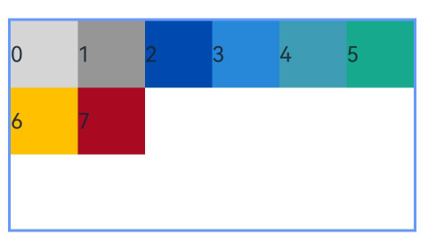
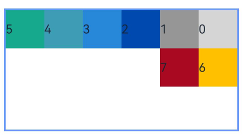
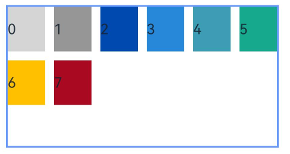
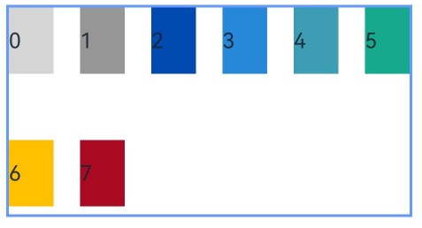

# Grid Layout (GridRow/GridCol)

## Overview

Grid layout is a universal auxiliary positioning tool that provides valuable reference for mobile device interface design. Its main advantages include:

1. **Predictable patterns**: Grid layout offers a regular structural framework for layouts, solving dynamic layout challenges across multiple screen sizes and devices. By dividing pages into equal-width columns and rows, it facilitates precise element positioning and typesetting.

2. **Unified positioning standards**: The grid system provides consistent positioning benchmarks, ensuring layout consistency across different devices. This reduces design and development complexity while improving efficiency.

3. **Flexible spacing adjustment**: Grid layout enables adaptable spacing methods to meet special scenario requirements. Adjusting column and row gaps controls overall page composition.

4. **Automatic wrapping and responsiveness**: The grid system automatically handles line breaks and adapts to one-to-many layouts. When elements exceed row/column capacity, they automatically wrap while maintaining responsive behavior across devices for flexible, adaptive page structures.

[GridRow](../../../API_Reference/source_en/arkui-cj/cj-grid-layout-gridrow.md) serves as the grid container component and must be used in conjunction with the grid item component [GridCol](../../../API_Reference/source_en/arkui-cj/cj-grid-layout-gridcol.md) in grid layout scenarios.

## Grid Container GridRow

### Grid System Breakpoints

The grid system uses device horizontal width ([screen density pixel value](../../../API_Reference/source_en/arkui-cj/cj-common-pixelunits.md), unit: vp) as breakpoint criteria, defining device width types through a comprehensive breakpoint rule system. Developers can implement different layout effects across breakpoint ranges.

Default breakpoints categorize device widths into four types (xs, sm, md, lg) with the following ranges:

| Breakpoint | Range (vp)       | Device Description |
|:---- |:-------------- |:------------ |
| xs   | [0, 320)   | Extra small width devices |
| sm   | [320, 520) | Small width devices  |
| md   | [520, 840) | Medium width devices |
| lg   | [840, +∞)  | Large width devices  |

The GridRow component allows custom breakpoint ranges via the `breakpoints` parameter, supporting up to six breakpoints (including xl and xxl beyond the default four) for six device size configurations (xs, sm, md, lg, xl, xxl).

| Breakpoint | Device Description |
|:---- |:------------ |
| xs   | Extra small width devices |
| sm   | Small width devices  |
| md   | Medium width devices |
| lg   | Large width devices  |
| xl   | Extra large width devices |
| xxl  | Super large width devices |

- Breakpoint positions are set via a monotonically increasing array. Since maximum six breakpoints are supported, the array length cannot exceed 5.

    ```cangjie
    breakpoints: BreakPoints(value: [100.vp, 200.vp])
    ```

    Enables xs, sm, md breakpoints: xs (<100vp), sm (100-200vp), md (>200vp).

    ```cangjie
    breakpoints: BreakPoints(value: [320.vp, 520.vp, 840.vp, 1080.vp])
    ```

    Enables xs, sm, md, lg, xl breakpoints: xs (<320vp), sm (320-520vp), md (520-840vp), lg (840-1080vp), xl (>1080vp).

- The grid system monitors window/container size changes for breakpoint triggers. The `reference` parameter sets the breakpoint reference object. Considering applications may display in non-fullscreen windows, using application window width as reference is more universal.

    Example using default 12 columns with six breakpoint ranges, where grid items occupy different columns per range:

    <!-- run -->

    ```cangjie
    package ohos_app_cangjie_entry
    import kit.ArkUI.*
    import ohos.arkui.state_macro_manage.*

    @Entry
    @Component
    class EntryView {
        @State
        var bgColors: Array<Color> = [Color(213,213,213), Color(150,150,150), Color(0,74,175), Color(39,135,217), Color(61,157,180), Color(23,169,141), Color(255,192,0), Color(170,10,33)];
        func build() {
            GridRow(
                columns: 12,
                breakpoints: BreakPoints(
                    value: [200.vp, 300.vp, 400.vp, 500.vp, 600.vp],
                    reference: BreakpointsReference.WindowSize
                ),
                direction: GridRowDirection.Row
            ) {
                ForEach(
                    bgColors,
                    itemGeneratorFunc: {
                        color: Color, index: Int64 => GridCol() {
                            Row() {
                                Text(index.toString())
                            }
                        }
                            .width(100.percent)
                            .height(50.vp)
                            .backgroundColor(color)
                            .span(GridColColumnOption(xs: 2, sm: 3, md: 4, lg: 6, xl:   8, xxl: 12))
                    }
                )
            }
        }
    }
    ```

    

### Total Column Count

The `columns` parameter in GridRow sets the total number of columns in the grid layout.

- Default columns value is 12, dividing layouts into 12 columns across all breakpoints when unspecified.

    <!-- run -->

    ```cangjie
    package ohos_app_cangjie_entry
    import kit.ArkUI.*
    import ohos.arkui.state_macro_manage.*

    @Entry
    @Component
    class EntryView {
        @State
        var bgColors: Array<Color> = [Color(213,213,213), Color(150,150,150), Color(0,74,175), Color(39,135,217), Color(61,157,180), Color(23,169,141), Color(255,192,0),Color(170,10,33),Color(213,213,213),Color(150,150,150), Color(0,74,175), Color(39,135,217)];
        func build() {
            GridRow(columns: GridRowColumnOption(xs: 12, sm: 12, md: 12, lg: 12, xl:    12, xxl: 12)) {
                ForEach(
                    bgColors,
                    itemGeneratorFunc: {
                        color: Color, index: Int64 => GridCol() {
                            Row() {
                                Text(index.toString())
                            }
                            .width(100.percent)
                            .height(50)
                        }.backgroundColor(color)
                    }
                )
            }
        }
    }
    ```

    

- Custom columns values divide layouts into specified columns across all devices. Below examples show layouts with 4 and 8 columns respectively (items default to 1 column):

    <!-- run -->

    ```cangjie
    package ohos_app_cangjie_entry
    import kit.ArkUI.*
    import ohos.arkui.state_macro_manage.*

    @Entry
    @Component
    class EntryView {
        var bgColors: Array<Color> = [Color(213,213,213), Color(150,150,150), Color(0,74,175), Color(39,135,217), Color(61,157,180), Color(23,169,141), Color(255,192,0), Color(170,10,33)];
        @State
        var currentBp: String = "";
        func build() {
            Column {
                Text("columns: 4")
                    .fontSize(20)
                    .fontColor(Color.Black)
                    .width(90.percent)
                Row() {
                    GridRow(columns: 4) {
                        ForEach(
                            bgColors,
                            itemGeneratorFunc: {
                                color: Color, index: Int64 => GridCol() {
                                    Row() {
                                        Text(index.toString())
                                    }
                                        .width(100.percent)
                                        .height(50)
                                }.backgroundColor(color)
                            }
                        )
                    }
                    .width(100.percent)
                    .height(100.percent)
                    .onBreakpointChange({bp => currentBp = bp})
                }
                .height(160)
                .border(color: Color.Blue, width: 2)
                .width(90.percent)
                Text("columns: 8")
                    .fontSize(20)
                    .fontColor(Color.Black)
                    .width(90.percent)
                Row() {
                    GridRow(columns: 8) {
                        ForEach(
                            bgColors,
                            itemGeneratorFunc: {
                                color: Color, index: Int64 => GridCol() {
                                    Row() {
                                        Text(index.toString())
                                    }
                                        .width(100.percent)
                                        .height(50)
                                }.backgroundColor(color)
                            }
                        )
                    }
                    .width(100.percent)
                    .height(100.percent)
                    .onBreakpointChange({bp => currentBp = bp})
                }
                .height(160)
                .border(color: Color.Blue, width: 2)
                .width(90.percent)
            }
        }
    }
    ```

    

- When columns type is GridRowColumnOption, it supports six device size configurations (xs, sm, md, lg, xl, xxl) with independent column counts per size.

    <!-- run-->

    ```cangjie
    package ohos_app_cangjie_entry
    import kit.ArkUI.*
    import ohos.arkui.state_macro_manage.*

    @Entry
    @Component
    class EntryView {
        @State
        var bgColors: Array<Color> = [Color(213,213,213), Color(150,150,150), Color(0,74,175), Color(39,135,217), Color(61,157,180), Color(23,169,141), Color(255,192,0), Color(170,10,33)];
        func build() {
            GridRow(
                columns: GridRowColumnOption(xs: 12, sm: 4, md: 8, lg: 12, xl: 12,  xxl: 12),
                breakpoints: BreakPoints(
                    value: [200.vp, 300.vp, 400.vp, 500.vp, 600.vp], // Monotonically increasing array for breakpoints
                    reference: BreakpointsReference.WindowSize
                )
            ) {
                ForEach(
                    bgColors,
                    itemGeneratorFunc: {
                        color: Color, index: Int64 => GridCol() {
                            Row() {
                                Text(index.toString())
                            }
                            .width(100.percent)
                            .height(50.vp)
                        }.backgroundColor(color)
                    }
                )
            }
        }
    }
    ```

    

    If only sm and md column counts are set, smaller sizes default to 12 columns while larger sizes inherit the previous size's setting (e.g., xs:12, lg/xl/xxl:8 when only sm:4 and md:8 are specified).

### Arrangement Direction

The `direction` property in GridRow controls item arrangement within the container, accepting GridRowDirection.Row (left-to-right) or GridRowDirection.RowReverse (right-to-left) values for flexible layout designs.

- Default left-to-right arrangement:

    ```cangjie
    GridRow(direction: GridRowDirection.Row ){}
    ```

    

- Right-to-left arrangement:

    ```cangjie
    GridRow(direction: GridRowDirection.RowReverse ){}
    ```

    

### Item Spacing

The `gutter` property sets horizontal and vertical spacing between grid items.

- When gutter is Length type, it sets equal horizontal/vertical spacing. Below example sets 10vp spacing:

    ```cangjie
    GridRow( gutter: 10.vp ){}
    ```

    

- When gutter is GutterOption type, x sets horizontal spacing and y sets vertical spacing independently.

    ```cangjie
    GridRow( gutter: GutterOption(x: 20.vp, y: 50.vp) ){}
    ```

    

## Child Component GridCol

As GridRow's child component, GridCol accepts parameters or property settings for span (column span), offset (column offset), and order (arrangement sequence).

- Span configuration:

    ```cangjie
    GridCol( span: 2 ){}
    GridCol(){}.span(2)
    GridCol(){}.span(GridColColumnOption(xs:1, sm:2, md:3, lg:4, xl:12, xxl: 12))
    ```

- Offset configuration:

    ```cangjie
    GridCol( offset: 2 ){}
    GridCol(){}.gridColOffset((GridColColumnOption(xs:1, sm:2, md:3, lg:4, xl:12, xxl: 12)))
    ```

- Order configuration:

    ```cangjie
    GridCol( order: 2 ){}
    GridCol(){}.order(2)
    GridCol(){}.order(GridColColumnOption(xs:1, sm:2, md:3, lg:4, xl:12, xxl: 12))
    ```

### span

Determines the number of columns an item occupies (default: 1), affecting item width.

- When Int32 type, items span identical columns across all devices.

    <!-- run -->

    ```cangjie
    package ohos_app_cangjie_entry
    import kit.ArkUI.*
    import ohos.arkui.state_macro_manage.*

    @Entry
    @Component
    class EntryView {
        @State
        var bgColors: Array<Color> = [Color(213,213,213), Color(150,150,150), Color(0,74,175), Color(39,135,217), Color(61,157,180), Color(23,169,141), Color(255,192,0),Color(170,10,33)];
        func build() {
            GridRow(columns: 8) {
                ForEach(
                    bgColors,
                    itemGeneratorFunc: {
                        color: Color, index: Int64 => GridCol(span: 2) {
                            Row() {
                                Text(index.toString())
                            }
                            .width(100.percent)
                            .height(50.vp)
                        }.backgroundColor(color)
                    }
                )
            }
        }
    }
    ```

    

- When GridColColumnOption type, supports six device sizes with independent span values.

    <!-- run -->

    ```cangjie
    package ohos_app_cangjie_entry
    import kit.ArkUI.*
    import ohos.arkui.state_macro_manage.*

    @Entry
    @Component
    class EntryView {
        @State
        var bgColors: Array<Color> = [Color(213,213,213), Color(150,150,150), Color(0,74,175), Color(39,135,217), Color(61,157,180), Color(23,169,141), Color(255,192,0), Color(170,10,33)];
        func build() {
            GridRow(columns: 8) {
                ForEach(
                    bgColors,
                    itemGeneratorFunc: {
                        color: Color, index: Int64 => GridCol() {
                            Row() {
                                Text(index.toString())
                            }
                            .width(100.percent)
                            .height(50.vp)
                        }
                        .backgroundColor(color)
                        .span(GridColColumnOption(xs: 1, sm: 2, md: 3, lg: 4, xl: 12,   xxl: 12))
                    }
                )
            }
        }
    }
    ```

    

### offset

Column offset from previous item (default: 0).

- When Int32 type, uniform offset across devices.

    <!-- run -->

    ```cangjie
    package ohos_app_cangjie_entry
    import kit.ArkUI.*
    import ohos.arkui.state_macro_manage.*

    @Entry
    @Component
    class EntryView {
        @State
        var bgColors: Array<Color> = [Color(213,213,213), Color(150,150,150), Color(0,74,175), Color(39,135,217), Color(61,157,180), Color(23,169,141), Color(255,192,0), Color(170,10,33)];
        func build() {
            GridRow() {
                ForEach(
                    bgColors,
                    itemGeneratorFunc: {
                        color: Color, index: Int64 => GridCol(offset: 2) {
                            Row() {
                                Text(index.toString())
                            }
                            .width(100.percent)
                            .height(50.vp)
                        }.backgroundColor(color)
                    }
                )
            }
        }
    }
    ```

    

    Default 12-column grid with each item spanning 1 column and offset by 2 columns (total 3 columns per item including gap), fitting four items per row.

- When GridColColumnOption type, supports six device sizes with independent offset values.

    <!-- run -->

    ```cangjie
    package ohos_app_cangjie_entry
    import kit.ArkUI.*
    import ohos.arkui.state_macro_manage.*

    @Entry
    @Component
    class EntryView {
        @State
        var bgColors: Array<Color> = [Color(213,213,213), Color(150,150,150), Color(0,74,175), Color(39,135,217), Color(61,157,180), Color(23,169,141), Color(255,192,0), Color(170,10,33)];
        func build() {
            GridRow() {
                ForEach(
                    bgColors,
                    itemGeneratorFunc: {
                        color: Color, index: Int64 => GridCol() {
                            Row() {
                                Text(index.toString())
                            }
                            .width(100.percent)
                            .height(50.vp)
                        }
                        .backgroundColor(color)
                        .gridColOffset(GridColColumnOption(xs: 1, sm: 2, md: 3, lg: 4, xl## Nested Usage of Grid Components

Grid components can also be used in a nested manner to achieve complex layouts.

In the following example, the grid divides the entire space into 12 parts. The first-level `GridRow` nests `GridCol`, dividing it into a large middle area and a "footer" area. The second-level `GridRow` nests `GridCol`, dividing it into "left" and "right" areas. The space of child components is divided according to the space allocation of the parent component in the upper level. The pink area represents the 12 columns of the screen space, while the green and blue areas represent the 12 columns of the parent `GridCol` component, thus sequentially dividing the space.
 <!-- run -->

```cangjie
package ohos_app_cangjie_entry
import kit.ArkUI.*
import ohos.arkui.state_macro_manage.*

@Entry
@Component
class EntryView {
    func build() {
        GridRow() {
            GridCol() {
                GridRow() {
                    GridCol() {
                        Row() {
                            Text('left').fontSize(24)
                        }
                        .justifyContent(FlexAlign.Center)
                        .height(90.percent)
                    }
                    .backgroundColor(0xff41dbaa)
                    .span(GridColColumnOption(xs: 12, sm: 2, md: 12, lg: 12, xl: 12, xxl: 12))
                    GridCol() {
                        Row() {
                            Text('right').fontSize(24)
                        }
                        .justifyContent(FlexAlign.Center)
                        .height(90.percent)
                    }
                    .backgroundColor(0xff4168db)
                    .span(GridColColumnOption(xs: 12, sm: 10, md: 12, lg: 12, xl: 12, xxl: 12))
                }.backgroundColor(0x19000000)
            }.span(GridColColumnOption(xs: 12, sm: 12, md: 12, lg: 12, xl: 12, xxl: 12))

            GridCol() {
                Row() {
                    Text('footer')
                        .width(100.percent)
                        .textAlign(TextAlign.Center)
                }
                .width(100.percent)
                .height(10.percent)
                .backgroundColor(0xFEC0CD)
            }.span(GridColColumnOption(xs: 12, sm: 12, md: 12, lg: 12, xl: 12, xxl: 12))
        }
        .width(100.percent)
        .height(300)
    }
}
```


In summary, grid components provide rich customization capabilities, offering exceptional flexibility and power. Simply define parameters such as `Columns`, `Margin`, `Gutter`, and `span` at different breakpoints to determine the final layout, without needing to consider specific device types or states (e.g., portrait or landscape orientation).