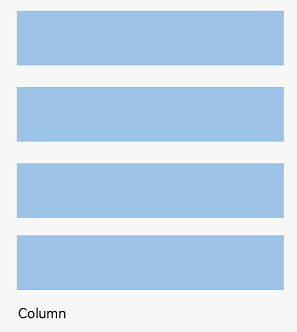
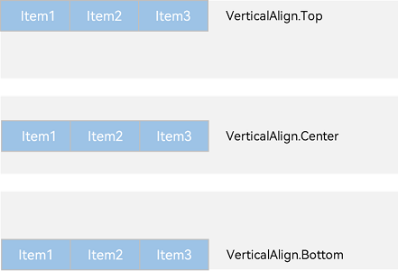
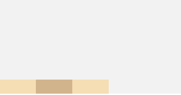
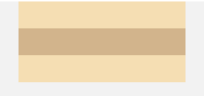
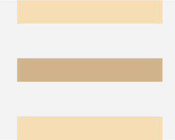
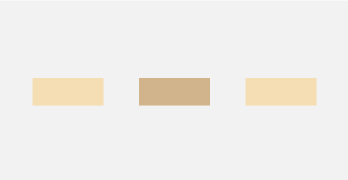

# Linear Layout (Row/Column)

## Overview

Linear Layout (LinearLayout) is the most commonly used layout in development, constructed through linear containers [Row](../../../API_Reference/source_en/arkui-cj/cj-row-column-stack-row.md) and [Column](../../../API_Reference/source_en/arkui-cj/cj-row-column-stack-column.md). Linear layout serves as the foundation for other layouts, with its child elements arranged sequentially in linear directions (horizontal and vertical). The arrangement direction of a linear layout is determined by the selected container component: child elements in a Column container are arranged vertically, while those in a Row container are arranged horizontally. Depending on the arrangement direction, developers can choose to use either Row or Column containers to create a linear layout.

**Figure 1** Illustration of Child Element Arrangement in a Column Container



**Figure 2** Illustration of Child Element Arrangement in a Row Container


## Basic Concepts

- **Layout Container**: A component container with layout capabilities that can host other elements as its children. The layout container calculates dimensions and arranges its child elements.

- **Layout Child Element**: Elements inside a layout container.

- **Main Axis**: The axis along the layout direction of a linear layout container, where child elements are arranged by default. The main axis of a Row container is horizontal, while that of a Column container is vertical.

- **Cross Axis**: The axis perpendicular to the main axis. The cross axis of a Row container is vertical, while that of a Column container is horizontal.

- **Spacing**: The spacing between child elements in the layout.

## Spacing Between Child Elements in the Arrangement Direction

Within a layout container, the `space` property can be used to set the spacing between child elements in the arrangement direction, ensuring equal spacing between them.

### Spacing in the Arrangement Direction Within a Column Container

**Figure 3** Spacing Diagram in the Arrangement Direction Within a Column Container


### Spacing in the Arrangement Direction Within a Row Container

**Figure 4** Spacing Diagram in the Arrangement Direction Within a Row Container


## Alignment of Child Elements Along the Cross Axis

Within a layout container, the `alignItems` property can be used to set the alignment of child elements along the cross axis (perpendicular to the arrangement direction). This behavior remains consistent across screens of various sizes. When the cross axis is vertical, the alignment is of type [VerticalAlign](../../../API_Reference/source_en/arkui-cj/cj-common-types.md#enum-verticalalign); when horizontal, it is of type [HorizontalAlign](../../../API_Reference/source_en/arkui-cj/cj-common-types.md#enum-horizontalalign).

The `alignSelf` property controls the alignment of a single child element along the container's cross axis and takes precedence over the `alignItems` property. If `alignSelf` is set, it overrides `alignItems` for that specific child element.

### Horizontal Arrangement of Child Elements Within a Column Container

**Figure 5** Illustration of Horizontal Arrangement of Child Elements Within a Column Container


- **HorizontalAlign.Start**: Child elements are left-aligned horizontally.

  <!-- run -->

  ```cangjie
  package ohos_app_cangjie_entry
  import kit.UIKit.*
  import ohos.state_macro_manage.*

  @Entry
  @Component
  class EntryView {
      func build() {
          Column() {
              Column() {
              }.width(80.percent).height(50).backgroundColor(0xF5DEB3)
              Column() {
              }.width(80.percent).height(50).backgroundColor(0xD2B48C)
              Column() {
              }.width(80.percent).height(50).backgroundColor(0xF5DEB3)
          }.width(100.percent).alignItems(HorizontalAlign.Start).backgroundColor(0xF2F2F2)
      }
  }
  ```

  

- **HorizontalAlign.Center**: Child elements are center-aligned horizontally.

  <!-- run -->

  ```cangjie
  package ohos_app_cangjie_entry
  import kit.UIKit.*
  import ohos.state_macro_manage.*

  @Entry
  @Component
  class EntryView {
      func build() {
          Column() {
              Column() {
              }.width(80.percent).height(50).backgroundColor(0xF5DEB3)
              Column() {
              }.width(80.percent).height(50).backgroundColor(0xD2B48C)
              Column() {
              }.width(80.percent).height(50).backgroundColor(0xF5DEB3)
          }.width(100.percent).alignItems(HorizontalAlign.Center).backgroundColor(0xF2F2F2)
      }
  }
  ```

  

- **HorizontalAlign.End**: Child elements are right-aligned horizontally.

  <!-- run -->

  ```cangjie
  package ohos_app_cangjie_entry
  import kit.UIKit.*
  import ohos.state_macro_manage.*

  @Entry
  @Component
  class EntryView {
      func build() {
          Column() {
              Column() {
              }.width(80.percent).height(50).backgroundColor(0xF5DEB3)
              Column() {
              }.width(80.percent).height(50).backgroundColor(0xD2B48C)
              Column() {
              }.width(80.percent).height(50).backgroundColor(0xF5DEB3)
          }.width(100.percent).alignItems(HorizontalAlign.End).backgroundColor(0xF2F2F2)
      }
  }
  ```

  

### Vertical Arrangement of Child Elements Within a Row Container

**Figure 6** Illustration of Vertical Arrangement of Child Elements Within a Row Container



- **VerticalAlign.Top**: Child elements are top-aligned vertically.

  <!-- run -->

  ```cangjie
  package ohos_app_cangjie_entry
  import kit.UIKit.*
  import ohos.state_macro_manage.*

  @Entry
  @Component
  class EntryView {
      func build() {
          Row() {
              Column() {
              }.width(20.percent).height(30).backgroundColor(0xF5DEB3)
              Column() {
              }.width(20.percent).height(30).backgroundColor(0xD2B48C)
              Column() {
              }.width(20.percent).height(30).backgroundColor(0xF5DEB3)
          }.width(100.percent).height(200).alignItems(VerticalAlign.Top).backgroundColor(0xF2F2F2)
      }
  }
  ```

  

- **VerticalAlign.Center**: Child elements are center-aligned vertically.

  <!-- run -->

  ```cangjie
  package ohos_app_cangjie_entry
  import kit.UIKit.*
  import ohos.state_macro_manage.*

  @Entry
  @Component
  class EntryView {
      func build() {
          Row() {
              Column() {
              }.width(20.percent).height(30).backgroundColor(0xF5DEB3)
              Column() {
              }.width(20.percent).height(30).backgroundColor(0xD2B48C)
              Column() {
              }.width(20.percent).height(30).backgroundColor(0xF5DEB3)
          }.width(100.percent).height(200).alignItems(VerticalAlign.Center).backgroundColor(0xF2F2F2)
      }
  }
  ```

  

- **VerticalAlign.Bottom**: Child elements are bottom-aligned vertically.

  <!-- run -->

  ```cangjie
  package ohos_app_cangjie_entry
  import kit.UIKit.*
  import ohos.state_macro_manage.*

  @Entry
  @Component
  class EntryView {
      func build() {
          Row() {
              Column() {
              }.width(20.percent).height(30).backgroundColor(0xF5DEB3)
              Column() {
              }.width(20.percent).height(30).backgroundColor(0xD2B48C)
              Column() {
              }.width(20.percent).height(30).backgroundColor(0xF5DEB3)
          }.width(100.percent).height(200).alignItems(VerticalAlign.Bottom).backgroundColor(0xF2F2F2)
      }
  }
  ```

  

## Arrangement of Child Elements Along the Main Axis

Within a layout container, the `justifyContent` property can be used to set the arrangement of child elements along the main axis. Child elements can be arranged starting from the beginning of the main axis, from the end, or with equal spacing dividing the main axis space.

### Vertical Arrangement of Child Elements Within a Column Container

**Figure 7** Illustration of Vertical Arrangement of Child Elements Within a Column Container


- **justifyContent(FlexAlign.Start)**: Elements are aligned at the start of the vertical direction, with the first element aligned to the top and subsequent elements aligned to the previous one.

  <!-- run -->

  ```cangjie
  package ohos_app_cangjie_entry
  import kit.UIKit.*
  import ohos.state_macro_manage.*

  @Entry
  @Component
  class EntryView {
      func build() {
          Column() {
              Column() {
              }.width(80.percent).height(50).backgroundColor(0xF5DEB3)
              Column() {
              }.width(80.percent).height(50).backgroundColor(0xD2B48C)
              Column() {
              }.width(80.percent).height(50).backgroundColor(0xF5DEB3)
          }.width(100.percent).height(300).backgroundColor(0xF2F2F2).justifyContent(FlexAlign.Start)
      }
  }
  ```

  

- **justifyContent(FlexAlign.Center)**: Elements are center-aligned vertically, with the distance from the first element to the top equal to the distance from the last element to the bottom.

  <!-- run -->

  ```cangjie
  package ohos_app_cangjie_entry
  import kit.UIKit.*
  import ohos.state_macro_manage.*

  @Entry
  @Component
  class EntryView {
      func build() {
          Column() {
              Column() {
              }.width(80.percent).height(50).backgroundColor(0xF5DEB3)
              Column() {
              }.width(80.percent).height(50).backgroundColor(0xD2B48C)
              Column() {
              }.width(80.percent).height(50).backgroundColor(0xF5DEB3)
          }.width(100.percent).height(300).backgroundColor(0xF2F2F2).justifyContent(FlexAlign.Center)
      }
  }
  ```

  

- **justifyContent(FlexAlign.End)**: Elements are aligned at the end of the vertical direction, with the last element aligned to the bottom and other elements aligned to the next one.

  <!-- run -->

  ```cangjie
  package ohos_app_cangjie_entry
  import kit.UIKit.*
  import ohos.state_macro_manage.*

  @Entry
  @Component
  class EntryView {
      func build() {
          Column() {
              Column() {
              }.width(80.percent).height(50).backgroundColor(0xF5DEB3)
              Column() {
              }.width(80.percent).height(50).backgroundColor(0xD2B48C)
              Column() {
              }.width(80.percent).height(50).backgroundColor(0xF5DEB3)
          }.width(100.percent).height(300).backgroundColor(0xF2F2F2).justifyContent(FlexAlign.End)
      }
  }
  ```

  

- justifyContent(FlexAlign.SpaceBetween): Evenly distributes elements vertically with equal spacing between adjacent elements. The first element aligns with the container start, and the last element aligns with the container end.

  <!-- run -->

  ```cangjie
  package ohos_app_cangjie_entry
  import kit.UIKit.*
  import ohos.state_macro_manage.*

  @Entry
  @Component
  class EntryView {
      func build() {
          Column() {
              Column() {
              }.width(80.percent).height(50).backgroundColor(0xF5DEB3)
              Column() {
              }.width(80.percent).height(50).backgroundColor(0xD2B48C)
              Column() {
              }.width(80.percent).height(50).backgroundColor(0xF5DEB3)
          }.width(100.percent).height(300).backgroundColor(0xF2F2F2).justifyContent(FlexAlign.SpaceBetween)
      }
  }
  ```

  

- justifyContent(FlexAlign.SpaceAround): Evenly distributes elements vertically with equal spacing between adjacent elements. The spacing between the first element and container start (or last element and container end) is half of the inter-element spacing.

  <!-- run -->

  ```cangjie
  package ohos_app_cangjie_entry
  import kit.UIKit.*
  import ohos.state_macro_manage.*

  @Entry
  @Component
  class EntryView {
      func build() {
          Column() {
              Column() {
              }.width(80.percent).height(50).backgroundColor(0xF5DEB3)
              Column() {
              }.width(80.percent).height(50).backgroundColor(0xD2B48C)
              Column() {
              }.width(80.percent).height(50).backgroundColor(0xF5DEB3)
          }.width(100.percent).height(300).backgroundColor(0xF2F2F2).justifyContent(FlexAlign.SpaceAround)
      }
  }
  ```

  

- justifyContent(FlexAlign.SpaceEvenly): Evenly distributes elements vertically with identical spacing between all elements, including between the first/last elements and container edges.

  <!-- run -->

  ```cangjie
  package ohos_app_cangjie_entry
  import kit.UIKit.*
  import ohos.state_macro_manage.*

  @Entry
  @Component
  class EntryView {
      func build() {
          Column() {
              Column() {
              }.width(80.percent).height(50).backgroundColor(0xF5DEB3)
              Column() {
              }.width(80.percent).height(50).backgroundColor(0xD2B48C)
              Column() {
              }.width(80.percent).height(50).backgroundColor(0xF5DEB3)
          }.width(100.percent).height(300).backgroundColor(0xF2F2F2).justifyContent(FlexAlign.SpaceEvenly)
      }
  }
  ```

  

### Horizontal Arrangement of Child Elements in Row Container

**Figure 8** Horizontal arrangement of child elements in Row container


- justifyContent(FlexAlign.Start): Elements align horizontally at the start. The first element aligns with container start, subsequent elements align with preceding ones.

  <!-- run -->

  ```cangjie
  package ohos_app_cangjie_entry
  import kit.UIKit.*
  import ohos.state_macro_manage.*

  @Entry
  @Component
  class EntryView {
      func build() {
          Row() {
              Column() {
              }.width(20.percent).height(30).backgroundColor(0xF5DEB3)
              Column() {
              }.width(20.percent).height(30).backgroundColor(0xD2B48C)
              Column() {
              }.width(20.percent).height(30).backgroundColor(0xF5DEB3)
          }.width(100.percent).height(200).backgroundColor(0xF2F2F2).justifyContent(FlexAlign.Start)
      }
  }
  ```

  

- justifyContent(FlexAlign.Center): Elements center horizontally. The distance from first element to container start equals the distance from last element to container end.

  <!-- run -->

  ```cangjie
  package ohos_app_cangjie_entry
  import kit.UIKit.*
  import ohos.state_macro_manage.*

  @Entry
  @Component
  class EntryView {
      func build() {
          Row() {
              Column() {
              }.width(20.percent).height(30).backgroundColor(0xF5DEB3)
              Column() {
              }.width(20.percent).height(30).backgroundColor(0xD2B48C)
              Column() {
              }.width(20.percent).height(30).backgroundColor(0xF5DEB3)
          }.width(100.percent).height(200).backgroundColor(0xF2F2F2).justifyContent(FlexAlign.Center)
      }
  }
  ```

  

- justifyContent(FlexAlign.End): Elements align horizontally at the end. The last element aligns with container end, others align with succeeding ones.

  <!-- run -->

  ```cangjie
  package ohos_app_cangjie_entry
  import kit.UIKit.*
  import ohos.state_macro_manage.*

  @Entry
  @Component
  class EntryView {
      func build() {
          Row() {
              Column() {
              }.width(20.percent).height(30).backgroundColor(0xF5DEB3)
              Column() {
              }.width(20.percent).height(30).backgroundColor(0xD2B48C)
              Column() {
              }.width(20.percent).height(30).backgroundColor(0xF5DEB3)
          }.width(100.percent).height(200).backgroundColor(0xF2F2F2).justifyContent(FlexAlign.End)
      }
  }
  ```

  

- justifyContent(FlexAlign.SpaceBetween): Evenly distributes elements horizontally with equal spacing between adjacent elements. First element aligns with container start, last with container end.

  <!-- run -->

  ```cangjie
  package ohos_app_cangjie_entry
  import kit.UIKit.*
  import ohos.state_macro_manage.*

  @Entry
  @Component
  class EntryView {
      func build() {
          Row() {
              Column() {
              }.width(20.percent).height(30).backgroundColor(0xF5DEB3)
              Column() {
              }.width(20.percent).height(30).backgroundColor(0xD2B48C)
              Column() {
              }.width(20.percent).height(30).backgroundColor(0xF5DEB3)
          }.width(100.percent).height(200).backgroundColor(0xF2F2F2).justifyContent(FlexAlign.SpaceBetween)
      }
  }
  ```

  

- justifyContent(FlexAlign.SpaceAround): Evenly distributes elements horizontally with equal spacing between adjacent elements. Spacing between first/last elements and container edges is half of inter-element spacing.

  <!-- run -->

  ```cangjie
  package ohos_app_cangjie_entry
  import kit.UIKit.*
  import ohos.state_macro_manage.*

  @Entry
  @Component
  class EntryView {
      func build() {
          Row() {
              Column() {
              }.width(20.percent).height(30).backgroundColor(0xF5DEB3)
              Column() {
              }.width(20.percent).height(30).backgroundColor(0xD2B48C)
              Column() {
              }.width(20.percent).height(30).backgroundColor(0xF5DEB3)
          }.width(100.percent).height(200).backgroundColor(0xF2F2F2).justifyContent(FlexAlign.SpaceAround)
      }
  }
  ```

  

- justifyContent(FlexAlign.SpaceEvenly): Evenly distributes elements horizontally with identical spacing between all elements, including between first/last elements and container edges.

  <!-- run -->

  ```cangjie
  package ohos_app_cangjie_entry
  import kit.UIKit.*
  import ohos.state_macro_manage.*

  @Entry
  @Component
  class EntryView {
      func build() {
          Row() {
              Column() {
              }.width(20.percent).height(30).backgroundColor(0xF5DEB3)
              Column() {
              }.width(20.percent).height(30).backgroundColor(0xD2B48C)
              Column() {
              }.width(20.percent).height(30).backgroundColor(0xF5DEB3)
          }.width(100.percent).height(200).backgroundColor(0xF2F2F2).justifyContent(FlexAlign.SpaceEvenly)
      }
  }
  ```

  
  