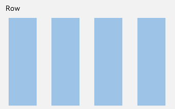
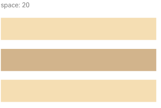
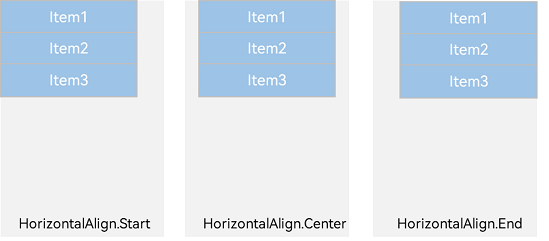
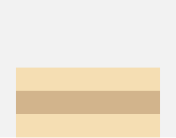
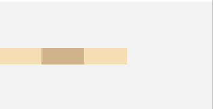
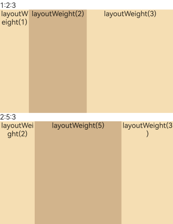
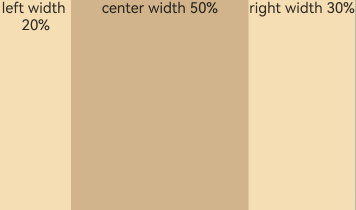

# Linear Layout (Row/Column)

## Overview

Linear Layout (LinearLayout) is the most commonly used layout in development, constructed through linear containers [Row](../../../API_Reference/source_en/arkui-cj/cj-row-column-stack-row.md) and [Column](../../../API_Reference/source_en/arkui-cj/cj-row-column-stack-column.md). Linear layout serves as the foundation for other layouts, with its child elements arranged sequentially along a linear direction (horizontal and vertical). The arrangement direction of a linear layout is determined by the selected container component: child elements within a Column container are arranged vertically, while those within a Row container are arranged horizontally. Depending on the desired arrangement direction, developers can choose to use either Row or Column containers to create a linear layout.

**Figure 1** Illustration of Child Element Arrangement in a Column Container


**Figure 2** Illustration of Child Element Arrangement in a Row Container



## Basic Concepts

- **Layout Container**: A component container with layout capabilities that can host other elements as its children. The layout container calculates dimensions and arranges its child elements.

- **Layout Child Element**: Elements contained within a layout container.

- **Main Axis**: The axis along the layout direction of a linear layout container, where child elements are arranged by default. For a Row container, the main axis is horizontal; for a Column container, it is vertical.

- **Cross Axis**: The axis perpendicular to the main axis. For a Row container, the cross axis is vertical; for a Column container, it is horizontal.

- **Spacing**: The spacing between child elements in a layout.

## Spacing Between Child Elements Along the Arrangement Direction

Within a layout container, the `space` property can be used to set the spacing between child elements along the arrangement direction, ensuring equal spacing between them.

### Spacing Along the Arrangement Direction in a Column Container

**Figure 3** Spacing Diagram Along the Arrangement Direction in a Column Container


 <!-- run -->

```cangjie
package ohos_app_cangjie_entry
import kit.ArkUI.*
import ohos.arkui.state_macro_manage.*

@Entry
@Component
class EntryView {
    func build() {
        Column(space: 20) {
            Text('space: 20').fontSize(15).fontColor(Color.Gray).width(90.percent)
            Row().width(90.percent).height(50).backgroundColor(0xF5DEB3)
            Row().width(90.percent).height(50).backgroundColor(0xD2B48C)
            Row().width(90.percent).height(50).backgroundColor(0xF5DEB3)
        }.width(100.percent)
    }
}
```



### Spacing Along the Arrangement Direction in a Row Container

**Figure 4** Spacing Diagram Along the Arrangement Direction in a Row Container


 <!-- run -->

```cangjie
package ohos_app_cangjie_entry
import kit.ArkUI.*
import ohos.arkui.state_macro_manage.*

@Entry
@Component
class EntryView {
    func build() {
        Row(space: 35) {
            Text('space: 35').fontSize(15).fontColor(Color.Gray)
            Row().width(10.percent).height(150).backgroundColor(0xF5DEB3)
            Row().width(10.percent).height(150).backgroundColor(0xD2B48C)
            Row().width(10.percent).height(150).backgroundColor(0xF5DEB3)
        }.width(90.percent)
    }
}
```


## Alignment of Child Elements Along the Cross Axis

Within a layout container, the `alignItems` property can be used to set the alignment of child elements along the cross axis (perpendicular to the arrangement direction). This behavior remains consistent across screens of different sizes. For a vertical cross axis, the alignment is specified using the [VerticalAlign](../../../API_Reference/source_en/arkui-cj/cj-common-types.md#enum-verticalalign) type; for a horizontal cross axis, the [HorizontalAlign](../../../API_Reference/source_en/arkui-cj/cj-common-types.md#enum-horizontalalign) type is used.

The `alignSelf` property controls the alignment of a single child element along the container's cross axis and takes precedence over the `alignItems` property. If `alignSelf` is set, it overrides `alignItems` for that specific child element.

### Horizontal Alignment of Child Elements in a Column Container

**Figure 5** Horizontal Alignment Diagram of Child Elements in a Column Container



- **HorizontalAlign.Start**: Child elements are left-aligned horizontally.

     <!-- run -->

  ```cangjie
  package ohos_app_cangjie_entry
  import kit.ArkUI.*
  import ohos.arkui.state_macro_manage.*

  @Entry
  @Component
  class EntryView {
      func build() {
          Column() {
              Column() {
              }.width(80.percent).height(50).backgroundColor(0xF5DEB3)
              Column() {
              }.width(80.percent).height(50).backgroundColor(0xD2B48C)
              Column() {
              }.width(80.percent).height(50).backgroundColor(0xF5DEB3)
          }.width(100.percent).alignItems(HorizontalAlign.Start).backgroundColor(0xF2F2F2)
      }
  }
  ```

  

- **HorizontalAlign.Center**: Child elements are center-aligned horizontally.

     <!-- run -->

  ```cangjie
  package ohos_app_cangjie_entry
  import kit.ArkUI.*
  import ohos.arkui.state_macro_manage.*

  @Entry
  @Component
  class EntryView {
      func build() {
          Column() {
              Column() {
              }.width(80.percent).height(50).backgroundColor(0xF5DEB3)
              Column() {
              }.width(80.percent).height(50).backgroundColor(0xD2B48C)
              Column() {
              }.width(80.percent).height(50).backgroundColor(0xF5DEB3)
          }.width(100.percent).alignItems(HorizontalAlign.Center).backgroundColor(0xF2F2F2)
      }
  }
  ```

  

- **HorizontalAlign.End**: Child elements are right-aligned horizontally.

     <!-- run -->

  ```cangjie
  package ohos_app_cangjie_entry
  import kit.ArkUI.*
  import ohos.arkui.state_macro_manage.*

  @Entry
  @Component
  class EntryView {
      func build() {
          Column() {
              Column() {
              }.width(80.percent).height(50).backgroundColor(0xF5DEB3)
              Column() {
              }.width(80.percent).height(50).backgroundColor(0xD2B48C)
              Column() {
              }.width(80.percent).height(50).backgroundColor(0xF5DEB3)
          }.width(100.percent).alignItems(HorizontalAlign.End).backgroundColor(0xF2F2F2)
      }
  }
  ```

  

### Vertical Alignment of Child Elements in a Row Container

**Figure 6** Vertical Alignment Diagram of Child Elements in a Row Container


- **VerticalAlign.Top**: Child elements are top-aligned vertically.

     <!-- run -->

  ```cangjie
  package ohos_app_cangjie_entry
  import kit.ArkUI.*
  import ohos.arkui.state_macro_manage.*

  @Entry
  @Component
  class EntryView {
      func build() {
          Row() {
              Column() {
              }.width(20.percent).height(30).backgroundColor(0xF5DEB3)
              Column() {
              }.width(20.percent).height(30).backgroundColor(0xD2B48C)
              Column() {
              }.width(20.percent).height(30).backgroundColor(0xF5DEB3)
          }.width(100.percent).height(200).alignItems(VerticalAlign.Top).backgroundColor(0xF2F2F2)
      }
  }
  ```

  

- **VerticalAlign.Center**: Child elements are center-aligned vertically.

     <!-- run -->

  ```cangjie
  package ohos_app_cangjie_entry
  import kit.ArkUI.*
  import ohos.arkui.state_macro_manage.*

  @Entry
  @Component
  class EntryView {
      func build() {
          Row() {
              Column() {
              }.width(20.percent).height(30).backgroundColor(0xF5DEB3)
              Column() {
              }.width(20.percent).height(30).backgroundColor(0xD2B48C)
              Column() {
              }.width(20.percent).height(30).backgroundColor(0xF5DEB3)
          }.width(100.percent).height(200).alignItems(VerticalAlign.Center).backgroundColor(0xF2F2F2)
      }
  }
  ```
  
  

- **VerticalAlign.Bottom**: Child elements are bottom-aligned vertically.

     <!-- run -->

  ```cangjie
  package ohos_app_cangjie_entry
  import kit.ArkUI.*
  import ohos.arkui.state_macro_manage.*

  @Entry
  @Component
  class EntryView {
      func build() {
          Row() {
              Column() {
              }.width(20.percent).height(30).backgroundColor(0xF5DEB3)
              Column() {
              }.width(20.percent).height(30).backgroundColor(0xD2B48C)
              Column() {
              }.width(20.percent).height(30).backgroundColor(0xF5DEB3)
          }.width(100.percent).height(200).alignItems(VerticalAlign.Bottom).backgroundColor(0xF2F2F2)
      }
  }
  ```

  

## Alignment of Child Elements Along the Main Axis in Layout

Within a layout container, the `justifyContent` property can be used to set the alignment of child elements along the container's main axis. Elements can be aligned starting from the beginning of the main axis, from the end of the main axis, or by evenly distributing the space along the main axis.

### Vertical Alignment of Child Elements in a Column Container

**Figure 7** Vertical Alignment of Child Elements in a Column Container


- `justifyContent(FlexAlign.Start)`: Elements are aligned at the start of the vertical direction, with the first element aligned to the top of the container and subsequent elements aligned to the previous one.

     <!-- run -->

  ```cangjie
  package ohos_app_cangjie_entry
  import kit.ArkUI.*
  import ohos.arkui.state_macro_manage.*

  @Entry
  @Component
  class EntryView {
      func build() {
          Column() {
              Column() {
              }.width(80.percent).height(50).backgroundColor(0xF5DEB3)
              Column() {
              }.width(80.percent).height(50).backgroundColor(0xD2B48C)
              Column() {
              }.width(80.percent).height(50).backgroundColor(0xF5DEB3)
          }.width(100.percent).height(300).backgroundColor(0xF2F2F2).justifyContent(FlexAlign.Start)
      }
  }
  ```

  

- `justifyContent(FlexAlign.Center)`: Elements are center-aligned in the vertical direction, with the distance from the first element to the top of the container equal to the distance from the last element to the bottom.

     <!-- run -->

  ```cangjie
  package ohos_app_cangjie_entry
  import kit.ArkUI.*
  import ohos.arkui.state_macro_manage.*

  @Entry
  @Component
  class EntryView {
      func build() {
          Column() {
              Column() {
              }.width(80.percent).height(50).backgroundColor(0xF5DEB3)
              Column() {
              }.width(80.percent).height(50).backgroundColor(0xD2B48C)
              Column() {
              }.width(80.percent).height(50).backgroundColor(0xF5DEB3)
          }.width(100.percent).height(300).backgroundColor(0xF2F2F2).justifyContent(FlexAlign.Center)
      }
  }
  ```

  

- `justifyContent(FlexAlign.End)`: Elements are aligned at the end of the vertical direction, with the last element aligned to the bottom of the container and other elements aligned to the next one.

     <!-- run -->

  ```cangjie
  package ohos_app_cangjie_entry
  import kit.ArkUI.*
  import ohos.arkui.state_macro_manage.*

  @Entry
  @Component
  class EntryView {
      func build() {
          Column() {
              Column() {
              }.width(80.percent).height(50).backgroundColor(0xF5DEB3)
              Column() {
              }.width(80.percent).height(50).backgroundColor(0xD2B48C)
              Column() {
              }.width(80.percent).height(50).backgroundColor(0xF5DEB3)
          }.width(100.percent).height(300).backgroundColor(0xF2F2F2).justifyContent(FlexAlign.End)
      }
  }
  ```

  

- `justifyContent(FlexAlign.SpaceBetween)`: Elements are evenly distributed along the vertical direction, with equal spacing between adjacent elements. The first element is aligned to the top, and the last element is aligned to the bottom.

     <!-- run -->

  ```cangjie
  package ohos_app_cangjie_entry
  import kit.ArkUI.*
  import ohos.arkui.state_macro_manage.*

  @Entry
  @Component
  class EntryView {
      func build() {
          Column() {
              Column() {
              }.width(80.percent).height(50).backgroundColor(0xF5DEB3)
              Column() {
              }.width(80.percent).height(50).backgroundColor(0xD2B48C)
              Column() {
              }.width(80.percent).height(50).backgroundColor(0xF5DEB3)
          }.width(100.percent).height(300).backgroundColor(0xF2F2F2).justifyContent(FlexAlign.SpaceBetween)
      }
  }
  ```

  

- `justifyContent(FlexAlign.SpaceAround)`: Elements are evenly distributed along the vertical direction, with equal spacing between adjacent elements. The spacing from the first element to the top and the last element to the bottom is half the spacing between adjacent elements.

     <!-- run -->

  ```cangjie
  package ohos_app_cangjie_entry
  import kit.ArkUI.*
  import ohos.arkui.state_macro_manage.*

  @Entry
  @Component
  class EntryView {
      func build() {
          Column() {
              Column() {
              }.width(80.percent).height(50).backgroundColor(0xF5DEB3)
              Column() {
              }.width(80.percent).height(50).backgroundColor(0xD2B48C)
              Column() {
              }.width(80.percent).height(50).backgroundColor(0xF5DEB3)
          }.width(100.percent).height(300).backgroundColor(0xF2F2F2).justifyContent(FlexAlign.SpaceAround)
      }
  }
  ```

  

- `justifyContent(FlexAlign.SpaceEvenly)`: Elements are evenly distributed along the vertical direction, with equal spacing between adjacent elements, as well as equal spacing from the first element to the top and the last element to the bottom.

     <!-- run -->

  ```cangjie
  package ohos_app_cangjie_entry
  import kit.ArkUI.*
  import ohos.arkui.state_macro_manage.*

  @Entry
  @Component
  class EntryView {
      func build() {
          Column() {
              Column() {
              }.width(80.percent).height(50).backgroundColor(0xF5DEB3)
              Column() {
              }.width(80.percent).height(50).backgroundColor(0xD2B48C)
              Column() {
              }.width(80.percent).height(50).backgroundColor(0xF5DEB3)
          }.width(100.percent).height(300).backgroundColor(0xF2F2F2).justifyContent(FlexAlign.SpaceEvenly)
      }
  }
  ```

  

### Horizontal Alignment of Child Elements in a Row Container

**Figure 8** Horizontal Alignment of Child Elements in a Row Container


- `justifyContent(FlexAlign.Start)`: Elements are aligned at the start of the horizontal direction, with the first element aligned to the left of the container and subsequent elements aligned to the previous one.

     <!-- run -->

  ```cangjie
  package ohos_app_cangjie_entry
  import kit.ArkUI.*
  import ohos.arkui.state_macro_manage.*

  @Entry
  @Component
  class EntryView {
      func build() {
          Row() {
              Column() {
              }.width(20.percent).height(30).backgroundColor(0xF5DEB3)
              Column() {
              }.width(20.percent).height(30).backgroundColor(0xD2B48C)
              Column() {
              }.width(20.percent).height(30).backgroundColor(0xF5DEB3)
          }.width(100.percent).height(200).backgroundColor(0xF2F2F2).justifyContent(FlexAlign.Start)
      }
  }
  ```

  

- `justifyContent(FlexAlign.Center)`: Elements are center-aligned in the horizontal direction, with the distance from the first element to the left of the container equal to the distance from the last element to the right.

     <!-- run -->

  ```cangjie
  package ohos_app_cangjie_entry
  import kit.ArkUI.*
  import ohos.arkui.state_macro_manage.*

  @Entry
  @Component
  class EntryView {
      func build() {
          Row() {
              Column() {
              }.width(20.percent).height(30).backgroundColor(0xF5DEB3)
              Column() {
              }.width(20.percent).height(30).backgroundColor(0xD2B48C)
              Column() {
              }.width(20.percent).height(30).backgroundColor(0xF5DEB3)
          }.width(100.percent).height(200).backgroundColor(0xF2F2F2).justifyContent(FlexAlign.Center)
      }
  }
  ```

  

- `justifyContent(F FlexAlign.End)`: Elements are aligned at the end of the horizontal direction, with the last element aligned to the right of the container and other elements aligned to the next one.

     <!-- run -->

  ```cangjie
  package ohos_app_cangjie_entry
  import kit.ArkUI.*
  import ohos.arkui.state_macro_manage.*

  @Entry
  @Component
  class EntryView {
      func build() {
          Row() {
              Column() {
              }.width(20.percent).height(30).backgroundColor(0xF5DEB3)
              Column() {
              }.width(20.percent).height(30).backgroundColor(0xD2B48C)
              Column() {
              }.width(20.percent).height(30).backgroundColor(0xF5DEB3)
          }.width(100.percent).height(200).backgroundColor(0xF2F2F2).justifyContent(FlexAlign.End)
      }
  }
  ```

  

- `justifyContent(FlexAlign.SpaceBetween)`: Elements are evenly distributed along the horizontal direction, with equal spacing between adjacent elements. The first element is aligned to the left, and the last element is aligned to the right.

     <!-- run -->

  ```cangjie
  package ohos_app_cangjie_entry
  import kit.ArkUI.*
  import ohos.arkui.state_macro_manage.*

  @Entry
  @Component
  class EntryView {
      func build() {
          Row() {
              Column() {
              }.width(20.percent).height(30).backgroundColor(0xF5DEB3)
              Column() {
              }.width(20.percent).height(30).backgroundColor(0xD2B48C)
              Column() {
              }.width(20.percent).height(30).backgroundColor(0xF5DEB3)
          }.width(100.percent).height(200).backgroundColor(0xF2F2F2).justifyContent(FlexAlign.SpaceBetween)
      }
  }
  ```

  

- `justifyContent(FlexAlign.SpaceAround)`: Elements are evenly distributed along the horizontal direction, with equal spacing between adjacent elements. The spacing from the first element to the left and the last element to the right is half the spacing between adjacent elements.

     <!-- run -->

  ```cangjie
  package ohos_app_cangjie_entry
  import kit.ArkUI.*
  import ohos.arkui.state_macro_manage.*

  @Entry
  @Component
  class EntryView {
      func build() {
          Row() {
              Column() {
              }.width(20.percent).height(30).backgroundColor(0xF5DEB3)
              Column() {
              }.width(20.percent).height(30).backgroundColor(0xD2B48C)
              Column() {
              }.width(20.percent).height(30).backgroundColor(0xF5DEB3)
          }.width(100.percent).height(200).backgroundColor(0xF2F2F2).justifyContent(FlexAlign.SpaceAround)
      }
  }
  ```

  

- `justifyContent(FlexAlign.SpaceEvenly)`: Elements are evenly distributed along the horizontal direction, with equal spacing between adjacent elements, as well as equal spacing from the first element to the left and the last element to the right.

     <!-- run -->

  ```cangjie
  package ohos_app_cangjie_entry
  import kit.ArkUI.*
  import ohos.arkui.state_macro_manage.*

  @Entry
  @Component
  class EntryView {
      func build() {
          Row() {
              Column() {
              }.width(20.percent).height(30).backgroundColor(0xF5DEB3)
              Column() {
              }.width(20.percent).height(30).backgroundColor(0xD2B48C)
              Column() {
              }.width(20.percent).height(30).backgroundColor(0xF5DEB3)
          }.width(100.percent).height(200).backgroundColor(0xF2F2F2).justifyContent(FlexAlign.SpaceEvenly)
      }
  }
  ```

  

## Adaptive Stretching

In linear layouts, the [Blank](../../../API_Reference/source_en/arkui-cj/cj-blank-divider-blank.md) component is commonly used to automatically fill blank space along the main axis of the container, achieving an adaptive stretching effect. When Row and Column serve as containers, simply setting width and height as percentages will create an adaptive effect when screen dimensions change.

<!-- run -->

```cangjie
package ohos_app_cangjie_entry
import kit.ArkUI.*
import ohos.arkui.state_macro_manage.*

@Entry
@Component
class EntryView {
    func build() {
        Column(){
            Row() {
                Text('Bluetooth').fontSize(18)
                Blank()
                Toggle(ToggleType.Switch,isOn: true)
            }.backgroundColor(0xFFFFFF).borderRadius(15).padding(left:12).width(100.percent)
        }.backgroundColor(0xEFEFEF).padding(20).width(100.percent)
    }
}
```

**Figure 9** Vertical Screen with Adaptive Stretching  

  

**Figure 10** Horizontal Screen with Adaptive Stretching  

  

## Adaptive Scaling  

Adaptive scaling refers to child elements automatically adjusting their dimensions proportionally based on the container's size changes, accommodating devices of various sizes. In linear layouts, the following two methods can achieve adaptive scaling:  

- **Using the `layoutWeight` Property**: When the parent container's dimensions are fixed, the `layoutWeight` property can be set for child elements to distribute remaining space along the main axis, ignoring their original size settings. This ensures they adaptively fill the available space on any device.  

    <!-- run -->

  ```cangjie
  package ohos_app_cangjie_entry
  import kit.ArkUI.*
  import ohos.arkui.state_macro_manage.*

  @Entry
  @Component
  class EntryView {
      func build() {
          Column() {
              Text('1:2:3').width(100.percent)
              Row() {
                  Column() {
                      Text('layoutWeight(1)').textAlign(TextAlign.Center)
                  }
                  .layoutWeight(1)
                  .backgroundColor(0xF5DEB3)
                  .height(100.percent)
                  Column() {
                      Text('layoutWeight(2)').textAlign(TextAlign.Center)
                  }
                  .layoutWeight(2)
                  .backgroundColor(0xD2B48C)
                  .height(100.percent)
                  Column() {
                      Text('layoutWeight(3)').textAlign(TextAlign.Center)
                  }
                  .layoutWeight(3)
                  .backgroundColor(0xF5DEB3)
                  .height(100.percent)
              }
              .backgroundColor(0xffd306)
              .height(30.percent)
              Text('2:5:3').width(100.percent)
              Row() {
                  Column() {
                      Text('layoutWeight(2)').textAlign(TextAlign.Center)
                  }
                  .layoutWeight(2)
                  .backgroundColor(0xF5DEB3)
                  .height(100.percent)
                  Column() {
                      Text('layoutWeight(5)').textAlign(TextAlign.Center)
                  }
                  .layoutWeight(5)
                  .backgroundColor(0xD2B48C)
                  .height(100.percent)
                  Column() {
                      Text('layoutWeight(3)').textAlign(TextAlign.Center)
                  }
                  .layoutWeight(3)
                  .backgroundColor(0xF5DEB3)
                  .height(100.percent)
              }
              .backgroundColor(0xffd306)
              .height(30.percent)
          }
      }
  }
  ```

  **Figure 11** Horizontal Screen with `layoutWeight` in Custom Scaling  

    

  **Figure 12** Vertical Screen with `layoutWeight` in Custom Scaling  

    

- **Using Percentage-Based Width**: When the parent container's dimensions are fixed, setting child elements' widths as percentages ensures they maintain a fixed proportional layout across devices.  

    <!-- run -->

  ```cangjie
  package ohos_app_cangjie_entry
  import kit.ArkUI.*
  import ohos.arkui.state_macro_manage.*

  @Entry
  @Component
  class EntryView {
      func build() {
          Column() {
              Row() {
                  Column() {
                      Text('left width 20%').textAlign(TextAlign.Center)
                  }
                  .width(20.percent)
                  .backgroundColor(0xF5DEB3)
                  .height(100.percent)
                  Column() {
                      Text('center width 50%').textAlign(TextAlign.Center)
                  }
                  .width(50.percent)
                  .backgroundColor(0xD2B48C)
                  .height(100.percent)
                  Column() {
                      Text('right width 30%').textAlign(TextAlign.Center)
                  }
                  .width(30.percent)
                  .backgroundColor(0xF5DEB3)
                  .height(100.percent)
              }
              .backgroundColor(0xffd306)
              .height(30.percent)
          }
      }
  }
  ```

  **Figure 13** Horizontal Screen with Percentage-Based Scaling  

    

  **Figure 14** Vertical Screen with Percentage-Based Scaling  

    

## Adaptive Extension  

Adaptive extension refers to scenarios where content exceeds the screen size and requires scrolling for full visibility. This is applicable in linear layouts where content cannot fit entirely on one screen. Two common implementation methods are:  

- **[Adding Scrollbars to Lists](cj-layout-development-create-list.md)**: When a List contains too many items to display on one screen, each item can be placed in separate components and scrolled through. The `scrollBar` property can be used to control the scrollbar's persistent state.  

- **Using the Scroll Component**: In linear layouts, developers can arrange content vertically or horizontally. When content overflows, wrapping Column or Row components with a Scroll container enables scrollable layouts.  

  **Vertical Layout with Scroll Component**:  

    <!-- run -->

  ```cangjie
  package ohos_app_cangjie_entry
  import kit.ArkUI.*
  import ohos.arkui.state_macro_manage.*

  @Entry
  @Component
  class EntryView {
      let scroller: Scroller = Scroller()
      private var arr: Array<Int64> = [0, 1, 2, 3, 4, 5, 6, 7, 8, 9]
      func build() {
          Scroll(this.scroller) {
              Column() {
                  ForEach(this.arr,itemGeneratorFunc: {
                      item: Int64, idx: Int64 => Text(item.toString())
                          .width(90.percent)
                          .height(150)
                          .backgroundColor(0xFFFFFF)
                          .borderRadius(15)
                          .fontSize(16)
                          .textAlign(TextAlign.Center)
                          .margin(top: 10)
                      },
                      keyGeneratorFunc: {item: Int64, idx: Int64 => idx.toString()}
                  )
              }.width(100.percent)
          }
          .backgroundColor(0xDCDCDC)
          .scrollable(ScrollDirection.Vertical) // Vertical scrolling direction
          .scrollBar(BarState.On) // Persistent scrollbar
          .scrollBarColor(Color.Gray) // Scrollbar color
          .scrollBarWidth(8.vp) // Scrollbar width
      }
  }
  ```

    

  **Horizontal Layout with Scroll Component**:  

    <!-- run -->

  ```cangjie
  package ohos_app_cangjie_entry
  import kit.ArkUI.*
  import ohos.arkui.state_macro_manage.*

  @Entry
  @Component
  class EntryView {
      let scroller: Scroller = Scroller()
      private var arr: Array<Int64> = [0, 1, 2, 3, 4, 5, 6, 7, 8, 9]
      func build() {
          Scroll(this.scroller) {
              Row() {
                  ForEach(this.arr,itemGeneratorFunc: {
                      item: Int64, idx: Int64 =>
                      Text(item.toString())
                          .width(150)
                          .height(90.percent)
                          .backgroundColor(0xFFFFFF)
                          .borderRadius(15)
                          .fontSize(16)
                          .textAlign(TextAlign.Center)
                          .margin(left: 10)
                      }
                  )
              }.height(100.percent)
          }
          .backgroundColor(0xDCDCDC)
          .scrollable(ScrollDirection.Horizontal) // Horizontal scrolling direction
          .scrollBar(BarState.On) // Persistent scrollbar
          .scrollBarColor(Color.Gray) // Scrollbar color
          .scrollBarWidth(8.vp) // Scrollbar width
      }
  }
  ```

  
