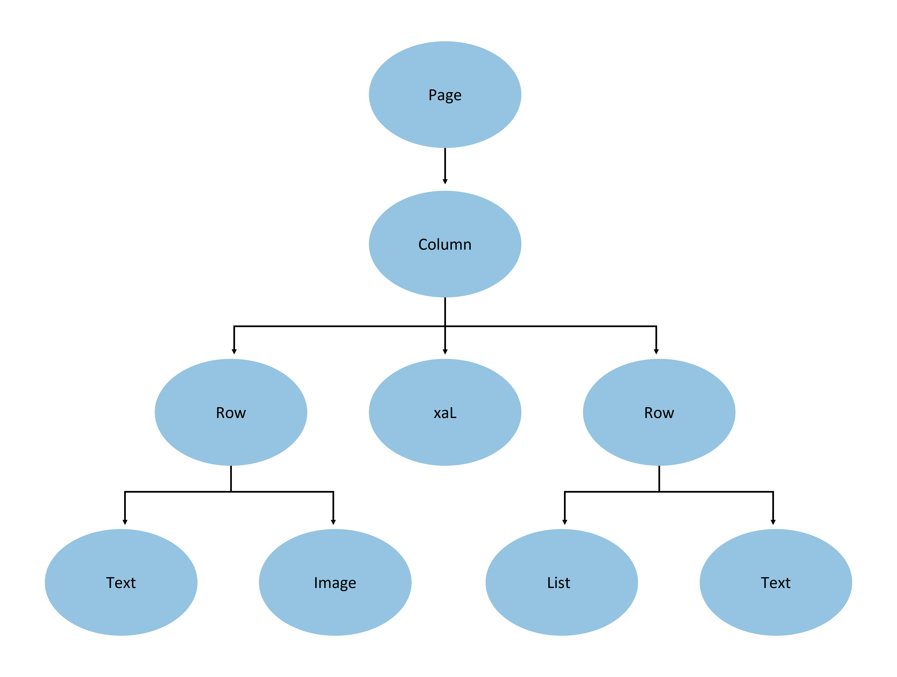

# Layout Overview

Components are arranged sequentially according to layout requirements to form application pages. In declarative UI, all pages are composed of custom components. Developers can choose appropriate layouts for page development based on their needs.

Layout refers to managing the size and position of UI components on user pages using specific components or attributes. In actual development, the following process should be followed to ensure overall layout effectiveness:

- Determine the page layout structure.
- Analyze the composition of elements on the page.
- Select appropriate layout container components or attributes to control the position and size of each element on the page.

## Layout Structure

Layouts typically follow a hierarchical structure. A common page structure is shown below:

**Figure 1** Common Page Structure Diagram

To achieve the above effect, developers need to declare corresponding elements on the page. Here, Page represents the root node of the page, while elements like Column/Row are system components. For different page structures, ArkUI provides various layout components to help developers achieve corresponding layout effects, such as Row for implementing linear layouts.

## Composition of Layout Elements

Layout-related container components can form corresponding layout effects. For example, the List component can constitute a linear layout.

**Figure 2** Layout Element Composition Diagram

- **Component Area (Blue Square)**: Represents the size of the component. The [width](../../../reference/source_en/arkui-cj/cj-universal-attribute-size.md#func-widthoptionlength) and [height](../../../reference/source_en/arkui-cj/cj-universal-attribute-size.md#func-heightoptionlength) attributes are used to set the size of the component area.
- **Component Content Area (Yellow Square)**: The size of the component content area is the component area size minus the component's [border](../../../reference/source_en/arkui-cj/cj-universal-attribute-border.md) value. The component content area size serves as the layout measurement constraint for the component content (or child components).
- **Component Content (Green Square)**: The size occupied by the component content itself, such as the size of text content. The component content and component content area may not match. For example, when fixed width and height are set, the component content size is the set width and height minus padding and border values, while the text content size is determined by the text layout engine, which may result in the actual text size being smaller than the set component content area size. When the component content and component content area sizes do not match, the [align](../../../reference/source_en/arkui-cj/cj-universal-attribute-location.md#func-alignalignment) attribute takes effect, defining the alignment of the component content within the component content area, such as center alignment.
- **Component Layout Boundary (Dashed Line)**: When the component's [margin](../../../reference/source_en/arkui-cj/cj-universal-attribute-size.md#func-marginlength) attribute is set, the component layout boundary is the component area plus the margin size.

## How to Choose a Layout

Declarative UI provides the following 10 common layouts. Developers can choose the appropriate layout for page development based on actual application scenarios.

| Layout | Application Scenario |
|:---|:---|
| [Linear Layout](./cj-layout-development-linear.md) (Row, Column) | Preferred when there are more than one child element in the layout and they can be arranged linearly. |
| [Stack Layout](./cj-layout-development-stack-layout.md) (Stack) | Preferred when components need a stacking effect. The stacking effect of the stack layout does not occupy or affect the layout space of other child components within the same container. |
| [Flex Layout](./cj-layout-development-flex-layout.md) (Flex) | The flex layout is similar to the linear layout. The difference is that the flex layout allows child components to be compressed or stretched by default. Preferred when child components need to calculate stretch or compression ratios, enabling better visual filling effects for multiple child components within containers. |
| [Relative Layout](./cj-layout-development-relative-layout.md) (RelativeContainer) | The relative layout is a two-dimensional layout method that does not follow the rules of linear layouts, offering more freedom. By setting anchor rules (AlignRules) on child components, child components can align their horizontal and vertical positions with the container or other child components within the container. The set anchor rules naturally support compression, stretching, stacking, or multi-line effects for child elements. Recommended when page element distribution is complex or when using linear layouts would result in deep nesting of containers. |
| [Grid Layout](./cj-layout-development-grid-layout.md) (GridRow, GridCol) | Grids are universal auxiliary positioning tools for multi-device scenarios, dividing space into regular grids. Unlike fixed space divisions in grid layouts, grids can achieve different layouts on different devices, offering more flexible space division, significantly reducing design and development costs for adapting to different screen sizes, and ensuring coordination and consistency in application display across devices, thereby improving user experience. Recommended when content is the same but layouts differ. |
| [List](./cj-layout-development-create-list.md) (List) | Lists efficiently display structured, scrollable information. In ArkUI, lists have vertical and horizontal layout capabilities and adaptive cross-axis arrangement, allowing scrolling when content exceeds the screen. Lists are suitable for presenting similar data types or data sets, such as images and text. |
| [Grid](./cj-layout-development-create-grid.md) (Grid) | Grid layouts have strong page division and child element proportion control capabilities. Grid layouts can control the number of grids occupied by elements and set child elements to span multiple rows or columns. When the grid container size changes, all child elements and spacing adjust proportionally. Recommended for layout scenarios requiring fixed proportions or uniform space allocation, such as calculators, photo albums, and calendars. |
| [Carousel](./cj-layout-development-create-looping.md) (Swiper) | Carousel components are typically used for advertising carousels, image previews, etc. |
| [Tabs](./cj-layout-development-tabs.md) (Tabs) | Tabs enable quick switching of view content within a page, improving information retrieval efficiency and streamlining the amount of information users receive at once. |

## Layout Position

Attributes like position and offset affect the position of layout containers relative to themselves or other components.

| Positioning Capability | Application Scenario | Implementation Method |
|:---|:---|:---|
| Absolute Positioning | For devices of different sizes, absolute positioning has poor adaptability and defects in screen adaptation. | Use [position](../../../reference/source_en/arkui-cj/cj-universal-attribute-location.md#func-positionlength-length) to achieve absolute positioning, setting the offset position of the element's top-left corner relative to the parent container's top-left corner. In layout containers, setting this attribute does not affect the parent container's layout, only adjusting the position during drawing. |
| Relative Positioning | Relative positioning does not脱离文档流脱离文档流脱离文档流脱离文档流脱离文档流脱离文档流脱离文档流脱离文档流脱离文档流脱离文档流脱离文档流脱离文档流脱离文档流脱离文档流脱离文档流脱离文档流脱离文档流脱离文档流脱离文档流脱离文档流脱离文档流脱离文档流脱离文档流脱离文档流脱离文档流脱离文档流脱离文档流脱离文档流脱离文档流脱离文档流脱离文档流脱离文档流脱离文档流脱离文档流脱离文档流脱离文档流脱离文档流脱离文档流脱离文档流脱离文档流脱离文档流脱离文档流脱离文档流脱离文档流脱离文档流脱离文档流脱离文档流脱离文档流脱离文档流脱离文档流脱离文档流脱离文档流脱离文档流脱离文档流脱离文档流脱离文档流脱离文档流脱离文档流脱离文档流脱离文档流脱离文档流脱离文档流脱离文档流脱离文档流脱离文档流脱离文档流脱离文档流脱离文档流脱离文档流脱离文档流脱离文档流脱离文档流脱离文档流脱离文档流脱离文档流脱离文档流脱离文档流脱离文档流脱离文档流脱离文档流脱离文档流脱离文档流脱离文档流脱离文档流脱离文档流脱离文档流脱离文档流脱离文档流脱离文档流脱离文档流脱离文档流脱离文档流脱离文档流脱离文档流脱离文档流脱离文档流脱离文档流脱离文档流脱离文档流脱离文档流脱离文档流脱离文档流脱离文档流脱离文档流脱离文档流脱离文档流脱离文档流脱离文档流脱离文档流脱离文档流脱离文档流脱离文档流脱离文档流脱离文档流脱离文档流脱离文档流脱离文档流脱离文档流脱离文档流脱离文档流脱离文档流脱离文档流脱离文档流脱离文档流脱离文档流脱离文档流脱离文档流脱离文档流脱离文档流脱离文档流脱离文档流脱离文档流脱离文档流脱离文档流脱离文档流脱离文档流脱离文档流脱离文档流脱离文档流脱离文档流脱离文档流脱离文档流脱离文档流脱离文档流脱离文档流脱离文档流脱离文档流脱离文档流脱离文档流脱离文档流脱离文档流脱离文档流脱离文档流脱离文档流脱离文档流脱离文档流脱离文档流脱离文档流脱离文档流脱离文档流脱离文档流脱离文档流脱离文档流脱离文档流脱离文档流脱离文档流脱离文档流脱离文档流脱离文档流脱离文档流脱离文档流脱离文档流脱离文档流脱离文档流脱离文档流脱离文档流脱离文档流脱离文档流脱离文档流脱离文档流脱离文档流脱离文档流脱离文档流脱离文档流脱离文档流脱离文档流脱离文档流脱离文档流脱离文档流脱离文档流脱离文档流脱离文档流脱离文档流脱离文档流脱离文档流脱离文档流脱离文档流脱离文档流脱离文档流脱离文档流脱离文档流脱离文档流脱离文档流脱离文档流脱离文档流脱离文档流脱离文档流脱离文档流脱离文档流脱离文档流脱离文档流脱离文档流脱离文档流脱离文档流脱离文档流脱离文档流脱离文档流脱离文档流脱离文档流脱离文档流脱离文档流脱离文档流脱离文档流脱离文档流脱离文档流脱离文档流脱离文档流脱离文档流脱离文档流脱离文档流脱离文档流脱离文档流脱离文档流脱离文档流脱离文档流脱离文档流脱离文档流脱离文档流脱离文档流脱离文档流脱离文档流脱离文档流脱离文档流脱离文档流脱离文档流脱离文档流脱离文档流脱离文档流脱离文档流脱离文档流脱离文档流脱离文档流脱离文档流脱离文档流脱离文档流脱离文档流脱离文档流脱离文档流脱离文档流脱离文档流脱离文档流脱离文档流脱离文档流脱离文档流脱离文档流脱离文档流脱离文档流脱离文档流脱离文档流脱离文档流脱离文档流脱离文档流脱离文档流脱离文档流脱离文档流脱离文档流脱离文档流脱离文档流脱离文档流脱离文档流脱离文档流脱离文档流脱离文档流脱离文档流脱离文档流脱离文档流脱离文档流脱离文档流脱离文档流脱离文档流脱离文档流脱离文档流脱离文档流脱离文档流脱离文档流脱离文档流脱离文档流脱离文档流脱离文档流脱离文档流脱离文档流脱离文档流脱离文档流脱离文档流脱离文档流脱离文档流脱离文档流脱离文档流脱离文档流脱离文档流脱离文档流脱离文档流脱离文档流脱离文档流脱离文档流脱离文档流脱离文档流脱离文档流脱离文档流脱离文档流脱离文档流脱离文档流脱离文档流脱离文档流脱离文档流脱离文档流脱离文档流脱离文档流脱离文档流脱离文档流脱离文档流脱离文档流脱离文档流脱离文档流脱离文档流脱离文档流脱离文档流脱离文档流脱离文档流脱离文档流脱离文档流脱离文档流脱离文档流脱离文档流脱离文档流脱离文档流脱离文档流脱离文档流脱离文档流脱离文档流脱离文档流脱离文档流脱离文档流脱离文档流脱离文档流脱离文档流脱离文档流脱离文档流脱离文档流脱离文档流脱离文档流脱离文档流脱离文档流脱离文档流脱离文档流脱离文档流脱离文档流脱离文档流脱离文档流脱离文档流脱离文档流脱离文档流脱离文档流脱离文档流脱离文档流脱离文档流脱离文档流脱离文档流脱离文档流脱离文档流脱离文档流脱离文档流脱离文档流脱离文档流脱离文档流脱离文档流脱离文档流脱离文档流脱离文档流脱离文档流脱离文档流脱离文档流脱离文档流脱离文档流脱离文档流脱离文档流脱离文档流脱离文档流脱离文档流脱离文档流脱离文档流脱离文档流脱离文档流脱离文档流脱离文档流脱离文档流脱离文档流脱离文档流脱离文档流脱离文档流脱离文档流脱离文档流脱离文档流脱离文档流脱离文档流脱离文档流脱离文档流脱离文档流脱离文档流脱离文档流脱离文档流脱离文档流脱离文档流脱离文档流脱离文档流脱离文档流脱离文档流脱离文档流脱离文档流脱离文档流脱离文档流脱离文档流脱离文档流脱离文档流脱离文档流脱离文档流脱离文档流脱离文档流脱离文档流脱离文档流脱离文档流脱离文档流脱离文档流脱离文档流脱离文档流脱离文档流脱离文档流脱离文档流脱离文档流脱离文档流脱离文档流脱离文档流脱离文档流脱离文档流脱离文档流脱离文档流脱离文档流脱离文档流脱离文档流脱离文档流脱离文档流脱离文档流脱离文档流脱离文档流脱离文档流脱离文档流脱离文档流脱离文档流脱离文档流脱离文档流脱离文档流脱离文档流脱离文档流脱离文档流脱离文档流脱离文档流脱离文档流脱离文档流脱离文档流脱离文档流脱离文档流脱离文档流脱离文档流脱离文档流脱离文档流脱离文档流脱离文档流脱离文档流脱离文档流脱离文档流脱离文档流脱离文档流脱离文档流脱离文档流脱离文档流脱离文档流脱离文档流脱离文档流脱离文档流脱离文档流脱离文档流脱离文档流脱离文档流脱离文档流脱离文档流脱离文档流脱离文档流脱离文档流脱离文档流脱离文档流脱离文档流脱离文档流脱离文档流脱离文档流脱离文档流脱离文档流脱离文档流脱离文档流脱离文档流脱离文档流脱离文档流脱离文档流脱离文档流脱离文档流脱离文档流脱离文档流脱离文档流脱离文档流脱离文档流脱离文档流脱离文档流脱离文档流脱离文档流脱离文档流脱离文档流脱离文档流脱离文档流脱离文档流脱离文档流脱离文档流脱离文档流脱离文档流脱离文档流脱离文档流脱离文档流脱离文档流脱离文档流脱离文档流脱离文档流脱离文档流脱离文档流脱离文档流脱离文档流脱离文档流脱离文档流脱离文档流脱离文档流脱离文档流脱离文档流脱离文档流脱离文档流脱离文档流脱离文档流脱离文档流脱离文档流脱离文档流脱离文档流脱离文档流脱离文档流脱离文档流脱离文档流脱离文档流脱离文档流脱离文档流脱离文档流脱离文档流脱离文档流脱离文档流脱离文档流脱离文档流脱离文档流脱离文档流脱离文档流脱离文档流脱离文档流脱离文档流脱离文档流脱离文档流脱离文档流脱离文档流脱离文档流脱离文档流脱离文档流脱离文档流脱离文档流脱离文档流脱离文档流脱离文档流脱离文档流脱离文档流脱离文档流脱离文档流脱离文档流脱离文档流脱离文档流脱离文档流脱离文档流脱离文档流脱离文档流脱离文档流脱离文档流脱离文档流脱离文档流脱离文档流脱离文档流脱离文档流脱离文档流脱离文档流脱离文档流脱离文档流脱离文档流脱离文档流脱离文档流脱离文档流脱离文档流脱离文档流脱离文档流脱离文档流脱离文档流脱离文档流脱离文档流脱离文档流脱离文档流脱离文档流脱离文档流脱离文档流脱离文档流脱离文档流脱离文档流脱离文档流脱离文档流脱离文档流脱离文档流脱离文档流脱离文档流脱离文档流脱离文档流脱离文档流脱离文档流脱离文档流脱离文档流脱离文档流脱离文档流脱离文档流脱离文档流脱离文档流脱离文档流脱离文档流脱离文档流脱离文档流脱离文档流脱离文档流脱离文档流脱离文档流脱离文档流脱离文档流脱离文档流脱离文档流脱离文档流脱离文档流脱离文档流脱离文档流脱离文档流脱离文档流脱离文档流脱离文档流脱离文档流脱离文档流脱离文档流脱离文档流脱离文档流脱离文档流脱离文档流脱离文档流脱离文档流脱离文档流脱离文档流脱离文档流脱离文档流脱离文档流脱离文档流脱离文档流脱离文档流脱离文档流脱离文档流脱离文档流脱离文档流脱离文档流脱离文档流脱离文档流脱离文档流脱离文档流脱离文档流脱离文档流脱离文档流脱离文档流脱离文档流脱离文档流脱离文档流脱离文档流脱离文档流脱离文档流脱离文档流脱离文档流脱离文档流脱离文档流脱离文档流脱离文档流脱离文档流脱离文档流脱离文档流脱离文档流脱离文档流脱离文档流脱离文档流脱离文档流脱离文档流脱离文档流脱离文档流脱离文档流脱离文档流脱离文档流脱离文档流脱离文档流脱离文档流脱离文档流脱离文档流脱离文档流脱离文档流脱离文档流脱离文档流脱离文档流脱离文档流脱离文档流脱离文档流脱离文档流脱离文档流脱离文档流脱离文档流脱离文档流脱离文档流脱离文档流脱离文档流脱离文档流脱离文档流脱离文档流脱离文档流脱离文档流脱离文档流脱离文档流脱离文档流脱离文档流脱离文档流脱离文档流脱离文档流脱离文档流脱离文档流脱离文档流脱离文档流脱离文档流脱离文档流脱离文档流脱离文档流脱离文档流脱离文档流脱离文档流脱离文档流脱离文档流脱离文档流脱离文档流脱离文档流脱离文档流脱离文档流脱离文档流脱离文档流脱离文档流脱离文档流脱离文档流脱离文档流脱离文档流脱离文档流脱离文档流脱离文档流脱离文档流脱离文档流脱离文档流脱离文档流脱离文档流脱离文档流脱离文档流脱离文档流脱离文档流脱离文档流脱离文档流脱离文档流脱离文档流脱离文档流脱离文档流脱离文档流脱离文档流脱离文档流脱离文档流脱离文档流脱离文档流脱离文档流脱离文档流脱离文档流脱离文档流脱离文档流脱离文档流脱离文档流脱离文档流脱离文档流脱离文档流脱离文档流脱离文档流脱离文档流脱离文档流脱离文档流脱离文档流脱离文档流脱离文档流脱离文档流脱离文档流脱离文档流脱离文档流脱离文档流脱离文档流脱离文档流脱离文档流脱离文档流脱离文档流脱离文档流脱离文档流脱离文档流脱离文档流脱离文档流脱离文档流脱离文档流脱离文档流脱离文档流脱离文档流脱离文档流脱离文档流脱离文档流脱离文档流脱离文档流脱离文档流脱离文档流脱离文档流脱离