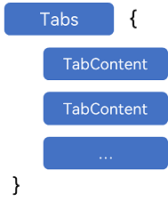

# Tabs

When a page contains abundant information, categorizing the content helps users focus on the currently displayed information and improves space utilization. The [Tabs](../../../API_Reference/source_zh_cn/arkui-cj/cj-navigation-switching-tabs.md) component enables quick content view switching within a single page, enhancing information retrieval efficiency while streamlining the amount of information users receive at once.

## Basic Layout

The Tabs component consists of two parts: TabContent and TabBar. TabContent represents the content area, while TabBar serves as the navigation tab bar. As shown in the diagram below, layouts vary based on navigation types, which include bottom navigation, top navigation, and sidebar navigation, with their respective navigation bars positioned at the bottom, top, or side.

**Figure 1** Tabs Component Layout Schematic


> **Note:**
>
> - The TabContent component does not support generic width properties; its width defaults to filling the parent Tabs component.
> - The TabContent component does not support generic height properties; its height is determined by the parent Tabs component's height and the TabBar component's height.

Tabs wrap TabContent with curly braces, as shown in Figure 2, where TabContent displays the corresponding content.



Each TabContent requires a tab, configured via its `tabBar` property. The example below sets the `tabBar` property to define the tab's content:

```cangjie
 TabContent() {
   Text('Home Content').fontSize(30)
 }
.tabBar('Home')
```

For multiple content sections, place them sequentially within Tabs:

```cangjie
Tabs() {
  TabContent() {
    Text('Home Content').fontSize(30)
  }
  .tabBar('Home')

  TabContent() {
    Text('Recommendations').fontSize(30)
  }
  .tabBar('Recommend')

  TabContent() {
    Text('Discover').fontSize(30)
  }
  .tabBar('Discover')

  TabContent() {
    Text('My Content').fontSize(30)
  }
  .tabBar("Mine")
}
```

## Bottom Navigation

Bottom navigation is the most common navigation pattern in applications. Positioned at the bottom of primary pages, it helps users quickly identify functional categories and corresponding content while facilitating one-handed operation. Typically serving as the main navigation, it organizes content by function to align with user habits and streamline switching between modules.

**Figure 3** Bottom Navigation Bar


The navigation bar position is set using the `barPosition` parameter of Tabs. By default, `barPosition` is `BarPosition.Start` (top). For bottom navigation, set it to `BarPosition.End`:

```cangjie
Tabs(BarPosition.End) {
    // TabContent content, e.g., Home, Discover, Recommend, Mine
    // ...
}
```

## Top Navigation

When content categories are numerous and users frequently switch between them (e.g., in news or thematic apps), top navigation is preferred. It often subdivides bottom navigation content further, such as categorizing topics into "Follow," "Video," or "Tech."

**Figure 4** Top Navigation Bar


```cangjie
Tabs(BarPosition.Start) {
    // TabContent content, e.g., Follow, Video, Game, Tech, Sports, Movies
    // ...
}
```

## Sidebar Navigation

Sidebar navigation is less common and typically used in landscape layouts. Aligned with left-to-right reading habits, it defaults to the left side.

**Figure 5** Sidebar Navigation


Enable sidebar navigation by setting the `vertical` property of Tabs to `true` (default is `false` for vertical arrangement):

```cangjie
Tabs(BarPosition.Start) {
    // TabContent content, e.g., Home, Discover, Recommend, Mine
    // ...
}
.vertical(true)
```

> **Note:**
>
> - When `vertical` is `false`, the TabBar width defaults to full screen width; adjust with `barWidth`.
> - When `vertical` is `true`, the TabBar height defaults to content height; adjust with `barHeight`.

## Disabling Swipe Navigation

By default, navigation bars support swipe switching. However, in multi-level categorization (e.g., combined bottom and top navigation), swiping conflicts may arise. To avoid poor UX, disable swiping via the `scrollable` property (default `true`):

**Figure 6** Disabled Bottom Navigation Swipe


```cangjie
Tabs(BarPosition.End) {
    TabContent() {
        Column() {
            Tabs() {
                // Top navigation content
                // ...
            }
        }
        .backgroundColor(0XFF08A8F1)
        .width(100.percent)
    }
    .tabBar("Home")

    // Other TabContent, e.g., Discover, Recommend, Mine
    // ...
}
.scrollable(false)
```

## Fixed Navigation Bar

For fixed categories (e.g., 3–5 bottom navigation items), use a non-scrollable, fixed navigation bar where tabs evenly distribute width.

**Figure 7** Fixed Navigation Bar


Set `barMode` to `BarMode.Fixed` (default):

```cangjie
Tabs(BarPosition.End) {
    // TabContent content, e.g., Home, Discover, Recommend, Mine
    // ...
}
.barMode(BarMode.Fixed)
```

## Scrollable Navigation Bar

For extensive categories exceeding screen width (top or sidebar navigation), enable scrolling via `barMode` set to `BarMode.Scrollable`:

**Figure 8** Scrollable Navigation Bar


```cangjie
Tabs(BarPosition.Start) {
    // TabContent content, e.g., Home, Discover, Recommend, Mine
    // ...
}
.barMode(BarMode.Scrollable)
```

## Custom Navigation Bar

Enhance UX by combining text and icons in bottom navigation. Customize styles by overriding the default underline indicator with a `tabBuilder` function that toggles active/inactive states.

**Figure 9** Custom Navigation Bar


```cangjie
@State var currentIndex: Int32 = 0

@Builder
func tabBuilder(title: String, targetIndex: Int32, imgs: Array<AppResource>) {
    Column(){
        if (this.currentIndex != targetIndex) {
            Image(imgs[0]).size(width: 25, height: 25)
            Text(title).fontColor(0X1698CE)
        } else {
            Image(imgs[1]).size(width: 25, height: 25)
            Text(title).fontColor(0X6B6B6B)
        }
    }
    .width(100.percent)
    .height(50)
    .justifyContent(FlexAlign.Center)
}
```

Pass the custom component to `tabBar`:

```cangjie
TabContent(){
  Text("My Content").fontSize(30)
}.tabBar({ =>
  bind(this.tabBuilder, this)("Mine", 0, [@r(app.media.mine_normal), @r(app.media.mine_selected)])
})
```

## Switching to a Specific Tab

Custom navigation bars require manual tab switching logic. Use the `onChange` event to sync the active tab index (`currentIndex`) with content changes.

**Figure 10** Unlinked Content and Tabs


```cangjie
package ohos_app_cangjie_entry
import kit.ArkUI.*
import ohos.arkui.state_macro_manage.*
import std.collection.ArrayList

@Entry
@Component
public class EntryView {
    @State var currentIndex: Int32 = 2

    @Builder
    func tabBuilder(title: String, targetIndex: Int32) {
        Column(){
            Text(title)
                .fontColor(
                    if (this.currentIndex == targetIndex) {
                        0X1698CE
                    } else {
                        0X6B6B6B
                    })
        }
    }

    func build() {
        Column() {
            Tabs(BarPosition.End){
                TabContent(){
                    // ...
                }.tabBar({ =>
                    bind(this.tabBuilder, this)("Home", 0)
                }).backgroundColor(Color.GREEN)
                TabContent() {
                    // ...
                }.tabBar({ =>
                    bind(this.tabBuilder, this)("Discover", 1)
                }).backgroundColor(Color.YELLOW)
                TabContent() {
                    // ...
                }.tabBar({ =>
                    bind(this.tabBuilder, this)("Recommend", 2)
                }).backgroundColor(Color.PINK)
                TabContent() {
                    // ...
                }.tabBar({ =>
                    bind(this.tabBuilder, this)("Mine", 3)
                }).backgroundColor(Color.BLUE)
            }
            .animationDuration(0)
            .backgroundColor(0xF1F3F5)
            .onChange({index =>
                this.currentIndex = index
            })
        }.width(100.percent)
    }
}
```

**Figure 11** Linked Content and Tabs

To achieve content and tab switching without sliding the content page or clicking the tab, you can pass the `currentIndex` to the `index` parameter of the `Tabs` component. By modifying `currentIndex`, you can jump to the `TabContent` corresponding to the specified index value. Alternatively, you can use `TabsController`, which serves as the controller for the `Tabs` component, enabling control over content switching. The `changeIndex` method of `TabsController` can be used to navigate to the `TabContent` associated with the specified index.

**Figure 12** Switching to a Specified Tab


Developers can utilize the `onContentWillChange` interface of the `Tabs` component to set a custom interception callback function. This callback function is triggered when the next page is about to be displayed. If the callback returns `true`, the new page will be displayed; if it returns `false`, the new page will not be shown, and the original page will remain visible.

```cangjie
Tabs(BarPosition.End, this.controller, this.currentIndex){
  // ...
}
.onContentWillChange({currentIndex, commingIndex =>
    if (commingIndex == 2) {
        return false
    } else {
        return true
    }
})
```

**Figure 13** Supporting Custom Page Switching Interception Events

