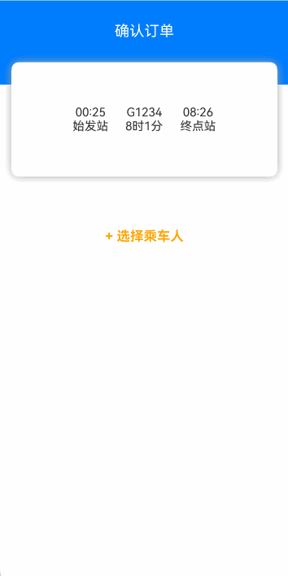
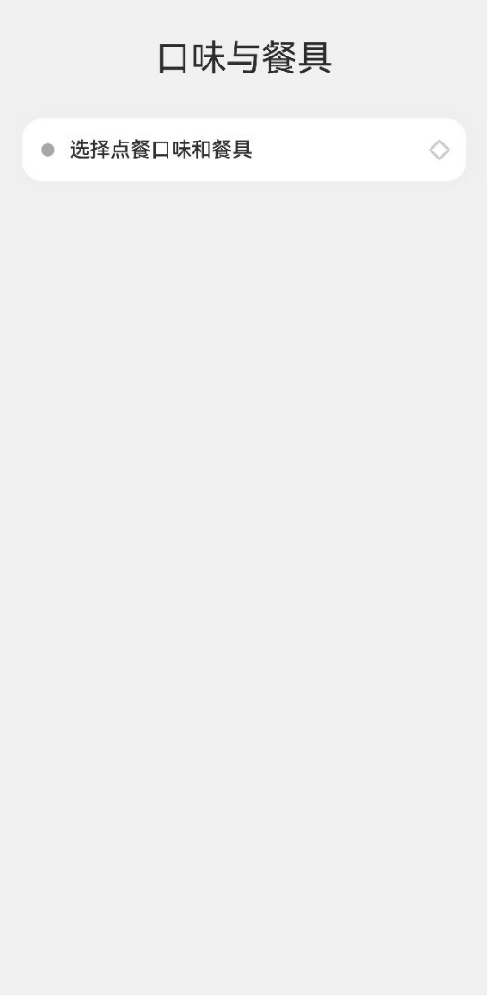

# Modal Transition

Modal transition is a type of transition where a new interface overlays the old one without the old interface disappearing.

**Table 1** Modal Transition Interfaces

| Interface                                       | Description                | Usage Scenarios                                     |
|:---------------------------------------- |:----------------- |:---------------------------------------- |
| [bindContentCover](../../../API_Reference/source_en/arkui-cj/cj-universal-attribute-bindcontentcover.md) | Displays a full-screen modal component.        | Used for custom full-screen modal display interfaces. Combined with transition animations and shared element animations, it can achieve complex transition effects, such as clicking a thumbnail to view a larger image. |
| [bindSheet](../../../API_Reference/source_en/arkui-cj/cj-universal-attribute-sheettransition.md#func-bindsheetbool----unit-sheetoptions) | Displays a semi-modal component.          | Used for semi-modal display interfaces, such as share dialogs.                          |
| [bindMenu](../../../API_Reference/source_en/arkui-cj/cj-universal-attribute-menu.md#func-bindmenu---unit) | Displays a menu that pops up when the component is clicked.     | Scenarios requiring menu functionality, such as the "+" button in general applications.                 |
| [bindContextMenu](../../../API_Reference/source_en/arkui-cj/cj-universal-attribute-menu.md#func-bindcontextmenu---unit-responsetype) | Displays a menu that pops up on long press or right-click. | Floating effect on long press, typically used with drag-and-drop frameworks, such as long-pressing desktop icons to float.             |
| [bindPopup](../../../API_Reference/source_en/arkui-cj/cj-universal-attribute-popup.md#func-bindpopupbool-custompopupoptions) | Displays a Popup dialog.        | Popup dialog scenarios, such as temporary explanations for a component after clicking.               |
| [if](./rendering_control/cj-rendering-control-ifelse.md)                                       | Adds or removes components via `if`.      | Used to temporarily display an interface under certain conditions. The back navigation for this method needs to be implemented by developers through interface monitoring.  |

## Building Full-Screen Modal Transition Effects with bindContentCover

The [bindContentCover](../../../API_Reference/source_en/arkui-cj/cj-universal-attribute-bindcontentcover.md) interface is used to bind a full-screen modal page to a component. Transition effects can be added during the appearance and disappearance of the component by setting the `ModalTransition` parameter. The steps to build a full-screen modal transition effect using `bindContentCover` are as follows:

- Define the full-screen modal transition effect [bindContentCover](../../../API_Reference/source_en/arkui-cj/cj-universal-attribute-bindcontentcover.md).

- Define the modal display interface.

   ```cangjie
   // Build the modal display interface via @Builder
   @Builder
   func MyBuilder() {
     Column {
       Text("my model view")
     }
     // Add transition effects for appearance/disappearance. The transition must be applied to the first component under the builder.
     .transition(TransitionEffect.translate(TranslateOptions(y: 1000)).animation(AnimateParam(curve: Curve.Smooth)))
   }
   ```

- Invoke the modal display interface via the modal interface and achieve corresponding animation effects through transition or shared element animations.

   ```cangjie
   // Modal transition control variable
   @State var isPresent: Bool = false

   Button("Click to present model view")
     // Bind the modal display interface via the selected modal interface. ModalTransition is a built-in ContentCover transition animation type. Here, None is selected to indicate no default system animation. The state variable is controlled via onDisappear.
     .bindContentCover(this.isPresent, this.MyBuilder, options: ContentCoverOptions(
               modalTransition: ModalTransition.Default,
               onDisappear: {
                => if (this.isPresent) {
                  this.isPresent = !this.isPresent
                 }
               }
     ))
     .onClick({
        evt => this.isPresent = !this.isPresent
      // Change the state variable to display the modal interface
     })
   ```

The complete example code and effect are as follows.

 <!-- run -->

```cangjie
package ohos_app_cangjie_entry

import kit.ArkUI.*
import ohos.arkui.state_macro_manage.*

class PersonList {
    var name: String
    var cardnum: String
    public init(name: String, cardnum: String) {
        this.name = name
        this.cardnum = cardnum
    }
}

@Entry
@Component
class EntryView {
    private var personList: Array<PersonList> = [
        PersonList("王**", "1234***********789"),
        PersonList("宋*", "2345***********789"),
        PersonList("许**", "3456***********789"),
        PersonList("唐*", "4567***********789")
    ]

    @State
    var isPresent: Bool = false

    @Builder
    func MyBuilder() {
        Column {
            Row {
                Text("选择乘车人")
                    .fontSize(20.vp)
                    .fontColor(Color.White)
                    .width(100.percent)
                    .textAlign(TextAlign.Center)
                    .padding(top: 30.vp, bottom: 15.vp)
            }.backgroundColor(0x007dfe)

            Row {
                Text("+ 添加乘车人")
                    .fontSize(16.vp)
                    .fontColor(0x333333)
                    .margin(top: 10.vp)
                    .padding(top: 20.vp, bottom: 20.vp)
                    .width(92.percent)
                    .borderRadius(10.vp)
                    .textAlign(TextAlign.Center)
                    .backgroundColor(Color.White)
            }

            Column {
                ForEach(
                    this.personList,
                    itemGeneratorFunc: {
                        item: PersonList, index: Int64 => Row {
                            Column {
                                if (index % 2 == 0) {
                                    Column {
                                    }
                                    .width(20.vp)
                                    .height(20.vp)
                                    .border(width: 1.vp, color: 0x007dfe)
                                    .backgroundColor(0x007dfe)
                                } else {
                                    Column {
                                    }
                                    .width(20.vp)
                                    .height(20.vp)
                                    .border(width: 1.vp, color: 0x007dfe)
                                }
                            }.width(20.percent)

                            Column {
                                Text(item.name)
                                    .fontColor(0x333333)
                                    .fontSize(18.vp)
                                Text(item.cardnum)
                                    .fontColor(0x666666)
                                    .fontSize(14.vp)
                            }
                                .width(60.percent)
                                .alignItems(HorizontalAlign.Start)

                            Column {
                                Text("编辑")
                                    .fontColor(0x007dfe)
                                    .fontSize(16.vp)
                            }.width(20.percent)
                        }
                        .padding(top: 10.vp, bottom: 10.vp)
                        .border(width: 1.vp, color: 0xf1f1f1)
                        .width(92.percent)
                        .backgroundColor(Color.White)
                    }
                )
            }.padding(top: 20.vp, bottom: 20.vp)

            Text("确认")
                .width(90.percent)
                .height(40.vp)
                .textAlign(TextAlign.Center)
                .borderRadius(10.vp)
                .fontColor(Color.White)
                .backgroundColor(0x007dfe)
                .onClick({
                    evt => this.isPresent = !this.isPresent
                })
        }
        .size(width: 100.percent, height: 100.percent)
        .backgroundColor(0xf5f5f5)
        .transition(
            TransitionEffect
                .translate(TranslateOptions(y: 1000))
                .animation(AnimateParam(curve: Curve.Smooth)))
    }

    func build() {
        Column {
            Row {
                Text("确认订单")
                    .fontSize(20.vp)
                    .fontColor(Color.White)
                    .width(100.percent)
                    .textAlign(TextAlign.Center)
                    .padding(top: 30.vp, bottom: 60.vp)
            }.backgroundColor(0x007dfe)

            Column {
                Row {
                    Column {
                        Text("00:25")
                        Text("始发站")
                    }.width(30.percent)

                    Column {
                        Text("G1234")
                        Text("8时1分")
                    }.width(30.percent)

                    Column {
                        Text("08:26")
                        Text("终点站")
                    }.width(30.percent)
                }
            }
            .width(92.percent)
            .padding(15.percent)
            .margin(top: -30)
            .backgroundColor(Color.White)
            .shadow(radius: 30.0, color: 0xaaaaaa)
            .borderRadius(10.vp)

            Column {
                Text("+ 选择乘车人")
                    .fontSize(18.vp)
                    .fontColor(Color(0xFFA500))
                    .fontWeight(FontWeight.Bold)
                    .padding(top: 10.vp, bottom: 10.vp)
                    .width(60.percent)
                    .textAlign(TextAlign.Center)
                    .borderRadius(15.vp)
                    .bindContentCover(
                        this.isPresent,
                        this.MyBuilder,
                        options: ContentCoverOptions(
                            modalTransition: ModalTransition.Default,
                            onDisappear: {
                                => if (this.isPresent) {
                                    this.isPresent = !this.isPresent
                                }
                            }
                        )
                    )
                    .onClick({
                        evt => this.isPresent = !this.isPresent
                    })
            }.padding(top: 60.vp)
        }
    }
}
```



## Building Semi-Modal Transition Effects with bindSheet

The [bindSheet](../../../API_Reference/source_en/arkui-cj/cj-universal-attribute-sheettransition.md#func-bindsheetbool----unit-sheetoptions) attribute binds a semi-modal page to a component. The size of the semi-modal can be determined by setting custom or default built-in heights during the component's appearance. The steps to build semi-modal transition effects are essentially the same as those for building full-screen modal transition effects using [bindContentCover](../../../API_Reference/source_en/arkui-cj/cj-universal-attribute-bindcontentcover.md).

The complete example and effect are as follows.

 <!-- run -->

```cangjie
package ohos_app_cangjie_entry

import kit.ArkUI.*
import ohos.arkui.state_macro_manage.*

@Entry
@Component
class EntryView {
    @State
    var isShowSheet: Bool = false
    private let menusList: Array<String> = ["不要辣", "少放辣", "多放辣", "不要香菜", "不要香葱", "不要一次性餐具",
        "需要一次性餐具"]

    @Builder
    func mySheet() {
        Column {
            Flex(direction: FlexDirection.Row, wrap: FlexWrap.Wrap) {
                ForEach(
                    this.menusList,
                    itemGeneratorFunc: {
                        item: String, index: Int64 => Text(item)
                            .fontSize(16.vp)
                            .fontColor(0x333333)
                            .backgroundColor(0xf1f1f1)
                            .borderRadius(8.vp)
                            .margin(10.vp)
                            .padding(10.vp)
                    }
                )
            }.padding(top: 18.vp)
        }
        .width(100.percent)
        .height(100.percent)
        .backgroundColor(Color.White)
    }

    func build() {
        Column {
            Text("口味与餐具")
                .fontSize(28.vp)
                .padding(top: 30.vp, bottom: 30.vp)
            Column {
                Row {
                    Row {
                    }
                    .width(10.vp)
                    .height(10.vp)
                    .backgroundColor(0xa8a8a8)
                    .margin(right: 12.vp)
                    .borderRadius(20.vp)
                    Column {
                        Text("选择点餐口味和餐具")
                            .fontSize(16.vp)
                            .fontWeight(FontWeight.Medium)
                    }.alignItems(HorizontalAlign.Start)

                    Blank()

                    Row {
                    }
                    .width(12.vp)
                    .height(12.vp)
                    .margin(right: 15.vp)
                    .border(width: 2.vp, color: 0xcccccc)
                    .rotate(angle: 45.0)
                }
                .borderRadius(15.vp)
                .shadow(radius: 100.0, color: 0xededed)
                .width(90.percent)
                .alignItems(VerticalAlign.Center)
                .padding(left: 15.vp, top: 15.vp, bottom: 15.vp)
                .backgroundColor(Color.White)
                .bindSheet(
                    this.isShowSheet,
                    this.mySheet,
                    options: SheetOptions(
                        height: SheetSize.FitContent,
                        dragBar: false,
                        onDisappear: {
                            => this.isShowSheet = !this.isShowSheet
                        }
                    )
                )
                .onClick({evt => this.isShowSheet = !this.isShowSheet})
            }.width(100.percent)
        }
        .width(100.percent)
        .height(100.percent)
        .backgroundColor(0xf1f1f1)
    }
}
```



## Implementing Menu Popup Effects with bindMenu

[bindMenu](../../../API_Reference/source_en/arkui-cj/cj-universal-attribute-menu.md#func-bindmenuarraymenuelement-menuoptions) binds a popup menu to a component, triggered by clicking. The complete example and effect are as follows.

 <!-- run -->

```cangjie
package ohos_app_cangjie_entry

import kit.ArkUI.*
import ohos.arkui.state_macro_manage.*
import ohos.hilog.*

@Entry
@Component
class EntryView {
    @State
    var items: Array<MenuElement> = [
        MenuElement(value: "菜单项1", action: {=> Hilog.info(0, "cangjie", "handle Menu1 select")}),
        MenuElement(value: "菜单项2", action: {=> Hilog.info(0, "cangjie", "handle Menu2 select")})
    ]

    func build() {
        Column {
            Button("click")
                .backgroundColor(0x409eff)
                .borderRadius(5.vp)
                .bindMenu(this.items)
        }
        .justifyContent(FlexAlign.Center)
        .width(100.percent)
        .height(437.vp)
    }
}
```


## Implementing Menu Popup Effects with bindContextMenu

[bindContextMenu](../../../API_Reference/source_en/arkui-cj/cj-universal-attribute-menu.md#func-bindcontextmenu---unit-responsetype-contextmenuoptions) binds a popup menu to a component, triggered by long press or right-click. The complete example and effect are as follows.

 <!-- run -->

```cangjie
package ohos_app_cangjie_entry
import kit.ArkUI.*
import ohos.arkui.state_macro_manage.*
import ohos.resource_manager.*

@Entry
@Component
class EntryView {
    private var menu: Array<String> = ["保存图片", "收藏", "搜一搜"]
    private var pics: Array<AppResource> = [@r(app.media.startIcon)]

    @Builder
    func myMenu() {
        Column {
            ForEach(
                this.menu,
                itemGeneratorFunc: {
                    item: String, index: Int64 => Row {
                        Text(item)
                            .fontSize(18.vp)
                            .width(100.percent)
                            .textAlign(TextAlign.Center)
                    }
                    .padding(15.vp)
                    .border(width: 1.vp, color: 0xcccccc)
                }
            )
        }
        .width(140.vp)
        .borderRadius(15.vp)
        .shadow(radius: 15.0, color: 0xf1f1f1)
        .backgroundColor(0xf1f1f1)
    }

    func build() {
        Column {
            Row {
                Text("查看图片")
                    .fontSize(20.vp)
                    .fontColor(Color.White)
                    .width(100.percent)
                    .textAlign(TextAlign.Center)
                    .padding(top: 20.vp, bottom: 20.vp)
            }.backgroundColor(0x007dfe)

            Column {
                ForEach(
                    this.pics,
                    itemGeneratorFunc: {
                        item: AppResource, index: Int64 => Row {
                            Image(item)
                                .width(100.percent)
                        }
                        .padding(top: 20.vp, bottom: 20.vp, left: 10.vp, right: 10.vp)
                        .bindContextMenu(builder: this.myMenu, responseType: ResponseType.LongPress)
                    }
                )
            }
        }
        .width(100.percent)
        .alignItems(HorizontalAlign.Center)
    }
}
```

## Implementing Bubble Popup Effects Using bindPopUp

The [bindpopup](../../../API_Reference/source_en/arkui-cj/cj-universal-attribute-popup.md) attribute can bind a popup to a component and configure its content, interaction logic, and display state.

Complete example and code are provided below.

 <!-- run -->

```cangjie
package ohos_app_cangjie_entry

import kit.ArkUI.*
import ohos.arkui.state_macro_manage.*

@Entry
@Component
class EntryView {
    @State
    var customPopup: Bool = false

    @Builder
    func popupBuilder() {
        Column(space: 2.vp) {
            Row {
            }
            .width(64.vp)
            .height(64.vp)
            .backgroundColor(0x409eff)
            Text("Popup")
                .fontSize(10.vp)
                .fontColor(Color.White)
        }
        .justifyContent(FlexAlign.SpaceAround)
        .width(100.vp)
        .height(100.vp)
        .padding(5.vp)
        .backgroundColor(Color.Red)
    }

    func build() {
        Column {
            Button("click")
                .onClick({
                    evt => this.customPopup = !this.customPopup
                })
                .backgroundColor(0xf56c6c)
                .bindPopup(
                    this.customPopup,
                    CustomPopupOptions(
                        builder: bind(popupBuilder, this),
                        placement: Placement.Top,
                        maskColor: Color(0x33000000),
                        popupColor: Color(0xf56c6c),
                        enableArrow: true,
                        autoCancel: true,
                        showInSubWindow: false,
                        onStateChange: {
                            e => if (!e.isVisible) {
                                this.customPopup = false
                            }
                        }
                    )
                )
        }
        .justifyContent(FlexAlign.Center)
        .width(100.percent)
        .height(437.vp)
    }
}
```


## Implementing Modal Transitions Using if

The aforementioned modal transition interfaces require binding to other components and triggering the modal interface by monitoring state variable changes. Alternatively, modal transitions can be achieved through the if paradigm by adding/removing components.

Complete example and code are provided below.

 <!-- run -->

```cangjie
package ohos_app_cangjie_entry

import kit.ArkUI.*
import ohos.arkui.ui_context.*
import ohos.arkui.state_macro_manage.*

@Entry
@Component
class EntryView {
    private var listArr: Array<String> = ["WLAN", "Bluetooth", "Personal Hotspot", "Connections & Sharing"]
    private var shareArr: Array<String> = ["Screen Cast", "Printing", "VPN", "Private DNS", "NFC"]
    @State
    var isShowShare: Bool = false
    private func shareFunc(): Unit {
        getUIContext().animateTo(
            AnimateParam(duration: 500),
            {
                => this.isShowShare = !this.isShowShare
            }
        )
    }

    func build() {
        Stack {
            Column {
                Column {
                    Text("Settings")
                    .fontSize(28.vp)
                    .fontColor(0x333333)
                }
                .width(90.percent)
                .padding(top: 40.vp, bottom: 15.vp)
                .alignItems(HorizontalAlign.Start)

                Search(placeholder: "Enter keywords to search")
                .width(90.percent)
                .height(40.vp)
                .margin(bottom: 20.vp)

                List(initialIndex: 0) {
                    ForEach(
                        this.listArr,
                        itemGeneratorFunc: {item: String, index: Int64 =>
                            ListItem {
                                Row {
                                    Row {
                                        Text((item
                                            .toRuneArray()
                                            .get(0) ?? r'0').toString())
                                            .fontColor(Color.White)
                                            .fontSize(14.vp)
                                            .fontWeight(FontWeight.Bold)
                                    }
                                    .width(30.vp)
                                    .height(30.vp)
                                    .backgroundColor(0xa8a8a8)
                                    .margin(right: 12.vp)
                                    .borderRadius(20.vp)
                                    .justifyContent(FlexAlign.Center)

                                    Column {
                                        Text(item)
                                            .fontSize(16.vp)
                                            .fontWeight(FontWeight.Medium)
                                    }.alignItems(HorizontalAlign.Start)

                                    Blank()

                                    Row {
                                    }
                                    .width(12.vp)
                                    .height(12.vp)
                                    .margin(right: 15.vp)
                                    .border(width: 2.vp, color: 0xcccccc)
                                    .borderWidth(EdgeWidths(top: 2.vp, right: 2.vp))
                                    .rotate(angle: 45.0)
                                }
                                .borderRadius(15.vp)
                                .shadow(radius: 100.0, color: 0xededed)
                                .width(90.percent)
                                .alignItems(VerticalAlign.Center)
                                .padding(top: 15.vp, bottom: 15.vp, left: 15.vp)
                                .backgroundColor(Color.White)
                            }
                            .width(100.percent)
                            .margin(top: 12.vp)
                            .onClick({
                                evt => if (item.endsWith("Sharing")) {
                                    this.shareFunc()
                                }
                            })
                        },
                        keyGeneratorFunc: {item: String, index: Int64 => item.toString()}
                    )
                }.width(100.percent).height(80.percent)
            }
            .width(100.percent)
            .height(100.percent)
            .backgroundColor(0xfefefe)

            if (this.isShowShare) {
                Column {
                    Column {
                        Row {
                            Row {
                                Row {
                                }
                                .width(16.vp)
                                .height(16.vp)
                                .border(width: 2.vp, color: 0x333333)
                                .borderWidth(EdgeWidths(top: 2.vp, left: 2.vp))
                                .rotate(angle: -45.0)
                            }
                            .padding(left: 15.vp, right: 10.vp)
                            .onClick({
                                evt => this.shareFunc()
                            })
                            Text("Connections & Sharing")
                                .fontSize(28.vp)
                                .fontColor(0x333333)
                        }.padding(top: 30.vp)
                    }
                    .width(90.percent)
                    .padding(bottom: 15.vp, top: 40.vp)
                    .alignItems(HorizontalAlign.Start)

                    List(initialIndex: 0) {
                        ForEach(
                            this.shareArr,
                            itemGeneratorFunc: {item: String, Index: Int64 =>
                                ListItem {
                                    Row {
                                        Row {
                                            Text((item
                                                .toRuneArray()
                                                .get(0) ?? r'0').toString())
                                                .fontColor(Color.White)
                                                .fontSize(14.vp)
                                                .fontWeight(FontWeight.Bold)
                                        }
                                        .width(30.vp)
                                        .height(30.vp)
                                        .backgroundColor(0xa8a8a8)
                                        .margin(right: 12.vp)
                                        .borderRadius(20.vp)
                                        .justifyContent(FlexAlign.Center)

                                        Column {
                                            Text(item)
                                                .fontSize(16.vp)
                                                .fontWeight(FontWeight.Medium)
                                        }.alignItems(HorizontalAlign.Start)

                                        Blank()

                                        Row {
                                        }
                                        .width(12.vp)
                                        .height(12.vp)
                                        .margin(right: 15.vp)
                                        .border(width: 2.vp, color: 0xcccccc)
                                        .borderWidth(EdgeWidths(top: 2.vp, right: 2.vp))
                                        .rotate(angle: 45.0)
                                    }
                                    .borderRadius(15.vp)
                                    .shadow(radius: 100.0, color: 0xededed)
                                    .width(90.percent)
                                    .alignItems(VerticalAlign.Center)
                                    .padding(left: 15.vp, top: 15.vp, bottom: 15.vp)
                                    .backgroundColor(Color.White)
                                }.width(100.percent).margin(top: 12.vp)
                            },
                            keyGeneratorFunc: {item: String, index: Int64 => item.toString()}
                        )
                    }.width(100.percent).height(80.percent)
                }
                .width(100.percent)
                .height(100.percent)
                .backgroundColor(0xffffff)
                .transition(
                    TransitionEffect
                        .OPACITY
                        .combine(TransitionEffect.translate(TranslateOptions(x: 100.percent)))
                        .combine(TransitionEffect.scale(ScaleOptions(x: 0.95, y: 0.95))))
            }
        }
    }
}
```

