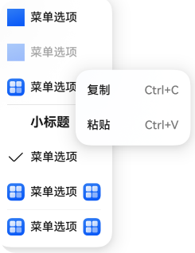

# Menu Control (Menu)

Menu is a menu interface, typically used for right-click pop-ups, click-triggered pop-ups, etc. For specific usage, please refer to [Menu Control](../../../API_Reference/source_zh_cn/arkui-cj/cj-universal-attribute-menu.md).

When using [bindContextMenu](../../../API_Reference/source_zh_cn/arkui-cj/cj-universal-attribute-menu.md#func-bindcontextmenu---unit-responsetype) with a preview image set, the menu will have an overlay when popped up, making it modal.

When using [bindMenu](../../../API_Reference/source_zh_cn/arkui-cj/cj-universal-attribute-menu.md#func-bindmenu---unit) or bindContextMenu without setting a preview image, the menu will pop up without an overlay, making it non-modal.

## Lifecycle

| Name | Type | Description |
|:---|:---|:---|
| aboutToAppear | () -> Unit | Callback event before the menu display animation. |
| onAppear | () -> Unit | Callback event when the menu pops up. |
| aboutToDisappear | () -> Unit | Callback event before the menu exit animation. |
| onDisappear | () -> Unit | Callback event when the menu disappears. |

## Creating a Default-Style Menu

The menu needs to be implemented by calling the bindMenu interface. bindMenu responds to the click event of the bound component. After binding the component, the menu will pop up when the corresponding component is clicked.

```cangjie
Button("click for Menu").bindMenu(
    Action(
        value: 'Menu1',
        action: {
            => AppLog.info('handle Menu1 select')
        }
    )
)
```


### Creating a Custom-Style Menu

When the default style does not meet development requirements, you can use [@Builder](./paradigm/cj-macro-builder.md) to customize the menu content and implement it via the bindMenu interface.

#### Developing Menu Content with @Builder

 <!-- run -->

```cangjie
package ohos_app_cangjie_entry
import kit.ArkUI.*
import ohos.arkui.state_macro_manage.*
import kit.LocalizationKit.*

class Tmp {
    var iconStr2: AppResource = @r(app.media.startIcon)

    public func set(val: AppResource) {
        this.iconStr2 = val
    }
}

@Entry
@Component
class EntryView {
    @State var select: Bool = true
    private var iconStr: AppResource = @r(app.media.startIcon)
    private var iconStr2: AppResource = @r(app.media.startIcon)

    @Builder
    func SubMenu() {
        Menu() {
            MenuItem(startIcon: "", content: "Copy", endIcon: "", labelInfo: "Ctrl+C")
            MenuItem(startIcon: "", content: "Paste", endIcon: "", labelInfo: "Ctrl+V")
        }
    }

    @Builder
    func MyMenu() {
        Menu() {
            MenuItem(startIcon: @r(app.media.app_background), content: @r(app.string.Content_name),
                endIcon: @r(app.string.Content_empty), labelInfo: @r(app.string.Content_empty))
            MenuItem(startIcon: @r(app.media.app_background), content: @r(app.string.Content_name),
                endIcon: @r(app.string.Content_empty), labelInfo: @r(app.string.Content_empty)).enabled(false)
            MenuItem(
                startIcon: this.iconStr,
                content: @r(app.string.Content_name),
                endIcon: @r(app.media.startIcon),
                labelInfo: @r(app.string.Content_empty),
                // When the builder parameter is configured, it indicates a submenu bound to the menuItem. Hovering over this menu item will display the submenu.
                builder: {=> bind(this.SubMenu, this)()}
            )
            MenuItemGroup(header: "Subtitle", footer: "") {
                =>
                MenuItem(startIcon: "", content: "Menu Option", endIcon: "", labelInfo: "")
                    .selectIcon(true)
                    .selected(this.select)
                    .onChange(
                        {
                            selected =>
                            AppLog.info("menuItem select${selected}")
                            let Str: Tmp = Tmp()
                            Str.set(@r(app.media.startIcon))
                        }
                    )
                MenuItem(
                    startIcon: @r(app.media.startIcon),
                    content: @r(app.string.Content_empty),
                    endIcon: @r(app.media.startIcon),
                    labelInfo: @r(app.string.Content_empty),
                    builder: {=> bind(this.SubMenu, this)()}
                )
            }

            MenuItem(
                startIcon: this.iconStr2,
                content: @r(app.string.Content_name),
                endIcon: @r(app.media.startIcon),
                labelInfo: @r(app.string.Content_empty)
            )
        }
    }

    func build() {
        // ...
    }
}
```

### Binding Components with bindMenu Attribute

```cangjie
Button('click for Menu')
    .bindMenu(builder: this.MyMenu)
```



## Creating a Right-Click or Long-Press Menu

Customize the menu via the bindContextMenu interface and set the trigger method for menu pop-up, which can be right-click or long-press. The menu items popped up via bindContextMenu are in an independent sub-window and can appear outside the application window.

- The method for developing menu content with @Builder is the same as above.
- Confirm the menu pop-up method and bind components with the bindContextMenu attribute. The example shows a right-click pop-up menu.

```cangjie
Button('click for Menu')
    .bindContextMenu(
        builder: this.MyMenu,
        responseType: ResponseType.RightClick
    )
```