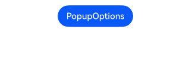
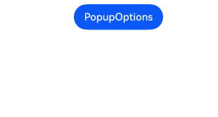
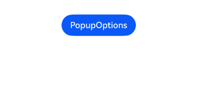
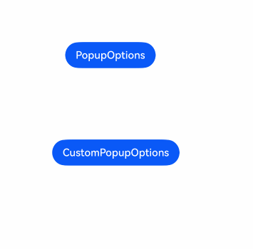

# Popup

The Popup attribute can be bound to components to display popup tooltips, configuring popup content, interaction logic, and display states. It is primarily used for screen recording, information alerts, and other display scenarios.

There are two types of popups: one is the system-provided popup [PopupOptions](../../../API_Reference/source_zh_cn/arkui-cj/cj-universal-attribute-popup.md#struct-popupoptions), and the other is a customizable popup [CustomPopupOptions](../../../API_Reference/source_zh_cn/arkui-cj/cj-universal-attribute-popup.md#struct-custompopupoptions). Among them, PopupOptions configures buttons via `primaryButton` and `secondaryButton`, while CustomPopupOptions allows custom popups through the `builder` configuration.

Popups can be configured as modal or non-modal windows using the [mask](../../../API_Reference/source_zh_cn/arkui-cj/cj-universal-attribute-popup.md#var-mask-1) parameter. When `mask` is set to `true` or a color value, the popup becomes a modal window; when `mask` is `false`, it is non-modal.

## Text Popup

Text popups are commonly used for displaying informational messages without any interactive elements. The Popup attribute must be bound to a component, and the popup appears when the `show` parameter in `bindPopup` is set to `true`.

In the following example, the Popup attribute is bound to a Button component. Each click toggles the `handlePopup` boolean value, triggering the popup when `true`.

<!-- run -->

```cangjie
package ohos_app_cangjie_entry

import kit.ArkUI.*
import ohos.arkui.state_macro_manage.*

@Entry
@Component
class EntryView {
    @State var handlePopup: Bool = false
    func build() {
        Column {
            Button('PopupOptions')
                .onClick({
                    => this.handlePopup = !this.handlePopup
                })
                .bindPopup(
                    show: this.handlePopup,
                    popup: PopupOptions(message: 'This is a popup with PopupOptions')
                )
        }.width(100.percent).padding(top: 5)
    }
}
```



## Adding State Change Events to Popups

The `onStateChange` parameter adds a callback for popup state changes, allowing detection of the current popup visibility state.

<!-- run -->

```cangjie
package ohos_app_cangjie_entry

import kit.ArkUI.*
import ohos.arkui.state_macro_manage.*

@Entry
@Component
class EntryView {
    @State var handlePopup: Bool = false
    func build() {
        Column() {
            Button('PopupOptions')
                .onClick({
                    => this.handlePopup = !this.handlePopup
                })
                .bindPopup(
                    show: this.handlePopup,
                    popup: PopupOptions(
                        message: 'This is a popup with PopupOptions',
                        onStateChange: {
                            e =>
                            if (!e.isVisible) {
                                this.handlePopup = false
                            }
                        }
                    )
                )
        }.width(100.percent).padding(top: 5)
    }
}
```



## Popup with Buttons

The `primaryButton` and `secondaryButton` properties allow adding up to two buttons for simple interactions. Developers can configure the `action` parameter to define the desired operations.

<!-- run -->

```cangjie
package ohos_app_cangjie_entry

import kit.ArkUI.*
import ohos.arkui.state_macro_manage.*
import kit.PerformanceAnalysisKit.Hilog
@Entry
@Component
class EntryView {
    @State var handlePopup: Bool = false
    func build() {
        Column() {

            Button('PopupOptions')
                .margin(top: 200)
                .onClick(
                    {
                    => this.handlePopup = !this.handlePopup

                }
                )
                .bindPopup(
                    show: this.handlePopup,
                    popup: PopupOptions(
                        message: 'This is a popup with PopupOptions',
                        primaryButton: Action(
                            value: 'Confirm',
                            action: {
                                => this.handlePopup = !this.handlePopup
                            Hilog.info(0, "click", "click Confirm")
                            }
                        ),
                        secondaryButton: Action(
                            value: 'Cancel',
                            action: {
                                => this.handlePopup = !this.handlePopup
                            Hilog.info(0, "click", "click Cancel")
                            }
                        ),
                        onStateChange: {
                            e =>
                            if (!e.isVisible) {
                                this.handlePopup = false
                            }
                        }
                    )
                )
        }.width(100.percent).padding(top: 5)
    }
}
```



## Popup Animation

Popups can define entry and exit animations using the `transition` parameter.

<!-- run -->

```cangjie
package ohos_app_cangjie_entry

import kit.ArkUI.*
import ohos.arkui.state_macro_manage.*

@Entry
@Component
class EntryView {
    @State var handlePopup: Bool = false
    @State var customPopup: Bool = false
    @State var custom: String = "Custom Wait"
    // Popup builder defines popup content
    @Builder
    func popupBuilder() {
        Row() {
            Text('Custom Popup with transitionEffect').fontSize(10)
        }
            .height(50)
            .padding(5)
    }

    func build() {
        Flex(FlexOptions(direction: FlexDirection.Column)) {
            // PopupOptions type popup
            Button('PopupOptions')
                .position(x: 100, y: 150)
                .onClick({
                    => this.handlePopup = !this.handlePopup
                })
                .bindPopup(
                    show: this.handlePopup,
                    popup: PopupOptions(
                        message: 'This is a popup with transitionEffect',
                        placementOnTop: true,
                        showInSubWindow: false,
                        onStateChange: {
                            e =>
                            if (!e.isVisible) {
                                this.handlePopup = false
                            }
                        },
                        // Sets entry animation as a combination of opacity and translate effects, with no exit animation
                        transition: TransitionEffect.asymmetric(
                            TransitionEffect
                                .OPACITY
                                .animation(AnimateParam(duration: 1000, curve: Curve.Ease))
                                .combine(TransitionEffect.translate(TranslateOptions(x: 50, y: 50))),
                            TransitionEffect.IDENTITY
                        )
                    )
                )

            // CustomPopupOptions type popup
            Button('CustomPopupOptions')
                .position(x: 80, y: 300)
                .onClick({
                    => this.customPopup = !this.customPopup
                })
                .bindPopup(
                    show: this.customPopup,
                    popup: CustomPopupOptions(
                        builder: bind(popupBuilder, this),
                        placement: Placement.Top,
                        showInSubWindow: false,
                        onStateChange: {
                            e =>
                            custom = "stateChange: ${e.isVisible}"
                            if (!e.isVisible) {
                                this.customPopup = true
                            }
                        },
                        // Sets entry and exit animations as scale effects
                        transition: TransitionEffect
                            .scale(ScaleOptions(x: 1.0, y: 0.0))
                            .animation(AnimateParam(duration: 500, curve: Curve.Ease))
                    )
                )
        }.width(100.percent).padding(top: 5)
    }
}
```



## Custom Popup

Developers can use the `builder` in `CustomPopupOptions` to create custom popups. The `@Builder` can include any custom content. Additionally, parameters like `popupColor` can control the popup's appearance.

<!-- run -->

```cangjie
package ohos_app_cangjie_entry

import kit.ArkUI.*
import ohos.arkui.state_macro_manage.*
import kit.LocalizationKit.*

@Entry
@Component
class EntryView {
    @State var customPopup: Bool = false
    @State var custom: String = "Custom Wait"
    // Popup builder defines popup content
    @Builder
    func popupBuilder() {
        Row(2) {
            Image(@r(app.media.startIcon))
                .width(24)
                .height(24)
                .margin(left: 5)
            Text('This is Custom Popup').fontSize(15)
        }
            .width(200)
            .height(50)
            .padding(5)
    }
    func build() {
        Column() {
            Button('CustomPopupOptions')
                .position(x: 100, y: 200)
                .onClick({
                    => this.customPopup = !this.customPopup
                })
                .bindPopup(
                    show: this.customPopup,
                    popup: CustomPopupOptions(
                        builder: bind(popupBuilder, this), // Popup content
                        placement: Placement.Bottom, // Popup position
                        popupColor: Color.PINK, // Popup background color
                        onStateChange: {
                            evt =>
                            custom = "stateChange: ${evt.isVisible}"
                            if (!evt.isVisible) {
                                customPopup = true
                            }
                        }
                    )
                )
        }.height(100.percent)
    }
}
```

The `placement` parameter positions the popup relative to the target component. The popup builder triggers the display of informational messages, guiding users through operations and enhancing the UI experience.


## Popup StylingBubbles can not only be customized through the builder but also have their styles and display effects configured via interfaces.

**Background Color**: The default background color of a bubble is transparent, but it comes with a default blur effect, which is `COMPONENT_ULTRA_THICK` on the terminal.

**Mask Style**: Bubbles have a transparent mask by default.

**Display Size**: The size of a bubble is determined by either the internal builder size or the length of the message.

**Display Position**: By default, bubbles appear below the host component. Their display position and alignment direction can be configured using the `Placement` interface.

The following example demonstrates how to style a bubble by setting `popupColor` (background color), `mask` (mask style), `width` (bubble width), and `placement` (display position).

<!-- run -->

```cangjie
package ohos_app_cangjie_entry

import kit.ArkUI.*
import ohos.arkui.state_macro_manage.*

@Entry
@Component
class EntryView {
    @State var handlePopup: Bool = false
    func build() {
        Column(100) {
            Button('PopupOptions')
                .onClick({
                    => this.handlePopup = !this.handlePopup
                })
                .bindPopup(
                    show: this.handlePopup,
                    popup: PopupOptions(
                        width: 200,
                        message: 'This is a popup.',
                        popupColor: Color.RED,
                        mask: Color(0x33d9d9d9), // Set the background color of the bubble
                        placement: Placement.Top,
                        backgroundBlurStyle: BlurStyle.NONE
                    )
                    // To remove the background blur effect, disable the bubble's blur background
                )
        }.width(100.percent)
    }
}
```

