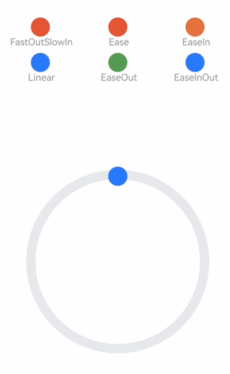

# Traditional Curves

Traditional curves are based on mathematical formulas, creating animation curves with shapes that align with developers' expectations. Represented by cubic Bézier curves, these curves can be adjusted by modifying their control points to achieve effects like ease-in and ease-out. For the same traditional curve, since it lacks physical meaning, its shape remains unchanged regardless of user interactions, resulting in a lack of the natural and dynamic feel of physical animations. It is recommended to prioritize using physical curves for animations and reserve traditional curves for rare, necessary scenarios as supplementary options.

ArkUI provides traditional curve interfaces such as Bézier curves and step curves. Developers can refer to [Interpolation Calculation](../../../API_Reference/source_en/arkui-cj/cj-apis-curves.md) for details.

Examples and effects of traditional curves are as follows:

<!--run-->

```cangjie
package ohos_app_cangjie_entry

import kit.ArkUI.*
import ohos.arkui.state_macro_manage.*

class MyCurve {
    let title: String
    let curve: Curve
    let color: ResourceColor

    public init(title: String, curve: Curve, color: ResourceColor) {
        this.title = title
        this.curve = curve
        this.color = color
    }
}

let myCurves: Array<MyCurve> = [
    MyCurve(' FastOutSlowIn', Curve.FastOutSlowIn, 0xD94838),
    MyCurve(' Ease', Curve.Ease, 0xD94838),
    MyCurve(' EaseIn', Curve.EaseIn, 0xDB6B42),
    MyCurve(' Linear', Curve.Linear, 0x317AF7),
    MyCurve(' EaseOut', Curve.EaseOut, 0x5BA854),
    MyCurve(' EaseInOut', Curve.EaseInOut, 0x317AF7)
]

@Entry
@Component
class EntryView {
    @State var dRotate: Float32 = 0.0

    func build() {
        Column() {
            Grid() {
                ForEach(myCurves,itemGeneratorFunc: {
                        item: MyCurve, _: Int64 =>
                        GridItem() {
                            Column() {
                                Row()
                                    .width(30)
                                    .height(30)
                                    .borderRadius(15)
                                    .backgroundColor(item.color)
                                Text(item.title)
                                    .fontSize(15)
                                    .fontColor(0x909399)
                            }.width(100.percent)
                        }
                    })
            }
            .columnsTemplate('1fr 1fr 1fr')
            .rowsTemplate('1fr 1fr 1fr 1fr 1fr')
            .padding(10)
            .width(100.percent)
            .height(300)
            .margin(top: 50)

            Stack() {
                Row()
                    .width(290)
                    .height(290)
                    .border(width: 15, color: 0xE6E8EB, radius: 145)

                ForEach(myCurves, itemGeneratorFunc: { item: MyCurve, idx: Int64 =>
                        Column() {
                            Row()
                                .width(30)
                                .height(30)
                                .borderRadius(15)
                                .backgroundColor(item.color)
                        }
                        .width(20)
                        .height(300)
                        .animationStart(AnimateParam(duration: 2000, curve: item.curve, delay: 100, iterations: -1))
                        .rotate(x: this.dRotate)
                        .animationEnd()
                    }
                )
            }
            .width(100.percent)
            .height(200)
            .onClick({evt => this.dRotate = 360.0})
        }
        .width(100.percent)
    }
}
```

