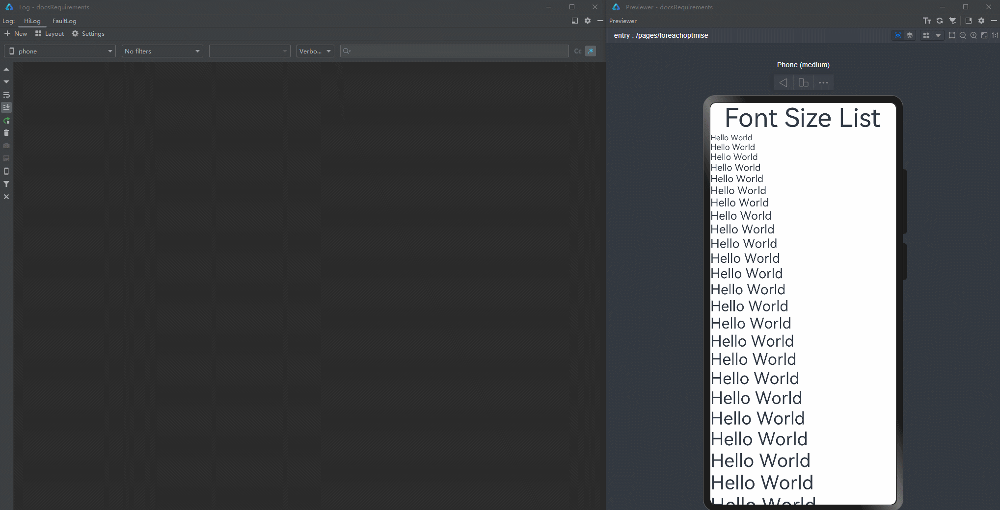

# Development Guide for Proper Use of State Management

Due to unfamiliarity with current state management features, many developers encounter issues such as UI not refreshing or poor refresh performance when using state management for development. This guide will analyze five typical scenarios from two perspectives, providing corresponding correct and incorrect examples to help developers learn how to properly utilize state management in development.

## Proper Use of Properties

## Combining Simple Property Arrays into Object Arrays

During development, we often need to set the same property for multiple components, such as text content for Text components, or style information like component width and height. Storing these properties in an array and using them with ForEach is a simple and convenient approach.

### Splitting Complex Large Objects into Collections of Smaller Objects

In development, we sometimes define large objects containing numerous style-related properties and pass these objects between parent and child components, binding their properties to components.

### Using @Observed Decorated or State Variable Declared Class Objects to Bind Components

During development, there are scenarios requiring "data reset" - assigning a newly created object to an existing state variable to achieve data refresh. If the type of the newly created object is not carefully considered, UI refresh issues may occur.

## Proper Use of ForEach/LazyForEach

### Minimizing UI Refresh Through LazyForEach's Rebuild Mechanism

### Using ObservedArrayList in ForEach

Object arrays are frequently combined with ForEach in development, but improper implementation can lead to UI refresh failures.

<!-- run -->

```cangjie
package ohos_app_cangjie_entry

import kit.ArkUI.*
import ohos.arkui.state_macro_manage.*
import std.collection.ArrayList
import kit.PerformanceAnalysisKit.Hilog

@Observed
class TextStyles{
    @Publish
    var fontSize: Int64
}

@Entry
@Component
class EntryView {

    @State
    var styleList: ArrayList<TextStyles> = ArrayList<TextStyles>([])

    public override func aboutToAppear(){
        for(i in 1..=35){
            this.styleList.add(TextStyles(fontSize: i))
        }
    }

    func build() {
        Column {
            Text("Font Size List")
                .fontSize(50)
                .onClick{
                    evt =>
                    for(i in 0..this.styleList.size){
                        this.styleList[i].fontSize++
                    }
                    Hilog.info(0, "AppLogCj", "change font size")
                }
            List(){
                ForEach(this.styleList ,{
                        item: TextStyles, _:Int64 =>
                        ListItem(){
                            Text("Hello World")
                                .fontSize(item.fontSize)
                        }
                })
            }
        }
    }
}
```


Since the items generated in ForEach are constants, UI refresh cannot be observed when modifying item content through clicks, despite logs showing the values have changed (as evidenced by the "change font size" log output). Therefore, ObservedArrayList should be used in conjunction with @Publish decorated custom class properties to achieve observation capability.

<!-- run -->

```cangjie
package ohos_app_cangjie_entry

import kit.ArkUI.*
import ohos.arkui.state_macro_manage.*
import std.collection.ArrayList
import kit.PerformanceAnalysisKit.Hilog

@Observed
class TextStyles{
    @Publish
    var fontSize: Int64
}

@Entry
@Component
class EntryView {

    @State
    var styleList: ObservedArrayList<TextStyles> = ObservedArrayList<TextStyles>([])

    public override func aboutToAppear(){
        for(i in 1..=35){
            this.styleList.append(TextStyles(fontSize: i))
        }
    }

    func build() {
        Column {
            Text("Font Size List")
                .fontSize(50)
                .onClick{
                    evt =>
                    for(i in 0..this.styleList.size){
                        this.styleList[i].fontSize++
                    }
                    Hilog.info(0,"AppLog: info","change font size")
                }
            List(){
                ForEach(this.styleList ,{
                        item: TextStyles, _:Int64 =>
                        ListItem(){
                            Text("Hello World")
                                .fontSize(item.fontSize)
                        }
                })
            }
        }
    }
}
```



Using @Publish decorated custom class properties gives the textStyles variable within Text components observation capability. When modifying values in styleList, the system observes changes to each textStyles item's fontSize value, thereby triggering UI refresh.

This represents a practical approach to implementing refresh functionality using state management.