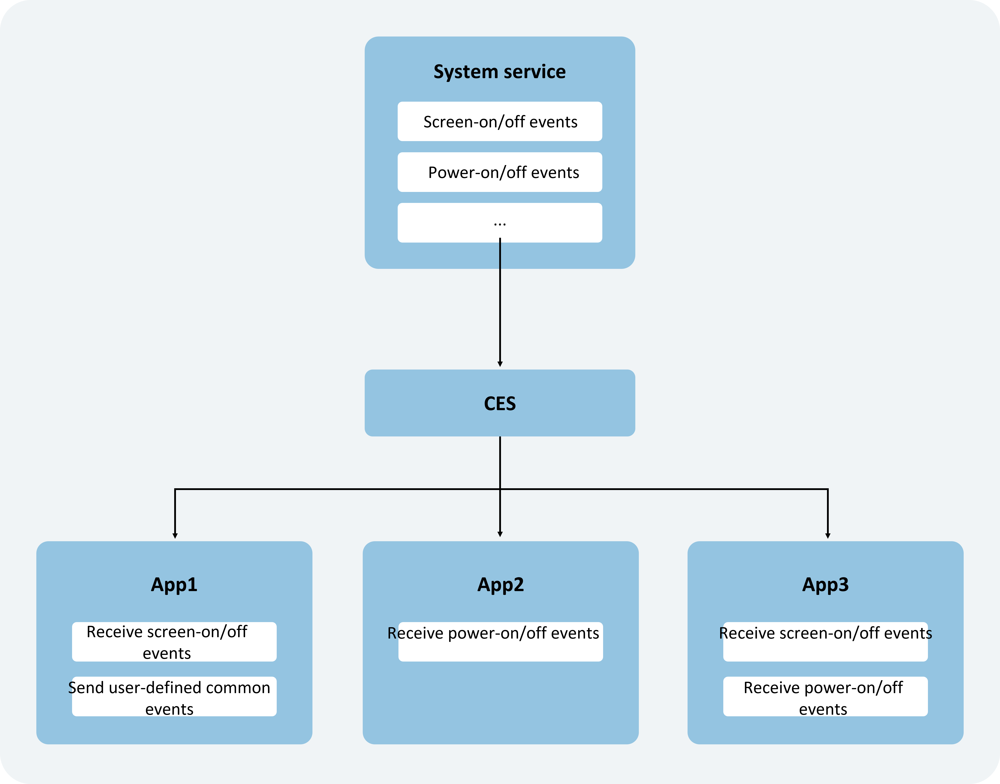

# Introduction to Common Events

CES (Common Event Service) provides applications with the capability to subscribe to, publish, and unsubscribe from common events.

## Classification of Common Events

From a system perspective, common events can be categorized into: system common events and custom common events.

- **System Common Events**: Common events defined internally by CES. Currently, only system applications and system services can publish these events, such as HAP installation, update, and uninstallation events. For the list of currently supported system common events, refer to [System Common Event List](../../../../API_Reference/source_en/apis/BasicServicesKit/cj-apis-common_event_manager.md#struct-support).
- **Custom Common Events**: Events defined by applications, which can be used to implement cross-process event communication.

Common events can also be classified by their delivery method: unordered common events, ordered common events, and sticky common events.

- **Unordered Common Events**: When forwarding these events, CES does not consider whether subscribers have received the event and does not guarantee that the order in which subscribers receive the event matches their subscription order.
- **Ordered Common Events**: When forwarding these events, CES prioritizes sending the event to subscribers with higher priority levels based on their set priority. It waits for the higher-priority subscribers to successfully receive the event before sending it to lower-priority subscribers. If multiple subscribers have the same priority, they will receive the event randomly.
- **Sticky Common Events**: These allow subscribers to receive events that were sent before they subscribed. Unlike regular common events, which can only be received if sent after subscription, sticky events can be sent before subscription and also support the traditional send-after-subscribe model. Only system applications or system services can send sticky events. Once sent, sticky events persist in the system. The sender must have the `ohos.permission.COMMONEVENT_STICKY` permission. For configuration details, refer to [Declaring Permissions](../../security/AccessToken/cj-declare-permissions.md).

## Operation Mechanism

Each application can subscribe to common events as needed. Upon successful subscription, the system will deliver the common events to the corresponding application when they are published. These events may originate from the system, other applications, or the application itself.

**Figure 1** Common Event Diagram

## Security Considerations

- **Common Event Publishers**: Without restrictions, any application can subscribe to common events and read the information they contain. Therefore, sensitive information should not be included in common events. The following methods can be used to limit the scope of event recipients:
    - Use the `subscriberPermissions` parameter in [CommonEventPublishData](../../../../API_Reference/source_en/apis/BasicServicesKit/cj-apis-common_event_manager.md#struct-commoneventpublishdata) to specify the permissions required by subscribers.
    - Use the `bundleName` parameter in [CommonEventPublishData](../../../../API_Reference/source_en/apis/BasicServicesKit/cj-apis-common_event_manager.md#struct-commoneventpublishdata) to specify the package names of the subscribers.
- **Common Event Subscribers**: After subscribing to custom common events, any application can potentially send malicious events to the subscriber. The following methods can be used to limit the scope of event publishers:
    - Use the `publisherPermission` parameter in [CommonEventSubscribeInfo](../../../../API_Reference/source_en/apis/BasicServicesKit/cj-apis-common_event_manager.md#class-commoneventsubscribeinfo) to specify the permissions required by publishers.
    - Use the `publisherBundleName` parameter in [CommonEventSubscribeInfo](../../../../API_Reference/source_en/apis/BasicServicesKit/cj-apis-common_event_manager.md#class-commoneventsubscribeinfo) to specify the package names of the publishers.
- Custom common event names should be globally unique to avoid conflicts with other common events.