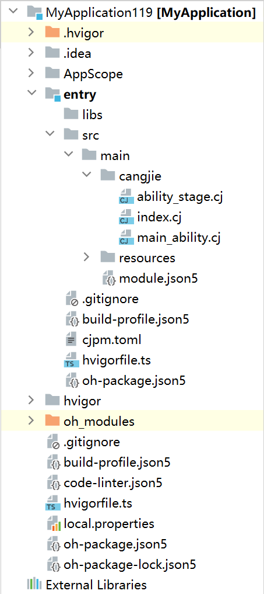

# Stage Model Application Package Structure

To provide developers with a clearer understanding of the different forms of application packages at various stages, this document introduces the application structures during the development phase, compilation phase, and release phase.

## Development Phase Package Structure

Create a project in DevEco Studio and attempt to create multiple Modules of different types. By comparing the actual project directory with the content in this section, you can better understand the application structure during the development phase.

**Figure 1** Schematic Diagram of Project Structure (Subject to Actual Project)

> **Note:**
>
> - The `AppScope` directory is automatically generated by DevEco Studio. Changing its name may cause configuration files and resources in this directory to fail to load, leading to compilation errors. Therefore, do not modify the name of this directory.
> - Module directory names can be automatically generated by DevEco Studio (e.g., `entry`, `library`) or customized. For clarity, the following table uses `Module_name` as a unified representation.

The main file types and their purposes in the project structure are as follows:

| File Type   | Description |
|------------|-------------|
| Configuration Files | Include application-level and Module-level configuration information:  - **AppScope > app.json5**: [app.json5 Configuration File](app-configuration-file.md), used to declare global configuration information such as the application bundle name, application name, application icon, and version number.  - **Module_name > src > main > module.json5**: [module.json5 Configuration File](module-configuration-file.md), used to declare Module basics, supported device types, component information, and required permissions. |
| Cangjie Source Files | **Module_name > src > main > cangjie**: Stores the Cangjie source files (.cj files) for the Module. |
| Resource Files | Include application-level and Module-level resource files, supporting graphics, multimedia, strings, layout files, etc. For details, see [Resource Classification and Access](../start/ide-resource-categories-and-access.md).  - **AppScope > resources**: Stores resource files required by the application.  - **Module_name > src > main > resources**: Stores resource files required by the Module. |
| Other Configuration Files | Used for compilation and building, including build configuration files, compilation task scripts, and dependency information for shared packages.  - **build-profile.json5**: Project-level or Module-level build configuration file, including [application signing](https://developer.huawei.com/consumer/cn/doc/harmonyos-guides/ide-signing) and product configurations.  - **hvigorfile.ts**: Project-level or Module-level compilation task script. Developers can customize the compilation tool version and control build behavior parameters.  - **[oh-package.json5](https://developer.huawei.com/consumer/cn/doc/harmonyos-guides/ide-oh-package-json5)**: Stores dependency library information, including third-party libraries and shared packages. |

## Compilation Phase Package Structure

Different types of Modules generate corresponding HAP, HAR, and other files after compilation. The relationship between the development phase and compilation phase views is as follows:

From the development phase to the compilation phase, Module files undergo the following changes:

- **libs directory**: Cangjie source files are compiled into .so files.
- **resources directory**: Resource files from the `AppScope` directory are merged into the Module's resource directory. If duplicate files exist, only the `AppScope` directory's resources are retained after compilation.
- **Module configuration files**: Fields from the `app.json5` file in the `AppScope` directory are merged into the `module.json5` file of the Module, generating the final `module.json` file in the HAP after compilation.

> **Note:**
>
> When compiling HAPs, their dependent HARs are directly compiled into the HAP.

## Release Phase Package Structure

Each application must contain at least one .hap file. All .hap files in an application together form a **Bundle**, and its corresponding `bundleName` serves as the unique identifier for the application (see the `bundleName` tag in the [app.json5 Configuration File](app-configuration-file.md)).

When publishing an application to the app store, the Bundle must be packaged into a .app file for release. This .app file is called an **App Pack** (Application Package). Simultaneously, DevEco Studio automatically generates a **pack.info** file. The **pack.info** file describes the attributes of each HAP in the App Pack, including the APP's `bundleName` and `versionCode`, as well as the Module's `name`, `type`, and `abilities`.

> **Note:**
>
> - The App Pack is the basic unit for publishing to the app store but cannot be directly installed or run on devices.
> - During [application signing](https://developer.huawei.com/consumer/cn/doc/harmonyos-guides/ide-signing), cloud distribution, or device-side installation, signing, distribution, and installation are performed at the HAP level.

**Figure 3** Compilation, Release, and Deployment Flowchart

