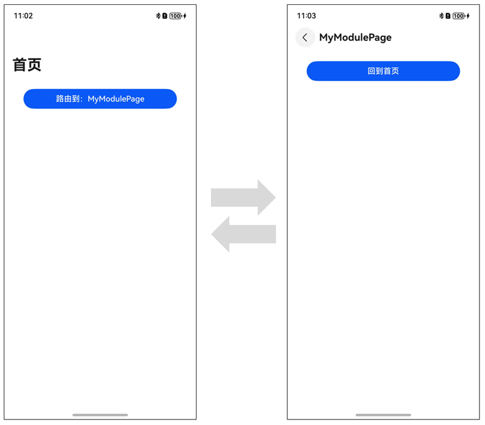
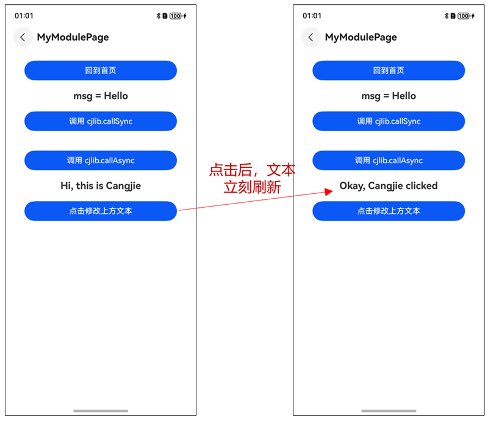
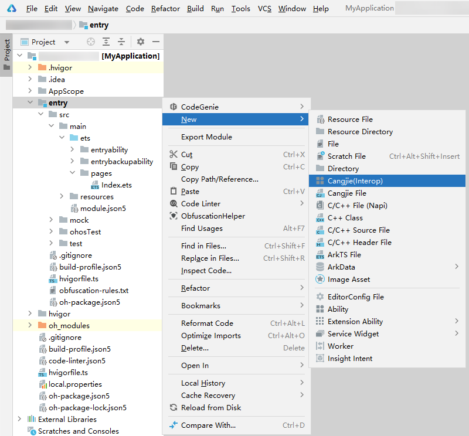

# Incrementally Using Cangjie in an Existing ArkTS Project

> **Note:**
>
> To ensure operational effectiveness, this document uses **DevEco Studio 5.0.2 Release** and **DevEco Studio-Cangjie Plugin 5.0.7.100 Beta1** as examples. Click [here](https://developer.huawei.com/consumer/cn/download/) to obtain the latest version download links.

This document is intended for OpenHarmony application developers with basic knowledge of the Cangjie language, ArkTS language, and UI frameworks. Based on a simple, purely ArkTS-developed application that supports page navigation/return functionality, this guide introduces Cangjie to develop incremental features (e.g., Cangjie providing a synchronous interface for ArkTS calls, an asynchronous interface for ArkTS calls, and embedding a Cangjie component in the original ArkTS page). This helps developers quickly understand how to introduce Cangjie into existing ArkTS projects and familiarize themselves with the hybrid application development process.

Assume the initial runtime effect of the original ArkTS application is as follows (with two pages supporting navigation/return):



Now, introducing Cangjie aims to achieve the following two effects:

1. In the ArkTS page, add two Button components. When clicked, they trigger calls to Cangjie's synchronous and asynchronous interfaces, respectively, updating the Text content, as shown below.

   

2. Embed a Cangjie component in the ArkTS page. The Cangjie component provides a Button that updates the Text content when clicked, as shown below.

   

## Initial State of the Original ArkTS Project

Developers can refer to the example to create the original ArkTS project. The directory structure of the example ArkTS application is as follows:

```text
Project_name
├── .hvigor
├── .idea
├── AppScope
├── entry
├── hvigor
│    └── hvigor-config.json5
├── my_module
├── oh_modules
├── build-profile.json5
├── code-linter.json5
├── hvigorfile.ts
├── local.properties
├── oh-package.json5
└── oh-package-lock.json5
```

Where:

- **entry** is an ArkTS module created using the **Empty Ability** project template, compiled into a HAP package.
- **my_module** is an ArkTS static library module created using the **Static Library** project template, compiled into a HAR package and depended upon by the **entry** module.

Both **entry** and **my_module** modules contain a page, with navigation between them via the Navigation component.

1. The directory structure of the **entry** module is as follows:

   ```text
   entry
   ├── build
   ├── oh_modules
   ├── src
   │    ├── main
   │    │    ├── ets
   │    │    │    ├── entryability
   │    │    │    ├── entrybackupability
   │    │    │    └── pages
   │    │    │         └── Index.ets  
   │    │    ├── resources
   │    │    └── module.json5
   │    ├── mock
   │    ├── ohosTest
   │    └── test
   ├── build-profile.json5
   ├── hvigorfile.ts
   ├── obfuscation-rules.txt
   ├── oh-package.json5
   └── oh-package-lock.json5
   ```

    - Example of the **entry > src > main > ets > pages > Index.ets** file:

   ```typescript
   // Index.ets
   @Entry
   @Component
   struct Index {
     pathStack: NavPathStack = new NavPathStack()
     @State message: string = 'Hello World';

     build() {
       Navigation(this.pathStack) {
         Column() {
           Button('Navigate to: MyModulePage')
             .width('80%')
             .height(40)
             .margin(20)
             .onClick(() => {
               this.pathStack.pushPathByName('MyModulePage', null)
             })
         }
         .width('100%')
         .height('100%')
       }
       .title("Home")
       .mode(NavigationMode.Stack)
     }
   }
   ```

    - In the module's **oh-package.json5** file, add my_module as a dependency:

   ```json
   "dependencies": {
     "my_module": "file:../my_module"
   }
   ```

2. The directory structure of the **my_module** module is as follows:

   ```text
   entry
   ├── build
   ├── src
   │    ├── main
   │    │    ├── ets
   │    │    │    └── pages
   │    │    │         └── MyModulePage.ets  
   │    │    ├── resources
   │    │    │    └── base
   │    │    │         ├── element
   │    │    │         └── profile
   │    │    │              └──router_map.json
   │    │    └── module.json5
   │    ├── ohosTest
   │    └── test
   ├── build-profile.json5
   ├── BuildProfile.ets
   ├── consumer-rules.txt
   ├── hvigorfile.ts
   ├── Index.ets
   ├── obfuscation-rules.txt
   └── oh-package.json5
   ```

    - Example of the **my_module > src > main > ets > pages > MyModulePage.ets** file:

   ```typescript
   // MyModulePage.ets

   @Builder
   export function MyModulePageBuilder() {
     MyModulePage()
   }

   @Component
   export struct MyModulePage {
     pathStack: NavPathStack = new NavPathStack()

     build() {
       NavDestination() {
         Column() {
           Button('Return to Home')
             .type(ButtonType.Capsule)
             .width('80%')
             .height(40)
             .margin(20)
             .onClick(() => {
               this.pathStack.clear()
             })
         }
         .width('100%')
         .height('100%')
       }
       .title('MyModulePage')
       .onReady((context: NavDestinationContext) => {
         this.pathStack = context.pathStack
       })
     }
   }
   ```

    - The **my_module > src > main > resources > base > profile > route_map.json** file must configure subpage routing information, as shown below:

   ```json
   // route_map.json
   {
     "routerMap": [
       {
         "name": "MyModulePage",
         "pageSourceFile": "src/main/ets/pages/MyModulePage.ets",
         "buildFunction": "MyModulePageBuilder",
         "data": {
           "description": "this is MyModulePage"
         }
       }
     ]
   }
   ```

    - In the **my_module > src > main > module.json5** configuration file, the module tag defines the routerMap field, pointing to the module's routing table configuration file route_map.json. Example:

   ```json5
   // module.json5
   "routerMap": "$profile:route_map"
   ```

   > **Note:**
   >
   > If the module tag originally contains the line `"pages": "$profile:main_pages"`, it must be deleted. Otherwise, after release, routing navigation may fail, resulting in a blank screen.

## Incrementally Using Cangjie in an ArkTS Module

> **Note:**
>
> Currently, Cangjie modules only support OpenHarmony static library modules, i.e., HAR static shared packages.

Cangjie supports enabling development directly in ArkTS HAP or HAR modules with SDK ranges API 12~15 and device types phone, tablet, and 2in1.  
If the current module supports device types other than default, phone, tablet, and 2in1, delete the unsupported device types from the deviceTypes field in module.json5 and modify it to the supported format (e.g., delete the wearable device type as shown below) before incrementally using Cangjie.


Using the original ArkTS application as an example, this section explains how to enable Cangjie development in an ArkTS module (i.e., **my_module**).

### Right-Click Menu to Enable Cangjie-ArkTS Hybrid Module

1. As shown below, in the **Project** window, right-click the **my_module** directory and select **New -> Cangjie(Interop)**.



After the project automatically synchronizes, the directory structure is as follows:

```text
├── hvigor
│    ├── cangjie-build-support-x.y.z.tgz
│    └── hvigor-config.json5
└── my_module
    ├── build
    ├── libs
    ├── oh_modules
    ├── src
    │    ├── main
    │    │    ├── cangjie
    │    │    │    ├── types
    │    │    │    │    └── libohos_app_cangjie_entry
    │    │    │    │          ├── Index.d.ts
    │    │    │    │          └── oh-package.json5
    │    │    │    └── index.cj
    │    │    ├── ets
    │    │    │    └── pages
    │    │    │         └── MyModulePage.ets
    │    │    ├── resources
    │    │    │    └── base
    │    │    │         ├── element
    │    │    │         └── profile
    │    │    │              └── route_map.json
    │    │    └── module.json5
    │    ├── ohosTest
    │    └── test
    ├── build-profile.json5
    ├── consumer-rules.txt
    ├── hvigorfile.ts
    ├── Index.ets
    ├── obfuscation-rules.txt
    ├── oh-package.json5
    └── oh-package-lock.json5
```

Here, **my_module** has become a Cangjie-ArkTS hybrid module.

> **Note:**
>
> When enabling Cangjie development in an ArkTS project for the first time, a "cangjie-build-support-x.y.z.tgz" plugin package is automatically created in the project's "hvigor" directory to support Cangjie-related compilation.

### Cross-Module Calls to Cangjie Functions in a Pure ArkTS Project Within the Same Project

1. Develop business logic on the Cangjie side and expose interfaces to ArkTS.

   In the **Project** window, navigate to **my_module > src > main > cangjie**, open the **index.cj** file, and write the following code:

   ```cangjie
   // index.cj
   package ohos_app_cangjie_my_module // Note: The package name must match the [package] name field in cjpm.toml.

   import ohos.base.*
   import ohos.ark_interop.*
   import ohos.ark_interop_macro.*
   import std.core.sleep
   import std.core.Duration

   // Synchronous interface: Executes synchronously on the main thread.
   @Interop[ArkTS]
   public func callSync(msg: String): String {
       // do something
       return "callSync: ${msg}"
   }

   // Asynchronous interface: Executes asynchronously on a Cangjie lightweight thread.
   @Interop[ArkTS, Async]
   public func callAsync(msg: String): String {
       // Simulate time-consuming operations using the sleep function.
       sleep(Duration.second * 5)
       return "callAsync: ${msg}"
   }```

2. Automatically generate Cangjie-ArkTS interoperation interface declarations.

   Open the aforementioned **index.cj** file, right-click in the file editor and select **Generate... > Cangjie-ArkTS Interop API**. This will automatically generate the .d.ts interface declarations exposed by Cangjie to ArkTS in the **Index.d.ts** file under the directory **entry > src > main > cangjie > types > libohos_app_cangjie_entry**. The directory structure is as follows:

   ```text
   my_module
   ├── build
   ├── libs
   ├── oh_modules
   └── src
        └── main
             ├── cangjie
             │    ├── ark_interop_api
             │    ├── types
             │    │    └── libohos_app_cangjie_entry
             │    │         │── Index.d.ts
             │    │         └── oh-package.json5
             │    └── index.cj
             └── ets
   ```

   The interface declarations are as follows:

   ```typescript
   // Index.d.ts
   export declare function callSync(msg: string): string
   export declare function callAsync(msg: string): Promise<string>
   ```

   > **Note:**
   >
   > After creating the Cangjie Hybrid Ability hybrid project, the **libohos_app_cangjie_my_module** library will be automatically added to the **dependencies** field in the **my_module > oh-package.json5** file as a dependency.

3. After the .d.ts interface declarations exposed by Cangjie to ArkTS are generated, if you need to import Cangjie interfaces in a pure ArkTS module, you must first modify the **hvigorfile.ts** file of the pure ArkTS module. For example, in this case, you need to modify **entry > hvigorfile.ts**, changing the first line `import { hapTasks } from '@ohos/hvigor-ohos-plugin'` to `import { hapTasks } from '@ohos/cangjie-build-support'`.

4. After modifying the **hvigorfile.ts** file of the pure ArkTS module, you can directly import the dependencies of the interfaces declared in the .d.ts file in the ArkTS file.

   Modify the **my_module > src > main > ets > pages > MyModulePage.ets** file. Example code is as follows:

   ```typescript
   // MyModulePage.ets
   // Import the callSync and callAsync interfaces from libohos_app_cangjie_entry.so
   import cjlib from 'libohos_app_cangjie_my_module.so'

   @Builder
   export function MyModulePageBuilder() {
     MyModulePage()
   }

   @Component
   export struct MyModulePage {
     pathStack: NavPathStack = new NavPathStack()
     @State msg: string = "Hello"

     build() {
       NavDestination() {
         Column() {
           Button('Return to Home')
             .type(ButtonType.Capsule)
             .width('80%')
             .height(40)
             .margin(20)
             .onClick(() => {
               this.pathStack.clear()
             })

           // Add a text component to display changes in this.msg
           Text(`msg = ${this.msg}`)
             .fontSize(20)
             .fontWeight(FontWeight.Bold)

           // Add two buttons to trigger calls
           Button('Call cjlib.callSync')
             .width('80%')
             .height(40)
             .margin(20)
             .onClick(() => {
               // Call the synchronous interface
               this.msg = cjlib.callSync('Hello')
             })
           Button('Call cjlib.callAsync')
             .width('80%')
             .height(40)
             .margin(20)
             .onClick(() => {
               // Call the asynchronous interface
               cjlib.callAsync('Hello')
                 .then((res) => {
                   this.msg = res
                 })
             })
         }
         .width('100%')
         .height('100%')
       }
       .title('MyModulePage')
       .onReady((context: NavDestinationContext) => {
         this.pathStack = context.pathStack
       })
     }
   }
   ```

5. Run the application on a real device or emulator.

   After the application is successfully compiled and installed, navigate to the **MyModulePage** and click the buttons to trigger function calls. The effect is as follows:

   > **Note:**
   >
   > For specific steps on running the application on a real device or emulator, refer to [Building Your First Cangjie Application](./cj-quick-start-first-cangjie-hybrid-app.md#running-the-application-on-a-real-device-or-emulator).

### Embedding Cangjie Components in ArkTS Pages Within the Same Module

1. Create a Cangjie page.

   In the **Project** window, open **my_module > src > main**, right-click the **cangjie** folder, select **New -> Cangjie HybridComponent File**, name the **Component name** as **CangjiePage**, check the **Cangjie** option, and click **OK**. The directory structure will be as follows:

   ```text
   my_module
   ├── build
   ├── libs
   ├── oh_modules
   └── src
        ├── main
        │    ├── cangjie
        │    │    ├── ark_interop_api
        │    │    ├── types
        │    │    ├── cangjie_page.cj
        │    │    └── index.cj
        │    ├── ets
        │    │    └── pages
        │    │         └── MyModulePage.ets
        │    ├── resources
        │    └── module.json5
        ├── ohosTest
        └── test
   ```

   - Add Text components, Button components, etc., to the Cangjie page and set their styles. The **cangjie_page.cj** file example is as follows:

   ```cangjie
   // cangjie_page.cj
   package ohos_app_cangjie_my_module

   import ohos.base.*
   import ohos.component.*
   import ohos.state_macro_manage.*
   import ohos.state_manage.*
   import ohos.hybrid_base.*

   @HybridComponentEntry
   @Component
   class CangjiePage {
       @State
       var msg: String = "Hi, this is Cangjie"

       public func build() {
           Column {
               Text(msg)
                   .fontSize(20)
                   .fontWeight(FontWeight.Bold)
               Button("Click to Modify the Text Above")
                   .shape(ShapeType.Capsule)
                   .width(80.percent)
                   .height(40)
                   .margin(20)
                   .onClick {
                       msg = "Okay, Cangjie clicked"
                   }
           }
           .width(100.percent)
           .height(100.percent)
       }
   }
   ```

2. Embed the Cangjie page in the ArkTS side.

   In the **Project** window, open **my_module > src > main > pages**, and modify the **MyModulePage.ets** file. The example is as follows:

   ```typescript
   // MyModulePage.ets
   // Embed the Cangjie page in the ArkTS page
   import { CJHybridComponentV2 } from '@cangjie/cjhybridview'
   // Import the callSync and callAsync interfaces from libohos_app_cangjie_entry.so
   import cjlib from 'libohos_app_cangjie_my_module.so'

   @Builder
   export function MyModulePageBuilder() {
     MyModulePage()
   }

   @Component
   export struct MyModulePage {
     pathStack: NavPathStack = new NavPathStack()
     @State msg: string = "Hello"

     build() {
       NavDestination() {
         Column() {
           Button('Return to Home')
             .type(ButtonType.Capsule)
             .width('80%')
             .height(40)
             .margin(20)
             .onClick(() => {
               this.pathStack.clear()
             })

             // Add a text component to display changes in this.msg
           Text(`msg = ${this.msg}`)
             .fontSize(20)
             .fontWeight(FontWeight.Bold)

           // Add two buttons to trigger calls
           Button('Call cjlib.callSync')
             .width('80%')
             .height(40)
             .margin(20)
             .onClick(() => {
               // Call the synchronous interface
               this.msg = cjlib.callSync('Hello')
             })
           Button('Call cjlib.callAsync')
             .width('80%')
             .height(40)
             .margin(20)
             .onClick(() => {
               // Call the asynchronous interface
               cjlib.callAsync('Hello')
                 .then((res) => {
                   this.msg = res
                 })
             })
             // Embed the Cangjie page using CJHybridComponent
           CJHybridComponentV2({
             library: 'ohos_app_cangjie_my_module', // The package name where the Cangjie page resides
             component: 'CangjiePage'               // The class name corresponding to the Cangjie page
           })
         }
         .width('100%')
         .height('100%')
       }
       .title('MyModulePage')
       .onReady((context: NavDestinationContext) => {
         this.pathStack = context.pathStack
       })
     }
   }
   ```

3. Run the application on a real device or emulator.

   After the application is successfully compiled and installed, navigate to the **MyModulePage** and click the Cangjie Button to trigger the Cangjie Text to update. The effect is as follows:

   > **Note:**
   >
   > For specific steps on running the application on a real device or emulator, refer to [Building Your First Cangjie Application](./cj-quick-start-first-cangjie-hybrid-app.md#running-the-application-on-a-real-device-or-emulator).

Congratulations! You have successfully used Cangjie to develop a business module in an ArkTS application.