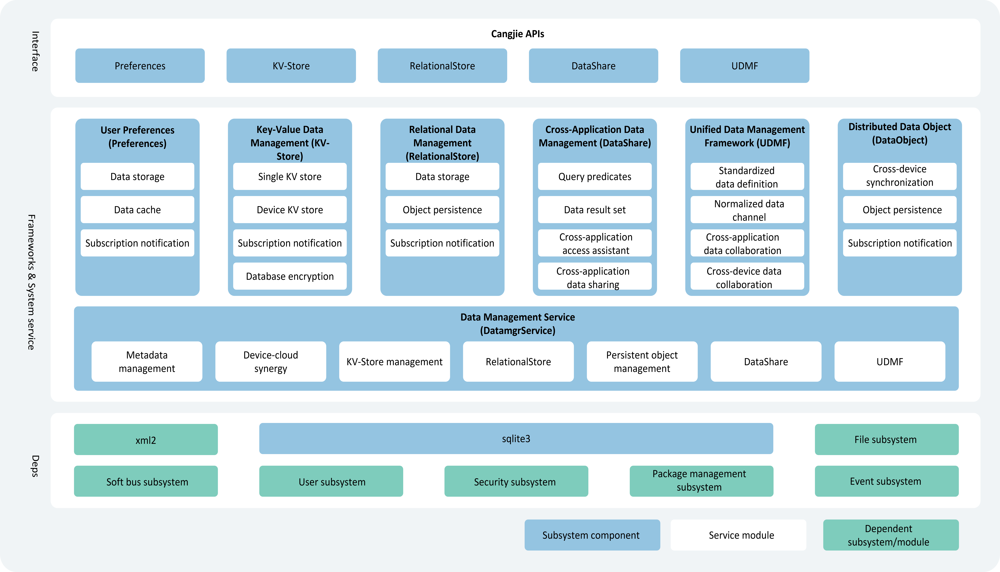

# Introduction to ArkData

## Features

ArkData (Ark Data Management) provides developers with capabilities for data storage, data management, and data synchronization. For example, contact application data can be stored in a database, offering management mechanisms for security, reliability, and shared access. It also supports synchronizing contact information with smartwatches.

- **Standardized Data Definition**: Provides a unified data type standard for cross-application and cross-device scenarios in OpenHarmony, including standardized data types and data structures.
- **Data Storage**: Offers general data persistence capabilities, categorized into user preferences, key-value databases, and relational databases based on data characteristics.
- **Data Management**: Delivers efficient data management capabilities, including permission management, data backup and recovery, and a data sharing framework.
- **Data Synchronization**: Enables cross-device data synchronization. For instance, distributed objects support memory object sharing across devices, while distributed databases facilitate cross-device database access.

Databases created by applications are stored in the application sandbox. When an application is uninstalled, its database is automatically deleted.

## Operation Mechanism

The data management module includes user preferences, key-value data management, relational data management, distributed data objects, cross-application data management, and a unified data management framework. The Interface layer provides standardized Cangjie APIs, defining component interface descriptions for developer reference. The Frameworks & System Service layer implements component functionalities for data storage and synchronization, along with dependencies on SQLite and other subsystems.

  **Figure 1** Data Management Architecture Diagram

 <!-- ToBeReviewd -->

- **Preferences**: Provides lightweight persistence for configuration data and supports notifications for data changes. It does not support distributed synchronization and is commonly used for storing application configurations and user preferences.
- **KV-Store**: Offers read/write operations, encryption, manual backup, and subscription notifications for key-value databases. When distributed capabilities are required, KV-Store sends synchronization requests to DatamgrService to complete cross-device data synchronization.
- **RelationalStore**: Supports CRUD operations, encryption, manual backup, and subscription notifications for relational databases. For distributed capabilities, RelationalStore sends synchronization requests to DatamgrService for cross-device synchronization.
- **DataShare**: Enables data providers (providers), data consumers (consumers), and cross-application data interactions on the same device, including CRUD operations and subscription notifications. DataShare is not bound to any specific database and can interface with relational or key-value databases. For C/C++ applications, developers can even encapsulate their own databases. In addition to the standard provider-consumer model, it supports silent data access, where data is accessed directly through DatamgrService without launching the provider (currently, only relational databases support silent access).
- **UDMF (Unified Data Management Framework)**: Establishes standards for cross-application and cross-device data interactions, defining a data language to improve efficiency. It provides secure, standardized data pathways with varying access permissions and lifecycle management policies for efficient data sharing across applications and devices.
- **DatamgrService**: Facilitates synchronization and cross-application sharing for other components, including RelationalStore and KV-Store cross-device synchronization and DataShare silent access to provider data.