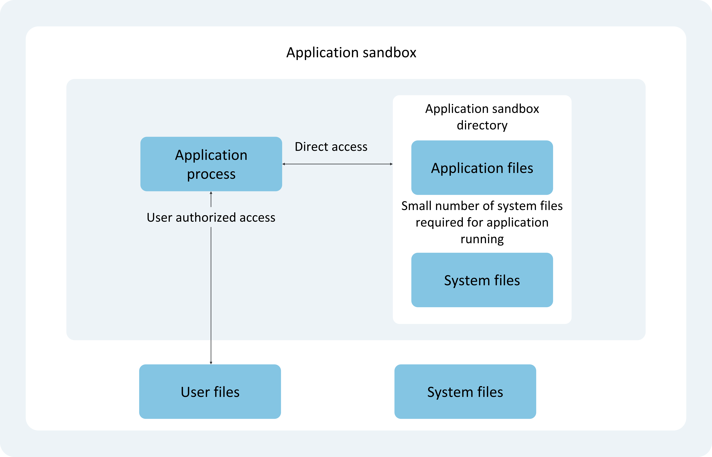
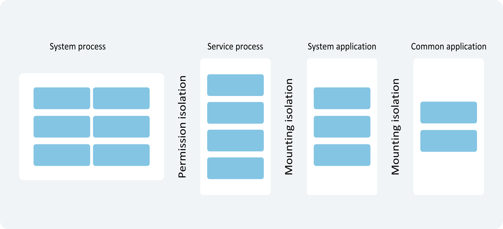

# Application Sandbox Directory

The application sandbox is an isolation mechanism designed for security protection, preventing data from being accessed through malicious path traversal. Under this sandbox protection mechanism, the directory scope visible to the application is referred to as the "Application Sandbox Directory."

- For each application, the system maps a dedicated "Application Sandbox Directory" in the internal storage space. It is a collection composed of the "[Application File Directory](#application-file-directory-and-application-file-path)" and a subset of system files (a small number of system files essential for application operation).

- The application sandbox restricts the scope of data visible to the application. Within the "Application Sandbox Directory," the application can only see its own application files and a limited number of system files (essential for its operation). Consequently, files belonging to this application are also invisible to other applications, thereby safeguarding the security of application files.

- Applications can save and manage their own files in the "Application File Directory"; system files and their directories are read-only to applications. If an application needs to access [user files](./cj-user-file-overview.md), it must do so through specific APIs and obtain corresponding user authorization.

The following diagram illustrates the file access scope and methods under the application sandbox.

## Application Sandbox Directory and Sandbox Path

Under the application sandbox protection mechanism, applications cannot determine the location or existence of data directories belonging to other applications or users outside their own application file directory. Additionally, the visible directory scope of all applications is isolated through permission restrictions and file path mounting, forming an independent path view that masks the actual physical paths:

- As shown below, from the perspective of a regular application (also known as a third-party application), not only is the range of visible directories and files limited, but the visible directory and file paths also differ from those seen by system processes or other processes. We refer to the path of a specific file or directory visible under the "Application Sandbox Directory" from the perspective of a regular application as the "Application Sandbox Path." <!--RP1-->
- The developer's hdc shell environment is equivalent to the system process perspective. Therefore, the "Application Sandbox Path" differs from the actual physical path seen when debugging with the hdc tool. For specific mappings, refer to [Correspondence Between Application Sandbox Path and Actual Physical Path](#correspondence-between-application-sandbox-path-and-actual-physical-path). <!--RP1End-->
- The actual physical path and sandbox path are not mapped one-to-one. The sandbox path is always fewer than the physical paths visible from the system process perspective. Some physical paths visible from the debugging process perspective have no corresponding paths under the application sandbox directory.

## Application File Directory and Application File Path

As mentioned earlier, the "Application Sandbox Directory" is divided into two categories: the application file directory and the system file directory.

The visible scope of the system file directory to applications is predefined by the OpenHarmony system, and developers need not concern themselves with it.

Here, we primarily introduce the application file directory, as shown in the diagram below. The path of a specific file or directory under the application file directory is referred to as the application file path. Each file path under the application file directory has distinct attributes and characteristics.

> **Note:**
>
> - Directly using path strings composed of directory names above the fourth level in the diagram is prohibited, as it may lead to compatibility issues in subsequent application versions due to changes in application file paths.
> - Application file paths, including but not limited to those highlighted in green in the diagram, should be obtained through Context properties. Refer to Context acquisition and the aforementioned application file path retrieval methods.

1. First-level directory `data/`: Represents the application file directory.

2. Second-level directory `storage/`: Represents the persistent file directory for the application.

3. Third-level directory `el1/~el5/`: Represents different file encryption types.

    EL1 (Encryption Level 1):
     - Provides basic security capabilities for all files on the device. Files protected by EL1 can be accessed without user authentication after the device boots. Unless necessary, this method is not recommended.
     - If ciphertext is directly stolen from the device storage medium, attackers cannot decrypt it offline.

    EL2 (Encryption Level 2):
     - Builds upon EL1 by adding file protection capabilities after the first authentication. After the device boots, files protected by EL2 can only be accessed after the user completes the first authentication. These files remain accessible as long as the device is not powered off. This method is recommended by default.
     - If the device is lost after shutdown, attackers cannot read files protected by EL2.

    EL3 (Encryption Level 3):
     - Similar in overall capability to EL4, but differs in that new files can be created while the screen is locked, though they cannot be read. Unless necessary, this method is not required.

    EL4 (Encryption Level 4):
     - Builds upon EL2 by adding file protection capabilities when the device screen is locked. Data protected by EL4 cannot be accessed while the screen is locked. Unless necessary, this method is not required.
     - If the device is stolen while the screen is locked, attackers cannot read files protected by EL4.

    EL5 (Encryption Level 5):
     - Builds upon EL2 by adding file protection capabilities when the device screen is locked. After the screen is locked, under certain conditions, data protected by EL5 cannot be accessed, but new files can still be created and read/written. Unless necessary, this method is not required.
     - By default, EL5-related directories are not generated. Access to E-class encrypted databases requires specific permissions. For details, refer to [Usage of E-Class Encrypted Databases](../database/cj-data-reliability-security-overview.md).

   > **Note:**
   >
   > Unless otherwise required, applications should store data in the el2 encrypted directory to maximize data security. However, for certain scenarios where application files need to be accessible before the user's first authentication (e.g., clocks, alarms, wallpapers), these files should be stored in the device-level encrypted area (el1).
   >
   > Developers can monitor the [COMMON_EVENT_USER_UNLOCKED](../../../API_Reference/source_zh_cn/apis/BasicServicesKit/cj-apis-common_event_manager.md#static-const-common_event_user_unlocked) event to detect when the user completes the first authentication.

4. Fourth- and fifth-level directories:
   The ApplicationContext can retrieve the application file paths for the `distributedfiles` directory or subdirectories under `base` such as `files`, `cache`, `preferences`, and `temp`. Application-wide information can be stored in these directories.

   The AbilityContext, AbilityStageContext, and ExtensionContext can retrieve HAP-level application file paths. HAP information can be stored in these directories. Files stored here will be deleted when the HAP is uninstalled and will not affect files in the App-level directory. During development, an application may contain one or more HAPs. For details, refer to [Stage Model Application Package Structure](../cj-start/basic-knowledge/application-package-structure-stage.md).

   The following table describes the application file paths and their lifecycles.

   | Directory Name     | Context Property Name | Type               | Description                                                                                                                                                                                                                                                                                                                                                                                                                          |
   | ------------------ | --------------------- | ------------------ | ------------------------------------------------------------------------------------------------------------------------------------------------------------------------------------------------------------------------------------------------------------------------------------------------------------------------------------------------------------------------------------------------------------------------------------- |
   | bundle             | bundleCodeDir         | Installation Path  | Directory where the HAP resource package of the App is installed after application installation; cleared upon application uninstallation. Do not concatenate paths to access resource files; use [Resource Management APIs](../../../API_Reference/source_zh_cn/apis/LocalizationKit/cj-apis-resource_manager.md) instead. Can store application code resources, including installed HAP resource packages, reusable library files, and plugin resources. This path can be used for dynamic loading. |
   | base               | NA                    | Local Device Path  | Directory for storing persistent data on the local device, with subdirectories including `files/`, `cache/`, `temp/`, and `haps/`; cleared upon application uninstallation.                                                                                                                                                                                                                                                             |
   | database           | databaseDir           | Database Path      | Directory for storing files operated by the distributed database service under el2 encryption; cleared upon application uninstallation. Only for storing private database data, primarily database files. This path is suitable only for distributed database-related file data.                                                                                                                                                     |
   | distributedfiles   | distributedFilesDir   | Distributed Path   | Directory for storing distributed files under el2 encryption. Files placed here can be directly accessed across devices in a distributed manner; cleared upon application uninstallation. Can store data for distributed scenarios, including multi-device shared files, multi-device backup files, and multi-device group collaboration files. This path makes applications more suitable for multi-device usage scenarios.         |
   | files              | filesDirectory        | General File Path  | Default path for storing long-term files in the device's internal storage; cleared upon application uninstallation. Can store any private application data, including persistent user files, images, media files, and logs. Data stored here remains private, secure, and persistently valid.                                                                                                                                      |
   | cache              | cacheDir              | Cache File Path    | Path for caching downloaded files or regeneratable cache files in the device's internal storage. Files in this directory are automatically cleared when the cache size exceeds the quota or system space reaches certain conditions. Users may also trigger cleanup via system space management apps. Applications should check file existence and decide whether to re-cache; cleared upon application uninstallation. Can store cache data, including offline data, image caches, database backups, and temporary files. Data here may be auto-cleared by the system, so avoid storing critical data. |
   | preferences        | preferencesDir        | Preferences Path   | Directory for storing configuration or preference data via database APIs in the device's internal storage; cleared upon application uninstallation. See [Data Persistence via User Preferences](../database/cj-data-persistence-by-preferences.md). Can store preference data, including application preference files and configuration files. This path is suitable only for small amounts of data.                                                                                                  |
   | temp               | tempDir               | Temporary File Path | Directory for files generated and needed only during application runtime in the device's internal storage; cleared after application exit. Can store temporary application data, including database caches, image caches, temporary log files, and downloaded installation packages. Data stored here can be deleted after use.                                                                                                                                                                  |

## Correspondence Between Application Sandbox Path and Actual Physical Path

When reading or writing files in the application sandbox path, the operations are mapped to the actual physical paths of application files. The correspondence between application sandbox paths and actual physical paths is shown in the table below.

Here, `<USERID>` represents the current user ID, starting from 100 and incrementing, and `<EXTENSIONPATH>` represents `moduleName-extensionName`.

| Application Sandbox Path          | Physical Path         |
| --------------------------------- | --------------------- |
| /data/storage/el1/bundle           | Application installation directory:  /data/app/el1/bundle/public/&lt;PACKAGENAME&gt; |
| /data/storage/el1/base             | Application el1-level encrypted data directory:  - Non-independent sandbox applications: /data/app/el1/&lt;USERID&gt;/base/&lt;PACKAGENAME&gt;  - Independent sandbox Extension applications: /data/app/el1/&lt;USERID&gt;/base/+extension-&lt;EXTENSIONPATH&gt;+&lt;PACKAGENAME&gt;          |
| /data/storage/el2/base             | Application el2-level encrypted data directory:  - Non-independent sandbox applications: /data/app/el2/&lt;USERID&gt;/base/&lt;PACKAGENAME&gt;  - Independent sandbox Extension applications: /data/app/el2/&lt;USERID&gt;/base/+extension-&lt;EXTENSIONPATH&gt;+&lt;PACKAGENAME&gt;          |
| /data/storage/el1/database         | Application el1-level encrypted database directory:  - Non-independent sandbox applications: /data/app/el1/&lt;USERID&gt;/database/&lt;PACKAGENAME&gt;  - Independent sandbox Extension applications: /data/app/el1/&lt;USERID&gt;/database/+extension-&lt;EXTENSIONPATH&gt;+&lt;PACKAGENAME&gt; |
| /data/storage/el2/database         | Application el2-level encrypted database directory:  - Non-independent sandbox applications: /data/app/el2/&lt;USERID&gt;/database/&lt;PACKAGENAME&gt;  - Independent sandbox Extension applications: /data/app/el2/&lt;USERID&gt;/database/+extension-&lt;EXTENSIONPATH&gt;+&lt;PACKAGENAME&gt; |
| /data/storage/el2/distributedfiles | /mnt/hmdfs/&lt;USERID&gt;/account/merge_view/data/&lt;PACKAGENAME&gt; |