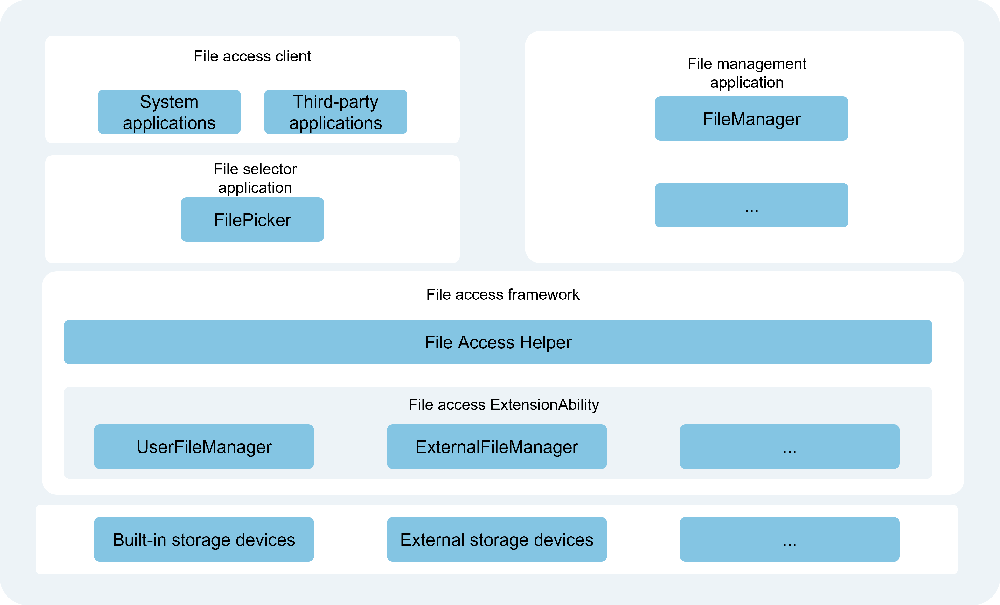

# Introduction to Core File Kit

Core File Kit (File Foundation Service) provides developers with a set of capabilities to access and manage application files and user files. It helps users efficiently manage, search, and back up various types of files, enabling them to easily meet diverse file management requirements.

## Overview of Core File Kit

In the Core File Kit suite, files are classified into the following categories based on ownership, as illustrated in the file classification model diagram below:

- [Application Files](./cj-app-file-overview.md): Owned by the application, including installation files, resource files, cache files, etc.

- [User Files](./cj-user-file-overview.md): Owned by the user logged into the terminal device, including private photos, videos, audio, documents, etc.

- System Files: Files unrelated to applications or users, such as public libraries, device files, and system resource files. These files do not require developer management and are not covered in this document.

Based on the storage location (data source) managed by the file system, the file system classification model is as follows:

- Local File System: Provides access to files on local or external storage devices (e.g., USB drives, external hard disks). The local file system is the most basic and is not discussed further here.

## Kit Usage Scenarios

Common usage scenarios for Core File Kit include:

- Application file access and sharing.
- Application data backup and recovery.
- Selecting and saving user files.
- Cross-device file access and sharing.

## Capabilities

- Supports viewing, creating, reading, writing, deleting, moving, copying, and retrieving attributes for application files.
- Supports uploading application files to network servers and downloading network resource files to local application directories.
- Supports retrieving the storage space size of the current application, available space of a specified file system, and total space of a specified file system.
- Supports sharing files between applications and using files shared by other applications.
- Supports application integration with data backup and recovery. After integration, applications can customize backup and recovery framework behavior via configuration files, including enabling/disabling backup and specifying data to back up.
- Provides a [User File Access Framework](#user-file-access-framework) for developers to access and manage user files, such as selecting and saving user files.
- Supports cross-device file access and copying.

## Highlights/Features

- **Application Sharing**: Applications can share files via Uniform Resource Identifier (URI) or File Descriptor (FD), offering the following advantages:
    - **Portability**: Simplifies operations and improves efficiency by eliminating the need for users to switch between applications.
    - **Efficiency**: Accelerates file transfers by reducing delays caused by multiple redirections and waiting.
    - **Data Consistency**: Ensures data integrity and consistency, preventing corruption or loss during transmission.
    - **Security**: Protects files from unauthorized access or tampering. File authorization further enhances security.

## Framework Principles

### Application File Access Framework

The Application File Access Framework is implemented through basic file operation interfaces ([ohos.file_fs](../../../API_Reference/source_en/CoreFileKit/cj-apis-file_fs.md)). Developers do not need to understand the internal implementation. For details, refer to [Interface Description](./cj-app-file-access.md#interface-description).

### User File Access Framework

The User File Access Framework (File Access Framework) provides developers with a foundational framework for accessing and managing user files. Leveraging OpenHarmony's ExtensionAbility component mechanism, it offers unified methods and interfaces for accessing user files.

**Figure 2** User File Access Framework Diagram

- System or third-party applications (i.e., file access clients) can access user files—such as selecting a photo or saving documents—by launching the "File Picker Application."

- **FileManager**: Device developers can also develop custom file picker or file manager applications as needed. <!--RP1--><!--RP1End-->

- The main functional modules of the File Access Framework (User File Access Framework) include:
    - **File Access Helper**: Provides APIs for file managers and file pickers to access user files.
    - **File Access ExtensionAbility**: Delivers file access framework capabilities, comprising the built-in storage management service (UserFileManager) and external storage management service (ExternalFileManager).
        - **UserFileManager**: Built-in storage management service, implemented via the File Access ExtensionAbility framework, for managing files on internal storage devices.
        - **ExternalFileManager**: External storage management service, implemented via the File Access ExtensionAbility framework, for managing files on external storage devices.

## Relationship with Other Kits

**Ability Kit**: The User File Access Framework in Core File Kit relies on the Extension capabilities provided by Ability Kit and is managed by the Ability Kit service.