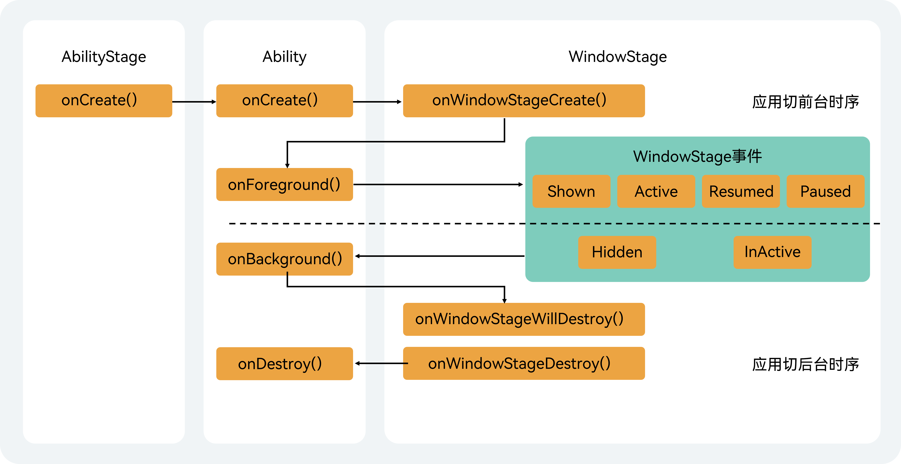

# UIAbility组件生命周期

## 概述

当用户打开、切换和返回到对应应用时，应用中的[UIAbility](../../../API_Reference/source_zh_cn/apis/AbilityKit/cj-apis-app-ability-ui_ability.md#class-uiability)实例会在其生命周期的不同状态之间转换。UIAbility类提供了一系列回调，通过这些回调可以知道当前UIAbility实例的某个状态发生改变，会经过UIAbility实例的创建和销毁，或者UIAbility实例发生了前后台的状态切换。

UIAbility的生命周期包括Create、Foreground、Background、Destroy四个状态，如下图所示。

**图1** UIAbility生命周期状态

<!-- ToBeReviewd -->

## 生命周期状态说明

### Create状态

Create状态为在应用加载过程中，[UIAbility](../../../API_Reference/source_zh_cn/apis/AbilityKit/cj-apis-app-ability-ui_ability.md#class-uiability)实例创建完成时触发，系统会调用[onCreate()](../../../API_Reference/source_zh_cn/apis/AbilityKit/cj-apis-app-ability-ui_ability.md#func-oncreatewant-launchparam)回调。可以在该回调中进行页面初始化操作，例如变量定义资源加载等，用于后续的UI展示。

<!-- compile -->

```cangjie
internal import kit.AbilityKit.UIAbility
internal import kit.AbilityKit.Want

class MainAbility <: UIAbility {
    public override func onCreate(want: Want, launchParam: LaunchParam): Unit {
      // 页面初始化
    }
    // ...
}
```

> **说明：**
>
> [Want](../../../API_Reference/source_zh_cn/apis/AbilityKit/cj-apis-app-ability-want.md#class-want)是对象间信息传递的载体，可以用于应用组件间的信息传递。Want的详细介绍请参见[信息传递载体Want](cj-want-overview.md)。

### WindowStageCreate和WindowStageDestroy状态

[UIAbility](../../../API_Reference/source_zh_cn/apis/AbilityKit/cj-apis-app-ability-ui_ability.md#class-uiability)实例创建完成之后，在进入Foreground之前，系统会创建一个WindowStage。WindowStage创建完成后会进入[onWindowStageCreate()](../../../API_Reference/source_zh_cn/apis/AbilityKit/cj-apis-app-ability-ui_ability.md#func-onwindowstagecreatewindowstage)回调，可以在该回调中设置UI加载、设置WindowStage的事件订阅。

**图2** WindowStageCreate和WindowStageDestroy状态

<!-- ToBeReviewd -->

在onWindowStageCreate()回调中通过[loadContent()](../../../API_Reference/source_zh_cn/arkui-cj/cj-apis-window.md#class-windowstage)方法设置应用要加载的页面，并根据需要调用[on('windowStageEvent')](../../../API_Reference/source_zh_cn/arkui-cj/cj-apis-window.md#func-onwindowcallbacktype-callback1argumentwindowstageeventtype)方法订阅[WindowStage的事件](../../../API_Reference/source_zh_cn/arkui-cj/cj-apis-window.md#enum-windowstageeventtype)（获焦/失焦、切到前台/切到后台、前台可交互/前台不可交互）。

> **说明：**
>
> 不同开发场景下[WindowStage事件](../../../API_Reference/source_zh_cn/arkui-cj/cj-apis-window.md#enum-windowstageeventtype)的时序可能存在差异。

<!-- compile -->

```cangjie
import kit.AbilityKit.UIAbilityContext
import kit.AbilityKit.UIAbility
import kit.ArkUI.{WindowStage, WindowCallbackType, WindowStageEventType}
import ohos.base.{AppLog, Callback1Argument, BusinessException}

class WindowStageCallback <: Callback1Argument<WindowStageEventType> {
    public override func invoke(arg: WindowStageEventType) {
        match (arg) {
            case WindowStageEventType.SHOWN => // 切到前台
                AppLog.info("windowStage foreground.")
            case WindowStageEventType.ACTIVE => // 获焦状态
                AppLog.info("windowStage active.")
            case WindowStageEventType.INACTIVE => // 失焦状态
                AppLog.info("windowStage inactive.")
            case WindowStageEventType.HIDDEN => // 切到后台
                AppLog.info("windowStage background.")
            case WindowStageEventType.RESUMED => // 前台可交互状态
                AppLog.info("windowStage resumed.")
            case WindowStageEventType.PAUSED => // 前台不可交互状态
                AppLog.info("windowStage paused.")
            case _ => ()
        }
    }
}

class MainAbility <: UIAbility {
    // ...
    public override func onWindowStageCreate(windowStage: WindowStage): Unit {
        // 设置WindowStage的事件订阅（获焦/失焦、切到前台/切到后台、前台可交互/前台不可交互）
        try {
            windowStage.on(WindowStageEvent, WindowStageCallback())
        } catch (e: BusinessException) {
            AppLog.error("Failed to enable the listener for window stage event changes. Cause: ${e.message}");
        }
        // 设置UI加载
        windowStage.loadContent("EntryView")
    }
}
```

> **说明：**
>
> WindowStage的相关使用请参见[窗口开发指导](../../../API_Reference/source_zh_cn/arkui-cj/cj-apis-window.md)。

### Foreground和Background状态

Foreground和Background状态分别在[UIAbility](../../../API_Reference/source_zh_cn/apis/AbilityKit/cj-apis-app-ability-ui_ability.md#class-uiability)实例切换至前台和切换至后台时触发，对应于[onForeground()](../../../API_Reference/source_zh_cn/apis/AbilityKit/cj-apis-app-ability-ui_ability.md#func-onforeground)回调和[onBackground()](../../../API_Reference/source_zh_cn/apis/AbilityKit/cj-apis-app-ability-ui_ability.md#func-onbackground)回调。

`onForeground()`回调，在UIAbility的UI可见之前，如UIAbility切换至前台时触发。可以在`onForeground()`回调中申请系统需要的资源，或者重新申请在`onBackground()`中释放的资源。

`onBackground()`回调，在UIAbility的UI完全不可见之后，如UIAbility切换至后台时候触发。可以在`onBackground()`回调中释放UI不可见时无用的资源，或者在此回调中执行较为耗时的操作，例如状态保存等。

例如应用在使用过程中需要使用用户定位时，假设应用已获得用户的定位权限授权。在UI显示之前，可以在`onForeground()`回调中开启定位功能，从而获取到当前的位置信息。

当应用切换到后台状态，可以在`onBackground()`回调中停止定位功能，以节省系统的资源消耗。

<!-- compile -->

```cangjie
import kit.AbilityKit.UIAbility

class MainAbility <: UIAbility {
    // ...

    public override func onForeground(): Unit {
        // 申请系统需要的资源，或者重新申请在onBackground()中释放的资源
    }

    public override func onBackground(): Unit {
        // 释放UI不可见时无用的资源，或者在此回调中执行较为耗时的操作
        // 例如状态保存等
    }
}
```

当应用的UIAbility实例已创建，且UIAbility配置为[singleton](cj-uiability-launch-type.md#singleton启动模式)启动模式时，再次调用[startAbility()](../../../API_Reference/source_zh_cn/apis/AbilityKit/cj-apis-app-ability-ui_ability.md#func-startabilityforresultwant-asynccallbackabilityresult)方法启动该UIAbility实例时，只会进入该UIAbility的[onNewWant()](../../../API_Reference/source_zh_cn/apis/AbilityKit/cj-apis-app-ability-ui_ability.md#func-onnewwantwant-launchparam)回调，不会进入其[onCreate()](../../../API_Reference/source_zh_cn/apis/AbilityKit/cj-apis-app-ability-ui_ability.md#func-oncreatewant-launchparam)和[onWindowStageCreate()](../../../API_Reference/source_zh_cn/apis/AbilityKit/cj-apis-app-ability-ui_ability.md#func-onwindowstagecreatewindowstage)生命周期回调。应用可以在该回调中更新要加载的资源和数据等，用于后续的UI展示。

<!-- compile -->

```cangjie
import kit.AbilityKit.{UIAbility, Want, LaunchParam}

class MainAbility <: UIAbility {
    // ...
    public override func onNewWant(want: Want, launchParam: LaunchParam): Unit {
        // 更新资源、数据
    }
}
```

### Destroy状态

Destroy状态在[UIAbility](../../../API_Reference/source_zh_cn/apis/AbilityKit/cj-apis-app-ability-ui_ability.md#class-uiability)实例销毁时触发。可以在onDestroy()回调中进行系统资源的释放、数据的保存等操作。

例如，调用[terminateSelf()](../../../API_Reference/source_zh_cn/apis/AbilityKit/cj-apis-app-ability-ui_ability.md#func-terminateself)方法停止当前UIAbility实例，执行onDestroy()回调，并完成UIAbility实例的销毁。

<!--RP1-->
再比如，用户使用最近任务列表关闭该UIAbility实例，执行onDestroy()回调，并完成UIAbility实例的销毁。

> **说明：**
>
> 当在开发者模式下调试某个应用时，如果用户从最近任务列表移除了该调试应用的一个任务，则该调试应用的进程会被强制销毁。

<!--RP1End-->

<!-- compile -->

```cangjie
import kit.AbilityKit.UIAbility

class MainAbility <: UIAbility {
    // ...

    public override func onDestroy(): Unit {
        // 系统资源的释放、数据的保存等
    }
}
```
