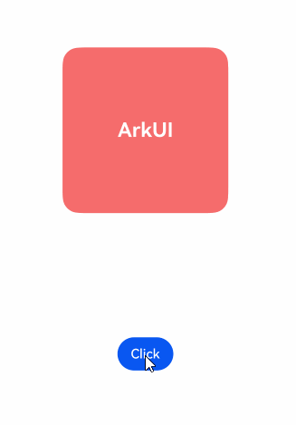

# 动画衔接

UI界面除了运行动画之外，还承载着与用户进行实时交互的功能。当用户行为根据意图变化发生改变时，UI界面应做到即时响应。例如用户在应用启动过程中，上滑退出，那么启动动画应该立即过渡到退出动画，而不应该等启动动画完成后再退出，减少用户等待时间。对于桌面翻页类从跟手到离手触发动画的场景，离手后动画的初始速度应承继手势速度，避免由于速度不接续导致停顿感的产生。针对以上场景，系统已提供动画与动画、手势与动画之间的衔接能力，保证各类场景下动画平稳光滑地过渡的同时，尽可能降低开发难度。

假设对于某一可动画属性，存在正在运行的动画。当UI侧行为改变该属性终点值时，开发者仅需在[animateTo](../../../API_Reference/source_zh_cn/arkui-cj/cj-animation-animateto.md#func-animatetoanimateparamunit)动画闭包中改变属性值或者改变[animationStart](../../../API_Reference/source_zh_cn/arkui-cj/cj-animation-animation.md#func-animationstartanimateparam)接口作用的属性值，即可产生动画。系统会自动衔接之前的动画和当前的动画，开发者仅需要关注当前单次动画的实现。

示例如下。通过点击click，红色方块的缩放属性会发生变化。当连续快速点击click时，缩放属性的终点值连续发生变化，当前动画也会平滑过渡到朝着新的缩放属性终点值运动。

 <!--run-->

```cangjie
package ohos_app_cangjie_entry

import kit.ArkUI.*
import ohos.arkui.state_macro_manage.*

@Observed
class SetSlt {
    @Publish var isAnimation: Bool = true
    public func set() {
        this.isAnimation = !this.isAnimation
    }

    public func getScale(): Float32 {
        if (this.isAnimation){
            return 2.0
        }
        return 1.0
    }
}

@Entry
@Component
class EntryView {
    @State var SetAnimation: SetSlt = SetSlt()

    func build() {
        Column() {
            Text('ArkUI')
                .fontWeight(FontWeight.Bold)
                .fontSize(12)
                .fontColor(Color.White)
                .textAlign(TextAlign.Center)
                .borderRadius(10)
                .backgroundColor(0xf56c6c)
                .width(100)
                .height(100)
                .animationStart(AnimateParam(curve: Curve.Ease))
                .scale(x: this.SetAnimation.getScale(), y: this.SetAnimation.getScale())
                .animationEnd()
            Button('Click')
                .margin(top: 200)
                .onClick({evt =>
                    this.SetAnimation.set()
                })
        }
        .width(100.percent)
        .height(100.percent)
        .justifyContent(FlexAlign.Center)
    }
}
```



## 手势与动画的衔接

使用滑动、捏合、旋转等手势的场景中，跟手过程中一般会触发属性的改变。离手后，这部分属性往往会继续发生变化，直到到达属性终点值。

离手阶段的属性变化初始速度应与离手前一刻的属性改变速度保持一致。如果离手后属性变化速度从0开始，就好像正在运行的汽车紧急刹车，造成观感上的骤变是用户和开发者都不希望看到的。

对于采用[springMotion](../../../API_Reference/source_zh_cn/arkui-cj/cj-apis-curves.md#static-func-springmotionfloat32float32float32)曲线的动画，离手阶段动画将自动继承跟手阶段动画的速度，并以跟手动画当前位置为起点，运动到指定的属性终点。

示例代码如下，小球跟手运动。

 <!--run-->

```cangjie
package ohos_app_cangjie_entry

import kit.ArkUI.*
import ohos.arkui.state_macro_manage.*

@Entry
@Component
class EntryView {
    @State var positionX: Float64 = 100.0
    @State var positionY: Float64 = 100.0
    var diameter: Float64 = 50.0

    func build() {
        Column() {
            Row() {
                Circle(width: this.diameter, height: this.diameter)
                    .fill(Color.Blue)
                    .animationStart(AnimateParam(curve: Curve.EaseInOut))
                    .position(x: this.positionX, y: this.positionY)
                    .animationEnd()
                    .onTouch({ event: TouchEvent =>
                    if (event.eventType == TouchType.Move) {
                        this.positionX = event.touches[0].screenX - this.diameter / 2.0
                        this.positionY = event.touches[0].screenY - this.diameter / 2.0
                    } else if (event.eventType == TouchType.Up) {
                        this.positionX = 100.0
                        this.positionY = 100.0
                    }
                })
            }
            .width(100.percent)
            .height(80.percent)
            .clip(true) // 如果球超出父组件范围，使球不可见
            .backgroundColor(0xFEA400)

            Flex(direction: FlexDirection.Row,justifyContent: FlexAlign.Center, alignItems: ItemAlign.Start) {
                Text("拖动小球").fontSize(16)
            }
            .width(100.percent)

            Row() {
                Text('点击位置: [x: ${Int64(this.positionX)} y: ${Int64(this.positionY)}]').fontSize(16)
            }
            .padding(10)
            .width(100.percent)
        }
        .width(100.percent)
        .height(100.percent)
    }
}
```


