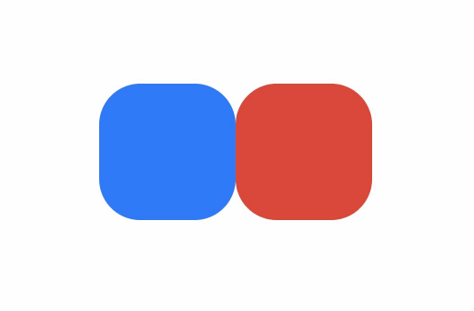

# 实现属性动画

通过可动画属性改变引起UI上产生的连续视觉效果，即为属性动画。属性动画是最基础易懂的动画，ArkUI提供两种属性动画接口[animateTo](../../../API_Reference/source_zh_cn/arkui-cj/cj-animation-animateto.md)、[animation](../../../API_Reference/source_zh_cn/arkui-cj/cj-animation-animation.md)驱动组件属性按照动画曲线等动画参数进行连续的变化，产生属性动画。

|属性动画接口|作用域|原理|使用场景|
|:---|:---|:---|:---|
|animateTo|闭包内改变属性引起的界面变化。<br/>作用于出现消失转场。|通用函数，对闭包前界面和闭包中的状态变量引起的界面之间的差异做动画。<br/>支持多次调用，支持嵌套。|适用对多个可动画属性配置相同动画参数的动画。<br/>需要嵌套使用动画的场景。|
|animation|组件通过属性接口绑定的属性变化引起的界面变化。|识别组件的可动画属性变化，自动添加动画。<br/>组件的接口调用是从下往上执行，animation只会作用于在其之上的属性调用。组件可以根据调用顺序对多个属性设置不同的animation。|适用于对多个可动画属性配置不同参数动画的场景。|

## 使用animateTo产生属性动画


```cangjie
public func animateTo(animation: AnimateParam, callback: () -> Unit): Unit
```

[animateTo](../../../API_Reference/source_zh_cn/arkui-cj/cj-animation-animateto.md)接口参数中，animation指定[AnimateParam对象](../../../API_Reference/source_zh_cn/arkui-cj/cj-animation-animateto.md#struct-animateparam)（包括时长、[Curve](../../../API_Reference/source_zh_cn/arkui-cj/cj-common-types.md#enum-curve)等）callback为动画的闭包函数，闭包内变量改变产生的属性动画将遵循相同的动画参数。

 <!-- run -->

```cangjie
package ohos_app_cangjie_entry
import kit.ArkUI.*
import ohos.arkui.state_macro_manage.*

@Entry
@Component
class EntryView {
    @State var animate: Bool = false
    //第一步：声明相关状态变量
    @State var rotateValue: Float32 = 0.0
    @State var translateX: Float32 = 0.0
    @State var opacityValue: Float32 = 1.0

    //第二步：将状态变量设置到相关可动画属性接口
    func build() {
        Row {
            //组件一
            Column {
            }
            .rotate(this.rotateValue)
            .backgroundColor(0x317AF7)
            .justifyContent(FlexAlign.Center)
            .width(100.vp)
            .height(100.vp)
            .borderRadius(30.vp)
            .onClick{ evt =>
                    animateTo(AnimateParam(curve: Curve.Smooth),
                    { =>
                        this.animate = !this.animate
                        //第三步：闭包内通过状态变量改变UI界面
                        //这里可以写任何能改变UI的逻辑比如数组添加，显隐控制，系统会检测改变后的UI界面与之前的UI界面的差异，对有差异的部分添加动画
                        //组件一的rotate属性发生变化，所以会给组件一添加rotate旋转动画
                        if (this.animate) {
                            this.rotateValue = 90.0
                        } else {
                            this.rotateValue = 0.0
                        }
                        //组件二的透明度发生变化，所以会给组件二添加透明度的动画
                        if (this.animate) {
                            this.opacityValue = 0.6
                        } else {
                            this.opacityValue = 1.0
                        }
                        //组件二的translate属性发生变化，所以会给组件二添加translate偏移动画
                        if (this.animate) {
                            this.translateX = 50.0
                        } else {
                            this.translateX = 0.0
                        }
                    })
            }

            //组件二
            Column {
            }
            .justifyContent(FlexAlign.Center)
            .width(100.vp)
            .height(100.vp)
            .backgroundColor(0xD94838)
            .borderRadius(30.vp)
            .opacity(Float64(this.opacityValue))
            .translate(x: Float64(this.translateX))
        }
        .width(100.percent)
        .height(100.percent)
        .justifyContent(FlexAlign.Center)
    }
}
```


## 使用animation产生属性动画

相比于animateTo接口需要把要执行动画的属性的修改放在闭包中，[animationStart](../../../API_Reference/source_zh_cn/arkui-cj/cj-animation-animation.md#func-animationstart)和[animationEnd](../../../API_Reference/source_zh_cn/arkui-cj/cj-animation-animation.md#func-animationend)接口无需使用闭包，把animationStart接口加在组件的第一个属性，animationEnd接口加在组件的最后一个属性即可。animationStart和animationEnd只要检测到其绑定的可动画属性发生变化，就会自动添加属性动画，animateTo则必须在动画闭包内改变可动画属性的值从而生成动画。

 <!-- run -->

```cangjie
package ohos_app_cangjie_entry
import kit.ArkUI.*
import ohos.arkui.state_macro_manage.*

@Entry
@Component
class EntryView {
    @State var animate: Bool = false
    //第一步：声明相关状态变量
    @State var rotateValue: Float32 = 0.0
    @State var translateX: Float32 = 0.0
    @State var opacityValue: Float32 = 1.0

    //第二步：将状态变量设置到相关可动画属性接口
    func build() {
        Row {
            //组件一
            Column {
            }
            .animationStart(AnimateParam(curve: Curve.Smooth))
            .opacity(Float64(this.opacityValue))
            .rotate(this.rotateValue)
            .backgroundColor(0x317AF7)
            .justifyContent(FlexAlign.Center)
            .width(100.vp)
            .height(100.vp)
            .borderRadius(30.vp)
            .onClick{ evt=>
                    this.animate = !this.animate
                    if (this.animate) {
                        this.rotateValue = 90.0
                    } else {
                        this.rotateValue = 0.0
                    }
                    if (this.animate) {
                        this.opacityValue = 0.6
                    } else {
                        this.opacityValue = 1.0
                    }
                    if (this.animate) {
                        this.translateX = 50.0
                    } else {
                        this.translateX = 0.0
                    }
            }
            .animationEnd()

            //组件二
            Column {
            }
            .animationStart(AnimateParam(curve: Curve.Smooth))
            .justifyContent(FlexAlign.Center)
            .width(100.vp)
            .height(100.vp)
            .backgroundColor(0xD94838)
            .borderRadius(30.vp)
            .opacity(Float64(this.opacityValue))
            .translate(x: Float64(this.translateX))
            .animationEnd()
        }.width(100.percent).height(100.percent).justifyContent(FlexAlign.Center)
    }
}
```



> **说明：**
>
> - 在对组件的位置大小的变化做动画的时候，由于布局属性的改变会触发测量布局，性能开销大。[scale](../../../API_Reference/source_zh_cn/arkui-cj/cj-universal-attribute-transform.md#func-scalefloat32-float32-float32-length-length)属性的改变不会触发测量布局，性能开销小。因此，在组件位置大小持续发生变化的场景，如跟手触发组件大小变化的场景，推荐适用scale。
>
> - 属性动画应该作用于始终存在的组件，对于将要出现或者将要消失的组件的动画应该使用[转场动画](./cj-transition-overview.md)。
>
> - 尽量不要使用动画结束回调。属性动画是对已经发生的状态进行的动画，不需要开发者去处理结束的逻辑。如果要使用结束回调，一定要正确处理连续操作的数据管理。
