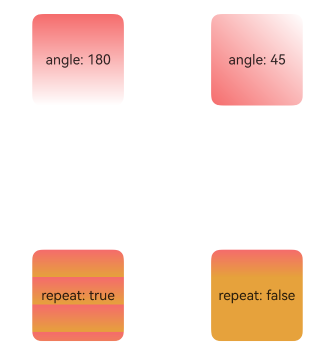
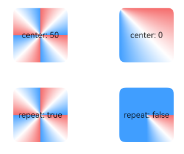
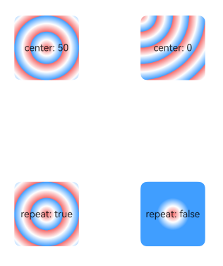

# 色彩

## 色彩

通过颜色渐变接口，可以设置组件的背景颜色渐变效果，实现在两个或多个指定的颜色之间进行平稳的过渡。

| 接口 | 说明 |
| :-------- | :-------- |
| [linearGradient](../../../API_Reference/source_zh_cn/arkui-cj/cj-universal-attribute-gradientcolor.md#func-lineargradientoptionfloat64-gradientdirection-arraycolorfloat64-bool) | 为当前组件添加线性渐变的颜色渐变效果。 |
| [sweepGradient](../../../API_Reference/source_zh_cn/arkui-cj/cj-universal-attribute-gradientcolor.md#func-sweepgradientlengthlength-float64-float64-float64-arraycolorfloat64-bool) | 为当前组件添加角度渐变的颜色渐变效果。 |
| [radialGradient](../../../API_Reference/source_zh_cn/arkui-cj/cj-universal-attribute-gradientcolor.md#func-radialgradientlengthlength-float64-arraycolorfloat64-bool) | 为当前组件添加径向渐变的颜色渐变效果。 |

## 为组件添加线性渐变效果

 <!--run-->

```cangjie
package ohos_app_cangjie_entry

import kit.ArkUI.*
import kit.LocalizationKit.*
import ohos.arkui.state_macro_manage.*

@Entry
@Component
class EntryView {
    func build() {
        Grid() {
            GridItem() {
                Column() {
                    Text('angle: 180').fontSize(15)
                }
                .width(100)
                .height(100)
                .justifyContent(FlexAlign.Center)
                .borderRadius(10)
                .linearGradient(colors: [(Color(0xf56c6c), 0.0), (Color(0xffffff), 1.0)])
            }

            GridItem() {
                Column() {
                    Text('angle: 45').fontSize(15)
                }
                .width(100)
                .height(100)
                .justifyContent(FlexAlign.Center)
                .borderRadius(10)
                .linearGradient(angle: 45.0, colors: [(Color(0xf56c6c), 0.0), (Color(0xffffff), 1.0)])
            }

            GridItem() {
                Column() {
                    Text('repeat: true').fontSize(15)
                }
                .width(100)
                .height(100)
                .justifyContent(FlexAlign.Center)
                .borderRadius(10)
                .linearGradient(repeating: true, colors: [(Color(0xf56c6c), 0.0), (Color(0xE6A23C), 0.3)])
            }

            GridItem() {
                Column() {
                    Text('repeat: false').fontSize(15)
                }
                .width(100)
                .height(100)
                .justifyContent(FlexAlign.Center)
                .borderRadius(10)
                .linearGradient(repeating: false, colors: [(Color(0xf56c6c), 0.0), (Color(0xE6A23C), 0.3)])
            }
        }
        .columnsGap(10)
        .rowsGap(10)
        .columnsTemplate('1fr 1fr')
        .rowsTemplate('1fr 1fr 1fr')
        .width(100.percent)
        .height(100.percent)
    }
}
```



## 为组件添加角度渐变效果

 <!--run-->

```cangjie
package ohos_app_cangjie_entry

import kit.ArkUI.*
import kit.LocalizationKit.*
import ohos.arkui.state_macro_manage.*

@Entry
@Component
class EntryView {
    func build() {
        Grid() {
            GridItem() {
                Column() {
                    Text('center: 50').fontSize(15)
                }
                .width(100)
                .height(100)
                .justifyContent(FlexAlign.Center)
                .borderRadius(10)
                .sweepGradient(
                    (50, 50), // 角度渐变中心点
                    start: 0.0, // 角度渐变的起点
                    end: 360.0, // 角度渐变的终点。
                    colors: [
                        // 当前组件中，按照中心点和渐变的起点和终点值,
                        // 角度区域为0-0.125的范围，从颜色断点1的颜色渐变到颜色断点2的颜色,
                        // 角度区域0.125到0.25的范围，从颜色断点2的颜色渐变到颜色断点3的颜色,
                        // 因为repeating设置为true，角度区域0.25到1的范围，重复区域0到0.25的颜色渐变效果
                        (Color(0xf56c6c), 0.0), // 颜色断点1的颜色和比重，对应角度为0*360°=0°，角点为中心点
                        (Color(0xffffff), 0.125), // 颜色断点2的颜色和比重
                        (Color(0x409EFF), 0.25) // 颜色断点3的颜色和比重
                    ],
                    repeating: true)
            }

            GridItem() {
                Column() {
                    Text('center: 0').fontSize(15)
                }
                .width(100)
                .height(100)
                .justifyContent(FlexAlign.Center)
                .borderRadius(10)
                .sweepGradient(
                    (0, 0), // 角度渐变中心点，当前为组件的左上角坐标
                    start: 0.0, // 角度渐变的起点
                    end: 360.0, // 角度渐变的终点。
                    colors: [
                        // 当前组件中，因为角度渐变中心是组件的左上角，所以从颜色断点1到颜色断点3的角度范围，恰好可以覆盖整个组件
                        (Color(0xf56c6c), 0.0), // 颜色断点1的颜色和比重，对应角度为0*360°=0°
                        (Color(0xffffff), 0.125), // 色断点2的颜色和比重，对应角度为0.125*360°=45°
                        (Color(0x409EFF), 0.25) // 色断点3的颜色和比重，对应角度为0.25*360°=90°
                    ],
                    repeating: true)
            }

            GridItem() {
                Column() {
                    Text('repeat: true').fontSize(15)
                }
                .width(100)
                .height(100)
                .justifyContent(FlexAlign.Center)
                .borderRadius(10)
                .sweepGradient(
                    (50, 50),
                    start: 0.0,
                    end: 360.0,
                    colors: [
                        (Color(0xf56c6c), 0.0),
                        (Color(0xffffff), 0.125),
                        (Color(0x409EFF), 0.25)
                    ],
                    repeating: true)
            }

            GridItem() {
                Column() {
                    Text('repeat: false').fontSize(15)
                }
                .width(100)
                .height(100)
                .justifyContent(FlexAlign.Center)
                .borderRadius(10)
                .sweepGradient(
                    (50, 50),
                    start: 0.0,
                    end: 360.0,
                    colors: [
                        (Color(0xf56c6c), 0.0),
                        (Color(0xffffff), 0.125),
                        (Color(0x409EFF), 0.25)
                    ],
                    repeating: false)
            }
        }
        .columnsGap(10)
        .rowsGap(10)
        .columnsTemplate('1fr 1fr')
        .rowsTemplate('1fr 1fr 1fr')
        .width(100.percent)
        .height(437)
    }
}
```



## 为组件添加径向渐变效果

 <!--run-->

```cangjie
package ohos_app_cangjie_entry

import kit.ArkUI.*
import kit.LocalizationKit.*
import ohos.arkui.state_macro_manage.*

@Entry
@Component
class EntryView {
    func build() {
        Grid() {
            GridItem() {
                Column() {
                    Text('center: 50').fontSize(15)
                }
                .width(100)
                .height(100)
                .justifyContent(FlexAlign.Center)
                .borderRadius(10)
                .radialGradient(
                    (50, 50), // 径向渐变中心点
                    100, // 径向渐变半径
                    colors: [
                        // 组件内以[50，50]为中心点，在半径为0到12.5的范围内从颜色断点1的颜色渐变到颜色断点2的颜色,
                        // 在半径为12.5到25的范围内从颜色断点2的颜色渐变到颜色断点3的颜色,
                        // 组件外其他半径范围内按照半径为0到25的渐变效果重复着色
                        (Color(0xf56c6c), 0.0), // 颜色断点1的颜色和比重，对应半径为0*100=0
                        (Color(0xffffff), 0.125), // 颜色断点2的颜色和比重，对应半径为0.125*100=12.5
                        (Color(0x409EFF), 0.25) // 颜色断点3的颜色和比重，对应半径为0.25*100=25
                    ],
                    repeating: true
                )
            }

            GridItem() {
                Column() {
                    Text('center: 0').fontSize(15)
                }
                .width(100)
                .height(100)
                .justifyContent(FlexAlign.Center)
                .borderRadius(10)
                .radialGradient(
                    (0, 0), // 径向渐变中心点，当前为组件左上角坐标
                    100,
                    colors: [
                        (Color(0xf56c6c), 0.0),
                        (Color(0xffffff), 0.125),
                        (Color(0x409EFF), 0.25)
                    ],
                    repeating: true
                )
            }

            GridItem() {
                Column() {
                    Text('repeat: true').fontSize(15)
                }
                .width(100)
                .height(100)
                .justifyContent(FlexAlign.Center)
                .borderRadius(10)
                .radialGradient(
                    (50, 50),
                    100,
                    colors: [
                        (Color(0xf56c6c), 0.0),
                        (Color(0xffffff), 0.125),
                        (Color(0x409EFF), 0.25)
                    ],
                    repeating: true
                )
            }

            GridItem() {
                Column() {
                    Text('repeat: false').fontSize(15)
                }
                .width(100)
                .height(100)
                .justifyContent(FlexAlign.Center)
                .borderRadius(10)
                .radialGradient(
                    (50, 50),
                    100.0,
                    colors: [
                        (Color(0xf56c6c), 0.0),
                        (Color(0xffffff), 0.125),
                        (Color(0x409EFF), 0.25)
                    ],
                    repeating: false // 在组件内渐变范围外不重复按照渐变范围内效果着色
                )
            }
        }
        .columnsGap(10)
        .rowsGap(10)
        .columnsTemplate('1fr 1fr')
        .rowsTemplate('1fr 1fr 1fr')
        .width(100.percent)
        .height(100.percent)
    }
}
```


