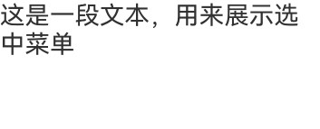
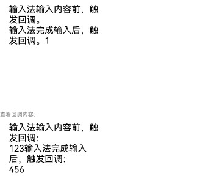
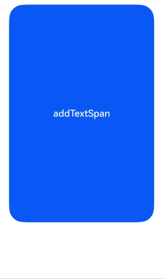

# 富文本（RichEditor）

RichEditor是支持图文混排和文本交互式编辑的组件，通常用于响应用户对图文混合内容的输入操作，例如可以输入图文的评论区。具体用法请参见[RichEditor](../../../API_Reference/source_zh_cn/arkui-cj/cj-text-input-richeditor.md)。

## 创建不使用属性字符串构建的RichEditor组件

创建非属性字符串构建的RichEditor组件，一般用于展示简单的图文信息，例如展示联系人的信息，也可以用于内容要求格式统一的场景，例如一些代码编辑器。

 <!-- run -->

```cangjie
package ohos_app_cangjie_entry
import kit.ArkUI.*
import kit.LocalizationKit.*
import ohos.arkui.state_macro_manage.*

@Entry
@Component
class EntryView {
    var controller: RichEditorController = RichEditorController()
    var option: RichEditorTextSpanOptions = RichEditorTextSpanOptions()

    func build() {
        Column() {
            Column() {
                RichEditor(this.controller)
                    .onReady({=>
                        this.controller.addTextSpan(value:"创建不使用属性字符串构建的RichEditor组件")
                    })
            }.width(200)
        }.height(200)
    }
}
```


## 设置属性

### 设置自定义选择菜单

通过[bindSelectionMenu](../../../API_Reference/source_zh_cn/arkui-cj/cj-text-input-richeditor.md#func-bindselectionmenuricheditorspantype-custombuilder-responsetype-selectionmenuoptions)设置自定义选择菜单。

组件原本具有默认的文本选择菜单，包含复制、剪切和全选的功能。用户可使用该属性设定自定义菜单，例如翻译英文、加粗字体等丰富的菜单功能。

当自定义菜单超长时，建议内部嵌套Scroll组件使用，避免键盘被遮挡。

 <!-- run -->

```cangjie
package ohos_app_cangjie_entry
import kit.ArkUI.*
import kit.LocalizationKit.*
import ohos.arkui.state_macro_manage.*
import ohos.hilog.*
import ohos.arkui.component.CopyOptions as MyCopyOptions
import std.collection.ArrayList

@Entry
@Component
class EntryView {
    let controller: TextController = TextController()
    @Builder
    func RightClickTextCustomMenu() {
        Menu() {
            MenuItemGroup(header: "", footer: "") {=>
                MenuItem(startIcon: @r(app.media.startIcon),   endIcon: @r(app.media.startIcon), content: @r(app.media.startIcon), labelInfo: @r(app.media.startIcon) )
                    .onChange ({ selected =>
                        // 使用closeSelectionMenu接口关闭菜单
                        this.controller.closeSelectionMenu()
                    })
                MenuItem(startIcon: @r(app.media.startIcon),   endIcon: @r(app.media.startIcon), content: @r(app.media.startIcon), labelInfo: @r(app.media.startIcon) )
                MenuItem(startIcon: @r(app.media.startIcon),   endIcon: @r(app.media.startIcon), content: @r(app.media.startIcon), labelInfo: @r(app.media.startIcon) )
            }
        }.backgroundColor(0XF0F0F0)
    }
    func build() {
        Scroll() {
            Column {
                RichEditor(RichEditorController())
                    .bindSelectionMenu(spantype: RichEditorSpanType.Text, content: {=>}, responseType: ResponseType.LongPress,
                        options: SelectionMenuOptions( onDisappear: {
                            => Hilog.info(0, " ", "自定义选择菜单关闭时  触发该回调")
                        },
                        onAppear: {
                            => Hilog.info(0, " ", "自定义选择菜单弹出时回调")
                        }))
            }
        }
    }
}
```



## 添加事件

### 添加组件初始化完成后可触发的回调

通过[onReady](../../../API_Reference/source_zh_cn/arkui-cj/cj-text-input-richeditor.md#func-onreadyvoidcallback)来添加组件初始化完成后可触发的回调。

该回调可在组件初始化后，有效地展示包括图文和表情在内的丰富内容。例如，利用富文本组件展示新闻时，此回调可触发从服务器获取图文数据的操作。随后，将获取到的数据填充至组件中，确保组件在初始化完成后能够迅速在页面上呈现完整的新闻内容。

 <!-- run -->

```cangjie
package ohos_app_cangjie_entry
import kit.ArkUI.*
import kit.LocalizationKit.*
import ohos.arkui.state_macro_manage.*

@Entry
@Component
class EntryView {
    var controller: RichEditorController = RichEditorController()
    var option: RichEditorTextSpanOptions = RichEditorTextSpanOptions()

    func build() {
        Column() {
            Column() {
                RichEditor(this.controller)
                    .onReady({=>
                        this.controller.addTextSpan(value:"onReady回调内容是组件内预置文本")
                })
            }.width(200)
        }.height(200)
    }
}
```


### 添加组件内容被选中时可触发的回调

通过[onSelect](../../../API_Reference/source_zh_cn/arkui-cj/cj-text-input-richeditor.md#func-onselectcallbackricheditorselectionunit)来添加组件内容被选中时可触发的回调。

该回调可在文本选择后增强操作体验。例如，在选中文本后，可在回调中触发弹出菜单，以便用户进行文本样式的修改。或者对选中的文本进行内容分析和处理，为用户提供输入建议，从而提升文本编辑的效率和便捷性。

触发回调有两种方式：一是通过鼠标左键选择，即按下左键进行选择，然后在松开左键时触发回调。二是通过手指触摸选择，即用手指进行选择，然后在松开手指时触发回调。

 <!-- run -->

```cangjie
package ohos_app_cangjie_entry
import kit.ArkUI.*
import kit.LocalizationKit.*
import ohos.arkui.state_macro_manage.*

@Entry
@Component
class EntryView {
    var controller: RichEditorController = RichEditorController()
    var controller1: RichEditorController = RichEditorController()
    var option: RichEditorTextSpanOptions = RichEditorTextSpanOptions()

    func build() {
        Column() {
            Column() {
                RichEditor(this.controller)
                    .onReady({=>
                        this.controller.addTextSpan(value:"选中此处文本，触发onselect回调。")
                    })
                    .onSelect({value1: RichEditorSelection=>
                        this.controller.addTextSpan(value:"1234")
                    }).width(200).height(200)
                Text("查看回调内容：").fontSize(10).fontColor(Color.Gray).width(200)
                RichEditor(this.controller1)
                    .width(200)
                    .height(200)
            }.width(200)
        }.height(200)
    }
}
```


### 添加图文变化前和图文变化后可触发的回调

通过[onDidChange](../../../API_Reference/source_zh_cn/arkui-cj/cj-text-input-richeditor.md#func-ondidchangeondidchangecallback)添加图文变化后可触发的回调。此回调适用于内容保存与同步，例如在用户完成内容编辑后，可使用该回调自动将最新内容保存至本地或同步至服务器。此外，它还适用于内容状态更新与渲染，例如在待办事项列表应用中，用户编辑富文本格式的待办事项描述后，可使用该回调更新待办事项在列表中的显示样式。

 <!-- run -->

```cangjie
package ohos_app_cangjie_entry
import kit.ArkUI.*
import kit.LocalizationKit.*
import ohos.arkui.state_macro_manage.*

@Entry
@Component
class EntryView {
    var controller: RichEditorController = RichEditorController()
    var controller1: RichEditorController = RichEditorController()
    var rangeBefore: TextRange = TextRange(10,13)
    var rangeAfter: TextRange = TextRange(15,18)

    func build() {
        Column() {
            Column() {
                RichEditor(this.controller)
                    .onReady({=>
                        this.controller.addTextSpan(value:"组件内图文变化前，触发回调。\n图文变化后，触发回调。")
                    })
                    .onDidChange({ rangeBefore: TextRange, rangeAfter: TextRange=>
                        this.controller1.addTextSpan(value:"\n图文变化后，触发回调：\nrangeBefore:" + "1234" +
                            "\nrangeAfter：" + "2345")
                        }).width(180)
                Text("查看回调内容：").fontSize(10).fontColor(Color.Gray).width(70)
                RichEditor(this.controller1).width(200).height(500)
            }.width(200).height(200)
        }
    }
}
```


### 添加输入法输入内容前和完成输入后可触发的回调

在添加输入法输入内容前，可以通过[aboutToIMEInput](../../../API_Reference/source_zh_cn/arkui-cj/cj-text-input-richeditor.md#func-abouttoimeinputcallbackricheditorinsertvaluebool)触发回调。在输入法完成输入后，可以通过[onIMEInputComplete](../../../API_Reference/source_zh_cn/arkui-cj/cj-text-input-richeditor.md#func-onimeinputcompletecallbackricheditortextspanresultunit)触发回调。

这两种回调机制适用于智能输入辅助。例如：在用户开始输入文本前，利用回调提供词汇联想，在用户完成输入后，利用回调执行自动化纠错或格式转换。

 <!-- run -->

```cangjie
package ohos_app_cangjie_entry
import kit.ArkUI.*
import kit.LocalizationKit.*
import ohos.arkui.state_macro_manage.*

@Entry
@Component
class EntryView {
    var controller: RichEditorController = RichEditorController()
    var controller1: RichEditorController = RichEditorController()

    func build() {
        Column() {
            Column() {
                RichEditor(this.controller)
                    .onReady({=>
                        this.controller.addTextSpan(value:"输入法输入内容前，触发回调。\n输入法完成输入后，触发回调。")
                    })
                    .aboutToIMEInput({value:   RichEditorInsertValue=>
                        this.controller1.addTextSpan(value:"输入法输入内容前，触发回调：\n123")
                        return true;
                    })
                    .onIMEInputComplete({value: RichEditorTextSpanResult=>
                        this.controller1.addTextSpan(value:"输入法完成输入后，触发回调：\n456")
                    }).width(200).height(200)

                Text("查看回调内容：").fontSize(10).fontColor(Color.Gray).width(200)
                RichEditor(this.controller1).width(200).height(200)
            }.width(200).height(200)
        }
    }
}
```



### 添加完成粘贴前可触发的回调

通过[onPaste](../../../API_Reference/source_zh_cn/arkui-cj/cj-text-input-richeditor.md#func-onpastepasteeventcallback)添加完成粘贴前可触发的回调。

此回调适用于内容格式的处理。例如，当用户复制包含HTML标签的文本时，可在回调中编写代码，将其转换为富文本组件所支持的格式，同时剔除不必要的标签或仅保留纯文本内容。

由于组件默认的粘贴行为仅限于纯文本，无法处理图片粘贴，开发者可利用此方法实现图文并茂的粘贴功能，从而替代组件原有的粘贴行为。

 <!-- run -->

```cangjie
package ohos_app_cangjie_entry
import kit.ArkUI.*
import kit.LocalizationKit.*
import ohos.arkui.state_macro_manage.*

@Entry
@Component
class EntryView {
    var controller: RichEditorController = RichEditorController()
    var controller1: RichEditorController = RichEditorController()
    func build() {
        Column() {
            Column() {
                RichEditor(this.controller)
                    .onReady({=>
                        this.controller.addTextSpan(value:"对此处文本进行复制粘贴操作可触发对应回调。")
                    })
                    .onPaste({value1:PasteEvent=>
                        this.controller1.addTextSpan(value:"触发onPaste回调\n")
                    }).width(300).height(70)
                Text("查看回调内容：").fontSize(10).fontColor(Color.Gray).width(300)
                RichEditor(this.controller1)
                    .width(300).height(70).width(200)
            }.height(200)
        }
    }
}
```


## 添加文本内容

除了直接在组件内输入内容，也可以通过[addTextSpan](../../../API_Reference/source_zh_cn/arkui-cj/cj-text-input-richeditor.md#func-addtextspanresourcestr-richeditortextspanoptions)添加文本内容。

此接口可以实现文本样式多样化，例如需要创建混合样式文本。

如果组件是获焦状态，有光标在闪烁，那么通过addTextSpan添加文本内容后，光标位置会更新，在新添加文本内容的右侧闪烁。

 <!-- run -->

```cangjie
package ohos_app_cangjie_entry

import kit.ArkUI.*
import ohos.arkui.state_macro_manage.*

@Entry
@Component
class EntryView {
    var controller: RichEditorController = RichEditorController()
    var controller1: RichEditorController = RichEditorController()

    func build() {
        Column() {
            Button("addTextSpan")
                .width(200)
                .height(300)
                .fontSize(13)
                .onClick{ evt =>
                    this.controller.addTextSpan(value:"新添加一段文字。")
                }
            RichEditor(this.controller)
                .width(200)
                .height(200)
        }.width(100.percent)
    }
}
```



## 添加图片内容

通过[addImageSpan](../../../API_Reference/source_zh_cn/arkui-cj/cj-text-input-richeditor.md#func-addimagespanstring-richeditorimagespanoptions)添加图片内容。

此接口可用于内容丰富与可视化展示，例如在新闻中加入图片，在文档中加入数据可视化图形等。

如果组件是获焦状态，有光标在闪烁，那么通过addImageSpan添加图片内容后，光标位置会更新，在新添加图片内容的右侧闪烁。

 <!-- run -->

```cangjie
package ohos_app_cangjie_entry
import kit.ArkUI.*
import kit.LocalizationKit.*
import ohos.arkui.state_macro_manage.*

@Entry
@Component
class EntryView {
    var controller: RichEditorController = RichEditorController()
    var controller1: RichEditorController = RichEditorController()
    func build() {
        Column() {
            Column() {
                Button("addTextSpan")
                    .width(200)
                    .height(300)
                    .fontSize(13)
                    .onClick{ evt =>
                        this.controller.addImageSpan(value: @r(app.media.startIcon),
                        options: RichEditorImageSpanOptions(
                            imageStyle: RichEditorImageSpanStyle(
                                size: (24.vp, 24.vp)
                            )
                        ))
                    }
                RichEditor(this.controller)
                    .onReady({=>
                        this.controller.addTextSpan(value:"对此处文本进行复制粘贴操作可触发对应回调。")}).width(200).height(200)
            }.width(200).height(300)
        }
    }
}
```


