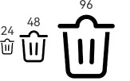
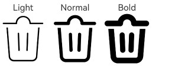
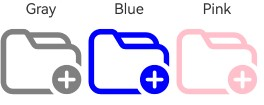
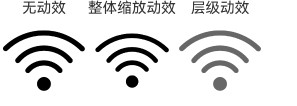
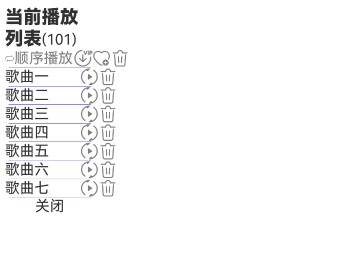

# 图标小符号 (SymbolGlyph/SymbolSpan)

SymbolGlyph是图标小符号组件，便于使用精美的图标，如渲染多色图标和使用动效图标。SymbolSpan作为Text组件的子组件，可在文本中穿插显示图标小符号。

## 创建图标

SymbolGlyph通过@r引用Resource资源来创建，目前仅支持系统预置的Symbol资源名。

<!--RP1--><!--RP1End-->

 <!-- run -->

```cangjie
package ohos_app_cangjie_entry
import kit.ArkUI.*
import kit.LocalizationKit.*
import ohos.arkui.state_macro_manage.*
import ohos.component

@Entry
@Component
class EntryView {
    func build(){
        SymbolGlyph(@r(sys.symbol.ohos_folder_badge_plus))
            .fontSize(96)
            .renderingStrategy(SymbolRenderingStrategy.SINGLE)
            .fontColor([Color.Black, Color.Green, Color.White])
    }
}
```


## 添加到文本中

- 创建SymbolSpan。

  SymbolSpan组件必须嵌入在Text组件中才能显示，单独的SymbolSpan组件不会呈现任何内容。

     <!-- run -->

  ```cangjie
  package ohos_app_cangjie_entry
  import kit.ArkUI.*
  import kit.LocalizationKit.*
  import ohos.arkui.state_macro_manage.*
  import ohos.component

  @Entry
  @Component
  class EntryView {
      func build(){
          Text() {
              SymbolSpan(@r(sys.symbol.ohos_trash))
                  .fontWeight(FontWeight.Normal)
                  .fontSize(96)
          }
      }
  }
  ```

  

     <!-- run -->

  ```cangjie
  package ohos_app_cangjie_entry
  import kit.ArkUI.*
  import kit.LocalizationKit.*
  import ohos.arkui.state_macro_manage.*
  import ohos.component

  @Entry
  @Component
  class EntryView {
      func build(){
          Row() {
              Column() {
                  Text("24")
                  Text() {
                      SymbolSpan(@r(sys.symbol.ohos_trash))
                          .fontWeight(FontWeight.Normal)
                      .fontSize(24)
                  }
              }
              Column() {
                  Text("48")
                  Text() {
                      SymbolSpan(@r(sys.symbol.ohos_trash))
                          .fontWeight(FontWeight.Normal)
                          .fontSize(48)
                  }
              }
              Column() {
                  Text("96")
                  Text() {
                      SymbolSpan(@r(sys.symbol.ohos_trash))
                         .fontWeight(FontWeight.Normal)
                         .fontSize(96)
                  }
              }
          }
      }
  }
  ```

  

     <!-- run -->

  ```cangjie
  package ohos_app_cangjie_entry
  import kit.ArkUI.*
  import kit.LocalizationKit.*
  import ohos.arkui.state_macro_manage.*
  import ohos.component

  @Entry
  @Component
  class EntryView {
      func build(){
          Row() {
              Column() {
                  Text("Light")
                  Text() {
                      SymbolSpan(@r(sys.symbol.ohos_trash))
                          .fontWeight(FontWeight.Lighter)
                          .fontSize(96)
                  }
              }
              Column() {
                  Text("Normal")
                  Text() {
                      SymbolSpan(@r(sys.symbol.ohos_trash))
                          .fontWeight(FontWeight.Normal)
                          .fontSize(96)
                  }
              }
              Column() {
                  Text("Bold")
                  Text() {
                      SymbolSpan(@r(sys.symbol.ohos_trash))
                          .fontWeight(FontWeight.Bold)
                          .fontSize(96)
                  }
              }
          }
      }
  }
  ```

  

     <!-- run -->

  ```cangjie
  package ohos_app_cangjie_entry
  import kit.ArkUI.*
  import kit.LocalizationKit.*
  import ohos.arkui.state_macro_manage.*
  import ohos.component

  @Entry
  @Component
  class EntryView {
      func build(){
          Row() {
              Column() {
                  Text("Gray")
                  Text() {
                      SymbolSpan(@r(sys.symbol.ohos_folder_badge_plus))
                          .fontColor(Color.Gray)
                          .fontSize(96)
                  }
              }
              Column() {
                  Text("Blue")
                  Text() {
                      SymbolSpan(@r(sys.symbol.ohos_folder_badge_plus))
                          .fontColor(Color.Blue)
                          .fontSize(96)
                  }
              }
              Column() {
                  Text("Pink")
                  Text() {
                      SymbolSpan(@r(sys.symbol.ohos_folder_badge_plus))
                          .fontColor(Color.PINK)
                          .fontSize(96)
                  }
              }
          }
      }
  }
  ```

  

     <!-- run -->

  ```cangjie
  package ohos_app_cangjie_entry
  import kit.ArkUI.*
  import kit.LocalizationKit.*
  import ohos.arkui.state_macro_manage.*
  import ohos.component

  @Entry
  @Component
  class EntryView {
      func build(){
          Row() {
              Column() {
                  Text("单色")
                  Text() {
                      SymbolSpan(@r(sys.symbol.ohos_folder_badge_plus))
                          .renderingStrategy(SymbolRenderingStrategy.SINGLE)
                          .fontColor(([Color.Black, Color.Green, Color.White]))
                          .fontSize(96)
                  }
              }
              Column() {
                  Text("多色")
                  Text() {
                      SymbolSpan(@r(sys.symbol.ohos_folder_badge_plus))
                          .renderingStrategy(SymbolRenderingStrategy.MULTIPLE_COLOR)
                          .fontColor(([Color.Black, Color.Green, Color.White]))
                          .fontSize(96)
                  }
              }
              Column() {
                  Text("分层")
                  Text() {
                  SymbolSpan(@r(sys.symbol.ohos_folder_badge_plus))
                      .renderingStrategy(SymbolRenderingStrategy.MULTIPLE_OPACITY)
                      .fontColor(([Color.Black, Color.Green, Color.White]))
                      .fontSize(96)
                  }
              }
          }
      }
  }
  ```

  

     <!-- run -->

  ```cangjie
  package ohos_app_cangjie_entry
  import kit.ArkUI.*
  import kit.LocalizationKit.*
  import ohos.arkui.state_macro_manage.*
  import ohos.component

  @Entry
  @Component
  class EntryView {
      func build(){
          Row() {
              Column() {
                  Text("无动效")
                  Text() {
                      SymbolSpan(@r(sys.symbol.ohos_wifi))
                          .fontSize(96)
                          .effectStrategy(SymbolEffectStrategy.NONE)
                  }
              }
              Column() {
                  Text("整体缩放动效")
                  Text() {
                      SymbolSpan(@r(sys.symbol.ohos_wifi))
                          .fontSize(96)
                          .effectStrategy(SymbolEffectStrategy.SCALE)
                  }
              }
              Column() {
                  Text("层级动效")
                  Text() {
                      SymbolSpan(@r(sys.symbol.ohos_wifi))
                          .fontSize(96)
                          .effectStrategy(SymbolEffectStrategy.HIERARCHICAL)
                  }
              }
          }
      }
  }
  ```

  

- SymbolSpan不支持通用事件。

## 自定义图标动效

相较于effectStrategy属性在启动时即触发动效，可以通过以下两种方式来控制动效的播放状态，以及选择更多样化的动效策略。

- 通过设置SymbolEffect属性，可以同时配置SymbolGlyph的动效策略及其播放状态。

     <!-- run -->

  ```cangjie
  package ohos_app_cangjie_entry
  import kit.ArkUI.*
  import kit.LocalizationKit.*
  import ohos.arkui.state_macro_manage.*
  import ohos.component

  @Entry
  @Component
  class EntryView {
      @State
      var isActive: Bool = true;
      func build(){
          Column() {
              Text("可变颜色动效")
              SymbolGlyph(@r(sys.symbol.ohos_wifi))
                  .fontSize(96)
                  .symbolEffect(HierarchicalSymbolEffect(fillStyle:EffectFillStyle.ITERATIVE), isActive:this.isActive)
              Button((func1(this.isActive))).onClick({=>
              this.isActive = !this.isActive;
              })
          }
      }
      func func1(value: Bool): String {
          if (value) {
              return "关闭"
          }
          return "播放"
      }
  }
  ```

  

- 通过设置SymbolEffect属性，可以同时指定SymbolGlyph的动画效果策略及其播放触发条件。

     <!-- run -->

  ```cangjie
  package ohos_app_cangjie_entry
  import kit.ArkUI.*
  import kit.LocalizationKit.*
  import ohos.arkui.state_macro_manage.*
  import ohos.component

  @Entry
  @Component
  class EntryView {
      @State
      var triggerValueReplace: Int32 = 0;
      func build(){
          Column() {
              Text("弹跳动效")
              SymbolGlyph(@r(sys.symbol.ellipsis_message_1))
                  .fontSize(96)
                  .fontColor([Color.Gray])
                  .symbolEffect(BounceSymbolEffect(scope:EffectScope.WHOLE,direction:EffectDirection.UP), triggerValue: this.triggerValueReplace)
              Button("trigger").onClick({=>
                  this.triggerValueReplace = this.triggerValueReplace + 1;
              })
          }
      }
  }
  ```

  

## 添加事件

SymbolGlyph组件可以添加通用事件，例如绑定[onClick](../../../API_Reference/source_zh_cn/arkui-cj/cj-universal-event-click.md#func-onclickclickevent---unit)、[onTouch](../../../API_Reference/source_zh_cn/arkui-cj/cj-universal-event-touch.md#func-ontouchtouchevent-unit)等事件来响应操作。

 <!-- run -->

```cangjie
package ohos_app_cangjie_entry
import kit.ArkUI.*
import kit.LocalizationKit.*
import ohos.arkui.state_macro_manage.*
import ohos.component

@Entry
@Component
class EntryView {
    @State
    var wifiColor: Color = Color.Black;
    func build(){
        Column() {
            SymbolGlyph(@r(sys.symbol.ohos_wifi))
                .fontSize(96)
                .fontColor([this.wifiColor])
                .onClick({event:ClickEvent=>
                    this.wifiColor = Color.PINK;
                })
        }
    }
}
```

 

## 场景示例

该示例通过symbolEffect、fontSize、fontColor属性展示了播放列表的效果。

 <!-- run -->

```cangjie
package ohos_app_cangjie_entry
import kit.ArkUI.*
import kit.LocalizationKit.*
import ohos.arkui.state_macro_manage.*
import ohos.component
import ohos.ui_test.Driver

@Entry
@Component
class EntryView {
    @State
    var triggerValueReplace: Int32 = 0;
    @State
    var symbolTextIndex: Int64 = 0;
    @State
    var symbolSourcesIndex: Int64 = 0;
    @State
    var fontColorValue: ResourceColor = Color.Gray;
    @State
    var fontColorValue1: ResourceColor = Color.Blue;
    @State
    var symbolText: Array<String> = ["顺序播放", "单曲循环", "随机播放"];

    func build(){
        Column() {
            Row() {
                Text() {
                    Span("当前播放列表")
                        .fontSize(20)
                        .fontWeight(FontWeight.Bolder)
                    Span("(101)")
                }
            }
            Row() {
                Row() {
                    SymbolGlyph(func1(this.symbolSourcesIndex))
                        .symbolEffect(ReplaceSymbolEffect(scope:EffectScope.WHOLE),triggerValue:this.triggerValueReplace)
                        .fontSize(10)
                        .fontColor(Color.Gray)
                    Text(this.symbolText[this.symbolTextIndex])
                        .fontColor(this.fontColorValue)
                }
                .onClick({event:ClickEvent=>
                    this.symbolTextIndex++;
                    this.symbolSourcesIndex++;
                    this.triggerValueReplace++;
                    if (this.symbolSourcesIndex > 2) {
                        this.symbolSourcesIndex = 0;
                        this.triggerValueReplace = 0;
                    }
                    if (this.symbolTextIndex > 2) {
                        this.symbolTextIndex = 0;
                    }
                }).width(75)

                Row() {
                    Text() {
                        SymbolSpan(@r(sys.symbol.arrow_down_circle_badge_vip_circle_filled))
                            .fontColor(Color.Gray)
                            .fontSize(20)
                    }

                    Text() {
                        SymbolSpan(@r(sys.symbol.heart_badge_plus))
                            .fontColor(Color.Gray)
                            .fontSize(20)
                    }

                    Text() {
                        SymbolSpan(@r(sys.symbol.ohos_trash))
                            .fontColor(Color.Gray)
                            .fontSize(20)
                    }
                }.width(25)
            }

            Divider().width(5).color(this.fontColorValue1).width(98)
            Row() {
                Row() {
                    Text("歌曲一")
                }.width(82)

            Row() {
                SymbolGlyph(@r(sys.symbol.play_arrow_triangle_2_circlepath))
                    .fontColor(Color.Gray)
                    .fontSize(20)
                SymbolGlyph(@r(sys.symbol.trash))
                    .fontColor(Color.Gray)
                    .fontSize(20)
            }
            }

            Divider().width(5).color(this.fontColorValue1).width(98)
            Row() {
                Row() {
                    Text("歌曲二")
                }.width(82)

                Row() {
                    SymbolGlyph(@r(sys.symbol.play_arrow_triangle_2_circlepath))
                        .fontColor(Color.Gray)
                        .fontSize(20)
                    SymbolGlyph(@r(sys.symbol.trash))
                        .fontColor(Color.Gray)
                        .fontSize(20)
                }
            }

            Divider().width(5).color(this.fontColorValue1).width(98)
            Row() {
                Row() {
                    Text("歌曲三")
                }.width(82)

                Row() {
                    SymbolGlyph(@r(sys.symbol.play_arrow_triangle_2_circlepath))
                        .fontColor(Color.Gray)
                        .fontSize(20)
                    SymbolGlyph(@r(sys.symbol.trash))
                        .fontColor(Color.Gray)
                        .fontSize(20)
                }
            }

            Divider().width(5).color(this.fontColorValue1).width(98)
            Row() {
                Row() {
                    Text("歌曲四")
                }.width(82)

                Row() {
                    SymbolGlyph(@r(sys.symbol.play_arrow_triangle_2_circlepath))
                        .fontColor(Color.Gray)
                        .fontSize(20)
                    SymbolGlyph(@r(sys.symbol.trash))
                        .fontColor(Color.Gray)
                        .fontSize(20)
                }
            }

            Divider().width(5).color(this.fontColorValue1).width(98)
            Row() {
                Row() {
                    Text("歌曲五")
                }.width(82)

                Row() {
                    SymbolGlyph(@r(sys.symbol.play_arrow_triangle_2_circlepath))
                        .fontColor(Color.Gray)
                        .fontSize(20)
                    SymbolGlyph(@r(sys.symbol.trash))
                        .fontColor(Color.Gray)
                        .fontSize(20)
                }
            }

            Divider().width(5).color(this.fontColorValue1).width(98)
            Row() {
                Row() {
                Text("歌曲六")
                }.width(82)

                Row() {
                    SymbolGlyph(@r(sys.symbol.play_arrow_triangle_2_circlepath))
                        .fontColor(Color.Gray)
                        .fontSize(20)
                    SymbolGlyph(@r(sys.symbol.trash))
                        .fontColor(Color.Gray)
                        .fontSize(20)
                }
            }
            Divider().width(5).color(this.fontColorValue1).width(98)
                Row() {
                    Row() {
                        Text("歌曲七")
                    }.width(82)

                    Row() {
                        SymbolGlyph(@r(sys.symbol.play_arrow_triangle_2_circlepath))
                            .fontColor(Color.Gray)
                            .fontSize(20)
                        SymbolGlyph(@r(sys.symbol.trash))
                            .fontColor(Color.Gray)
                            .fontSize(20)
                    }
                }

            Divider().width(5).color(this.fontColorValue1).width(98)
                Column() {
                    Text("关闭")
                }
                .alignItems(HorizontalAlign.Center)
                .width(98)
        }
        .alignItems(HorizontalAlign.Start)
        .width(100)
        .height(400)
        .padding(left: 10,top: 10)
    }

    func func1(index: Int64): AppResource {
        if (index % 3 == 0) {
            return @r(sys.symbol.repeat)
        }
        if (index % 3 == 1){
            return @r(sys.symbol.repeat_1)
        }
        else {
            return @r(sys.symbol.arrow_left_arrow_right)
        }
    }
}
```


