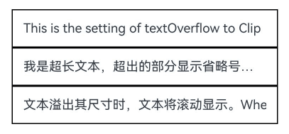
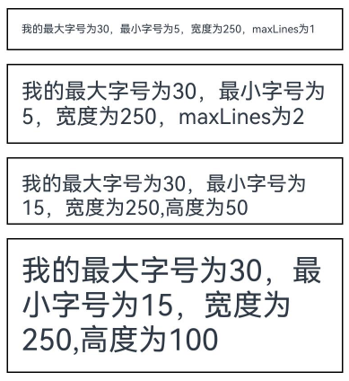
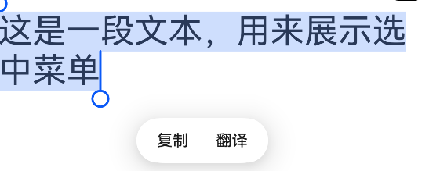
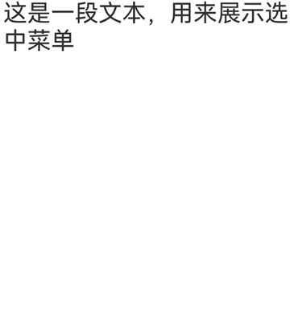

# 文本显示 (Text/Span)

Text是文本组件，通常用于展示用户视图，如显示文章的文字内容，支持绑定自定义文本选择菜单，用户可根据需要选择不同功能，同时还可以扩展自定义菜单，丰富可用选项，进一步提升用户体验。Span则用于呈现显示行内文本。具体用法请参见[Text](../../../API_Reference/source_zh_cn/arkui-cj/cj-text-input-text.md)和[Span](../../../API_Reference/source_zh_cn/arkui-cj/cj-text-input-span.md)组件的使用说明。

## 创建文本

Text可通过以下两种方式来创建：

- string字符串。


  ```cangjie
  Text('我是一段文本')
  ```

  

- 引用AppResource资源。

  资源引用类型可以通过@r创建AppResource类型对象，文件位置为/resources/base/element/string.json，具体内容如下：


  ```cangjie
  {
    "string": [
      {
        "name": "module_desc",
        "value": "模块描述"
      }
    ]
  }
  ```


  ```cangjie
  Text(@r(app.string.module_desc))
    .baselineOffset(0)
    .fontSize(30)
    .border(width: 1)
    .padding(10)
    .width(300)
  ```

  

## 添加子组件

[Span](../../../API_Reference/source_zh_cn/arkui-cj/cj-text-input-span.md)只能作为[Text](../../../API_Reference/source_zh_cn/arkui-cj/cj-text-input-text.md)和[RichEditor](../../../API_Reference/source_zh_cn/arkui-cj/cj-text-input-richeditor.md)组件的子组件显示文本内容。可以在一个Text内添加多个Span来显示一段信息，例如产品说明书、承诺书等。

- 创建Span。

  Span组件必须嵌入在Text组件中才能显示，单独的Span组件不会呈现任何内容。

     <!-- run -->

  ```cangjie
  package ohos_app_cangjie_entry
  import kit.ArkUI.*
  import ohos.arkui.state_macro_manage.*
  import ohos.resource_manager.*

  @Entry
  @Component
  class EntryView {
      func build() {
          Column() {
              Text() {
                  Span("我是Span")
              }
              .padding(10)
              .borderWidth(1)
          }
      }
  }
  ```

  

- 设置文本装饰线及颜色。

  通过[decoration](../../../API_Reference/source_zh_cn/arkui-cj/cj-text-input-span.md#func-decorationtextdecorationtype-resourcecolor)设置文本装饰线及颜色。

     <!-- run -->

  ```cangjie
  package ohos_app_cangjie_entry
  import kit.ArkUI.*
  import ohos.arkui.state_macro_manage.*

  @Entry
  @Component
  class EntryView {
      func build() {
          Scroll {
              Column {
                  Text() {
                      Span('我是Span1，').fontSize(16).fontColor(Color.GREY)
                        .decoration(decorationType: TextDecorationType.LineThrough, color: Color.Red)
                      Span('我是Span2').fontColor(Color.Blue).fontSize(16)
                        .fontStyle(FontStyle.Italic)
                        .decoration(decorationType: TextDecorationType.Underline, color: Color.Black)
                      Span('，我是Span3').fontSize(16). fontColor(Color.GREY)
                        .decoration(decorationType: TextDecorationType.Overline, color: Color.Green)
                  }
                  .borderWidth(1)
                  .padding(10)
              }
              .height(100.percent)
              .width(100.percent)
          }
      }
  }
  ```

  

- 通过[textCase](../../../API_Reference/source_zh_cn/arkui-cj/cj-text-input-span.md#func-textcasetextcase)设置文字一直保持大写或者小写状态。

     <!-- run -->

  ```cangjie
  package ohos_app_cangjie_entry
  import kit.ArkUI.*
  import ohos.arkui.state_macro_manage.*

  @Entry
  @Component
  class EntryView {
      func build() {
          Scroll {
              Column {
                  Text() {
                    Span('I am Upper-span').fontSize(12)
                      .textCase(TextCase.UpperCase)
                  }
                  .borderWidth(1)
                  .padding(10)
              }
              .height(100.percent)
              .width(100.percent)
          }
      }
  }
  ```

  

- 添加事件。

  由于Span组件无尺寸信息，事件仅支持添加点击事件[onClick](../../../API_Reference/source_zh_cn/arkui-cj/cj-universal-event-click.md#func-onclickclickevent---unit)。

     <!-- run -->

  ```cangjie
  package ohos_app_cangjie_entry
  import kit.ArkUI.*
  import ohos.arkui.state_macro_manage.*
  import ohos.resource_manager.*

  @Entry
  @Component
  class EntryView {
      func build() {
          Scroll() {
              Column() {
                    Text() {
                        Span('I am Upper-span').fontSize(12)
                            .textCase(TextCase.UpperCase)
                            .onClick{evt =>
                                AppLog.info('我是Span——onClick')
                            }
                    }
              }
          }.height(100.percent).width(100.percent)
      }
  }
  ```

## 自定义文本样式

- 通过[textAlign](../../../API_Reference/source_zh_cn/arkui-cj/cj-text-input-text.md#textaligntextalign)属性设置文本对齐样式。

     <!-- run -->

  ```cangjie
  package ohos_app_cangjie_entry
  import kit.ArkUI.*
  import ohos.arkui.state_macro_manage.*

  @Entry
  @Component
  class EntryView {
      func build() {
          Scroll {
              Column {
                  Text('左对齐')
                      .width(300)
                      .textAlign(TextAlign.Start)
                      .border(width: 1)
                      .padding(10)
                  Text('中间对齐')
                      .width(300)
                      .textAlign(TextAlign.Center)
                      .border(width: 1)
                      .padding(10)
                  Text('右对齐')
                      .width(300)
                      .textAlign(TextAlign.End)
                      .border(width: 1)
                      .padding(10)
              }
              .height(100.percent)
              .width(100.percent)
          }
      }
  }
  ```

  

- 通过[textOverflow](../../../API_Reference/source_zh_cn/arkui-cj/cj-text-input-text.md#textoverflowtextoverflow)属性控制文本超长处理，textOverflow需配合[maxLines](../../../API_Reference/source_zh_cn/arkui-cj/cj-text-input-text.md#maxlinesint32)一起使用（默认情况下文本自动折行）。

     <!-- run -->

  ```cangjie
  package ohos_app_cangjie_entry
  import kit.ArkUI.*
  import ohos.arkui.state_macro_manage.*

  @Entry
  @Component
  class EntryView {
      func build() {
          Scroll {
              Column {
                  Text('This is the setting of textOverflow to Clip text content This is the setting of textOverflow to None text content. This is the setting of textOverflow to Clip text content This is the setting of textOverflow to None text content.')
                      .width(250)
                      .textOverflow(TextOverflow.None)
                      .maxLines(1)
                      .fontSize(12)
                      .border(width: 1)
                      .padding(10)
                  Text('我是超长文本，超出的部分显示省略号。I am an extra long text, with ellipses displayed for any excess。')
                      .width(250)
                      .textOverflow(TextOverflow.Ellipsis)
                      .maxLines(1)
                      .fontSize(12)
                      .border(width: 1)
                      .padding(10)
                  Text('当文本溢出其尺寸时，文本将滚动显示。When the text overflows its dimensions, the text will scroll for displaying.')
                      .width(250)
                      .textOverflow(TextOverflow.MARQUEE)
                      .maxLines(1)
                      .fontSize(12)
                      .border(width: 1)
                      .padding(10)
              }
              .height(100.percent)
              .width(100.percent)
          }
      }
  }
  ```

  

- 通过[lineHeight](../../../API_Reference/source_zh_cn/arkui-cj/cj-text-input-text.md#func-lineheightlength)属性设置文本行高。

     <!-- run -->

  ```cangjie
  package ohos_app_cangjie_entry
  import kit.ArkUI.*
  import ohos.arkui.state_macro_manage.*

  @Entry
  @Component
  class EntryView {
      func build() {
          Scroll {
              Column {
                  Text('This is the text with the line height set. This is the text with the line height set.')
                      .width(300).fontSize(12).border(width: 1).padding(10)
                  Text('This is the text with the line height set. This is the text with the line height set.')
                      .width(300).fontSize(12).border(width: 1).padding(10)
                      .lineHeight(20)
              }
              .height(100.percent)
              .width(100.percent)
          }
      }
  }
  ```

  

- 通过[decoration](../../../API_Reference/source_zh_cn/arkui-cj/cj-text-input-text.md#decorationtextdecorationtype-color-textdecorationstyle)属性设置文本装饰线样式及其颜色。

     <!-- run -->

  ```cangjie
  package ohos_app_cangjie_entry
  import kit.ArkUI.*
  import ohos.arkui.state_macro_manage.*

  @Entry
  @Component
  class EntryView {
      func build() {
          Scroll {
              Column {
                  Text('This is the text')
                      .decoration(
                          decorationType: TextDecorationType.LineThrough,
                          color: Color.Red
                      )
                      .borderWidth(1).padding(10).margin(5)
                  Text('This is the text')
                      .decoration(
                          decorationType: TextDecorationType.Overline,
                          color: Color.Red
                      )
                      .borderWidth(1).padding(10).margin(5)
                  Text('This is the text')
                      .decoration(
                          decorationType: TextDecorationType.Underline,
                          color: Color.Red
                      )
                      .borderWidth(1).padding(10).margin(5)
              }
              .height(100.percent)
              .width(100.percent)
          }
      }
  }
  ```

  

- 通过[baselineOffset](../../../API_Reference/source_zh_cn/arkui-cj/cj-text-input-text.md#baselineoffsetlength)属性设置文本基线的偏移量。

     <!-- run -->

  ```cangjie
  package ohos_app_cangjie_entry
  import kit.ArkUI.*
  import ohos.arkui.state_macro_manage.*

  @Entry
  @Component
  class EntryView {
      func build() {
          Scroll {
              Column {
                  Text('This is the text content with baselineOffset 0.')
                      .baselineOffset(0)
                      .fontSize(12)
                      .border(width: 1)
                      .padding(10)
                      .width(100.percent)
                      .margin(5)
                  Text('This is the text content with baselineOffset 30.')
                      .baselineOffset(30)
                      .fontSize(12)
                      .border(width: 1)
                      .padding(10)
                      .width(100.percent)
                      .margin(5)
                  Text('This is the text content with baselineOffset -20.')
                      .baselineOffset(-20)
                      .fontSize(12)
                      .border(width: 1)
                      .padding(10)
                      .width(100.percent)
                      .margin(5)
              }
              .height(100.percent)
              .width(100.percent)
          }
      }
  }
  ```

  

- 通过[letterSpacing](../../../API_Reference/source_zh_cn/arkui-cj/cj-text-input-text.md#letterspacinglength)属性设置文本字符间距。

     <!-- run -->

  ```cangjie
  package ohos_app_cangjie_entry
  import kit.ArkUI.*
  import ohos.arkui.state_macro_manage.*

  @Entry
  @Component
  class EntryView {
      func build() {
          Scroll {
              Column {
                  Text('This is the text content with letterSpacing 0.')
                      .letterSpacing(0)
                      .fontSize(12)
                      .border(width: 1)
                      .padding(10)
                      .width(100.percent)
                      .margin(5)
                  Text('This is the text content with letterSpacing 3.')
                      .letterSpacing(3)
                      .fontSize(12)
                      .border(width: 1)
                      .padding(10)
                      .width(100.percent)
                      .margin(5)
                  Text('This is the text content with letterSpacing -1.')
                      .letterSpacing(-1)
                      .fontSize(12)
                      .border(width: 1)
                      .padding(10)
                      .width(100.percent)
                      .margin(5)
              }
              .height(100.percent)
              .width(100.percent)
          }
      }
  }
  ```

  

- 通过[minFontSize](../../../API_Reference/source_zh_cn/arkui-cj/cj-text-input-text.md#minfontsizelength)与[maxFontSize](../../../API_Reference/source_zh_cn/arkui-cj/cj-text-input-text.md#maxfontsizelength)自适应字体大小。

  minFontSize用于设置文本的最小显示字号，maxFontSize用于设置文本的最大显示字号。这两个属性必须同时设置才能生效，并且需要与[maxLines](../../../API_Reference/source_zh_cn/arkui-cj/cj-text-input-text.md#maxlinesint32)属性或布局大小限制配合使用，单独设置任一属性将不会产生效果。

     <!-- run -->

  ```cangjie
  package ohos_app_cangjie_entry
  import kit.ArkUI.*
  import ohos.arkui.state_macro_manage.*

  @Entry
  @Component
  class EntryView {
      func build() {
          Scroll {
              Column {
                  Text('我的最大字号为30，最小字号为5，宽度为250，maxLines为1')
                      .width(250)
                      .maxLines(1)
                      .maxFontSize(30)
                      .minFontSize(5)
                      .border(width: 1)
                      .padding(10)
                      .margin(5)
                  Text('我的最大字号为30，最小字号为5，宽度为250，maxLines为2')
                      .width(250)
                      .maxLines(2)
                      .maxFontSize(30)
                      .minFontSize(5)
                      .border(width: 1)
                      .padding(10)
                      .margin(5)
                  Text('我的最大字号为30，最小字号为15，宽度为250,高度为50')
                      .width(250)
                      .height(50)
                      .maxFontSize(30)
                      .minFontSize(15)
                      .border(width: 1)
                      .padding(10)
                      .margin(5)
                  Text('我的最大字号为30，最小字号为15，宽度为250,高度为100')
                      .width(250)
                      .height(100)
                      .maxFontSize(30)
                      .minFontSize(15)
                      .border(width: 1)
                      .padding(10)
                      .margin(5)
              }
              .height(100.percent)
              .width(100.percent)
          }
      }
  }
  ```

  

- 通过[textCase](../../../API_Reference/source_zh_cn/arkui-cj/cj-text-input-text.md#textcasetextcase)属性设置文本大小写。

     <!-- run -->

  ```cangjie
  package ohos_app_cangjie_entry
  import kit.ArkUI.*
  import ohos.arkui.state_macro_manage.*

  @Entry
  @Component
  class EntryView {
      func build() {
          Scroll {
              Column {
                  Text('This is the text content with textCase set to Normal.')
                      .textCase(TextCase.Normal)
                      .padding(10)
                      .border(width: 1)
                      .padding(10)
                      .margin(5)
                    // 文本全小写展示
                  Text('This is the text content with textCase set to LowerCase.')
                      .textCase(TextCase.LowerCase)
                      .border(width: 1)
                      .padding(10)
                      .margin(5)
                    // 文本全大写展示
                  Text('This is the text content with textCase set to UpperCase.')
                      .textCase(TextCase.UpperCase)
                      .border(width: 1)
                      .padding(10)
                      .margin(5)
              }
              .height(100.percent)
              .width(100.percent)
          }
      }
  }
  ```

  

- 通过[copyOption](../../../API_Reference/source_zh_cn/arkui-cj/cj-text-input-text.md#copyoptioncopyoptions)属性设置文本是否可复制粘贴。

     <!-- run -->

  ```cangjie
  package ohos_app_cangjie_entry
  import kit.ArkUI.*
  import ohos.arkui.state_macro_manage.*

  @Entry
  @Component
  class EntryView {
      func build() {
          Scroll {
              Column {
                  Text("这是一段可复制文本")
                      .fontSize(30)
                      .copyOption(CopyOptions.InApp)
              }
              .height(100.percent)
              .width(100.percent)
          }
      }
  }
  ```

  

## 添加事件

Text组件可以添加通用事件，可以绑定[onClick](../../../API_Reference/source_zh_cn/arkui-cj/cj-universal-event-click.md#func-onclickclickevent---unit)、[onTouch](../../../API_Reference/source_zh_cn/arkui-cj/cj-universal-event-touch.md#func-ontouchtouchevent-unit)等事件来响应操作。

 <!-- run -->

```cangjie
package ohos_app_cangjie_entry
import kit.ArkUI.*
import ohos.arkui.state_macro_manage.*

@Entry
@Component
class EntryView {
    func build() {
        Scroll {
            Column {
                Text('点我')
                    .onClick{ evt =>
                        AppLog.info('我是Text的点击响应事件')
                    }
            }
            .height(100.percent)
            .width(100.percent)
        }
    }
}
```

## 选中菜单

- Text被选中时会弹出包含复制、翻译的菜单。

  Text组件需要设置[copyOption](../../../API_Reference/source_zh_cn/arkui-cj/cj-text-input-text.md#func-copyoptioncopyoptions)属性才可以被选中。


  ```cangjie
  Text("这是一段文本，用来展示选中菜单")
      .fontSize(30)
      .copyOption(CopyOptions.InApp)
  ```

  

- Text组件通过设置[bindSelectionMenu](../../../API_Reference/source_zh_cn/arkui-cj/cj-text-input-text.md#func-bindselectionmenutextspantype----unit-textresponsetype-int32int32---unit----unit)属性绑定自定义选择菜单。

     <!-- run -->

  ```cangjie
  package ohos_app_cangjie_entry
  import kit.ArkUI.*
  import ohos.arkui.state_macro_manage.*
  import ohos.resource_manager.*
  import kit.PerformanceAnalysisKit.Hilog
  import std.collection.ArrayList

  @Entry
  @Component
  class EntryView {
      let controller: TextController = TextController()
      @Builder
      func RightClickTextCustomMenu() {
              Menu() {
                  MenuItemGroup(header: "", footer: "") {
                      =>
                      MenuItem(startIcon: @r(app.media.startIcon),   endIcon: @r(app.string.blank), content: @r(app.string.content1), labelInfo: @r(app.string.blank) )
                        .onChange ({ selected =>
                          // 使用closeSelectionMenu接口关闭菜单
                          this.controller.closeSelectionMenu()
                        })
                      MenuItem(startIcon: @r(app.media.startIcon),   endIcon: @r(app.string.blank), content: @r(app.string.content2), labelInfo: @r(app.string.blank) )
                      MenuItem(startIcon: @r(app.media.startIcon),   endIcon: @r(app.string.blank), content: @r(app.string.content3), labelInfo: @r(app.string.blank) )
                  }
              }.backgroundColor(0XF0F0F0)
      }
      func build() {
          Scroll() {
              Column {
                  Text("这是一段文本，用来展示选中菜单", controller:   TextController())
                      .fontSize(30)
                      .copyOption(CopyOptions.InApp)
                      .bindSelectionMenu( TextSpanType.TEXT, bind  (RightClickTextCustomMenu, this),   TextResponseType.LONG_PRESS,
                      onDisappear: {
                          => Hilog.info(0, '', '自定义选择菜单关闭时  触发该回调')
                      },
                      onAppear: {
                          _: Int32, _: Int32 => Hilog.info(0, '', '自  定义选择菜单弹出时回调')
                      })
              }
          }
      }
  }
  ```

  

- Text组件通过设置[editMenuOptions](../../../API_Reference/source_zh_cn/arkui-cj/cj-text-input-text.md#func-editmenuoptionsarraytextmenuitem---arraytextmenuitem-textmenuitem-int32-int32---bool)属性扩展自定义选择菜单，可以设置扩展项的文本内容、图标以及回调方法。

     <!-- run -->

  ```cangjie
  package ohos_app_cangjie_entry
  import kit.ArkUI.*
  import ohos.arkui.state_macro_manage.*
  import ohos.resource_manager.*
  import kit.PerformanceAnalysisKit.Hilog
  import std.collection.ArrayList

  @Entry
  @Component
  class EntryView {
      func onCreateMenu(menuItems: Array<TextMenuItem>)  : Array<TextMenuItem> {
          let items = ArrayList<TextMenuItem>()
          for (item in menuItems) {
              if (item.id.equals(TextMenuItemId.  CUT) || item.id.equals(TextMenuItemId.  COPY) || item
                  .id
                  .equals(TextMenuItemId.SELECT_ALL)) {
                  items.add(item)
              }
          }
          let customItem1 = TextMenuItem(content:   "custom1", id: TextMenuItemId.of  ("customItem1"))
          let customItem2 = TextMenuItem(content:   "custom2", icon: @r(app.media.startIcon),
              id: TextMenuItemId.of("customItem2"))
          let customItem3 = TextMenuItem(content: @r(app.string.customItem3), icon: @r(app.media.startIcon),
              id: TextMenuItemId.of("customItem3"))
          items.add(customItem1)
          items.add(customItem2)
          items.add(customItem3)
          return items.toArray()
      }
      func onMenuItemClick(menuItem: TextMenuItem,   start: Int32, end: Int32): Bool {
          if (menuItem.id.equals(TextMenuItemId.of  ("custom2"))) {
              Hilog.info(0, "", "拦截 id: customMenu2   start: ${start}; end: ${end}")
              return true
          }
          if (menuItem.id.equals(TextMenuItemId.COPY))   {
              Hilog.info(0, "", "拦截 COPY start: $  {start}; end: ${end}")
              return true
          }
          if (menuItem.id.equals(TextMenuItemId.  SELECT_ALL)) {
              Hilog.info(0, "", "不拦截 SELECT_ALL   start: ${start}; end: ${end}")
              return false
          }
          return false
      }
      func build() {
          Column() {
              Text("这是一段文本，用来展示选中菜单")
                .fontSize(20)
                .copyOption(CopyOptions.LocalDevice)
                .editMenuOptions(onCreateMenu,onMenuItemClick)
          }
      }
  }
  ```

  

## 场景示例

该示例通过maxLines、textOverflow、textAlign、constraintSize属性展示了热搜榜的效果。

 <!-- run -->

```cangjie
package ohos_app_cangjie_entry
import kit.ArkUI.*
import ohos.arkui.state_macro_manage.*

@Entry
@Component
class EntryView {
    func build() {
        Column() {
            Row() {
                Text("1").fontSize(14).fontColor(Color.Red).margin(left: 10, right: 10)
                Text("我是热搜词条1")
                    .fontSize(12)
                    .fontColor(Color.Blue)
                    .maxLines(1)
                    .textOverflow(TextOverflow.Ellipsis)
                    .fontWeight(W300)
                Text("爆")
                    .margin(left: 6)
                    .textAlign(TextAlign.Center)
                    .fontSize(10)
                    .fontColor(Color.White)
                    .fontWeight(W600)
                    .backgroundColor(0x770100)
                    .borderRadius(5)
                    .width(15)
                    .height(14)
                }.width(100.percent).margin(5)

            Row() {
                Text("2").fontSize(14).fontColor(Color.Red).margin(left: 10, right: 10)
                Text("我是热搜词条2 我是热搜词条2 我是热搜词条2 我是热搜词条2 我是热搜词条2")
                    .fontSize(12)
                    .fontColor(Color.Blue)
                    .fontWeight(W300)
                    .constraintSize(maxWidth: 200)
                    .maxLines(1)
                    .textOverflow(TextOverflow.Ellipsis)
                Text("热")
                    .margin(left: 6)
                    .textAlign(TextAlign.Center)
                    .fontSize(10)
                    .fontColor(Color.White)
                    .fontWeight(W600)
                    .backgroundColor(0xCC5500)
                    .borderRadius(5)
                    .width(15)
                    .height(14)
                }.width(100.percent).margin(5)

            Row() {
                Text("3").fontSize(14).fontColor(Color.ORANGE).margin(left: 10, right: 10)
                Text("我是热搜词条3")
                    .fontSize(12)
                    .fontColor(Color.Blue)
                    .fontWeight(W300)
                    .maxLines(1)
                    .constraintSize(maxWidth: 200)
                    .textOverflow(TextOverflow.Ellipsis)
                Text("热")
                    .margin(left: 6)
                    .textAlign(TextAlign.Center)
                    .fontSize(10)
                    .fontColor(Color.White)
                    .fontWeight(W600)
                    .backgroundColor(0xCC5500)
                    .borderRadius(5)
                    .width(15)
                    .height(14)
                }.width(100.percent).margin(5)

            Row() {
                Text("4").fontSize(14).fontColor(Color.GREY).margin(left: 10, right: 10)
                Text("我是热搜词条4 我是热搜词条4 我是热搜词条4 我是热搜词条4 我是热搜词条4")
                    .fontSize(12)
                    .fontColor(Color.Blue)
                    .fontWeight(W300)
                    .constraintSize(maxWidth: 200)
                    .maxLines(1)
                    .textOverflow(TextOverflow.Ellipsis)
                }.width(100.percent).margin(5)
        }.width(100.percent)
    }
}
```


