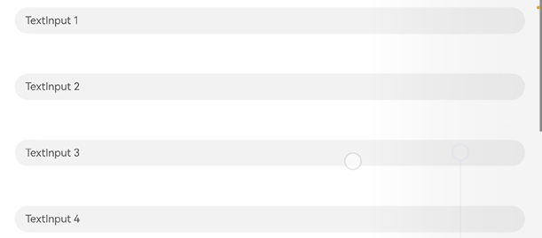

# 文本输入 (TextInput/TextArea)

TextInput、TextArea是输入框组件，通常用于响应用户的输入操作，比如评论区的输入、聊天框的输入、表格的输入等，也可以结合其它组件构建功能页面，例如登录注册页面。具体用法请参见[TextInput](../../../API_Reference/source_zh_cn/arkui-cj/cj-text-input-textinput.md)、[TextArea](../../../API_Reference/source_zh_cn/arkui-cj/cj-text-input-textarea.md)。

## 创建输入框

TextInput为单行输入框、TextArea为多行输入框。通过以下接口来创建。


```cangjie
init(placeholder!: String = "", text!: String = "", controller!: TextInputController = TextInputController())
```


```cangjie
init(placeholder!: String = "", text!: String = "", controller!: TextAreaController = TextAreaController())
```

- 单行输入框。


    ```cangjie
    TextInput()
    ```

    

- 多行输入框。


    ```cangjie
    TextArea()
    ```

    

- 多行输入框文字超出一行时会自动折行。


    ```cangjie
    TextArea(text: "我是TextArea我是TextArea我是TextArea我是TextArea" ).width(300)
    ```

    

## 设置输入框类型

TextInput有以下类型可选择：Normal基本输入模式、Password密码输入模式、Email邮箱地址输入模式、Number纯数字输入模式、PhoneNumber电话号码输入模式、USER_NAME用户名输入模式、NEW_PASSWORD新密码输入模式、NUMBER_PASSWORD纯数字密码输入模式、NUMBER_DECIMAL带小数点的数字输入模式、带URL的输入模式。通过setType属性进行设置：

- 基本输入模式（默认类型）


    ```cangjie
    TextInput()
    .setType(InputType.Normal)
    ```

    

- 密码输入模式


    ```cangjie
    TextInput()
    .setType(InputType.Password)
    ```

    

- 邮箱地址输入模式。


    ```cangjie
    TextInput()
    .setType(InputType.Email)
    ```

    

- 纯数字输入模式。


    ```cangjie
    TextInput()
    .setType(InputType.Number)
    ```

    

- 电话号码输入模式。


    ```cangjie
    TextInput()
    .setType(InputType.PhoneNumber)
    ```

    

- 带小数点的数字输入模式。


    ```cangjie
    TextInput()
    .setType(InputType.NUMBER_DECIMAL)
    ```

    

- 带URL的输入模式。


    ```cangjie
    TextInput()
    .setType(InputType.URL)
    ```

    

## 自定义样式

- 设置无输入时的提示文本。


    ```cangjie
    TextInput(placeholder: '我是提示文本')
    ```

    

- 设置输入框当前的文本内容。


    ```cangjie
    TextInput( placeholder: '我是提示文本', text: '我是当前文本内容' )
    ```

    

- 添加backgroundColor改变输入框的背景颜色。


    ```cangjie
    TextInput( placeholder: '我是提示文本', text: '我是当前文本内容' )
    .backgroundColor(Color.PINK)
    ```

    

    更丰富的样式可以结合通用属性实现。

## 添加事件

文本框主要用于获取用户输入的信息，把信息处理成数据进行上传，绑定onChange事件可以获取输入框内改变的文本内容，绑定onSubmit事件可以获取回车提交的文本信息，绑定onTextSelectionChange事件可以获取文本选中时手柄的位置信息或者编辑时光标的位置信息等等。用户也可以使用通用事件来进行相应的交互操作。

> **说明：**
>
> - 在密码模式下，设置showPassword属性时，在onSecurityStateChange回调中，建议增加状态同步，详见如下示例。
> - onWillInsert、onDidInsert、onWillDelete、onDidDelete回调仅支持系统输入法的场景。


```cangjie
TextInput( text: "", placeholder: "input your word...", controller: TextInputController() )
    .setType(InputType.Password)
    .showPassword(this.passwordState)
    .onChange {
        value: String =>
        // 文本内容发生变化时触发该回调
        Hilog.info(0, "onChange", "onChange is triggering: ${value}")
    }
    .onSubmit {
        enterKey: EnterKeyType, event: SubmitEvent =>
        // 按下输入法回车键时触发该回调
        Hilog.info(0, "AppLogCj", "onSubmit is triggering: ")
    }
    .onTextSelectionChange {
        selectionStart: Int32, selectionEnd: Int32 =>
        // 文本选择的位置发生变化或编辑状态下光标位置发生变化时，触发该回调
        Hilog.info(0, "onTextSelectionChange", "onTextSelectionChange is triggering: ${selectionStart}, ${selectionEnd}")
    }
    .onSecurityStateChange {
        isShowPassword: Bool =>
        // 密码显隐状态切换时，触发该回调
        Hilog.info(0, "onSecurityStateChange", "onSecurityStateChange is triggering: ${isShowPassword}")
        this.passwordState = isShowPassword
    }
    .onWillInsert {
        insertValue: Float64, insertOffset: String =>
        // 在将要输入时，触发该回调
        Hilog.info(0, "AppLogCj", 'onWillInsert is triggering: ${insertValue}, ${insertOffset}')
        return true
    }
    .onDidInsert {
        insertValue: Float64, insertOffset: String =>
        // 在输入完成时，触发该回调
        Hilog.info(0, "AppLogCj", 'onDidInsert is triggering: ${insertValue}, ${insertOffset}')
    }
    .onWillDelete {
        insertValue: Float64, id: Int32, insertOffset: String =>
        // 在将要删除时，触发该回调
        Hilog.info(0, "onWillDelete", 'onWillDelete is triggering: ${insertValue}, ${id}, ${insertOffset}')
        return true
    }
    .onDidDelete {
        insertValue: Float64, id: Int32, insertOffset: String =>
        // 在删除完成时，触发该回调
        Hilog.info(0, "onDidDelete", 'onDidDelete is triggering: ${insertValue}, ${id}, ${insertOffset}')
    }
    .onFocus {
        =>
        // 绑定通用事件，输入框获焦时触发该回调
        Hilog.info(0, "onFocus", 'onFocus is triggering')
    }
```

## 选中菜单

输入框中的文字被选中时会弹出包含剪切、复制、翻译的菜单。

TextInput:


```cangjie
TextInput( text: '这是一段文本，用来展示选中菜单')
```


TextArea:


```cangjie
TextArea( text: '这是一段文本，用来展示选中菜单')
```


## 自动填充

输入框可以通过[contentType](../../../API_Reference/source_zh_cn/arkui-cj/cj-text-input-textinput.md#func-contenttypecontenttype)属性设置自动填充类型。

支持的类型请参见[ContentType](../../../API_Reference/source_zh_cn/arkui-cj/cj-common-types.md#enum-contenttype)。


```cangjie
TextInput( placeholder: '输入你的邮箱...' )
    .width(95.percent)
    .height(40)
    .margin(20)
    .contentType(ContentType.EMAIL_ADDRESS)
```

## 键盘避让

键盘抬起后，具有滚动能力的容器组件在横竖屏切换时，才会生效键盘避让，若希望无滚动能力的容器组件也生效键盘避让，建议在组件外嵌套一层具有滚动能力的容器组件，比如[Scroll](../../../API_Reference/source_zh_cn/arkui-cj/cj-scroll-swipe-scroll.md)、[List](../../../API_Reference/source_zh_cn/arkui-cj/cj-scroll-swipe-list.md)、[Grid](../../../API_Reference/source_zh_cn/arkui-cj/cj-scroll-swipe-grid.md)。


```cangjie
package ohos_app_cangjie_entry
import kit.ArkUI.*
import ohos.arkui.state_macro_manage.*

@Entry
@Component
class EntryView {
    var placeHolderArr: Array<String> = ["1", "2", "3", "4", "5", "6", "7"];
    func build() {
        Scroll() {
            Column {
                ForEach(this.placeHolderArr, itemGeneratorFunc: {placeholder: String, _: Int64 =>
                TextInput( placeholder: 'TextInput ' + placeholder )
                .margin(30)}
                )
            }
        }
        .height(100.percent)
        .width(100.percent)
    }
}
```


