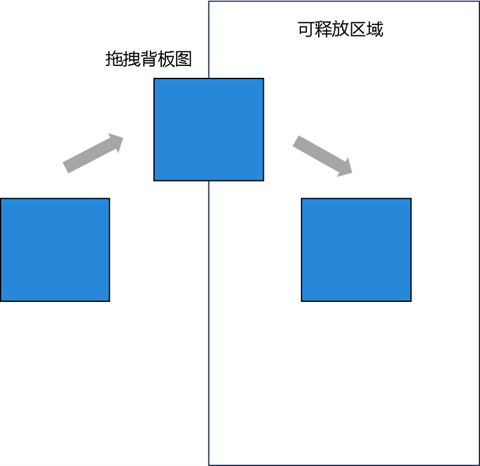

# 拖拽事件

拖拽事件提供了一种通过鼠标或手势触屏传递数据的机制，即从一个组件位置拖出（drag）数据并将其拖入（drop）到另一个组件位置，以触发响应。在这一过程中，拖出方提供数据，而拖入方负责接收和处理数据。这一操作使用户能够便捷地移动、复制或删除指定内容。

## 基本概念

- 拖拽操作：在可响应拖出的组件上长按并滑动以触发拖拽行为，当用户释放手指或鼠标时，拖拽操作即告结束。
- 拖拽背景（背板）：用户拖动数据时的形象化表示。开发者可以通过[onDragStart](../../../API_Reference/source_zh_cn/arkui-cj/cj-universal-event-drag.md#func-ondragstartdrageventstring------unit)的()-> Unit或[DragItemInfo](../../../API_Reference/source_zh_cn/arkui-cj/cj-universal-event-drag.md#struct-dragiteminfo)进行设置，也可以通过[dragPreview](../../../API_Reference/source_zh_cn/arkui-cj/cj-universal-attribute-dragcontrol.md#func-dragpreviewdragiteminfo)通用属性进行自定义。
- 拖拽内容：被拖动的数据，使用UDMF统一API UnifiedData 进行封装，确保数据的一致性和安全性。
- 拖出对象：触发拖拽操作并提供数据的组件，通常具有响应拖拽的特性。
- 拖入目标：可接收并处理拖动数据的组件，能够根据拖入的数据执行相应的操作。
- 拖拽点：鼠标或手指与屏幕的接触位置，用于判断是否进入组件范围。判定依据是接触点是否位于组件的范围内。

## 拖拽流程

拖拽流程包含手势拖拽流程和鼠标拖拽流程，可帮助开发者理解回调事件触发的时机。

### ​手势拖拽流程

对于手势长按触发拖拽的场景，ArkUI在发起拖拽前会校验当前组件是否具备拖拽功能。对于默认可拖出的组件（Search、TextInput、TextArea、RichEditor、Text、Image、Hyperlink）需要判断是否设置了[draggable](../../../API_Reference/source_zh_cn/arkui-cj/cj-universal-attribute-dragcontrol.md#func-draggablebool)，需检查是否已设置draggable属性为true（若系统使能分层参数，draggable属性默认为true）。其他组件则需额外确认是否已设置onDragStart回调函数。在满足上述条件后，长按时间达到或超过500ms即可触发拖拽，而长按800ms时，系统开始执行预览图的浮起动效。若与Menu功能结合使用，并通过isShow控制其显示与隐藏，建议避免在用户操作800ms后才控制菜单显示，此举可能引发非预期的行为。

手势拖拽（手指/手写笔）触发拖拽流程：

### ​鼠标拖拽流程

鼠标拖拽操作遵循即拖即走的模式，当鼠标左键在可拖拽的组件上按下并移动超过1vp时，即可触发拖拽功能。

当前不仅支持应用内部的拖拽，还支持跨应用的拖拽操作。为了帮助开发者更好地感知拖拽状态并调整系统默认的拖拽行为，ArkUI提供了多个回调事件，详情如下：

| **回调事件** | **说明**|
| :---------------- | :------------------------|
| [onDragStart](../../../API_Reference/source_zh_cn/arkui-cj/cj-universal-event-drag.md#func-ondragstartdrageventstring------unit) | 拖出的组件产生拖出动作时，该事件触发。 该回调可以感知拖拽行为的发起，开发者可以在onDragStart方法中设置拖拽过程中传递的数据，并自定义拖拽的背板图像。建议开发者采用pixelmap的方式来返回背板图像，避免使用customBuilder，因为后者可能会带来额外的性能开销。|
| [onDragEnter](../../../API_Reference/source_zh_cn/arkui-cj/cj-universal-event-drag.md#func-ondragenterdrageventstring---unit) | 当拖拽操作的拖拽点进入组件的范围时，如果该组件监听了[onDrop](../../../API_Reference/source_zh_cn/arkui-cj/cj-universal-event-drag.md#func-ondropdrageventstring---unit)事件，此事件将会被触发。|
| [onDragMove](../../../API_Reference/source_zh_cn/arkui-cj/cj-universal-event-drag.md#func-ondragmovedrageventstring---unit) | 当拖拽点在组件范围内移动时，如果该组件监听了[onDragMove](../../../API_Reference/source_zh_cn/arkui-cj/cj-universal-event-drag.md#func-ondragmovedrageventstring---unit)事件，此事件将会被触发。 在这一过程中，可以通过调用[DragEvent](../../../API_Reference/source_zh_cn/arkui-cj/cj-universal-event-drag.md#class-dragevent)中的setResult方法来影响系统在部分场景下的外观表现。 1. 设置DragResult.DROP\_ENABLED。 2. 设置DragResult.DROP\_DISABLED。|
| [onDragLeave](../../../API_Reference/source_zh_cn/arkui-cj/cj-universal-event-drag.md#func-ondragleavedrageventstring---unit) | 当拖拽点移出组件范围时，如果该组件监听了onDrop事件，此事件将会被触发。 在以下两种情况下，系统默认不会触发onDragLeave事件： 1. 父组件移动到子组件。 2. 目标组件与当前组件布局有重叠。|
| [onDrop](../../../API_Reference/source_zh_cn/arkui-cj/cj-universal-event-drag.md#func-ondropdrageventstring---unit) | 当用户在组件范围内释放拖拽操作时，此回调会被触发。开发者需在此回调中通过DragEvent的setResult方法来设置拖拽结果，否则在拖出方组件的onDragEnd方法中，通过getResult方法获取的将只是默认的处理结果DragResult.DRAG\_FAILED。 此回调是开发者干预系统默认拖入处理行为的关键点，系统会优先执行开发者定义的onDrop回调。通过在onDrop回调中调用setResult方法，开发者可以告知系统如何处理被拖拽的数据。 1. 设置 DragResult.DRAG\_SUCCESSFUL，数据完全由开发者自己处理，系统不进行处理。 2. 设置DragResult.DRAG\_FAILED，数据不再由系统继续处理。 3. 设置DragResult.DRAG\_CANCELED，系统也不需要进行数据处理。 4. 设置DragResult.DROP\_ENABLED或DragResult.DROP\_DISABLED会被忽略，等同于设置DragResult.DRAG\_FAILED。|
| [onDragEnd](../../../API_Reference/source_zh_cn/arkui-cj/cj-universal-event-drag.md#func-ondragenddrageventstring---unit) | 当用户释放拖拽时，拖拽活动终止，发起拖出动作的组件将触发该事件。|
| [onPreDrag](../../../API_Reference/source_zh_cn/arkui-cj/cj-universal-event-drag.md#func-onpredragpredragstatus---unit) | 当触发拖拽事件的不同阶段时，绑定此事件的组件会触发该事件。 开发者可利用此方法，在拖拽开始前的不同阶段，根据[PreDragStatus](../../../API_Reference/source_zh_cn/arkui-cj/cj-universal-event-drag.md#enum-predragstatus)枚举准备相应数据。 1. ACTION\_DETECTING\_STATUS：拖拽手势启动阶段。按下50ms时触发。 2. READY\_TO\_TRIGGER\_DRAG\_ACTION：拖拽准备完成，可发起拖拽阶段。按下500ms时触发。 3. PREVIEW\_LIFT\_STARTED：拖拽浮起动效发起阶段。按下800ms时触发。 4. PREVIEW\_LIFT\_FINISHED：拖拽浮起动效结束阶段。浮起动效完全结束时触发。 5. PREVIEW\_LANDING\_STARTED：拖拽落回动效发起阶段。落回动效发起时触发。 6. PREVIEW\_LANDING\_FINISHED：拖拽落回动效结束阶段。落回动效结束时触发。 7. ACTION\_CANCELED\_BEFORE\_DRAG：拖拽浮起落位动效中断。已满足READY_TO_TRIGGER_DRAG_ACTION状态后，未达到动效阶段，手指抬起时触发。|

[DragEvent](../../../API_Reference/source_zh_cn/arkui-cj/cj-universal-event-drag.md#class-dragevent)支持的get方法可用于获取拖拽行为的详细信息，下表展示了在相应的拖拽回调中，这些get方法是否能够返回有效数据。

| 回调事件 | onDragStart | onDragEnter | onDragMove | onDragLeave | onDrop | onDragEnd |
| :- | :- | :- | :- | :- | :- | :- |
| getResult       |—|—|—|—|—| 支持 |
| getPreviewRect  |—|—|—|—| 支持 |—|
| getVelocity/X/Y |—| 支持 | 支持 | 支持 | 支持 |—|
| getWindowX/Y    | 支持 | 支持 | 支持 | 支持 | 支持 |—|
| getDisplayX/Y   | 支持 | 支持 | 支持 | 支持 | 支持 |—|

[DragEvent](../../../API_Reference/source_zh_cn/arkui-cj/cj-universal-event-drag.md#class-dragevent)支持相关set方法向系统传递信息，这些信息部分会影响系统对UI或数据的处理方式。下表列出了set方法应该在回调的哪个阶段执行才会被系统接受并处理。

| 回调事件 | onDragStart | onDragEnter | onDragMove | onDragLeave | onDrop |
| :- | :- | :- | :- | :- | :- |
| useCustomDropAnimation |—|—|—|—| 支持 |
| setResult              | 支持，可通过set failed或cancel来阻止拖拽发起 | 支持，不作为最终结果传递给onDragEnd | 支持，不作为最终结果传递给onDragEnd | 支持，不作为最终结果传递给onDragEnd  | 支持，作为最终结果传递给onDragEnd |

## 拖拽背板图

在拖拽移动过程中显示的背板图并非组件本身，而是表示用户拖动的数据，开发者可将其设定为任意可显示的图像。具体而言，onDragStart回调中返回的customBuilder或pixelmap可以用于设置拖拽移动过程中的背板图，而浮起图则默认采用组件本身的截图。dragpreview属性中设定的customBuilder或pixelmap可以用于配置浮起和拖拽过程的背板图。若开发者未配置背板图，系统将自动采用组件本身的截图作为拖拽和浮起时的背板图。

拖拽背板图当前支持设置透明度、圆角、阴影和模糊，详情请参见[拖拽控制](../../../API_Reference/source_zh_cn/arkui-cj/cj-universal-attribute-dragcontrol.md)。

**约束限制：**

- 对于容器组件，如果内部内容通过position、offset等接口使得绘制区域超出了容器组件范围，则系统截图无法截取到范围之外的内容。此种情况下，如果一定要浮起，即拖拽背板能够包含范围之外的内容，则可考虑通过扩大容器范围或自定义方式实现。
- 不论是使用自定义builder或是系统默认截图方式，截图都暂时无法应用[scale](../../../API_Reference/source_zh_cn/arkui-cj/cj-universal-attribute-transform.md#func-scalefloat32-float32-float32-length-length)、[rotate](../../../API_Reference/source_zh_cn/arkui-cj/cj-universal-attribute-transform.md#func-rotatefloat32-float32-float32-float64-length-length)等图形变换效果。
