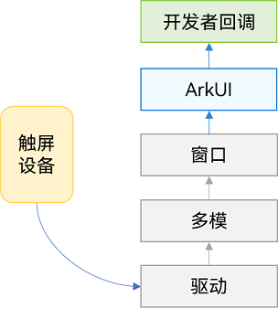
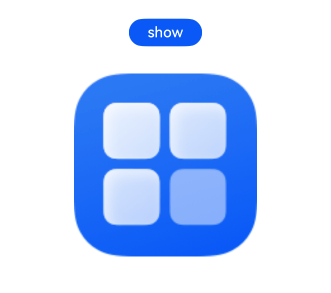
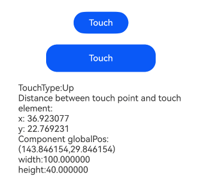

# 触屏事件

触屏事件指当手指/手写笔在组件上按下、滑动、抬起时触发的回调事件。包括[点击事件](#点击事件)、[拖拽事件](./../../../API_Reference/source_zh_cn/arkui-cj/cj-universal-event-drag.md)和[触摸事件](#触摸事件)。触屏事件的原理如下图所示：

**图1** 触摸事件原理



## 点击事件

点击事件是指通过手指或手写笔做出一次完整的按下和抬起动作。当发生点击事件时，会触发以下回调函数：

```cangjie
func onClick(callback: (ClickEvent)->Unit): This
```

event参数提供点击事件相对于窗口或组件的坐标位置，以及发生点击的事件源。

例如通过按钮的点击事件控制图片的显示和隐藏。

 <!-- run -->

```cangjie
package ohos_app_cangjie_entry
import kit.ArkUI.*
import ohos.arkui.state_macro_manage.*
import ohos.resource_manager.*

@Entry
@Component
class EntryView {
    @State var flag = true
    @State var btnMsg: String = 'show'

    func build() {
        Column {
            Button(this.btnMsg)
                .width(80)
                .height(30)
                .margin(30)
                .onClick({ event =>
                    if (this.flag) {
                        this.btnMsg = 'hide'
                    } else {
                        this.btnMsg = 'show'
                    }
                    // 点击Button控制Image的显示和消失
                    this.flag = !this.flag
                })
            if (this.flag) {
                Image(@r(app.media.startIcon))
                    .width(200)
                    .height(200)
            }
        }
        .height(100.percent)
        .width(100.percent)
    }
}
```

**图2** 通过按钮的点击事件控制图片的显示和隐藏



## 触摸事件

当手指或手写笔在组件上触碰时，会触发不同动作所对应的事件响应，包括按下（Down）、滑动（Move）、抬起（Up）事件：

```cangjie
public func onTouch(callback: (TouchEvent)->Unit): This
```

- event.type为TouchType.Down：表示手指按下。

- event.type为TouchType.Up：表示手指抬起。

- event.type为TouchType.Move：表示手指按住移动。

- event.type为TouchType.Cancel：表示打断取消当前手指操作。

触摸事件可以同时多指触发，通过event参数可获取触发的手指位置、手指唯一标志、当前发生变化的手指和输入的设备源等信息。

 <!-- run -->

```cangjie
package ohos_app_cangjie_entry
import kit.ArkUI.*
import ohos.arkui.state_macro_manage.*

@Entry
@Component
class EntryView {
    @State var text: String = ""
    @State var eventType: String = ""

    func build() {
        Column {
            Button('Touch')
                .height(40)
                .width(100)
                .onTouch({ event =>
                    this.eventType = match (event.eventType) {
                        case TouchType.Down => 'Down'
                        case TouchType.Up => 'Up'
                        case TouchType.Move => 'Move'
                        case TouchType.Cancel => 'Move'
                        case TouchType.Unknown => "Unknown"
                        case _ => ""
                    }
                    this.text = 'TouchType:' + this.eventType + '\nDistance between touch point and touch element:\nx: '
                        + event.touches[0].x.toString() + '\n' + 'y: ' + event.touches[0].y.toString()
                        + '\nComponent globalPos:(' + event.target.area.globalPosition.x.value.toString()
                        + ',' + event.target.area.globalPosition.y.value.toString() + ')\nwidth:'
                        + event.target.area.width.value.toString() + '\nheight:' + event.target.area.height.value.toString()
                })
            Button('Touch')
                .height(50)
                .width(200)
                .margin(20)
                .onTouch({ event =>
                    this.eventType = match (event.eventType) {
                        case TouchType.Down => 'Down'
                        case TouchType.Up => 'Up'
                        case TouchType.Move => 'Move'
                        case TouchType.Cancel => 'Move'
                        case TouchType.Unknown => "Unknown"
                        case _ => ""
                    }
                    this.text = 'TouchType:' + this.eventType + '\nDistance between touch point and touch element:\nx: '
                        + event.touches[0].x.toString() + '\n' + 'y: ' + event.touches[0].y.toString()
                        + '\nComponent globalPos:(' + event.target.area.globalPosition.x.value.toString()
                        + ',' + event.target.area.globalPosition.y.value.toString() + ')\nwidth:'
                        + event.target.area.width.value.toString() + '\nheight:' + event.target.area.height.value.toString()
                })
            Text(this.text)
        }
        .width(100.percent)
        .padding(30)
    }
}
```


