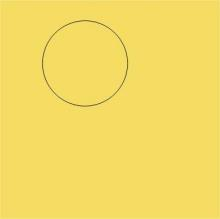
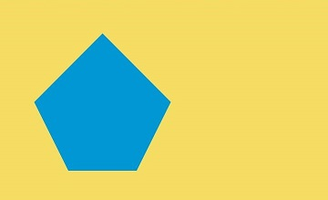

# 使用画布绘制自定义图形 (Canvas)

Canvas提供画布组件，用于自定义绘制图形，开发者使用CanvasRenderingContext2D对象和OffscreenCanvasRenderingContext2D对象在Canvas组件上进行绘制，绘制对象可以是基础形状、文本、图片等。

## 使用画布组件绘制自定义图形

- 使用[CanvasRenderingContext2D](../../../API_Reference/source_zh_cn/arkui-cj/cj-canvas-drawing-canvasrenderingcontext2d.md)对象在Canvas画布上绘制。

     <!-- run -->

  ```cangjie
  package ohos_app_cangjie_entry

  import kit.ArkUI.*
  import ohos.arkui.state_macro_manage.*

  @Entry
  @Component
  class EntryView {
      //用来配置CanvasRenderingContext2D对象的参数，包括是否开启抗锯齿，true表明开启抗锯齿。
      var settings: RenderingContextSettings = RenderingContextSettings(antialias: true)
      //用来创建CanvasRenderingContext2D对象，通过在canvas中调用CanvasRenderingContext2D对象来绘制。
      var context: CanvasRenderingContext2D = CanvasRenderingContext2D(this.settings)
      func build() {
          Flex(direction: FlexDirection.Column, alignItems: ItemAlign.Center, justifyContent: FlexAlign.Center) {
              //在canvas中调用CanvasRenderingContext2D对象。
              Canvas(this.context)
                  .width(100.percent)
                  .height(100.percent)
                  .backgroundColor(0XF5DC62)
                  .onReady(
                      {
                          =>
                          //可以在这里绘制内容。
                          this.context.lineWidth = 0.6
                          this.context.strokeRect(50.0, 50.0, 200.0, 150.0);
                      }
                  )
          }.width(100.percent).height(100.percent)
      }
  }
  ```

  

## 初始化画布组件

onReady(() -> Unit)是Canvas组件初始化完成时或者Canvas组件发生大小变化时的事件回调。调用该事件后，可获取Canvas组件的确定宽高，进一步使用CanvasRenderingContext2D对象和OffscreenCanvasRenderingContext2D对象调用相关API进行图形绘制。

 <!-- run -->

```cangjie
package ohos_app_cangjie_entry

import kit.ArkUI.*
import ohos.arkui.state_macro_manage.*

@Entry
@Component
class EntryView {
    //用来配置CanvasRenderingContext2D对象的参数，包括是否开启抗锯齿，true表明开启抗锯齿。
    var settings: RenderingContextSettings = RenderingContextSettings(antialias: true)
    //用来创建CanvasRenderingContext2D对象，通过在canvas中调用CanvasRenderingContext2D对象来绘制。
    var context: CanvasRenderingContext2D = CanvasRenderingContext2D(this.settings)
    func build() {
        Canvas(this.context)
        .width(100.percent)
        .height(100.percent)
        .backgroundColor(0XF5DC62)
        .onReady({
            =>
            this.context.fillStyle(0X0097D4)
            this.context.fillRect(50.0, 50.0, 100.0, 100.0)
        })
    }
}
```


## 画布组件绘制方式

调用Canvas组件生命周期接口onReady()之后，开发者可以直接使用Canvas组件进行绘制。或者可以脱离Canvas组件和onReady()生命周期，单独定义Path2d对象构造理想的路径，并在onReady()调用之后使用Canvas组件进行绘制。

- 通过CanvasRenderingContext2D对象和OffscreenCanvasRenderingContext2D对象直接调用相关API进行绘制。

     <!-- run -->

  ```cangjie
  package ohos_app_cangjie_entry

  import kit.ArkUI.*
  import ohos.arkui.state_macro_manage.*

  @Entry
  @Component
  class EntryView {
      private let settings: RenderingContextSettings = RenderingContextSettings(antialias: true)
      private let context: CanvasRenderingContext2D = CanvasRenderingContext2D(this.settings)

      func build() {
          Flex(direction: FlexDirection.Column, alignItems: ItemAlign.Center, justifyContent: FlexAlign.Center) {
              Canvas(this.context)
                  .width(100.percent)
                  .height(100.percent)
                  .backgroundColor(0XF5DC62)
                  .onReady(
                      {
                          =>
                          this.context.beginPath()
                          this.context.moveTo(50.0, 50.0)
                          this.context.lineTo(280.0, 160.0)
                          this.context.stroke()
                      }
                  )
          }.width(100.percent).height(100.percent)
      }
  }
  ```

  

- 先单独定义path2d对象构造理想的路径，再通过调用CanvasRenderingContext2D对象和OffscreenCanvasRenderingContext2D对象的stroke接口或者fill接口进行绘制，具体使用可以参考path2d。

     <!-- run -->

  ```cangjie
  package ohos_app_cangjie_entry

  import kit.ArkUI.*
  import ohos.arkui.state_macro_manage.*

  @Entry
  @Component
  class EntryView {
      private let settings: RenderingContextSettings = RenderingContextSettings(antialias: true)
      private let context: CanvasRenderingContext2D = CanvasRenderingContext2D(this.settings)

      var region: Path2D = Path2D()
      func build() {
          Flex(direction: FlexDirection.Column, alignItems: ItemAlign.Center, justifyContent: FlexAlign.Center) {
              Canvas(this.context)
                  .width(100.percent)
                  .height(100.percent)
                  .backgroundColor(0XF5DC62)
                  .onReady(
                      {
                          =>
                          this.region.arc(100.0, 75.0, 50.0, 0.0, 6.28)
                          this.context.stroke(this.region)
                      }
                  )
          }.width(100.percent).height(100.percent)
      }
  }
  ```

  

## 画布组件常用方法

OffscreenCanvasRenderingContext2D对象和CanvasRenderingContext2D对象提供了大量的属性和方法，可以用来绘制文本、图形，处理像素等，是Canvas组件的核心。常用接口有[fill](../../../API_Reference/source_zh_cn/arkui-cj/cj-canvas-drawing-canvasrenderingcontext2d.md#func-fill)（对封闭路径进行填充）、[clip](../../../API_Reference/source_zh_cn/arkui-cj/cj-canvas-drawing-canvasrenderingcontext2d.md#func-clip)（设置当前路径为剪切路径）、[stroke](../../../API_Reference/source_zh_cn/arkui-cj/cj-canvas-drawing-canvasrenderingcontext2d.md#func-stroke)（进行边框绘制操作）等等，同时提供了[fillStyle](../../../API_Reference/source_zh_cn/arkui-cj/cj-canvas-drawing-canvasrenderingcontext2d.md#func-fillstylecanvasgradient)（指定绘制的填充色）、[globalAlpha](../../../API_Reference/source_zh_cn/arkui-cj/cj-canvas-drawing-canvasrenderingcontext2d.md#func-globalalphafloat64)（设置透明度）与[strokeStyle](../../../API_Reference/source_zh_cn/arkui-cj/cj-canvas-drawing-canvasrenderingcontext2d.md#func-strokestylecanvasgradient)（设置描边的颜色）等属性修改绘制内容的样式。将通过以下几个方面简单介绍画布组件常见使用方法：

- 基础形状绘制。

  可以通过[arc](../../../API_Reference/source_zh_cn/arkui-cj/cj-canvas-drawing-canvasrenderingcontext2d.md#func-arcfloat64-float64-float64-float64-float64-bool)（绘制弧线路径）、 [ellipse](../../../API_Reference/source_zh_cn/arkui-cj/cj-canvas-drawing-canvasrenderingcontext2d.md#func-ellipsefloat64-float64-float64-float64-float64-float64-float64-bool)（绘制一个椭圆）、[rect](../../../API_Reference/source_zh_cn/arkui-cj/cj-canvas-drawing-canvasrenderingcontext2d.md#func-rectfloat64-float64-float64-float64)（创建矩形路径）等接口绘制基础形状。

     <!-- run -->

  ```cangjie
  package ohos_app_cangjie_entry

  import kit.ArkUI.*
  import ohos.arkui.state_macro_manage.*
  import std.math.MathExtension

  @Entry
  @Component
  class EntryView {
  private let settings: RenderingContextSettings = RenderingContextSettings(antialias: true)
  private let context: CanvasRenderingContext2D = CanvasRenderingContext2D(this.settings)

  func build() {
      Flex(direction: FlexDirection.Column, alignItems: ItemAlign.Center, justifyContent: FlexAlign.Center) {
              Canvas(this.context)
              .width(100.percent)
              .height(100.percent)
              .backgroundColor(0XF5DC62)
              .onReady({
                  =>
                      //绘制矩形
                      this.context.beginPath()
                      this.context.rect(100.0, 50.0, 100.0, 100.0)
                      this.context.stroke()
                      //绘制圆形
                      this.context.beginPath()
                      this.context.arc(150.0, 250.0, 50.0, 0.0, 6.28)
                      this.context.stroke()
                      //绘制椭圆
                      this.context.beginPath()
                      this.context.ellipse(150.0, 450.0, 50.0, 100.0, Float64.GetPI() * 0.25, Float64.GetPI() * 0.0, Float64.GetPI() * 2.0)
                      this.context.stroke()
              })
      }.width(100.percent).height(100.percent)
  }
  }
  ```

  

- 文本绘制。

  可以通过[fillText](../../../API_Reference/source_zh_cn/arkui-cj/cj-canvas-drawing-canvasrenderingcontext2d.md#func-filltextstring-float64-float64)（文本填充）、[strokeText](../../../API_Reference/source_zh_cn/arkui-cj/cj-canvas-drawing-canvasrenderingcontext2d.md#func-stroketextstring-float64-float64)（文本描边）等接口进行文本绘制，示例中设置了font为50像素高加粗的"sans-serif"字体，然后调用fillText方法在(50, 100)处绘制文本"Hello World!"，设置strokeStyle为红色，lineWidth为0.7，font为50像素高加粗的"sans-serif"字体，然后调用strokeText方法在(50, 120)处绘制文本"Hello World!"的轮廓。

     <!-- run -->

  ```cangjie
  package ohos_app_cangjie_entry

  import kit.ArkUI.*
  import ohos.arkui.state_macro_manage.*

  @Entry
  @Component
  class EntryView {
      private let settings: RenderingContextSettings = RenderingContextSettings(antialias: true)
      private let context: CanvasRenderingContext2D = CanvasRenderingContext2D(this.settings)

      func build() {
          Flex(direction: FlexDirection.Column, alignItems: ItemAlign.Center, justifyContent: FlexAlign.Center) {
              Canvas(this.context)
                  .width(100.percent)
                  .height(100.percent)
                  .backgroundColor(0XF5DC62)
                  .onReady({
                      =>
                      // 文本填充
                      this.context.font(size: 50.px, weight: FontWeight.Bolder, family: "sans-serif")
                      this.context.fillText("Hello World!", 50.0, 100.0)
                      // 文本描边
                      this.context.strokeStyle(0Xff0000)
                      this.context.lineWidth = 0.7
                      this.context.font(size: 50.px, weight: FontWeight.Bolder, family: "sans-serif")
                      this.context.strokeText("Hello World!", 50.0, 120.0)
                      }
                  )
          }.width(100.percent).height(100.percent)
      }
  }
  ```

  

- 其他方法。

  Canvas中还提供其他类型的方法。渐变相关的方法：[createLinearGradient](../../../API_Reference/source_zh_cn/arkui-cj/cj-canvas-drawing-canvasrenderingcontext2d.md#func-createlineargradientfloat64-float64-float64-float64)（创建一个线性渐变色）、[createRadialGradient](../../../API_Reference/source_zh_cn/arkui-cj/cj-canvas-drawing-canvasrenderingcontext2d.md#func-createradialgradientfloat64-float64-float64-float64-float64-float64)（创建一个径向渐变色）等。

     <!-- run -->

  ```cangjie
  package ohos_app_cangjie_entry

  import kit.ArkUI.*
  import ohos.arkui.state_macro_manage.*
  
  @Entry
  @Component
  class EntryView {
      private let settings: RenderingContextSettings = RenderingContextSettings(antialias: true)
      private let context: CanvasRenderingContext2D = CanvasRenderingContext2D(this.settings)

      func build() {
            Canvas(this.context)
                .width(100.percent)
                .height(100.percent)
                .backgroundColor(0XF5DC62)
                .onReady(
                    {
                        =>
                        //创建一个径向渐变色的CanvasGradient对象
                        let grad = this.context.createRadialGradient(200.0, 200.0, 50.0, 200.0, 200.0, 200.0)
                        //为CanvasGradient对象设置渐变断点值，包括偏移和颜色
                        grad.addColorStop(0.0, 0XE87361)
                        grad.addColorStop(0.5, 0XFFFFF0)
                        grad.addColorStop(1.0, 0XBDDB69)
                        //用CanvasGradient对象填充矩形
                        this.context.fillStyle(grad)
                        this.context.fillRect(0.0, 0.0, 400.0, 400.0)
                    }
                )
        }
  }
  ```

  

## 场景示例

- 规则基础形状绘制。

     <!-- run -->

  ```cangjie
  package ohos_app_cangjie_entry

  import kit.ArkUI.*
  import ohos.arkui.state_macro_manage.*

  @Entry
  @Component
  class EntryView {
      private let settings: RenderingContextSettings = RenderingContextSettings(antialias: true)
      private let context: CanvasRenderingContext2D = CanvasRenderingContext2D(this.settings)

      func build() {
          Flex(direction: FlexDirection.Column, alignItems: ItemAlign.Center, justifyContent: FlexAlign.Center) {
              Canvas(this.context)
                  .width(100.percent)
                  .height(100.percent)
                  .backgroundColor(0XF5DC62)
                  .onReady(
                      {
                      =>
                          // 设定填充样式，填充颜色设为蓝色
                          this.context.fillStyle(0X0097D4)
                          // 以(50, 50)为左上顶点，画一个宽高200的矩形
                          this.context.fillRect(50.0, 50.0, 200.0, 200.0)
                          // 以(70, 70)为左上顶点，清除宽150高100的区域
                          this.context.clearRect(70.0, 70.0, 150.0, 100.0)
                      }
                  )
          }.width(100.percent).height(100.percent)
      }
  }
  ```

  

- 不规则图形绘制。

     <!-- run -->

  ```cangjie
  package ohos_app_cangjie_entry

  import kit.ArkUI.*
  import ohos.arkui.state_macro_manage.*

  @Entry
  @Component
  class EntryView {
      private let settings: RenderingContextSettings = RenderingContextSettings(antialias: true)
      private let context: CanvasRenderingContext2D = CanvasRenderingContext2D(this.settings)

      // 使用Path2D的接口构造一个五边形
      var path: Path2D = Path2D()
      func build() {
          Flex(direction: FlexDirection.Column, alignItems: ItemAlign.Center, justifyContent: FlexAlign.Center) {
              Canvas(this.context)
                  .width(100.percent)
                  .height(100.percent)
                  .backgroundColor(0XF5DC62)
                  .onReady(
                      {
                      =>
                      path.moveTo(150.0, 50.0)
                      path.lineTo(50.0, 150.0)
                      path.lineTo(100.0, 250.0)
                      path.lineTo(200.0, 250.0)
                      path.lineTo(250.0, 150.0)
                      path.closePath()
                      // 设定填充色为蓝色
                      this.context.fillStyle(0X0097D4)
                      // 使用填充的方式，将Path2D描述的五边形绘制在canvas组件内部
                      this.context.fill(path)
                      }
                  )
          }.width(100.percent).height(100.percent)
      }
  }
  ```

  
