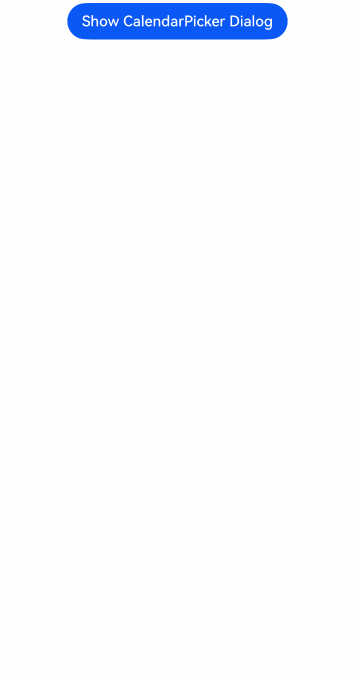
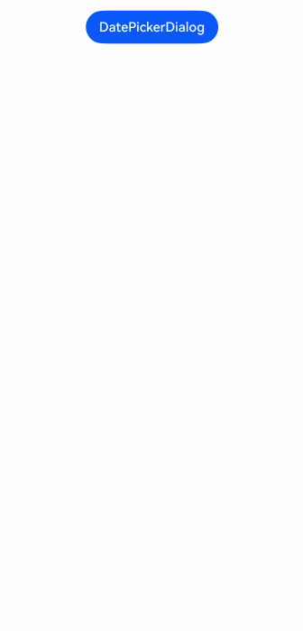
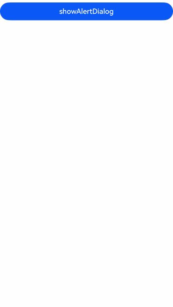

# 固定样式弹出框

固定样式弹出框采用固定的布局格式，这使得开发者无需关心具体的显示布局细节，只需输入所需显示的文本内容，从而简化了使用流程，提升了便捷性。

## 使用约束

- 操作菜单（showActionMenu）、对话框（showDialog）需先使用PromptAction方法获取到PromptAction对象，再通过该对象调用对应方法。

- 操作菜单（showActionMenu）、对话框（showDialog）、列表选择弹出框（ActionSheet）、警告弹出框（AlertDialog）可以设置isModal为false，变成非模态弹窗。

## 操作菜单（showActionMenu）

操作菜单通过PromptAction方法获取到PromptAction对象，支持在回调或开发者自定义类中使用。

创建并显示操作菜单后，菜单的响应结果会异步返回选中按钮在buttons数组中的索引。

 <!-- run -->

```cangjie
// xxx.cj
package ohos_app_cangjie_entry

import ohos.base.*
import ohos.arkui.component.*
import ohos.arkui.state_management.*
import ohos.arkui.state_macro_manage.*
import std.collection.*
import ohos.prompt_action.ButtonInfo
import ohos.prompt_action.PromptAction

@Entry
@Component
class EntryView {
    @State var index1: Int32 = 0
    func build() {
         Column {
            Button("showActionMenu").onClick(
                {
                    evt =>
                    let buttons: Array<ButtonInfo> = [ButtonInfo("item1", Color.Gray), ButtonInfo("item2", Color.Black)]
                    PromptAction.showActionMenu(title: "showActionMenu Title Info", buttons: buttons,
                        callback: {
                            err: Option<AsyncError>, i: Option<Int32> => try {
                                match (err) {
                                    case Some(e) => AppLog.error("error: errcode is ${e.code}")
                                    case _ => index1 = i.getOrThrow()
                                }
                            } catch (e: Exception) {
                                AppLog.error(e.toString())
                            }
                        })
                }
            )
        }.width(100.percent).padding(top: 5)
    }
}

```


## 对话框（showDialog）

对话框通过PromptAction方法获取到PromptAction对象，支持在回调或开发者自定义类中使用。

创建并显示对话框，对话框响应后异步返回选中按钮在buttons数组中的索引。

 <!-- run -->

```cangjie
// xxx.cj
package ohos_app_cangjie_entry

import ohos.base.*
import ohos.arkui.component.*
import ohos.arkui.state_management.*
import ohos.arkui.state_macro_manage.*
import std.collection.*
import ohos.prompt_action.ButtonInfo
import ohos.prompt_action.PromptAction

@Entry
@Component
class EntryView {
    @State var index0: Int32 = 0
    func build() {
        Column {
            Button("showDialog").onClick(
                {
                    evt =>
                    let buttons: Array<ButtonInfo> = [
                        ButtonInfo("button1", Color.Black),
                        ButtonInfo("button2", Color.Black)]
                    PromptAction.showDialog(title: "showDialog Title Info", message: "Message Info", buttons: buttons,
                        callback: {
                            err: Option<AsyncError>, i: Option<Int32> => try {
                                match (err) {
                                    case Some(e) => AppLog.error("error: errcode is ${e.code}")
                                    case _ => index0 = i.getOrThrow()
                                }
                            } catch (e: Exception) {
                                AppLog.error(e.toString())
                            }
                        })
                }
            )
        }.width(100.percent).padding(top: 5)
    }
}

```


## 选择器弹窗（PickerDialog）

选择器弹窗通常用于在用户进行某些操作（如点击按钮）时显示特定的信息或选项。

### 生命周期

弹窗提供了生命周期函数用于通知用户该弹窗的生命周期。
生命周期的触发顺序可看各组件API参考。

| 名称            |类型| 说明                       |
| :----------------- | :------ | :---------------------------- |
| onDidAppear    | () -> Unit  | 弹窗弹出时的事件回调。  |
| onDidDisappear |() -> Unit  | 弹窗消失时的事件回调。  |
| onWillAppear    | () -> Unit | 弹窗显示动效前的事件回调。 |
| onWillDisappear | () -> Unit | 弹窗退出动效前的事件回调。 |

### 日历选择器弹窗（CalendarPickerDialog）

日历选择器弹窗提供日历视图，包含年、月和星期信息，开发者可调用show函数，定义并弹出日历选择器弹窗。

通过配置 acceptButtonStyle、cancelButtonStyle可以实现自定义按钮样式。

 <!-- run -->

```cangjie
// xxx.cj
package ohos_app_cangjie_entry

import ohos.base.*
import ohos.arkui.component.*
import ohos.arkui.state_management.*
import ohos.arkui.state_macro_manage.*
import std.collection.*
import std.time.DateTime
import kit.PerformanceAnalysisKit.Hilog

@Entry
@Component
class EntryView {
    @State
    var selectedDate: DateTime = DateTime.now()
    func build() {
        Row {
            Column {
                Button("Show CalendarPicker Dialog").onClick {
                    Hilog.info(0, "AppLogCj", "CalendarDialog.show")
                    let acceptButtonStyle = PickerDialogButtonStyle(
                        fontColor: Color.Blue,
                        fontSize: 16.fp,
                        fontStyle: FontStyle.Normal,
                        fontFamily: "sans-serif",
                        backgroundColor: Color.White,
                        borderRadius: BorderRadiuses(topLeft: 10, topRight: 10, bottomLeft: 10, bottomRight: 10)
                    )

                    let cancelButtonStyle = PickerDialogButtonStyle(
                        fontColor: Color.Red,
                        fontSize: 16.fp,
                        fontStyle: FontStyle.Normal,
                        fontFamily: "sans-serif",
                        backgroundColor: Color.White,
                        borderRadius: BorderRadiuses(topLeft: 10, topRight: 10, bottomLeft: 10, bottomRight: 10)
                    )
                    CalendarPickerDialog.show(
                        options: CalendarDialogOptions(
                            selected: selectedDate,
                            acceptButtonStyle: acceptButtonStyle,
                            cancelButtonStyle: cancelButtonStyle,
                            onAccept: {
                                value => Hilog.info(0, "AppLogCj",
                                    "calendar onAccept: ${value.year}-${value.monthValue}-${value.dayOfMonth}")
                            },
                            onCancel: {=> Hilog.info(0, "AppLogCj", "calendar onCancel")},
                            onChange: {
                                value => Hilog.info(0, "AppLogCj",
                                    "calendar onChange: ${value.year}-${value.monthValue}-${value.dayOfMonth}")
                            },
                            onDidAppear: {=> Hilog.info(0, "AppLogCj", "calendar onDidAppear")},
                            onDidDisappear: {=> Hilog.info(0, "AppLogCj", "calendar onDidDisappear")},
                            onWillAppear: {=> Hilog.info(0, "AppLogCj", "calendar onWillAppear")},
                            onWillDisappear: {=> Hilog.info(0, "AppLogCj", "calendar onWillDisappear")},
                            shadow: ShadowOptions(radius: 20.0, color: Color.Gray, offsetX: 50.0, offsetY: 10.0)
                        )
                    )
                }
            }.width(100.percent).padding(top: 5)
        }
    }
}

```



### 日期滑动选择器弹窗（DatePickerDialog）

开发者可以根据指定的日期范围，创建日期滑动选择器弹窗，将日期信息清晰地展示在弹出的窗口上。

弹窗中配置lunarSwitch、showTime为true时，展示切换农历的开关以及时间，当checkbox被选中时，显示农历。当按下确定按钮时，弹窗会通过onDateAccept返回目前所选中的日期。如需弹窗再次弹出时显示选中的是上一次确定的日期，就要在回调中重新给selectTime进行赋值。

 <!-- run -->

```cangjie
package ohos_app_cangjie_entry
import kit.ArkUI.*
import ohos.arkui.state_macro_manage.*
import std.time.*
import ohos.hilog.*

@Entry
@Component
class EntryView {
    @State
    var selectedDate: DateTime = DateTime.of(year: 2023, month: Month.of(1), dayOfMonth: 1)
    func build() {
        Column {
            Button("DatePickerDialog")
                .margin(20)
                .onClick {
                    Hilog.info(0, "AppLogCj", "DatePickerDialog.show")
                    DatePickerDialog.show(
                        options: DatePickerDialogOptions(
                            start: DateTime.of(year: 2000, month: Month.of(1), dayOfMonth: 1),
                            end: DateTime.of(year: 2100, month: Month.of(12), dayOfMonth: 31),
                            selected: this.selectedDate,
                            showTime: true,
                            lunarSwitch: true,
                            useMilitaryTime: false,
                            disappearTextStyle: PickerTextStyle(Color.PINK, MyFont(size: 22.fp, weight: FontWeight.Bold)),
                            textStyle: PickerTextStyle(0xff00ff00, MyFont(size: 18.fp, weight: FontWeight.Normal)),
                            selectedTextStyle: PickerTextStyle(0xff182431, MyFont(size: 14.fp, weight: FontWeight.Regular)),
                            onDateAccept: {
                                value => Hilog.info(0, "AppLogCj",
                                    "DatePickerDialog:onDateAccept(): ${value.year}-${value.monthValue}-${value.dayOfMonth}")
                            },
                            onCancel: {=> Hilog.info(0, "AppLogCj", "DatePickerDialog:onCancel()")},
                            onDateChange: {
                                value => Hilog.info(0, "AppLogCj",
                                    "DatePickerDialog:onDateChange(): ${value.year}-${value.monthValue}-${value.dayOfMonth}")
                            },
                            onDidAppear: {=> Hilog.info(0, "AppLogCj", "DatePickerDialog:onDidAppear()")},
                            onDidDisappear: {=> Hilog.info(0, "AppLogCj", "DatePickerDialog:onDidDisappear()")},
                            onWillAppear: {=> Hilog.info(0, "AppLogCj", "DatePickerDialog:onWillAppear()")},
                            onWillDisappear: {=> Hilog.info(0, "AppLogCj", "DatePickerDialog:onWillDisappear()")}
                        )
                    )
                }
        }.width(100.percent)
    }
}
```



## 列表选择弹窗（ActionSheet）

列表选择器弹窗适用于呈现多个操作选项，尤其当界面中仅需展示操作列表而无其他内容时。

列表选择器弹窗通过ActionSheet中的[show](../../../API_Reference/source_zh_cn/arkui-cj/cj-dialog-actionsheet.md#static-func-showactionsheetoptions)接口实现。

该示例通过配置width、height、transition等接口定义了弹窗的样式以及弹出动效。

 <!-- run -->

```cangjie
// xxx.cj
package ohos_app_cangjie_entry

import ohos.base.*
import ohos.arkui.component.*
import ohos.arkui.state_management.*
import ohos.arkui.state_macro_manage.*
import std.collection.*

@Entry
@Component
class EntryView {
    func build() {
        Column() {
            Button('showActionSheet').onClick {
                let confirm: Confirm = Confirm("Confirm button", {=> AppLog.info("Get Alert Dialog handled")},
                    defaultFocus: true, style: DialogButtonStyle.DEFAULT)
                let sheets: Array<SheetInfo> = [
                    SheetInfo("apple", {=> AppLog.info("apple")}),
                    SheetInfo("banana", {=> AppLog.info("banana")}),
                    SheetInfo("pears", {=> AppLog.info("pears")})]
                ActionSheet.show(
                    ActionSheetOptions(
                        'ActionSheet title',
                        'message',
                        sheets,
                        autoCancel: false,
                        confirm: confirm,
                        width: 300,
                        height: 300,
                        cornerRadius: BorderRadiuses(topLeft: 20.vp, topRight: 20.vp, bottomLeft: 20.vp,
                            bottomRight: 20.vp),
                        borderWidth: 1.vp,
                        borderStyle: EdgeStyle.SOILD,
                        borderColor: Color.Blue,
                        backgroundColor: Color.White,
                        transition: TransitionEffect.asymmetric(
                            TransitionEffect
                                .OPACITY
                                .animation(AnimateParam(duration: 3000, curve: Curve.Sharp))
                                .combine(
                                    TransitionEffect
                                        .scale(ScaleOptions(x: 1.5, y: 1.5))
                                        .animation(AnimateParam(duration: 3000, curve: Curve.Sharp))),
                            TransitionEffect
                                .OPACITY
                                .animation(AnimateParam(duration: 100, curve: Curve.Smooth))
                                .combine(
                                    TransitionEffect
                                        .scale(ScaleOptions(x: 0.5, y: 0.5))
                                        .animation(AnimateParam(duration: 100, curve: Curve.Smooth)))
                        ),
                        alignment: DialogAlignment.Center,
                    )
                )
            }
        }.width(100.percent).margin(top: 5)
    }
}
```


## 警告弹窗（AlertDialog）

需要向用户提问或得到用户的许可时，可使用警告弹窗。

- 警告弹窗用来提示重要信息，但会中断当前任务，尽量提供必要的信息和有用的操作。
- 避免仅使用警告弹窗提供信息，用户不喜欢被信息丰富但不可操作的警告打断。

该示例通过配置width、height、transition等接口定义了多个按钮弹窗的样式以及弹出动效。

 <!-- run -->

```cangjie
// xxx.cj
package ohos_app_cangjie_entry

import ohos.base.*
import ohos.arkui.component.*
import ohos.arkui.state_management.*
import ohos.arkui.state_macro_manage.*

@Entry
@Component
class EntryView {
    func build() {
        Column() {
            Button('showAlertDialog')
                .onClick {
                    let primaryButton = AlertDialogButtonOptions(
                        value: 'cancel',
                        action: {
                            => AppLog.info('Callback when the first button is clicked')
                        }
                    )
                    let secondaryButton = AlertDialogButtonOptions(
                        enabled: true,
                        defaultFocus: true,
                        style: DialogButtonStyle.HIGHLIGHT,
                        value: 'ok',
                        action: {
                            => AppLog.info('Callback when the second button is clicked')
                        }
                    )
                    AlertDialog.show(
                        AlertDialogParamWithButtons(
                            'text',
                            title: 'title',
                            autoCancel: true,
                            alignment: DialogAlignment.Center,
                            offset: Offset(0.0, -20.0),
                            gridCount: 3,
                            transition: TransitionEffect.asymmetric(
                                TransitionEffect
                                    .OPACITY
                                    .animation(AnimateParam(duration: 3000, curve: Curve.Sharp))
                                    .combine(TransitionEffect.scale(ScaleOptions(x: 1.5, y: 1.5)))
                                    .animation(AnimateParam(duration: 3000, curve: Curve.Sharp)),
                                TransitionEffect
                                    .OPACITY
                                    .animation(AnimateParam(duration: 100, curve: Curve.Smooth))
                                    .combine(
                                        TransitionEffect
                                            .scale(ScaleOptions(x: 0.5, y: 0.5))
                                            .animation(AnimateParam(duration: 100, curve: Curve.Smooth)))
                            ),
                            primaryButton: primaryButton,
                            secondaryButton: secondaryButton
                        )
                    )
                }.width(100.percent).margin(top: 5)
        }
    }
}
```


