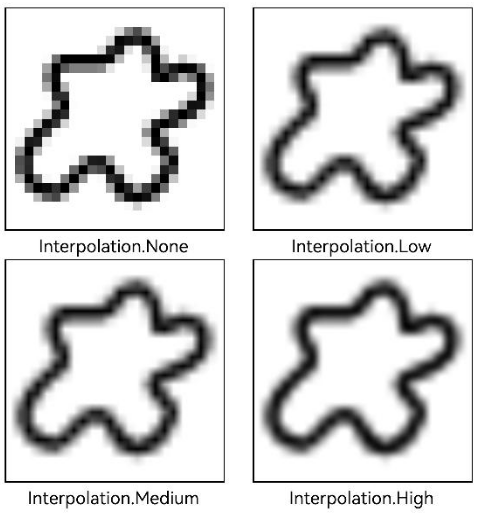
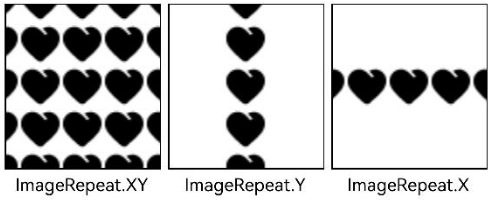

# 显示图片 (Image)

开发者经常需要在应用中显示一些图片，例如：按钮中的icon、网络图片、本地图片等。在应用中显示图片需要使用Image组件实现，Image支持多种图片格式，包括png、jpg、bmp、svg、gif和heif，具体用法请参考[Image](../../../API_Reference/source_zh_cn/arkui-cj/cj-image-video-image.md)组件。

Image通过调用接口来创建，接口调用形式如下：

```cangjie
Image(src: String | AppResource | PixelMap | ImageContent)
```

该接口通过图片数据源获取图片，支持本地图片和网络图片的渲染展示。其中，src是图片的数据源，加载方式请参考[加载图片资源](#加载图片资源)。

## 加载图片资源

Image支持加载存档图、多媒体像素图两种类型。

### 存档图类型数据源

存档图类型的数据源可以分为本地资源、网络资源、Resource资源、媒体库资源和base64。

- 本地资源

  创建文件夹，将本地图片放入cangjie文件夹下的任意位置。

  Image组件引入本地图片路径，即可显示图片（根目录为cangjie文件夹）。

  ```cangjie
  Image('file://media/images/view.jpg')
  .width(200)
  ```

- 网络资源

  引入网络图片需申请权限ohos.permission.INTERNET。此时，Image组件的src参数为网络图片的链接。

  当前Image组件仅支持加载简单网络图片。

  Image组件首次加载网络图片时，需要请求网络资源，非首次加载时，默认从缓存中直接读取图片。

  网络图片必须支持RFC 9113标准，否则会导致加载失败。如果下载的网络图片大于10MB或一次下载的网络图片数量较多，建议使用[HTTP](../network/cj-http-request.md)工具提前预下载，提高图片加载性能，方便应用侧管理数据。

  ```cangjie
  Image("https://www.example.com/example.jpg") // 实际使用时请替换为真实地址
  ```

- Resource资源

  使用资源格式可以跨包/跨模块引入图片，resources文件夹下的图片都可以通过@r资源接口读取到并转换到AppResource格式。resources文件夹下的目录结构如下图所示：

  

  调用方式：

  ```cangjie
  Image(@r(app.media.startIcon))
  ```

- 媒体库file://media/storage

  支持file://路径前缀的字符串

  从媒体库获取的url格式通常如下。

  ```cangjie
  Image('file://media/Photos/5')
  .width(200)
  ```

## 显示矢量图

Image组件可显示矢量图（svg格式的图片），svg标签文档请参考[svg说明](../../../API_Reference/source_zh_cn/ImageKit/cj-apis-image.md#svg标签说明)。

svg格式的图片可以使用fillColor属性改变图片的绘制颜色。

```cangjie
Image(@r(app.media.cloud))
  .width(50)
  .fillColor(Color.Blue)
```

svg格式的原始图片如图：


设置绘制颜色后的svg图片如图：


### 矢量图引用位图

如果Image加载的Svg图源中包含对本地位图的引用，则Svg图源的路径应当设置为以cangjie为根目录的工程路径，同时，本地位图的路径应设置为与Svg图源同级的相对路径。

Image加载的Svg图源路径设置方法如下所示：

```cangjie
Image('resource://rawfile/icon.svg')
  .width(50)
  .height(50)
```

Svg图源通过`<image>`标签的`xmlns:xlink`属性指定本地位图路径，本地位图路径设置为跟Svg图源同级的相对路径：

```cangjie
<svg width="200" height="200">
  <image width="200" height="200" xmlns:xlink="sky.svg">
</svg>
```

文件工程路径示例如图：


## 添加属性

给Image组件设置属性可以使图片显示更灵活，达到一些自定义的效果。以下是几个常用属性的使用示例，完整属性信息详见[Image](../../../API_Reference/source_zh_cn/arkui-cj/cj-image-video-image.md)。

### 设置图片缩放类型

通过objectFit属性使图片缩放到高度和宽度确定的框内。

 <!-- run -->

```cangjie
package ohos_app_cangjie_entry
import kit.ArkUI.*
import ohos.arkui.state_macro_manage.*
import ohos.resource_manager.*

@Entry
@Component
class EntryView {
    let scroller: Scroller = Scroller()
    func build() {
        Scroll(this.scroller) {
            Column() {
                Row() {
                    Image(@r(app.media.example))
                        .width(160)
                        .height(120)
                        .border(width: 1)
                        // 保持宽高比进行缩小或者放大，使得图片完全显示在显示边界内。
                        .objectFit(ImageFit.Contain)
                        .margin(15)
                        .overlay(value: 'Contain', align: Alignment.Bottom, offset: OverlayOffset(x: 0.0, y: 20.0))
                    Image(@r(app.media.example))
                        .width(160)
                        .height(120)
                        .border(width: 1)
                        // 保持宽高比进行缩小或者放大，使得图片两边都大于或等于显示边界。
                        .objectFit(ImageFit.Cover)
                        .margin(15)
                        .overlay(value: 'Cover', align: Alignment.Bottom, offset: OverlayOffset(x: 0.0, y: 20.0))
                }
                Row() {
                    Image(@r(app.media.example))
                        .width(160)
                        .height(120)
                        .border(width: 1)
                        // 自适应显示。
                        .objectFit(ImageFit.Auto)
                        .margin(15)
                        .overlay(value: 'Auto', align: Alignment.Bottom, offset: OverlayOffset(x: 0.0, y: 20.0))
                    Image(@r(app.media.example))
                        .width(160)
                        .height(80)
                        .border(width: 1)
                        // 不保持宽高比进行放大缩小，使得图片充满显示边界。
                        .objectFit(ImageFit.Fill)
                        .margin(15)
                        .overlay(value: 'Fill', align: Alignment.Bottom, offset: OverlayOffset(x: 0.0, y: 20.0))
                }
                Row() {
                    Image(@r(app.media.example))
                        .width(160)
                        .height(120)
                        .border(width: 1)
                        // 保持宽高比显示，图片缩小或者保持不变。
                        .objectFit(ImageFit.ScaleDown)
                        .margin(15)
                        .overlay(value: 'ScaleDown', align: Alignment.Bottom, offset: OverlayOffset(x: 0.0, y: 20.0))
                    Image(@r(app.media.example))
                        .width(160)
                        .height(80)
                        .border(width: 1)
                        // 保持原有尺寸显示。
                        .objectFit(ImageFit.None)
                        .margin(15)
                        .overlay(value: 'None', align: Alignment.Bottom, offset: OverlayOffset(x: 0.0, y: 20.0))
                }
            }
        }
    }
}
```


### 图片插值

当原图分辨率较低并且放大显示时，图片会模糊出现锯齿。这时可以使用interpolation属性对图片进行插值，使图片显示得更清晰。

 <!-- run -->

```cangjie
package ohos_app_cangjie_entry

import kit.ArkUI.*
import ohos.arkui.state_macro_manage.*
import ohos.resource_manager.*

@Entry
@Component
class EntryView {
    func build() {
        Column() {
            Row() {
                Image(@r(app.media.grass))
                    .width(40.percent)
                    .interpolation(ImageInterpolation.None)
                    .borderWidth(1)
                    .overlay(value: "Interpolation.None", align: Alignment.Bottom, offset: OverlayOffset(x: 0.0, y: 20.0
                    ))
                    .margin(10)
                Image(@r(app.media.grass))
                    .width(40.percent)
                    .interpolation(ImageInterpolation.Low)
                    .borderWidth(1)
                    .overlay(value: "Interpolation.Low", align: Alignment.Bottom, offset: OverlayOffset(x: 0.0, y: 20.0)
                    )
                    .margin(10)
            }
                .width(100.percent)
                .justifyContent(FlexAlign.Center)

            Row() {
                Image(@r(app.media.grass))
                    .width(40.percent)
                    .interpolation(ImageInterpolation.Medium)
                    .borderWidth(1)
                    .overlay(value: "Interpolation.Medium", align: Alignment.Bottom,
                        offset: OverlayOffset(x: 0.0, y: 20.0))
                    .margin(10)
                Image(@r(app.media.grass))
                    .width(40.percent)
                    .interpolation(ImageInterpolation.High)
                    .borderWidth(1)
                    .overlay(value: "Interpolation.High", align: Alignment.Bottom, offset: OverlayOffset(x: 0.0, y: 20.0
                    ))
                    .margin(10)
            }
                .width(100.percent)
                .justifyContent(FlexAlign.Center)
        }.height(100.percent)
    }
}
```



### 设置图片重复样式

通过objectRepeat属性设置图片的重复样式方式，重复样式请参考[ImageRepeat](../../../API_Reference/source_zh_cn/arkui-cj/cj-common-types.md#enum-imagerepeat)枚举说明。

 <!-- run -->

```cangjie
package ohos_app_cangjie_entry

import kit.ArkUI.*
import ohos.arkui.state_macro_manage.*
import ohos.resource_manager.*

@Entry
@Component
class EntryView {
    func build() {
        Column(space: 10) {
            Row(space: 5) {
                Image(@r(app.media.ic_public_favor_filled_1))
                    .width(110)
                    .height(115)
                    .border(width: 1)
                    .objectRepeat(ImageRepeat.XY)
                    .objectFit(ImageFit.ScaleDown)
                    // 在水平轴和竖直轴上同时重复绘制图片
                    .overlay(value: 'ImageRepeat.XY', align: Alignment.Bottom, offset: OverlayOffset(x: 0.0, y: 20.0))
                Image(@r(app.media.ic_public_favor_filled_1))
                    .width(110)
                    .height(115)
                    .border(width: 1)
                    .objectRepeat(ImageRepeat.Y)
                    .objectFit(ImageFit.ScaleDown)
                    // 只在竖直轴上重复绘制图片
                    .overlay(value: 'ImageRepeat.Y', align: Alignment.Bottom, offset: OverlayOffset(x: 0.0, y: 20.0))
                Image(@r(app.media.ic_public_favor_filled_1))
                    .width(110)
                    .height(115)
                    .border(width: 1)
                    .objectRepeat(ImageRepeat.X)
                    .objectFit(ImageFit.ScaleDown)
                    // 只在水平轴上重复绘制图片
                    .overlay(value: 'ImageRepeat.X', align: Alignment.Bottom, offset: OverlayOffset(x: 0.0, y: 20.0))
            }
        }
        .height(150)
        .width(100.percent)
        .padding(8)
    }
}
```



### 设置图片渲染模式

通过renderMode属性设置图片的渲染模式为原色或黑白。

 <!-- run -->

```cangjie
package ohos_app_cangjie_entry

import kit.ArkUI.*
import ohos.arkui.state_macro_manage.*
import ohos.resource_manager.*

@Entry
@Component
class EntryView {
    func build() {
        Column(space: 10) {
            Row(50) {
                Image(@r(app.media.example))
                    // 设置图片的渲染模式为原色
                    .renderMode(ImageRenderMode.Original)
                    .width(100)
                    .height(100)
                    .border(width: 1)
                    // overlay是通用属性，用于在组件上显示说明文字
                    .overlay(value: 'Original', align: Alignment.Bottom, offset: OverlayOffset(x: 0.0, y: 20.0))
                Image(@r(app.media.example))
                    // 设置图片的渲染模式为黑白
                    .renderMode(ImageRenderMode.Template)
                    .width(100)
                    .height(100)
                    .border(width: 1)
                    .overlay(value: 'Template', align: Alignment.Bottom, offset: OverlayOffset(x: 0.0, y: 20.0))
            }
        }
        .height(150)
        .width(100.percent)
        .padding(top: 20, right: 10)
    }
}
```


### 设置图片解码尺寸

通过sourceSize属性设置图片解码尺寸，降低图片的分辨率。

原图尺寸为1280\*960，该示例将图片解码为40\*40和90\*90。

 <!-- run -->

```cangjie
package ohos_app_cangjie_entry

import kit.ArkUI.*
import ohos.arkui.state_macro_manage.*
import ohos.resource_manager.*

@Entry
@Component
class EntryView {
    func build() {
        Column() {
            Row(50) {
                Image(@r(app.media.example))
                    .sourceSize(40, 40)
                    .objectFit(ImageFit.ScaleDown)
                    .aspectRatio(1.0)
                    .width(25.percent)
                    .border(width: 1)
                    .overlay(value: 'width:40 height:40', align: Alignment.Bottom, offset: OverlayOffset(x: 0.0, y: 40.0))
                Image(@r(app.media.example))
                    .sourceSize(90, 90)
                    .objectFit(ImageFit.ScaleDown)
                    .width(25.percent)
                    .aspectRatio(1.0)
                    .border(width: 1)
                    .overlay(value: 'width:90 height:90', align: Alignment.Bottom, offset: OverlayOffset(x: 0.0, y: 40.0))
            }
            .height(150)
            .width(100.percent)
            .padding(20)
        }
    }
}
```


### 为图片添加滤镜效果

通过colorFilter修改图片的像素颜色，为图片添加滤镜。

 <!-- run -->

```cangjie
package ohos_app_cangjie_entry

import kit.ArkUI.*
import ohos.arkui.state_macro_manage.*
import ohos.resource_manager.*

@Entry
@Component
class EntryView {
    let colorFilter = ColorFilter([1.0, 1.0, 0.0, 0.0, 0.0, 0.0, 1.0, 0.0, 0.0, 0.0, 0.0, 0.0, 1.0, 0.0, 0.0, 0.0, 0.0,
        0.0, 1.0, 0.0])
    func build() {
        Column() {
            Row() {
                Image(@r(app.media.example))
                    .width(40.percent)
                    .margin(10)
                Image(@r(app.media.example))
                    .width(40.percent)
                    .colorFilter(colorFilter)
                    .margin(10)
            }
            .width(100.percent)
            .justifyContent(FlexAlign.Center)
        }
    }
}
```


### 同步加载图片

一般情况下，图片加载流程会异步进行，以避免阻塞主线程，影响UI交互。但是特定情况下，图片刷新时会出现闪烁，这时可以使用syncLoad属性，使图片同步加载，从而避免出现闪烁。不建议图片加载较长时间时使用，会导致页面无法响应。

```cangjie
Image(@r(app.media.icon))
  .syncLoad(true)
```

## 事件调用

通过在Image组件上绑定onComplete事件，图片加载成功后可以获取图片的必要信息。如果图片加载失败，也可以通过绑定onError回调来获得结果。

 <!-- run -->

```cangjie
package ohos_app_cangjie_entry

import kit.ArkUI.*
import ohos.arkui.state_macro_manage.*
import ohos.resource_manager.*
import kit.PerformanceAnalysisKit.Hilog

@Entry
@Component
class EntryView {
    @State var widthValue: Float64 = 0.0
    @State var heightValue: Float64 = 0.0
    @State var componentWidth: Float64 = 0.0
    @State var componentHeight: Float64 = 0.0
    func build() {
        Column() {
            Row() {
                Image(@r(app.media.example))
                    .width(200)
                    .height(150)
                    .margin(15)
                    .onComplete({msg: ImageLoadResult =>
                        this.widthValue = msg.width
                        this.heightValue = msg.height
                        this.componentWidth = msg.componentWidth
                        this.componentHeight = msg.componentHeight
                    })
                    .onError({evt =>
                        Hilog.info(0, "cangjie", "load image fail")
                    })
                    .overlay(
                        value: '\nwidth: ${this.widthValue}, height: ${this.heightValue}\ncomponentWidth: ${this.componentWidth}\ncomponentHeight: ${this.componentHeight}',
                        align: Alignment.Bottom,
                        offset: OverlayOffset( x: 0.0, y: 60.0 )
                    )
            }
        }
    }
}
```


