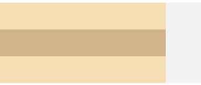
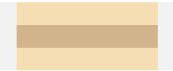
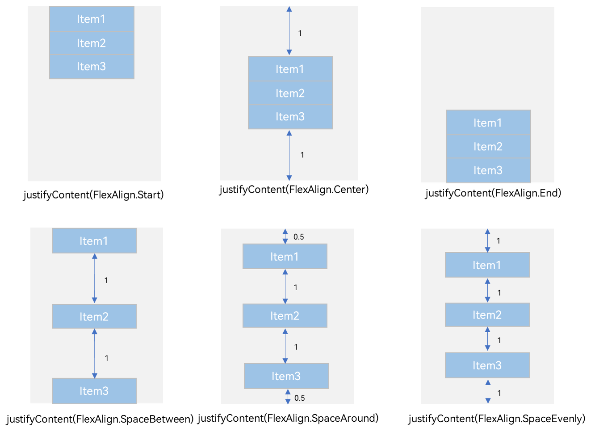
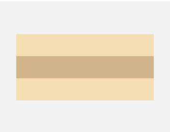
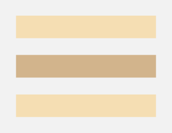
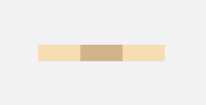
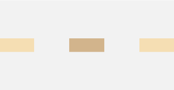

# 线性布局（Row/Column）

## 概述

线性布局（LinearLayout）是开发中最常用的布局，通过线性容器[Row](../../../API_Reference/source_zh_cn/arkui-cj/cj-row-column-stack-row.md)和[Column](../../../API_Reference/source_zh_cn/arkui-cj/cj-row-column-stack-column.md)构建。线性布局是其他布局的基础，其子元素在线性方向上（水平方向和垂直方向）依次排列。线性布局的排列方向由所选容器组件决定，Column容器内子元素按照垂直方向排列，Row容器内子元素按照水平方向排列。根据不同的排列方向，开发者可选择使用Row或Column容器创建线性布局。

**图1** Column容器内子元素排列示意图


**图2** Row容器内子元素排列示意图


## 基本概念

- 布局容器：具有布局能力的组件容器，可以承载其他元素作为其子元素，布局容器会对其子元素进行尺寸计算和布局排列。

- 布局子元素：布局容器内部的元素。

- 主轴：线性布局容器在布局方向上的轴线，子元素默认沿主轴排列。Row容器主轴为水平方向，Column容器主轴为垂直方向。

- 交叉轴：垂直于主轴方向的轴线。Row容器交叉轴为垂直方向，Column容器交叉轴为水平方向。

- 间距：布局子元素的间距。

## 布局子元素在排列方向上的间距

在布局容器内，可以通过space属性设置排列方向上子元素的间距，使各子元素在排列方向上有等间距效果。

### Column容器内排列方向上的间距

**图3** Column容器内排列方向的间距图


### Row容器内排列方向上的间距

**图4** Row容器内排列方向的间距图


## 布局子元素在交叉轴上的对齐方式

在布局容器内，可以通过alignItems属性设置子元素在交叉轴（排列方向的垂直方向）上的对齐方式。且在各类尺寸屏幕中，表现一致。其中，交叉轴为垂直方向时，取值为[VerticalAlign](../../../API_Reference/source_zh_cn/arkui-cj/cj-common-types.md#enum-verticalalign)类型，水平方向取值为[HorizontalAlign](../../../API_Reference/source_zh_cn/arkui-cj/cj-common-types.md#enum-horizontalalign)类型。

alignSelf属性用于控制单个子元素在容器交叉轴上的对齐方式，其优先级高于alignItems属性，如果设置了alignSelf属性，则在单个子元素上会覆盖alignItems属性。

### Column容器内子元素在水平方向上的排列

**图5** Column容器内子元素在水平方向上的排列图


- HorizontalAlign.Start：子元素在水平方向左对齐。

  <!-- run -->

  ```cangjie
  package ohos_app_cangjie_entry
  import kit.UIKit.*
  import ohos.state_macro_manage.*

  @Entry
  @Component
  class EntryView {
      func build() {
          Column() {
              Column() {
              }.width(80.percent).height(50).backgroundColor(0xF5DEB3)
              Column() {
              }.width(80.percent).height(50).backgroundColor(0xD2B48C)
              Column() {
              }.width(80.percent).height(50).backgroundColor(0xF5DEB3)
          }.width(100.percent).alignItems(HorizontalAlign.Start).backgroundColor(0xF2F2F2)
      }
  }
  ```

  

- HorizontalAlign.Center：子元素在水平方向居中对齐。

  <!-- run -->

  ```cangjie
  package ohos_app_cangjie_entry
  import kit.UIKit.*
  import ohos.state_macro_manage.*

  @Entry
  @Component
  class EntryView {
      func build() {
          Column() {
              Column() {
              }.width(80.percent).height(50).backgroundColor(0xF5DEB3)
              Column() {
              }.width(80.percent).height(50).backgroundColor(0xD2B48C)
              Column() {
              }.width(80.percent).height(50).backgroundColor(0xF5DEB3)
          }.width(100.percent).alignItems(HorizontalAlign.Center).backgroundColor(0xF2F2F2)
      }
  }
  ```

  

- HorizontalAlign.End：子元素在水平方向右对齐。

  <!-- run -->

  ```cangjie
  package ohos_app_cangjie_entry
  import kit.UIKit.*
  import ohos.state_macro_manage.*

  @Entry
  @Component
  class EntryView {
      func build() {
          Column() {
              Column() {
              }.width(80.percent).height(50).backgroundColor(0xF5DEB3)
              Column() {
              }.width(80.percent).height(50).backgroundColor(0xD2B48C)
              Column() {
              }.width(80.percent).height(50).backgroundColor(0xF5DEB3)
          }.width(100.percent).alignItems(HorizontalAlign.End).backgroundColor(0xF2F2F2)
      }
  }
  ```

  

### Row容器内子元素在垂直方向上的排列

**图6** Row容器内子元素在垂直方向上的排列图


- VerticalAlign.Top：子元素在垂直方向顶部对齐。

  <!-- run -->

  ```cangjie
  package ohos_app_cangjie_entry
  import kit.UIKit.*
  import ohos.state_macro_manage.*

  @Entry
  @Component
  class EntryView {
      func build() {
          Row() {
              Column() {
              }.width(20.percent).height(30).backgroundColor(0xF5DEB3)
              Column() {
              }.width(20.percent).height(30).backgroundColor(0xD2B48C)
              Column() {
              }.width(20.percent).height(30).backgroundColor(0xF5DEB3)
          }.width(100.percent).height(200).alignItems(VerticalAlign.Top).backgroundColor(0xF2F2F2)
      }
  }
  ```

  

- VerticalAlign.Center：子元素在垂直方向居中对齐。

  <!-- run -->

  ```cangjie
  package ohos_app_cangjie_entry
  import kit.UIKit.*
  import ohos.state_macro_manage.*

  @Entry
  @Component
  class EntryView {
      func build() {
          Row() {
              Column() {
              }.width(20.percent).height(30).backgroundColor(0xF5DEB3)
              Column() {
              }.width(20.percent).height(30).backgroundColor(0xD2B48C)
              Column() {
              }.width(20.percent).height(30).backgroundColor(0xF5DEB3)
          }.width(100.percent).height(200).alignItems(VerticalAlign.Center).backgroundColor(0xF2F2F2)
      }
  }
  ```

  

- VerticalAlign.Bottom：子元素在垂直方向底部对齐。

  <!-- run -->

  ```cangjie
  package ohos_app_cangjie_entry
  import kit.UIKit.*
  import ohos.state_macro_manage.*

  @Entry
  @Component
  class EntryView {
      func build() {
          Row() {
              Column() {
              }.width(20.percent).height(30).backgroundColor(0xF5DEB3)
              Column() {
              }.width(20.percent).height(30).backgroundColor(0xD2B48C)
              Column() {
              }.width(20.percent).height(30).backgroundColor(0xF5DEB3)
          }.width(100.percent).height(200).alignItems(VerticalAlign.Bottom).backgroundColor(0xF2F2F2)
      }
  }
  ```

  

## 布局子元素在主轴上的排列方式

在布局容器内，可以通过justifyContent属性设置子元素在容器主轴上的排列方式。可以从主轴起始位置开始排布，也可以从主轴结束位置开始排布，或者均匀分割主轴的空间。

### Column容器内子元素在垂直方向上的排列

**图7** Column容器内子元素在垂直方向上的排列图



- justifyContent(FlexAlign.Start)：元素在垂直方向首端对齐，第一个元素与行首对齐，同时后续的元素与前一个对齐。

  <!-- run -->

  ```cangjie
  package ohos_app_cangjie_entry
  import kit.UIKit.*
  import ohos.state_macro_manage.*

  @Entry
  @Component
  class EntryView {
      func build() {
          Column() {
              Column() {
              }.width(80.percent).height(50).backgroundColor(0xF5DEB3)
              Column() {
              }.width(80.percent).height(50).backgroundColor(0xD2B48C)
              Column() {
              }.width(80.percent).height(50).backgroundColor(0xF5DEB3)
          }.width(100.percent).height(300).backgroundColor(0xF2F2F2).justifyContent(FlexAlign.Start)
      }
  }
  ```

  

- justifyContent(FlexAlign.Center)：元素在垂直方向中心对齐，第一个元素与行首的距离与最后一个元素与行尾距离相同。

  <!-- run -->

  ```cangjie
  package ohos_app_cangjie_entry
  import kit.UIKit.*
  import ohos.state_macro_manage.*

  @Entry
  @Component
  class EntryView {
      func build() {
          Column() {
              Column() {
              }.width(80.percent).height(50).backgroundColor(0xF5DEB3)
              Column() {
              }.width(80.percent).height(50).backgroundColor(0xD2B48C)
              Column() {
              }.width(80.percent).height(50).backgroundColor(0xF5DEB3)
          }.width(100.percent).height(300).backgroundColor(0xF2F2F2).justifyContent(FlexAlign.Center)
      }
  }
  ```

  

- justifyContent(FlexAlign.End)：元素在垂直方向尾部对齐，最后一个元素与行尾对齐，其他元素与后一个对齐。

  <!-- run -->

  ```cangjie
  package ohos_app_cangjie_entry
  import kit.UIKit.*
  import ohos.state_macro_manage.*

  @Entry
  @Component
  class EntryView {
      func build() {
          Column() {
              Column() {
              }.width(80.percent).height(50).backgroundColor(0xF5DEB3)
              Column() {
              }.width(80.percent).height(50).backgroundColor(0xD2B48C)
              Column() {
              }.width(80.percent).height(50).backgroundColor(0xF5DEB3)
          }.width(100.percent).height(300).backgroundColor(0xF2F2F2).justifyContent(FlexAlign.End)
      }
  }
  ```

  

- justifyContent(FlexAlign.SpaceBetween)：垂直方向均匀分配元素，相邻元素之间距离相同。第一个元素与行首对齐，最后一个元素与行尾对齐。

  <!-- run -->

  ```cangjie
  package ohos_app_cangjie_entry
  import kit.UIKit.*
  import ohos.state_macro_manage.*

  @Entry
  @Component
  class EntryView {
      func build() {
          Column() {
              Column() {
              }.width(80.percent).height(50).backgroundColor(0xF5DEB3)
              Column() {
              }.width(80.percent).height(50).backgroundColor(0xD2B48C)
              Column() {
              }.width(80.percent).height(50).backgroundColor(0xF5DEB3)
          }.width(100.percent).height(300).backgroundColor(0xF2F2F2).justifyContent(FlexAlign.SpaceBetween)
      }
  }
  ```

  

- justifyContent(FlexAlign.SpaceAround)：垂直方向均匀分配元素，相邻元素之间距离相同。第一个元素到行首的距离和最后一个元素到行尾的距离是相邻元素之间距离的一半。

  <!-- run -->

  ```cangjie
  package ohos_app_cangjie_entry
  import kit.UIKit.*
  import ohos.state_macro_manage.*

  @Entry
  @Component
  class EntryView {
      func build() {
          Column() {
              Column() {
              }.width(80.percent).height(50).backgroundColor(0xF5DEB3)
              Column() {
              }.width(80.percent).height(50).backgroundColor(0xD2B48C)
              Column() {
              }.width(80.percent).height(50).backgroundColor(0xF5DEB3)
          }.width(100.percent).height(300).backgroundColor(0xF2F2F2).justifyContent(FlexAlign.SpaceAround)
      }
  }
  ```

  

- justifyContent(FlexAlign.SpaceEvenly)：垂直方向均匀分配元素，相邻元素之间的距离、第一个元素与行首的间距、最后一个元素到行尾的间距都完全一样。

  <!-- run -->

  ```cangjie
  package ohos_app_cangjie_entry
  import kit.UIKit.*
  import ohos.state_macro_manage.*

  @Entry
  @Component
  class EntryView {
      func build() {
          Column() {
              Column() {
              }.width(80.percent).height(50).backgroundColor(0xF5DEB3)
              Column() {
              }.width(80.percent).height(50).backgroundColor(0xD2B48C)
              Column() {
              }.width(80.percent).height(50).backgroundColor(0xF5DEB3)
          }.width(100.percent).height(300).backgroundColor(0xF2F2F2).justifyContent(FlexAlign.SpaceEvenly)
      }
  }
  ```

  

### Row容器内子元素在水平方向上的排列

**图8** Row容器内子元素在水平方向上的排列图


- justifyContent(FlexAlign.Start)：元素在水平方向首端对齐，第一个元素与行首对齐，同时后续的元素与前一个对齐。

  <!-- run -->

  ```cangjie
  package ohos_app_cangjie_entry
  import kit.UIKit.*
  import ohos.state_macro_manage.*

  @Entry
  @Component
  class EntryView {
      func build() {
          Row() {
              Column() {
              }.width(20.percent).height(30).backgroundColor(0xF5DEB3)
              Column() {
              }.width(20.percent).height(30).backgroundColor(0xD2B48C)
              Column() {
              }.width(20.percent).height(30).backgroundColor(0xF5DEB3)
          }.width(100.percent).height(200).backgroundColor(0xF2F2F2).justifyContent(FlexAlign.Start)
      }
  }
  ```

  

- justifyContent(FlexAlign.Center)：元素在水平方向中心对齐，第一个元素与行首的距离与最后一个元素与行尾距离相同。

  <!-- run -->

  ```cangjie
  package ohos_app_cangjie_entry
  import kit.UIKit.*
  import ohos.state_macro_manage.*

  @Entry
  @Component
  class EntryView {
      func build() {
          Row() {
              Column() {
              }.width(20.percent).height(30).backgroundColor(0xF5DEB3)
              Column() {
              }.width(20.percent).height(30).backgroundColor(0xD2B48C)
              Column() {
              }.width(20.percent).height(30).backgroundColor(0xF5DEB3)
          }.width(100.percent).height(200).backgroundColor(0xF2F2F2).justifyContent(FlexAlign.Center)
      }
  }
  ```

  

- justifyContent(FlexAlign.End)：元素在水平方向尾部对齐，最后一个元素与行尾对齐，其他元素与后一个对齐。

  <!-- run -->

  ```cangjie
  package ohos_app_cangjie_entry
  import kit.UIKit.*
  import ohos.state_macro_manage.*

  @Entry
  @Component
  class EntryView {
      func build() {
          Row() {
              Column() {
              }.width(20.percent).height(30).backgroundColor(0xF5DEB3)
              Column() {
              }.width(20.percent).height(30).backgroundColor(0xD2B48C)
              Column() {
              }.width(20.percent).height(30).backgroundColor(0xF5DEB3)
          }.width(100.percent).height(200).backgroundColor(0xF2F2F2).justifyContent(FlexAlign.End)
      }
  }
  ```

  

- justifyContent(FlexAlign.SpaceBetween)：水平方向均匀分配元素，相邻元素之间距离相同。第一个元素与行首对齐，最后一个元素与行尾对齐。

  <!-- run -->

  ```cangjie
  package ohos_app_cangjie_entry
  import kit.UIKit.*
  import ohos.state_macro_manage.*

  @Entry
  @Component
  class EntryView {
      func build() {
          Row() {
              Column() {
              }.width(20.percent).height(30).backgroundColor(0xF5DEB3)
              Column() {
              }.width(20.percent).height(30).backgroundColor(0xD2B48C)
              Column() {
              }.width(20.percent).height(30).backgroundColor(0xF5DEB3)
          }.width(100.percent).height(200).backgroundColor(0xF2F2F2).justifyContent(FlexAlign.SpaceBetween)
      }
  }
  ```

  

- justifyContent(FlexAlign.SpaceAround)：水平方向均匀分配元素，相邻元素之间距离相同。第一个元素到行首的距离和最后一个元素到行尾的距离是相邻元素之间距离的一半。

  <!-- run -->

  ```cangjie
  package ohos_app_cangjie_entry
  import kit.UIKit.*
  import ohos.state_macro_manage.*

  @Entry
  @Component
  class EntryView {
      func build() {
          Row() {
              Column() {
              }.width(20.percent).height(30).backgroundColor(0xF5DEB3)
              Column() {
              }.width(20.percent).height(30).backgroundColor(0xD2B48C)
              Column() {
              }.width(20.percent).height(30).backgroundColor(0xF5DEB3)
          }.width(100.percent).height(200).backgroundColor(0xF2F2F2).justifyContent(FlexAlign.SpaceAround)
      }
  }
  ```

  

- justifyContent(FlexAlign.SpaceEvenly)：水平方向均匀分配元素，相邻元素之间的距离、第一个元素与行首的间距、最后一个元素到行尾的间距都完全一样。

  <!-- run -->

  ```cangjie
  package ohos_app_cangjie_entry
  import kit.UIKit.*
  import ohos.state_macro_manage.*

  @Entry
  @Component
  class EntryView {
      func build() {
          Row() {
              Column() {
              }.width(20.percent).height(30).backgroundColor(0xF5DEB3)
              Column() {
              }.width(20.percent).height(30).backgroundColor(0xD2B48C)
              Column() {
              }.width(20.percent).height(30).backgroundColor(0xF5DEB3)
          }.width(100.percent).height(200).backgroundColor(0xF2F2F2).justifyContent(FlexAlign.SpaceEvenly)
      }
  }
  ```

  
