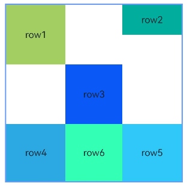
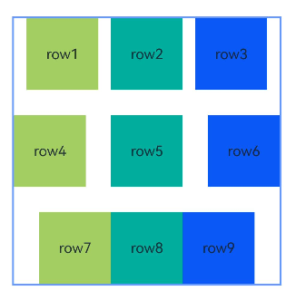

# 相对布局（RelativeContainer）

## 概述

在应用的开发过程中，经常需要设计复杂界面，此时涉及到多个相同或不同组件之间的嵌套。如果布局组件嵌套深度过深，或者嵌套组件数过多，会带来额外的开销。如果在布局的方式上进行优化，就可以有效的提升性能，减少时间开销。

RelativeContainer是一种采用相对布局的容器，支持容器内部的子元素设置相对位置关系，适用于界面复杂场景的情况，对多个子组件进行对齐和排列。子元素支持指定兄弟元素作为锚点，也支持指定父容器作为锚点，基于锚点做相对位置布局。下图1是一个RelativeContainer的概念图，图中的虚线表示位置的依赖关系。

**图1** 相对布局示意图


子元素并不完全是上图中的依赖关系。比如，Item4可以以Item2为依赖锚点，也可以以RelativeContainer父容器为依赖锚点。

## 基本概念

- 参考边界：设置当前组件的哪个边界对齐到锚点。

- 锚点：通过锚点设置当前元素基于哪个元素确定位置。

- 对齐方式：通过对齐方式，设置当前元素是基于锚点的上中下对齐，还是基于锚点的左中右对齐。

## 设置依赖关系

### 设置参考边界

设置当前组件的哪个边界对齐到锚点。容器内子组件的参考边界区分水平方向和垂直方向。

- 在水平方向上，可以按照起始（left）、居中（middle）或尾端（right）的组件边界与锚点对齐。当设置三个边界时，仅起始（left）和居中（middle）的边界设置生效。

    

- 在垂直方向上，可以设置组件边界与锚点对齐，具体包括顶部（top）、居中（center）和底部（bottom）。当设置三个边界时，仅顶部（top）和居中（center）生效。

    

### 设置锚点

锚点设置涉及子元素相对于其父元素或兄弟元素的位置依赖关系。具体而言，子元素可以将其位置锚定到相对布局容器（RelativeContainer）、辅助线（guideline）、屏障（barrier）或其他子元素上。

为了准确定义锚点，RelativeContainer的子元素必须拥有唯一的组件标识（id），用于指定锚点信息。父元素RelativeContainer的标识默认为“\__container__”，其他子元素的组件标识（id）则通过[id](../../../API_Reference/source_zh_cn/arkui-cj/cj-universal-attribute-componentid.md)属性设置。

> **说明:**
>
> - 未设置组件标识（id）的组件虽可显示，但无法被其他组件引用为锚点。相对布局容器会为其拼接组件标识，但组件标识（id）的规律无法被应用感知。辅助线（guideline）与屏障（barrier）的组件标识（id）需确保唯一，避免与任何组件冲突。若有重复，遵循组件 > guideline > barrier 的优先级。
> - 组件间设置锚点时应避免形成依赖循环（组件之间设置链除外），依赖循环将导致子组件缺乏定位基准，最终无法绘制。

- RelativeContainer父组件为锚点，__container__代表容器的组件标识（id）。

         <!-- run -->

    ```cangjie
    package ohos_app_cangjie_entry
    import kit.ArkUI.*
    import ohos.arkui.state_macro_manage.*

    @Entry
    @Component
    class EntryView {
        func build() {
            RelativeContainer() {
                Row() {
                    Text('row1')
                }
                .justifyContent(FlexAlign.Center)
                .width(100)
                .height(100)
                .backgroundColor(0xa3cf62)
                .alignRules(
                    AlignRuleOption(
                        top: VerticalAnchor("__container__", VerticalAlign.Top),
                        left: HorizontalAnchor("__container__", HorizontalAlign.Start)
                    )
                )
                .id("row1")

                Row() {
                    Text('row2')
                }
                .justifyContent(FlexAlign.Center)
                .width(100)
                .height(100)
                .backgroundColor(0x00ae9d)
                .alignRules(
                    AlignRuleOption(
                        top: VerticalAnchor("__container__", VerticalAlign.Top),
                        right: HorizontalAnchor("__container__", HorizontalAlign.End)
                    )
                )
                .id("row2")
            }
            .width(300)
            .height(300)
            .margin(left: 20)
            .border(width: 2, color: 0x6699FF)
        }
    }
    ```

    

- 以兄弟元素为锚点。

         <!-- run -->

    ```cangjie
    package ohos_app_cangjie_entry
    import kit.ArkUI.*
    import ohos.arkui.state_macro_manage.*

    @Entry
    @Component
    class EntryView {
        func build() {
            RelativeContainer() {
                Row() {
                    Text('row1')
                }
                .justifyContent(FlexAlign.Center)
                .width(100)
                .height(100)
                .backgroundColor(0x00ae9d)
                .alignRules(
                    AlignRuleOption(
                        top: VerticalAnchor("__container__", VerticalAlign.Top),
                        left: HorizontalAnchor("__container__", HorizontalAlign.Start)
                    )
                )
                .id("row1")

                Row() {
                    Text('row2')
                }
                .justifyContent(FlexAlign.Center)
                .width(100)
                .height(100)
                .backgroundColor(0xa3cf62)
                .alignRules(
                    AlignRuleOption(
                        top: VerticalAnchor("row1", VerticalAlign.Bottom),
                        left: HorizontalAnchor("row1", HorizontalAlign.Start)
                    )
                )
                .id("row2")
            }
            .width(300)
            .height(300)
            .margin(left: 20)
            .border(width: 2, color: 0x6699FF)
        }
    }
    ```

    

- 子组件锚点可以任意选择，但需注意不要相互依赖。

         <!-- run -->

    ```cangjie
    package ohos_app_cangjie_entry
    import kit.ArkUI.*
    import ohos.arkui.state_macro_manage.*

    @Entry
    @Component
    class EntryView {
        func build() {
            Row() {
                RelativeContainer() {
                    Row() {Text('row1')}
                    .justifyContent(FlexAlign.Center)
                    .width(100)
                    .height(100)
                    .backgroundColor(0xa3cf62)
                    .alignRules(
                        AlignRuleOption(
                            top: VerticalAnchor("__container__", VerticalAlign.Top),
                            left: HorizontalAnchor("__container__",HorizontalAlign.Start)
                        )
                    )
                    .id("row1")
                    Row() {Text('row2')}
                    .justifyContent(FlexAlign.Center)
                    .width(100)
                    .backgroundColor(0x00ae9d)
                    .alignRules(
                        AlignRuleOption(
                            top: VerticalAnchor("__container__", VerticalAlign.Top),
                            right: HorizontalAnchor("__container__",HorizontalAlign.End),
                            bottom: VerticalAnchor("row1", VerticalAlign.Center),
                        )
                    )
                    .id("row2")
                    Row() {Text('row3')}
                    .justifyContent(FlexAlign.Center)
                    .height(100)
                    .backgroundColor(0x0a59f7)
                    .alignRules(
                        AlignRuleOption(
                            top: VerticalAnchor("row1", VerticalAlign.Bottom),
                            left: HorizontalAnchor("row1", HorizontalAlign.Start),
                            right: HorizontalAnchor("row2", HorizontalAlign.Start)
                        )
                    )
                    .id("row3")
                    Row() {Text('row4')}
                    .justifyContent(FlexAlign.Center)
                    .backgroundColor(0x2ca9e0)
                    .alignRules(
                        AlignRuleOption(
                            top: VerticalAnchor("row3", VerticalAlign.Bottom),
                            left: HorizontalAnchor("row1", HorizontalAlign.Center),
                            right: HorizontalAnchor("row2", HorizontalAlign.End)
                        )
                    )
                    .id("row4")
                }
                .width(300)
                .height(300)
                .margin(left: 50)
                .border(width: 2, color: 0x6699FF)
            }.height(100.percent)
        }
    }
    ```

    

### 设置相对于锚点的对齐位置

设置了锚点之后，可以通过[alignRules](../../../API_Reference/source_zh_cn/arkui-cj/cj-universal-attribute-location.md#func-alignrulesalignruleoption)属性设置相对于锚点的对齐位置。

在水平方向上，对齐位置可以设置为HorizontalAlign.Start、HorizontalAlign.Center、HorizontalAlign.End。


在竖直方向上，对齐位置可以设置为VerticalAlign.Top、VerticalAlign.Center、VerticalAlign.Bottom。


### 子组件位置偏移

子组件经过相对位置对齐后，位置可能还不是目标位置，开发者可根据需要进行额外偏移设置额外偏移（offset）。当使用offset调整位置的组件作为锚点时，对齐位置为设置offset之前的位置。建议使用[bias](../../../API_Reference/source_zh_cn/arkui-cj/cj-universal-attribute-location.md#class-bias)来设置额外偏移。

 <!-- run -->

```cangjie
package ohos_app_cangjie_entry

import kit.ArkUI.*
import ohos.arkui.state_macro_manage.*

@Entry
@Component
class EntryView {
    func build() {
        Row() {
            RelativeContainer() {
                Row() {
                    Text('row1')
                }
                .justifyContent(FlexAlign.Center)
                .width(100)
                .height(100)
                .backgroundColor(0xa3cf62)
                .alignRules(
                    AlignRuleOption(
                        top: VerticalAnchor("__container__", VerticalAlign.Top),
                        left: HorizontalAnchor("__container__",HorizontalAlign.Start)
                    )
                )
                .id("row1")

                Row() {
                    Text('row2')
                }
                .justifyContent(FlexAlign.Center)
                .width(100)
                .backgroundColor(0x00ae9d)
                .alignRules(
                    AlignRuleOption(
                        top: VerticalAnchor("__container__", VerticalAlign.Top),
                        right: HorizontalAnchor("__container__",HorizontalAlign.End),
                        bottom: VerticalAnchor("row1", VerticalAlign.Center)
                    )
                )
                .offset(x: -40, y: -20)
                .id("row2")

                Row() {
                    Text('row3')
                }
                .justifyContent(FlexAlign.Center)
                .height(100)
                .backgroundColor(0x0a59f7)
                .alignRules(
                    AlignRuleOption(
                        top: VerticalAnchor("row1", VerticalAlign.Bottom),
                        left: HorizontalAnchor("row1", HorizontalAlign.End),
                        right: HorizontalAnchor("row2", HorizontalAlign.Start)
                    )
                )
                .offset(x: -10, y: -20)
                .id("row3")

                Row() {
                    Text('row4')
                }
                .justifyContent(FlexAlign.Center)
                .backgroundColor(0x2ca9e0)
                .alignRules(
                    AlignRuleOption(
                        top: VerticalAnchor("row3", VerticalAlign.Bottom),
                        bottom: VerticalAnchor("__container__", VerticalAlign.Bottom),
                        left: HorizontalAnchor("__container__",HorizontalAlign.Start),
                        right: HorizontalAnchor("row1", HorizontalAlign.End)
                    )
                )
                .offset(x: -10, y: -30)
                .id("row4")
                Row() {
                    Text('row5')
                }
                .justifyContent(FlexAlign.Center)
                .backgroundColor(0x30c9f7)
                .alignRules(
                    AlignRuleOption(
                        top: VerticalAnchor("row3", VerticalAlign.Bottom),
                        bottom: VerticalAnchor("__container__", VerticalAlign.Bottom),
                        left: HorizontalAnchor("row2", HorizontalAlign.Start),
                        right: HorizontalAnchor("row2", HorizontalAlign.End)
                    )
                )
                .offset(x: 10, y: 20)
                .id("row5")
                Row() {
                    Text('row6')
                }
                .justifyContent(FlexAlign.Center)
                .backgroundColor(0xff33ffb5)
                .alignRules(
                    AlignRuleOption(
                        top: VerticalAnchor("row3", VerticalAlign.Bottom),
                        bottom: VerticalAnchor("row4", VerticalAlign.Bottom),
                        left: HorizontalAnchor("row3", HorizontalAlign.Start),
                        right: HorizontalAnchor("row3", HorizontalAlign.End)
                    )
                )
                .offset(x: -15, y: 10)
                .backgroundImagePosition(Alignment.Bottom)
                .backgroundImageSize(ImageSize.Cover)
                .id("row6")
            }
            .width(300)
            .height(300)
            .margin(left: 50)
            .border(width: 2, color: 0x6699FF)
        }.height(100.percent)
    }
}
```


## 多种组件的对齐布局

Row、Column、Flex、Stack等多种布局组件，可按照RelativeContainer组件规则进行对齐排布。

 <!-- run -->

```cangjie
package ohos_app_cangjie_entry
import kit.ArkUI.*
import ohos.arkui.state_macro_manage.*

@Entry
@Component
class EntryView {
    func build() {
        Row() {
            RelativeContainer() {
                Row()
                .width(100)
                .height(100)
                .backgroundColor(0xa3cf62)
                .alignRules(
                    AlignRuleOption(
                        top: VerticalAnchor("__container__", VerticalAlign.Top),
                        left: HorizontalAnchor("__container__",HorizontalAlign.Start)
                    )
                )
                .id("row1")
                Column()
                .width(50.percent)
                .height(30)
                .backgroundColor(0x00ae9d)
                .alignRules(
                    AlignRuleOption(
                        top: VerticalAnchor("__container__", VerticalAlign.Top),
                        left: HorizontalAnchor("__container__",HorizontalAlign.Center)
                    )
                )
                .id("row2")

                Flex(FlexParams(direction: FlexDirection.Row)) {
                    Text('1')
                        .width(20.percent)
                        .height(50)
                        .backgroundColor(0x0a59f7)
                    Text('2')
                        .width(20.percent)
                        .height(50)
                        .backgroundColor(0x2ca9e0)
                    Text('3')
                        .width(20.percent)
                        .height(50)
                        .backgroundColor(0x0a59f7)
                    Text('4')
                        .width(20.percent)
                        .height(50)
                        .backgroundColor(0x2ca9e0)
                }
                .padding(10)
                .backgroundColor(0x30c9f7)
                .alignRules(
                    AlignRuleOption(
                        top: VerticalAnchor("row2", VerticalAlign.Bottom),
                        left: HorizontalAnchor("__container__",HorizontalAlign.Start),
                        bottom: VerticalAnchor("__container__", VerticalAlign.Center),
                        right: HorizontalAnchor("row2", HorizontalAlign.Center)
                    )
                )
                .id("row3")

                Stack(Alignment.Bottom) {
                    Text('First child, show in bottom')
                        .width(90.percent)
                        .height(100.percent)
                        .backgroundColor(0xa3cf62)
                        .align(Alignment.Top)
                    Text('Second child, show in top')
                        .width(70.percent)
                        .height(60.percent)
                        .backgroundColor(0x00ae9d)
                        .align(Alignment.Top)
                }
                .margin(top: 5)
                .alignRules(
                    AlignRuleOption(
                        top: VerticalAnchor("row3", VerticalAlign.Bottom),
                        left: HorizontalAnchor("__container__",HorizontalAlign.Start),
                        bottom: VerticalAnchor("__container__", VerticalAlign.Bottom),
                        right: HorizontalAnchor("row3", HorizontalAlign.End)
                    )
                )
                .id("row4")
            }
            .width(300)
            .height(300)
            .margin(left: 50)
            .border(width: 2, color: 0x6699FF)
        }.height(100.percent)
    }
}
```


## 组件尺寸

当同时存在前端页面设置的子组件尺寸和相对布局规则时，子组件的绘制尺寸依据约束规则确定。子组件自身设置的尺寸优先级高于相对布局规则中的对齐锚点尺寸。因此，若要使子组件与锚点严格对齐，应仅使用alignRules，避免使用[尺寸设置](../../../API_Reference/source_zh_cn/arkui-cj/cj-universal-attribute-size.md)。

> **说明:**
>
> - 根据约束条件和子组件自身的size属性无法确定子组件的大小，此时，不绘制该子组件。
> - 在同一方向上设置两个或更多锚点时，若这些锚点的位置顺序有误，该子组件将被视为大小为0而不予绘制。

 <!-- run -->

```cangjie
package ohos_app_cangjie_entry
import kit.ArkUI.*
import ohos.arkui.state_macro_manage.*

@Entry
@Component
class EntryView {
    func build() {
        Row() {
            RelativeContainer() {
                Row() {
                    Text('row1')
                }
                .justifyContent(FlexAlign.Center)
                .width(100)
                .height(100)
                .backgroundColor(0xa3cf62)
                .alignRules(
                    AlignRuleOption(
                        top: VerticalAnchor("__container__", VerticalAlign.Top),
                        left: HorizontalAnchor("__container__",HorizontalAlign.Start)
                    )
                )
                .id("row1")

                Row() {
                    Text('row2')
                }
                .justifyContent(FlexAlign.Center)
                .width(100)
                .backgroundColor(0x00ae9d)
                .alignRules(
                    AlignRuleOption(
                        top: VerticalAnchor("__container__", VerticalAlign.Top),
                        right: HorizontalAnchor("__container__",HorizontalAlign.End),
                        bottom: VerticalAnchor("row1", VerticalAlign.Center)
                    )
                )
                .id("row2")

                Row() {
                    Text('row3')
                }
                .justifyContent(FlexAlign.Center)
                .height(100)
                .backgroundColor(0x0a59f7)
                .alignRules(
                    AlignRuleOption(
                        top: VerticalAnchor("row1", VerticalAlign.Bottom),
                        left: HorizontalAnchor("row1", HorizontalAlign.End),
                        right: HorizontalAnchor("row2", HorizontalAlign.Start),
                    )
                )
                .id("row3")

                Row() {
                    Text('row4')
                }
                .justifyContent(FlexAlign.Center)
                .backgroundColor(0x2ca9e0)
                .alignRules(
                    AlignRuleOption(
                        top: VerticalAnchor("row3", VerticalAlign.Bottom),
                        bottom: VerticalAnchor("__container__", VerticalAlign.Bottom),
                        left: HorizontalAnchor("__container__",HorizontalAlign.Start),
                        right: HorizontalAnchor("row1", HorizontalAlign.End)
                    )
                )
                .id("row4")

                Row() {
                    Text('row5')
                }
                .justifyContent(FlexAlign.Center)
                .backgroundColor(0x30c9f7)
                .alignRules(
                    AlignRuleOption(
                        top: VerticalAnchor("row3", VerticalAlign.Bottom),
                        bottom: VerticalAnchor("__container__", VerticalAlign.Bottom),
                        left: HorizontalAnchor("row2", HorizontalAlign.Start),
                        right: HorizontalAnchor("row2", HorizontalAlign.End)
                    )
                )
                .id("row5")

                Row() {
                    Text('row6')
                }
                .justifyContent(FlexAlign.Center)
                .backgroundColor(0xff33ffb5)
                .alignRules(
                    AlignRuleOption(
                        top: VerticalAnchor("row3", VerticalAlign.Bottom),
                        bottom: VerticalAnchor("row4", VerticalAlign.Bottom),
                        left: HorizontalAnchor("row3", HorizontalAlign.Start),
                        right: HorizontalAnchor("row3", HorizontalAlign.End)
                    )
                )
                .id("row6")
                .backgroundImagePosition(Alignment.Bottom)
                .backgroundImageSize(ImageSize.Cover)
            }
            .width(300)
            .height(300)
            .margin(left: 50)
            .border(width: 2, color: 0x6699FF)
        }.height(100.percent)
    }
}
```



## 多个组件形成链

链的形成依赖于组件之间的关联关系。以组件A和组件B构成的最简水平链为例，其依赖关系为：锚点1 \<-- 组件A \<---> 组件B --> 锚点2，即A具有left锚点，B具有right锚点，同时A的right锚点与B的HorizontalAlign.Start对齐，B的left锚点与A的HorizontalAlign.End对齐。

- 链的方向和格式在链头组件的[chainMode](../../../API_Reference/source_zh_cn/arkui-cj/cj-universal-attribute-location.md#func-chainmodeaxis-chainstyle)接口中声明；链内元素的bias属性全部失效，链头元素的bias属性作为整个链的bias生效。链头是指在满足成链规则时链的第一个组件（在水平方向上，从左边开始，镜像语言中从右边开始；在竖直方向上，从上边开始）。

- 如果链内所有元素的size超出链的锚点约束，超出部分将被均匀分配到链的两侧。在[Packed](../../../API_Reference/source_zh_cn/arkui-cj/cj-universal-attribute-location.md#packed)链中，可以通过[bias](../../../API_Reference/source_zh_cn/arkui-cj/cj-universal-attribute-location.md#class-bias)设置超出部分的分布。

 <!-- run -->

```cangjie
package ohos_app_cangjie_entry
import kit.ArkUI.*
import ohos.arkui.state_macro_manage.*

@Entry
@Component
class EntryView {
    func build() {
        Row() {
            RelativeContainer() {
                Row() {
                    Text('row1')
                }
                .justifyContent(FlexAlign.Center)
                .width(80)
                .height(80)
                .backgroundColor(0xa3cf62)
                .alignRules(
                    AlignRuleOption(
                        top: VerticalAnchor("__container__", VerticalAlign.Top),
                        left: HorizontalAnchor("__container__",HorizontalAlign.Start),
                        right: HorizontalAnchor("row2", HorizontalAlign.Start)
                    )
                )
                .id("row1")
                .chainMode(Axis.Horizontal, ChainStyle.SPREAD)

                Row() {
                    Text('row2')
                }
                .justifyContent(FlexAlign.Center)
                .width(80)
                .height(80)
                .backgroundColor(0x00ae9d)
                .alignRules(
                    AlignRuleOption(
                        top: VerticalAnchor("row1", VerticalAlign.Top),
                        right: HorizontalAnchor("row3",HorizontalAlign.Start),
                        left: HorizontalAnchor("row1",HorizontalAlign.End)
                    )
                )
                .id("row2")

                Row() {
                    Text('row3')
                }
                .justifyContent(FlexAlign.Center)
                .height(80)
                .width(80)
                .backgroundColor(0x0a59f7)
                .alignRules(
                    AlignRuleOption(
                        top: VerticalAnchor("row1", VerticalAlign.Top),
                        left: HorizontalAnchor("row2", HorizontalAlign.End),
                        right: HorizontalAnchor("__container__", HorizontalAlign.End),
                    )
                )
                .id("row3")

                Row() {
                    Text('row4')
                }
                .justifyContent(FlexAlign.Center)
                .width(80)
                .height(80)
                .backgroundColor(0xa3cf62)
                .alignRules(
                    AlignRuleOption(
                        center: VerticalAnchor("__container__", VerticalAlign.Center),
                        left: HorizontalAnchor("__container__",HorizontalAlign.Start),
                        right: HorizontalAnchor("row5", HorizontalAlign.Start)
                    )
                )
                .id("row4")
                .chainMode(Axis.Horizontal, ChainStyle.SPREAD_INSIDE)

                Row() {
                    Text('row5')
                }
                .justifyContent(FlexAlign.Center)
                .width(80)
                .height(80)
                .backgroundColor(0x00ae9d)
                .alignRules(
                    AlignRuleOption(
                        top: VerticalAnchor("row4", VerticalAlign.Top),
                        left: HorizontalAnchor("row4", HorizontalAlign.End),
                        right: HorizontalAnchor("row6", HorizontalAlign.Start)
                    )
                )
                .id("row5")

                Row() {
                    Text('row6')
                }
                .justifyContent(FlexAlign.Center)
                .width(80)
                .height(80)
                .backgroundColor(0x0a59f7)
                .alignRules(
                    AlignRuleOption(
                        top: VerticalAnchor("row4", VerticalAlign.Top),
                        left: HorizontalAnchor("row5", HorizontalAlign.End),
                        right: HorizontalAnchor("__container__", HorizontalAlign.End)
                    )
                )
                .id("row6")

                Row() {
                    Text('row7')
                }
                .justifyContent(FlexAlign.Center)
                .width(80)
                .height(80)
                .backgroundColor(0xa3cf62)
                .alignRules(
                    AlignRuleOption(
                        bottom: VerticalAnchor("__container__", VerticalAlign.Bottom),
                        left: HorizontalAnchor("__container__", HorizontalAlign.Start),
                        right: HorizontalAnchor("row8", HorizontalAlign.Start)
                    )
                )
                .id("row7")
                .chainMode(Axis.Horizontal, ChainStyle.PACKED)

                Row() {
                    Text('row8')
                }
                .justifyContent(FlexAlign.Center)
                .width(80)
                .height(80)
                .backgroundColor(0x00ae9d)
                .alignRules(
                    AlignRuleOption(
                        top: VerticalAnchor("row7", VerticalAlign.Top),
                        left: HorizontalAnchor("row7", HorizontalAlign.End),
                        right: HorizontalAnchor("row9", HorizontalAlign.Start)
                    )
                )
                .id("row8")

                Row() {
                    Text('row9')
                }
                .justifyContent(FlexAlign.Center)
                .width(80)
                .height(80)
                .backgroundColor(0x0a59f7)
                .alignRules(
                    AlignRuleOption(
                        top: VerticalAnchor("row7", VerticalAlign.Top),
                        left: HorizontalAnchor("row8", HorizontalAlign.End),
                        right: HorizontalAnchor("__container__", HorizontalAlign.End)
                    )
                )
                .id("row9")
            }
            .width(300)
            .height(300)
            .margin(left: 50)
            .border(width: 2, color: 0x6699FF)
        }.height(100.percent)
    }
}
```


