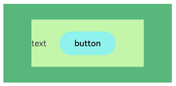

# 层叠布局 (Stack)

## 概述

层叠布局（StackLayout）用于在屏幕上预留一块区域来显示组件中的元素，提供元素可以重叠的布局。层叠布局通过[Stack](../../../reference/source_zh_cn/arkui-cj/cj-row-column-stack-stack.md)容器组件实现位置的固定定位与层叠，容器中的子元素依次入栈，后一个子元素覆盖前一个子元素，子元素可以叠加，也可以设置位置。

层叠布局具有较强的页面层叠、位置定位能力，其使用场景有广告、卡片层叠效果等。

如图1，Stack作为容器，容器内的子元素的顺序为Item1-&gt;Item2-&gt;Item3。

**图1** 层叠布局


## 开发布局

Stack组件为容器组件，容器内可包含各种子元素。其中子元素默认进行居中堆叠。子元素被约束在Stack下，进行样式定义以及排列。

 <!-- run -->

```cangjie
package ohos_app_cangjie_entry
import kit.ArkUI.*
import ohos.arkui.state_macro_manage.*

@Entry
@Component
class EntryView {
    func build() {
        Column() {
            Stack() {
                Column() {}
                    .width(90.percent)
                    .height(100.percent)
                    .backgroundColor(0xff58b87c)
                Text('text')
                    .width(60.percent)
                    .height(60.percent)
                    .backgroundColor(0xffc3f6aa)
                Button('button')
                    .width(30.percent)
                    .height(30.percent)
                    .backgroundColor(0xff8ff3eb)
                    .fontColor(0x000)
            }
            .width(100.percent)
            .height(150)
            .margin(top: 50)
        }
    }
}
```



## 对齐方式

Stack组件通过[alignContent参数](../../../reference/source_zh_cn/arkui-cj/cj-row-column-stack-stack.md#func-aligncontentalignment)实现位置的相对移动。如图2所示，支持九种对齐方式。

**图2** Stack容器内元素的对齐方式  


 <!-- run -->

```cangjie
package ohos_app_cangjie_entry
import kit.ArkUI.*
import ohos.arkui.state_macro_manage.*

@Entry
@Component
class EntryView {
    func build() {
        Stack(alignContent: Alignment.TopStart) {
            Text('Stack')
                .width(90.percent)
                .height(100.percent)
                .backgroundColor(0xe1dede)
                .align(Alignment.BottomEnd)
            Text('Item 1')
                .width(70.percent)
                .height(80.percent)
                .backgroundColor(0xd2cab3)
                .align(Alignment.BottomEnd)
            Text('Item 2')
                .width(50.percent)
                .height(60.percent)
                .backgroundColor(0xc1cbac)
                .align(Alignment.BottomEnd)
        }
        .width(100.percent)
        .height(150)
        .margin(top: 5)
    }
}
```

## Z序控制

Stack容器中兄弟组件显示层级关系可以通过[Z序控制](../../../reference/source_zh_cn/arkui-cj/cj-universal-attribute-zorder.md)的zIndex属性改变。zIndex值越大，显示层级越高，即zIndex值大的组件会覆盖在zIndex值小的组件上方。

  在层叠布局中，如果后面子元素尺寸大于前面子元素尺寸，则前面子元素完全隐藏。

 <!-- run -->

```cangjie
package ohos_app_cangjie_entry
import kit.ArkUI.*
import ohos.arkui.state_macro_manage.*

@Entry
@Component
class EntryView {
    func build() {
        Stack(alignContent: Alignment.BottomStart) {
            Column() {
                Text('Stack子元素1')
                    .textAlign(TextAlign.End)
                    .fontSize(20)
            }
            .width(100)
            .height(100)
            .backgroundColor(0xffd306)

            Column() {
                Text('Stack子元素2').fontSize(20)
            }
            .width(150)
            .height(150)
            .backgroundColor(0xFEC0CD)

            Column() {
                Text('Stack子元素3').fontSize(20)
            }
            .width(200)
            .height(200)
            .backgroundColor(Color.Gray)
        }
        .width(350)
        .height(350)
        .backgroundColor(0xe0e0e0)
    }
}
```


上图中，最后的子元素3的尺寸大于前面的所有子元素，所以，前面两个元素完全隐藏。改变子元素1，子元素2的zIndex属性后，可以将元素展示出来。

 <!-- run -->

```cangjie
package ohos_app_cangjie_entry
import kit.ArkUI.*
import ohos.arkui.state_macro_manage.*

@Entry
@Component
class EntryView {
    func build() {
        Stack(alignContent: Alignment.BottomStart) {
            Column() {
                Text('Stack子元素1').fontSize(20)
            }
            .width(100)
            .height(100)
            .backgroundColor(0xffd306)
            .zIndex(2)
            Column() {
                Text('Stack子元素2').fontSize(20)
            }
            .width(150)
            .height(150)
            .backgroundColor(0xFEC0CD)
            .zIndex(1)
            Column() {
                Text('Stack子元素3').fontSize(20)
            }
            .width(200)
            .height(200)
            .backgroundColor(Color.Gray)
        }
        .width(350)
        .height(350)
        .backgroundColor(0xe0e0e0)
    }
}
```


## 场景示例

使用层叠布局快速搭建页面。

 <!-- run -->

```cangjie
package ohos_app_cangjie_entry
import kit.ArkUI.*
import ohos.arkui.state_macro_manage.*

@Entry
@Component
class EntryView {
    private var arr: Array<String> = ['APP1', 'APP2', 'APP3', 'APP4', 'APP5', 'APP6', 'APP7', 'APP8'];
    func build() {
        Stack(alignContent: Alignment.Bottom) {
            Flex(wrap: FlexWrap.Wrap) {
                ForEach(this.arr,itemGeneratorFunc: {
                    item: String, idx: Int64 => Text(item)
                        .width(100)
                        .height(100)
                        .fontSize(16)
                        .margin(10)
                        .textAlign(TextAlign.Center)
                        .borderRadius(10)
                        .backgroundColor(0xFFFFFF)
                    },
                    keyGeneratorFunc: {item: String, idx: Int64 => idx.toString()}
                )
            }
            .width(100.percent)
            .height(100.percent)
            Flex(justifyContent: FlexAlign.SpaceAround, alignItems: ItemAlign.Center) {
                Text('联系人').fontSize(16)
                Text('设置').fontSize(16)
                Text('短信').fontSize(16)
            }
            .width(50.percent)
            .height(50)
            .backgroundColor(0x16302e2e)
            .margin(bottom: 15)
            .borderRadius(15)
        }
        .width(100.percent)
        .height(100.percent)
        .backgroundColor(0xCFD0CF)
    }
}
```


