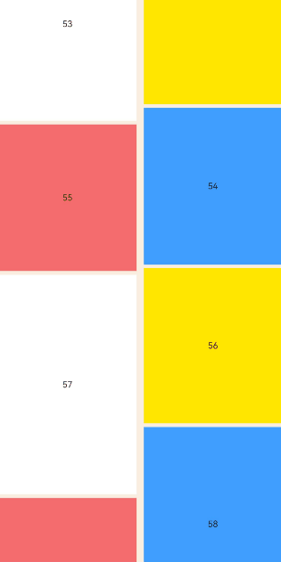
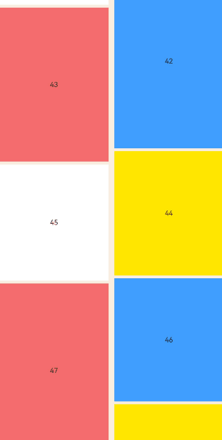
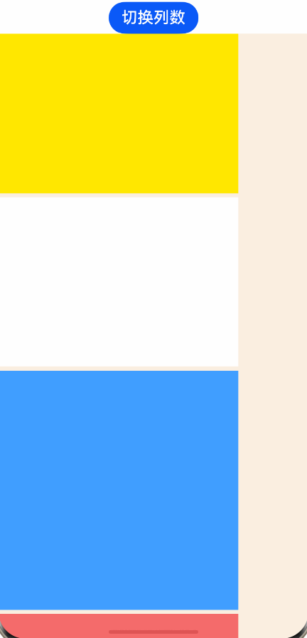

# 创建瀑布流（WaterFlow）

ArkUI提供了WaterFlow容器组件，用于构建瀑布流布局。WaterFlow组件支持条件渲染、循环渲染和懒加载等方式生成子组件。

## 布局与约束

瀑布流支持横向和纵向布局。在横向布局中，可以通过rowsTemplate设置行数。

在瀑布流的纵向布局中，第一行的子节点按从左到右顺序排列，从第二行开始，每个子节点将放置在当前总高度最小的列。如果多个列的总高度相同，则按照从左到右的顺序填充。如下图：


在瀑布流的横向布局中，每个子节点都会放置在当前总宽度最小的行。若多行总宽度相同，则按照从上到下的顺序进行填充。


## 无限滚动

### 到达末尾时新增数据

瀑布流常用于无限滚动的信息流。并将footer做成正在加载新数据的样式（使用[LoadingProgress](../../../API_Reference/source_zh_cn/arkui-cj/cj-information-display-loadingprogress.md)组件）。

 <!-- run -->

```cangjie
package ohos_app_cangjie_entry
import kit.ArkUI.*
import ohos.arkui.state_macro_manage.*
import std.collection.*
import kit.BasicServicesKit.agent.State
import ohos.ui_test.Driver

class MyDataSource <: IDataSource<Int64> {
    public MyDataSource(let data_: ArrayList<Int64>) {}
    public var listenerOp: Option<DataChangeListener> = None
    public func getData(index: Int64): Int64 {
        return data_[index]
    }

    public func onRegisterDataChangeListener(listener: DataChangeListener): Unit {
        listenerOp = listener
    }

    public func onUnregisterDataChangeListener(listener: DataChangeListener): Unit {
        listenerOp = None
    }

    public func totalCount(): Int64 {
        return data_.size
    }

    public func addLastItem(): Unit {
        data_.add(data_.size)
    }

    public func addNewItems(count: Int64): Unit{
        let len: Int64 = this.data_.size
        for(i in 1..=count){
            this.data_.add(this.data_.size)
        }
        this.notifyReloaded1()
    }

    public func notifyReloaded(): Unit {
        let listener: DataChangeListener = listenerOp.getOrThrow()
        listener.onDataReloaded()
    }

    public func notifyReloaded1(): Unit {
        let listener: DataChangeListener = listenerOp.getOrThrow()
        listener.onDatasetChange(ArrayList<DataOperation>([DataAddOperation( 0,count: 1, key: "")]))
    }
}

@Entry
@Component
class EntryView {
    @State
    var myDataSource: MyDataSource = MyDataSource(ArrayList<Int64>(100, {i => i}))
    @State
    var myHight: Array<Int64> = [200, 212, 334, 265, 214]
    var myColor: Array<Int64> = [0xFFE700, 0xffffff, 0x409EFF, 0xf56c6c]
    var myScroller: Scroller = Scroller()

    @Builder
    func itemFoot(): Unit {
        Column() {
          Text("正在加载")
            .fontSize(20)
            .backgroundColor(0xFFE700)
            .width(100)
            .height(50)
            .align(Alignment.Center)
            .margin(20.vp)
        }.width(100).justifyContent(FlexAlign.Center)
    }

    func build() {
        Column() {
            WaterFlow(footer: bind(itemFoot, this), scroller: myScroller, layoutMode: WaterFlowLayoutMode.SLIDING_WINDOW) {
                LazyForEach(
                    this.myDataSource,
                    itemGeneratorFunc: {
                        element: Int64, index: Int64 =>
                        FlowItem() {
                            Column() {
                                Text(element.toString()).fontSize(12).height(16.vp)
                            }
                        }
                        .width(100.percent)
                        .height(myHight[element % 5])
                        .backgroundColor(this.myColor[element % 4])
                    }
                )
            }
            .layoutDirection(FlexDirection.Column)
            .itemConstraintSize(20.vp, 300.vp, 20.vp, 300.vp)
            .columnsTemplate("1fr 1fr")
            .columnsGap(10.vp)
            .rowsGap(5.vp)
            .backgroundColor(0xFAEEE0)
            .enableScrollInteraction(true)
            .friction(0.7)
            .cachedCount(20, true)
            .width(100.percent)
            .height(100.percent)
            .onReachStart({=>
                AppLog.info('waterFlow reach start')
            })
            .onReachEnd({=>
                AppLog.info('waterFlow reach end')
                sleep(Duration.second/2)
                this.myDataSource.addNewItems(10)
            })
            .onScrollFrameBegin({offset: Float64, state: ScrollState =>
                AppLog.info("waterFlow scrollFrameBegin offset: " + offset.toString() + " state: " + state.toString())
                return offset
            })
            .onScrollIndex({first: Int32, last: Int32=>
                AppLog.info("waterFlow onScrollIndex first: " + first.toString() + " last: " + last.toString() + " totalCount: " + this.myDataSource.totalCount().toString())
            })
        }.height(100.percent)
    }
}
```

在此处应通过在数据末尾添加元素的方式来新增数据，不可直接修改dataArray后通过LazyForEach的onDataReloaded()方法通知瀑布流重新加载数据。

由于在瀑布流布局中，各子节点的高度不一致，下面的节点位置依赖于上面的节点，所以重新加载所有数据会触发整个瀑布流重新计算布局，可能会导致卡顿。在数据末尾增加数据后，应使用onDatasetChange()方法通知，以使瀑布流能够识别新增数据并继续加载，同时避免对已有数据进行重复处理。



### 提前新增数据

虽然在onReachEnd()触发时加载数据可以实现无限加载，但在滑动到底部会出现明显的停顿。

为了实现更加流畅的无限滑动，需要调整增加新数据的时机。比如可以在LazyForEach还剩余若干个数据未遍历的情况下提前加载新数据。

 <!-- run -->

```cangjie
package ohos_app_cangjie_entry
import kit.ArkUI.*
import ohos.arkui.state_macro_manage.*
import std.collection.*
import kit.BasicServicesKit.agent.State
import ohos.ui_test.Driver

class MyDataSource <: IDataSource<Int64> {
    public MyDataSource(let data_: ArrayList<Int64>) {}
    public var listenerOp: Option<DataChangeListener> = None
    public func getData(index: Int64): Int64 {
        return data_[index]
    }

    public func onRegisterDataChangeListener(listener: DataChangeListener): Unit {
        listenerOp = listener
    }

    public func onUnregisterDataChangeListener(listener: DataChangeListener): Unit {
        listenerOp = None
    }

    public func totalCount(): Int64 {
        return data_.size
    }

    public func addLastItem(): Unit {
        data_.add(data_.size)
    }

    public func addNewItems(count: Int64): Unit{
        let len: Int64 = this.data_.size
        for(i in 1..=count){
            this.data_.add(this.data_.size)
        }
        this.notifyReloaded1()
    }

    public func notifyReloaded(): Unit {
        let listener: DataChangeListener = listenerOp.getOrThrow()
        listener.onDataReloaded()
    }

    public func notifyReloaded1(): Unit {
        let listener: DataChangeListener = listenerOp.getOrThrow()
        listener.onDatasetChange(ArrayList<DataOperation>([DataAddOperation( 0,count: 1, key: "")]))
    }
}

@Entry
@Component
class EntryView {
    @State
    var myDataSource: MyDataSource = MyDataSource(ArrayList<Int64>(100, {i => i}))
    @State
    var myHight: Array<Int64> = [200, 212, 334, 265, 214]
    var myColor: Array<Int64> = [0xFFE700, 0xffffff, 0x409EFF, 0xf56c6c]
    var myScroller: Scroller = Scroller()

    @Builder
    func itemFoot(): Unit {
        Column() {
          Text("正在加载")
            .fontSize(20)
            .backgroundColor(0xFFE700)
            .width(100)
            .height(50)
            .align(Alignment.Center)
            .margin(20.vp)
        }.width(100).justifyContent(FlexAlign.Center)
    }

    func build() {
        Column() {
            WaterFlow(footer: bind(itemFoot, this), scroller: myScroller, layoutMode: WaterFlowLayoutMode.SLIDING_WINDOW) {
                LazyForEach(
                    this.myDataSource,
                    itemGeneratorFunc: {
                        element: Int64, index: Int64 =>
                        FlowItem() {
                            Column() {
                                Text(element.toString()).fontSize(12).height(16.vp)
                            }
                        }
                        .width(100.percent)
                        .height(myHight[element % 5])
                        .backgroundColor(this.myColor[element % 4])
                    }
                )
            }
            .layoutDirection(FlexDirection.Column)
            .itemConstraintSize(20.vp, 300.vp, 20.vp, 300.vp)
            .columnsTemplate("1fr 1fr")
            .columnsGap(10.vp)
            .rowsGap(5.vp)
            .backgroundColor(0xFAEEE0)
            .enableScrollInteraction(true)
            .friction(0.7)
            .cachedCount(20, true)
            .width(100.percent)
            .height(100.percent)
            .onReachStart({=>
                AppLog.info('waterFlow reach start')
            })
            .onReachEnd({=>
                AppLog.info('waterFlow reach end')
            })
            .onScrollFrameBegin({offset: Float64, state: ScrollState =>
                AppLog.info("waterFlow scrollFrameBegin offset: " + offset.toString() + " state: " + state.toString())
                return offset
            })
            .onScrollIndex({first: Int32, last: Int32=>
                AppLog.info("waterFlow onScrollIndex first: " + first.toString() + " last: " + last.toString() + " totalCount: " + this.myDataSource.totalCount().toString())
                    if(Int64(last + 20) >= this.myDataSource.totalCount()){
                        this.myDataSource.addNewItems(10)
                    }
            })
        }.height(100.percent)
    }
}
```



## 动态切换列数

通过动态调整瀑布流的列数，应用能够实现在列表模式与瀑布流模式间的切换，或适应屏幕宽度的变化。若要动态设置列数，建议采用瀑布流的移动窗口布局模式，以实现更快速的列数转换。

 <!-- run -->

```cangjie
package ohos_app_cangjie_entry
import kit.ArkUI.*
import ohos.arkui.state_macro_manage.*
import std.collection.*
import kit.BasicServicesKit.agent.State
import ohos.ui_test.Driver
import kit.ArkData.Entry
import kit.ImageKit.Component

class MyDataSource <: IDataSource<Int64> {
    public MyDataSource(let data_: ArrayList<Int64>) {}
    public var listenerOp: Option<DataChangeListener> = None
    public func getData(index: Int64): Int64 {
        return data_[index]
    }

    public func onRegisterDataChangeListener(listener: DataChangeListener): Unit {
        listenerOp = listener
    }

    public func onUnregisterDataChangeListener(listener: DataChangeListener): Unit {
        listenerOp = None
    }

    public func totalCount(): Int64 {
        return data_.size
    }

    public func addLastItem(): Unit {
        data_.add(data_.size)
    }

    public func addNewItems(count: Int64): Unit{
        let len: Int64 = this.data_.size
        for(i in 1..=count){
            this.data_.add(this.data_.size)
        }
        this.notifyReloaded1()
    }

    public func notifyReloaded(): Unit {
        let listener: DataChangeListener = listenerOp.getOrThrow()
        listener.onDataReloaded()
    }

    public func notifyReloaded1(): Unit {
        let listener: DataChangeListener = listenerOp.getOrThrow()
        listener.onDatasetChange(ArrayList<DataOperation>([DataAddOperation( 0,count: 1, key: "")]))
    }
}

@Reusable
@Component
class ReusableListItem {
    @State
    var item: Int64 = 0

    protected override func aboutToReuse(params: ReuseParams) {
        let nameVal = params.get("item").getOrThrow()
        this.item = nameVal as Int64 ?? 0
      }
    func build() {
        Row() {
          Image('res/waterFlow(' + (this.item % 5).toString() + ').JPG')
            .objectFit(ImageFit.Fill)
            .height(100)
            .aspectRatio(1)
          Text("N" + this.item.toString()).fontSize(12).height(16).layoutWeight(1).textAlign(TextAlign.Center)
        }
    }
}
@Reusable
@Component
class  ReusableFlowItem {
  @State
    var item: Int64 = 0

  // 从复用缓存中加入到组件树之前调用，可在此处更新组件的状态变量以展示正确的内容
    protected override func aboutToReuse(params: ReuseParams) {
        let nameVal = params.get("item").getOrThrow()
        this.item = nameVal as Int64 ?? 0
      }

  protected  override func aboutToAppear() {
    AppLog.info('new item:' + this.item.toString())
  }

  func build() {
    Image('res/waterFlowTest(' + (this.item % 5).toString() + ').jpg')
        .overlay(title:'N' + this.item.toString(), align:Alignment.Top , offset: ContentOffset(x: 0.0, y: 0.0))
        .objectFit(ImageFit.Fill)
        .width(100.percent)
        .layoutWeight(1)
  }
}

@Entry
@Component
class EntryView {
    @State
    var columns: Int64 = 2
    @State
    var myDataSource: MyDataSource = MyDataSource(ArrayList<Int64>(100, {i => i}))
    @State
    var myHight: Array<Int64> = [200, 212, 334, 265, 214]
    var myColor: Array<Int64> = [0xFFE700, 0xffffff, 0x409EFF, 0xf56c6c]
    var myScroller: Scroller = Scroller()
    @State
    var columns_string: String = "1fr 1fr"

    @Builder
    func itemFoot(): Unit {
        Column() {
          Text("正在加载")
            .fontSize(20)
            .backgroundColor(0xFFE700)
            .width(100)
            .height(50)
            .align(Alignment.Center)
            .margin(20.vp)
        }.width(100).justifyContent(FlexAlign.Center)
    }

    func build() {
        Column() {
            Button("切换列数").fontSize(20).onClick(){ =>
                if(this.columns == 2){
                    this.columns = 1;
                    this.columns_string="1fr"
                } else{
                    this.columns = 2;
                    this.columns_string = "1fr 1fr"
                }
            }

            WaterFlow(footer: bind(itemFoot, this), scroller: myScroller, layoutMode: WaterFlowLayoutMode.SLIDING_WINDOW) {
                LazyForEach(
                    this.myDataSource,
                    itemGeneratorFunc: {
                        element: Int64, index: Int64 =>
                        FlowItem() {
                        }
                        .width(100.percent)
                        .height(myHight[element % 5])
                        .backgroundColor(this.myColor[element % 4])
                    }
                )
            }
            .layoutDirection(FlexDirection.Column)
            .itemConstraintSize(20.vp, 300.vp, 20.vp, 300.vp)
            .columnsTemplate(this.columns_string)
            .columnsGap(10.vp)
            .rowsGap(5.vp)
            .backgroundColor(0xFAEEE0)
            .enableScrollInteraction(true)
            .friction(0.7)
            .cachedCount(20, true)
            .width(100.percent)
            .height(100.percent)
            .onReachStart({=>
                AppLog.info('waterFlow reach start')
            })
            .onReachEnd({=>
                AppLog.info('waterFlow reach end')
            })
            .onScrollFrameBegin({offset: Float64, state: ScrollState =>
                AppLog.info("waterFlow scrollFrameBegin offset: " + offset.toString() + " state: " + state.toString())
                return offset
            })
            .onScrollIndex({first: Int32, last: Int32=>
                AppLog.info("waterFlow onScrollIndex first: " + first.toString() + " last: " + last.toString() + " totalCount: " + this.myDataSource.totalCount().toString())
                    if(Int64(last + 20) >= this.myDataSource.totalCount()){
                        this.myDataSource.addNewItems(10)
                    }
            })
        }.height(100.percent)
    }
}
```



## 分组混合布局

许多应用界面在瀑布流上方包含其他内容，这类场景可通过在Scroll或List内部嵌套WaterFlow来实现。类似下图：


如果能够将不同部分的子节点整合到一个数据源中，那么通过设置 WaterFlowSections，可以在一个 WaterFlow 容器内实现混合布局。与嵌套滚动相比，这种方法可以简化滚动事件处理等应用逻辑。

每个瀑布流分组可以分别设置自己的列数、行间距、列间距、margin和子节点总数，如下代码可以实现上述效果：

 <!-- run -->

```cangjie
package ohos_app_cangjie_entry
import kit.ArkUI.*
import ohos.arkui.state_macro_manage.*
import std.collection.*

class MyDataSource <: IDataSource<Int64> {
    public MyDataSource(let data_: ArrayList<Int64>) {}
    public var listenerOp: Option<DataChangeListener> = None
    public func getData(index: Int64): Int64 {
        return data_[index]
    }

    public func onRegisterDataChangeListener(listener: DataChangeListener): Unit {
        listenerOp = listener
    }

    public func onUnregisterDataChangeListener(listener: DataChangeListener): Unit {
        listenerOp = None
    }

    public func totalCount(): Int64 {
        return data_.size
    }

    public func addLastItem(): Unit {
        data_.add(data_.size)
    }

    public func addNewItems(count: Int64): Unit{
        let len: Int64 = this.data_.size
        for(i in 1..=count){
            this.data_.add(this.data_.size)
        }
        this.notifyReloaded1()
    }

    public func notifyReloaded(): Unit {
        let listener: DataChangeListener = listenerOp.getOrThrow()
        listener.onDataReloaded()
    }

    public func notifyReloaded1(): Unit {
        let listener: DataChangeListener = listenerOp.getOrThrow()
        listener.onDatasetChange(ArrayList<DataOperation>([DataAddOperation( 0,count: 1, key: "")]))
    }
}

@Entry
@Component
class EntryView {
    @State
    var minSize: Int64 = 80;
    var maxSize: Int64 = 180;
    var myColor: Array<Int64> = [0xFFE700, 0xffffff, 0x409EFF, 0xf56c6c]
    var myDataSource: MyDataSource = MyDataSource(ArrayList<Int64>(100, {i => i}))
    private var itemWidthArray: ArrayList<Int64> = ArrayList<Int64>();
    private var itemHeightArray: ArrayList<Int64> = ArrayList<Int64>();
    var myHight: Array<Int64> = [200, 212, 334, 265, 214]
    var sections: WaterFlowSections = WaterFlowSections();
    var sectionMargin: Margin = Margin(top:10,right:5,bottom:10,left:5)
    var oneColumnSection: SectionOptions = SectionOptions(itemsCount: 1, margin: this.sectionMargin, crossCount: 1, columnsGap: 5, rowsGap: 10)
    var twoColumnSection: SectionOptions = SectionOptions(itemsCount: 98,crossCount:2)
    // 使用分组瀑布流时无法通过footer设置尾部组件，可以保留一个固定的分组作为footer
    var lastSection: SectionOptions = SectionOptions(itemsCount: 1,crossCount:1)
    var myScroller: Scroller = Scroller()

    public func getsize(){
        return minSize
    }

    @Builder
    func itemFoot(): Unit {
        Column() {
          Text("正在加载")
            .fontSize(20)
            .backgroundColor(0xFFE700)
            .width(100)
            .height(50)
            .align(Alignment.Center)
            .margin(20.vp)
        }.width(100).justifyContent(FlexAlign.Center)
    }

    public override func aboutToAppear() {
        setItemSizeArray()
        let sectionOptions: Array<SectionOptions> = [this.oneColumnSection, this.twoColumnSection, this.lastSection];
        this.sections.splice(0, 0, sectionOptions);
        return
   }

    public func setItemSizeArray() {
        for (i in 1..15) {
            this.itemWidthArray.add(this.getsize());
            this.itemHeightArray.add(this.getsize());
        }
    }

    func build() {
        Column(){
            WaterFlow(footer: bind(itemFoot, this), scroller: myScroller, layoutMode: WaterFlowLayoutMode.SLIDING_WINDOW,waterFlowSections:this.sections) {
                LazyForEach(
                    this.myDataSource,
                    itemGeneratorFunc: {
                        element: Int64, index: Int64 =>
                        FlowItem() {
                            if(index == 0){
                                Column(){
                                    Grid(){
                                        GridItem(){
                                            Text("GridItem").fontSize(16).height(12)
                                        }.backgroundColor(Color.PINK)
                                    }
                                    .columnsTemplate("lfr")
                                    .rowsTemplate("lfr")
                                    .width(120)
                                    .height(myHight[element % 5])
                                    .backgroundColor(Color.PINK)
                                    .rowsGap(5)
                                    .columnsGap(4)
                                }
                            }
                            else{
                                Column(){
                                    Text(element.toString()).fontSize(12).height(16.vp)
                                }
                            }
                        }
                        .width(100.percent)
                        .height(myHight[element % 5])
                        .backgroundColor(this.myColor[element % 4])
                    }
                )
            }
            .layoutDirection(FlexDirection.Column)
            .itemConstraintSize(20.vp, 300.vp, 20.vp, 300.vp)
            .columnsTemplate("1fr 1fr")
            .columnsGap(10.vp)
            .rowsGap(5.vp)
            .backgroundColor(0xFAEEE0)
            .enableScrollInteraction(true)
            .friction(0.7)
            .cachedCount(20, true)
            .width(100.percent)
            .height(100.percent)
            .onReachStart({=>
                AppLog.info('waterFlow reach start')
            })
            .onReachEnd({=>
                AppLog.info('waterFlow reach end')
            })
            .onScrollFrameBegin({offset: Float64, state: ScrollState =>
                AppLog.info("waterFlow scrollFrameBegin offset: " + offset.toString() + " state: " + state.toString())
                return offset
            })
            .onScrollIndex({first: Int32, last: Int32=>
                AppLog.info("waterFlow onScrollIndex first: " + first.toString() + " last: " + last.toString() + " totalCount: " + this.myDataSource.totalCount().toString())
                    if(Int64(last + 20) >= this.myDataSource.totalCount()){
                        this.myDataSource.addNewItems(10)
                        this.twoColumnSection.itemsCount += 10;
                        this.sections.update(1, this.twoColumnSection);
                    }
            })
        }
    }
}
```


> **说明：**
>
> - 使用分组混合布局时不支持单独设置footer，可以使用最后一个分组作为尾部组件。
> - 增加或删除数据后需要同步修改对应分组的itemCount。
