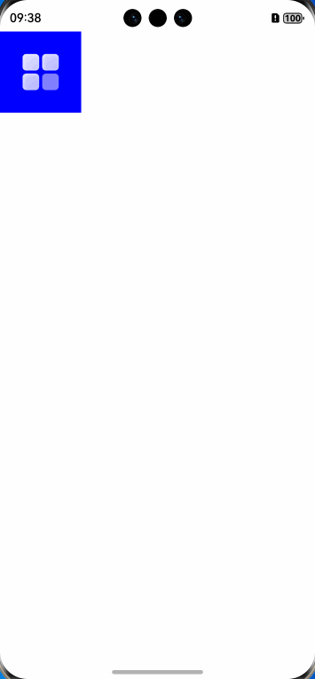

# 旋转屏动画

旋转屏动画主要分为两类：[布局切换的旋转屏动画](#布局切换的旋转屏动画)和[透明度变化的旋转屏动画](#透明度变化的旋转屏动画)，旨在实现屏幕显示方向变化时的自然过渡。布局切换的旋转屏动画实现较为简便，例如在module.json5中配置自动旋转（或设置窗口显示方向）即可实现。而透明度变化的旋转屏动画则需在module.json5配置的基础上，预备两套视图，在屏幕旋转时，通过视图切换，使消失的视图呈现渐隐效果，新出现的视图则渐显，从而营造流畅的视觉体验。

## 布局切换的旋转屏动画

布局切换时的旋转屏动画，是在屏幕显示方向改变时，为窗口与应用视图同步旋转而设计的大小和位置过渡动画。这种布局切换的旋转屏动画是系统默认的，便于开发者实现。当屏幕显示方向变化时，系统会生成窗口旋转动画，并自动调整窗口大小以匹配旋转后的尺寸。在此过程中，窗口会通知对应的应用，要求其根据新的窗口大小重新布局，产生与窗口旋转动画参数相同的布局动画。

切换屏幕方向即可实现布局切换的旋转屏动画效果。

 <!--run-->

```cangjie
package ohos_app_cangjie_entry

import kit.ArkUI.*
import ohos.arkui.state_macro_manage.*
import ohos.resource_manager.*

@Entry
@Component
class EntryView{
    func build(){
        Column(){
            Image(@r(app.media.foreground))
                .position(x: 0,y: 0)
                .size(width: 100,height: 100)
                .id('image1')
                .backgroundColor(Color.Blue)
        }
    }
}
```

需要在项目的module.json5文件中的abilities列表里添加"orientation"，指定为"auto_rotation"。

```json
"orientation": "auto_rotation",
```

布局切换的旋转屏动画，会对同步旋转的窗口与应用视图做大小和位置的过渡。



## 透明度变化的旋转屏动画

透明度变化的旋转屏动画在屏幕显示方向变化时启用，当窗口进行旋转动画时，为旋转过程中新增或删除的组件添加默认透明度转场，以实现组件的优雅出现和消失。此功能通过监听窗口旋转事件，在事件中切换组件的视图效果，如果消失视图的根节点和新出现视图的根节点未设置转场效果，会为其自动添加默认透明度转场（即[TransitionEffect](../../../reference/source_zh_cn/arkui-cj/cj-animation-transition.md#class-transitioneffect).OPACITY），展现出透明度的渐隐和渐显效果。

 <!-- run -example1 -->

```cangjie
package ohos_app_cangjie_entry

import kit.ArkUI.*
import ohos.arkui.state_macro_manage.*
import ohos.resource_manager.*
import ohos.display.*
import ohos.display.{Orientation as DisplayOrientation}

func matchor(orientation: DisplayOrientation): String {
    match(orientation){
        case Landscape => "Landscape"
        case Portrait => "Portrait"
        case LandscapeInverted => "LandscapeInverted"
        case PortraitInverted => "PortraitInverted"
        case _ => "FollowDesktop"
    }
}

@Entry
@Component
class EntryView{
    // 获取通过监听窗口的windowsSizeChange事件得到的屏幕显示方向
    @StorageLink["orientation"] var orientation: DisplayOrientation  = DisplayOrientation.Portrait

    func build(){
        Stack() {
            if(matchor(orientation) == "Portrait"|| matchor(orientation) == "PortraitInverted"){
                Image(@r(app.media.startIcon))
                    .size(width: 100, height: 100 )
                    .id('image1')
                  // 开发者也可以通过自行设置transition的TransitionEffect.OPACITY转场效果来实现旋转屏动画的透明度变化
//                   .transition(TransitionEffect.OPACITY)
            }else{
                Image(@r(app.media.startIcon))
                    .position(x: 0, y: 0 )
                    .size( width: 200, height: 200)
                    .id('image2')
                    // 开发者也可以通过自行设置transition的TransitionEffect.OPACITY转场效果来实现旋转屏动画的透明度变化
//                    .transition(TransitionEffect.OPACITY)
            }
        }.backgroundColor(Color.White).size(width: 100.percent, height: 100.percent)
    }
}
```

监听窗口旋转的同步事件windowsSizeChange来实现视图的切换。例如可在main_ability.cj文件的onWindowStageCreate方法中添加处理逻辑以获取屏幕的显示方向。

需要在项目的 module.json5 文件中的 abilities 列表里添加 "orientation"，指定为 "auto_rotation"。

```json
"orientation": "auto_rotation",
```

透明度变化的旋转屏动画，会对窗口做大小和位置的过渡，并同时对应用视图做切换过渡，且为消失隐藏的应用视图做渐隐效果，对新出现的视图做渐显的效果。


