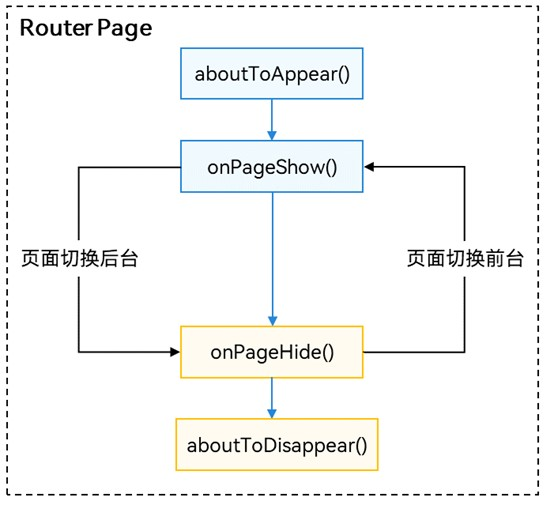

# Router切换Navigation

鉴于组件导航(Navigation)支持更丰富的动效、一次开发多端部署能力和更灵活的栈操作。本文主要从页面跳转、动效和生命周期等方面介绍如何从Router切换到Navigation。

## 页面结构

Router路由的页面是一个@Entry修饰的Component。

以下为Router页面的示例。

 <!-- run -->

```cangjie
// index.cj
package ohos_app_cangjie_entry
import kit.ArkUI.*
import ohos.arkui.state_macro_manage.*

@Entry
@Component
class EntryView {
    @State
    var message: String = "Hello World";
    func build() {
        Row() {
            Column() {
                Text(this.message)
                    .fontSize(10)
                    .fontWeight(FontWeight.Bold)
                Button("router to pageOne")
                    .stateEffect(true)
                    .width(120)
                    .height(80)
                    .margin(40)
                    .onClick({ =>
                        Router.pushUrl(url: "pageOne" ,// 目标url
                        params: "pagesparams", mode: RouterMode.Standard, callback: { code => })
                    })
            }
            .width(100)
        }
    .height(100)
    }
}
```

 <!-- run -->

```cangjie
//pageOne.cj
package ohos_app_cangjie_entry
import kit.ArkUI.*
import ohos.arkui.state_macro_manage.*

@Entry
@Component
class pageOne {
    @State
    var message: String = "This is pageOne";
    func build() {
        Row() {
            Column() {
                Text(this.message)
                    .fontSize(10)
                    .fontWeight(FontWeight.Bold)
                Button("router back to Index")
                    .stateEffect(true)
                    .width(120)
                    .height(80)
                    .margin(40)
                    .onClick({ =>
                        Router.back();
                    })
            }
            .width(100)
        }
        .height(100)
    }
}
```

而基于Navigation的路由页面分为导航页和子页，导航页又叫Navbar，是Navigation包含的子组件，子页是NavDestination包含的子组件。

以下为Navigation导航页以及子页的示例。

 <!-- run -->

```cangjie
package ohos_app_cangjie_entry
import kit.ArkUI.*
import ohos.arkui.state_macro_manage.*

@Builder
func pageMap(name: String) {
    if (name == "pageOne") {
        PageOne()
    }
}

@Entry
@Component
class EntryView {
    var pageInfos: NavPathStack = NavPathStack()
    public func build() {
        Navigation(pageInfos) {
            Button("Navigation page")
                .onClick {
                    pageInfos.pushPath(NavPathInfo("pageOne", "pageOne test"))
            }
        }
        .navDestination(bind<String>(pageMap, this))
    }
}

@Component
class PageOne {
    var pageInfos: NavPathStack = NavPathStack()

    public func build() {
        NavDestination() {
            Column(){
                Button("回到首页",ButtonOptions(shape: ButtonType.Capsule))
                .width(80.percent)
                .height(40)
                .onClick{
                    => this.pageInfos.pop()
                }
            }
        }.title("pageOne")
        .onReady {context =>
            this.pageInfos = context.pathStack
        }
        .onBackPressed {
            this.pageInfos.pop()
            true
        }
    }
}
```

## 路由操作

通过全局Router实例来进行相关操作。


```cangjie

// push page
Router.pushUrl(url: "pageOne" , params: "pagesparams", callback: { code => })

// pop page
Router.back(url: "pageOne", params: "pagesparams");

// replace page
Router.replaceUrl(url: "pageOne", params: "pagesparams", callback: { code => })

// clear all page
Router.clear()

// 获取页面栈大小
let size = Router.getLength()

// 获取页面状态
let pageState = Router.getState()

```

Navigation通过页面栈对象[NavPathStack](../../../API_Reference/source_zh_cn/arkui-cj/cj-navigation-switching-navigation.md#class-navpathstack)提供的方法来操作页面，需要创建一个栈对象并传入Navigation中。


```cangjie
package ohos_app_cangjie_entry
import kit.ArkUI.*
import ohos.arkui.state_macro_manage.*

@Entry
@Component
class EntryView {
    var pathStack: NavPathStack = NavPathStack()
    public func build() {
        // 设置NavPathStack并传入Navigation
        Navigation(this.pageInfos) {
            // ...
        }.width(100.percent).height(100.perent)
        .title("Navigation")
    }
}


// push page
this.pathStack.pushPath("pageOne")

// pop page
this.pathStack.pop()
this.pathStack.popToIndex(1)
this.pathStack.popToName("pageOne")

// replace page
this.pathStack.replacePath(NavPathInfo("pageOne"))
this.pathStack.replacePathByName("pageOne")

// clear all page
this.pathStack.clear()

// 获取页面栈大小
let size = this.pathStack.size()

// 删除栈中name为PageOne的所有页面
this.pathStack.removeByName("pageOne")

// 删除指定索引的页面
this.pathStack.removeByIndexes([1, 3, 5])

// 获取栈中所有页面name集合
this.pathStack.getAllPathName()

// 获取索引为1的页面参数
this.pathStack.getParamByIndex(1)

// 获取PageOne页面的参数
this.pathStack.getParamByName("pageOne")

// 获取PageOne页面的索引集合
this.pathStack.getIndexByName("pageOne")
// ...

```

Router作为全局通用模块，可以在任意页面中调用，Navigation作为组件，子页面想要做路由需要拿到Navigation持有的页面栈对象NavPathStack，可以通过如下几种方式获取：

**方式一**：通过@Provide和@Consume传递给子页面（有耦合，不推荐）。


```cangjie
// Navigation根容器
package ohos_app_cangjie_entry
import kit.ArkUI.*
import ohos.arkui.state_macro_manage.*

@Entry
@Component
class EntryView {
    // Navigation创建一个Provide修饰的NavPathStack
    @Provide
    var pathStack: NavPathStack = NavPathStack()

    func build() {
        Navigation(this.pathStack) {
        // ...
        }
    }
}

// Navigation子页面
@Component
class PageOne {
    // NavDestination通过Consume获取到
    @Consume
    var pathStack: NavPathStack;

    func build() {
        NavDestination() {
        // ...
        }
    }
}
```

**方式二**：子页面通过OnReady回调获取。


```cangjie
@Component
class EntrvView {
    var pathStack: NavPathStack = NavPathStack()

    func build() {
        NavDestination() {
            // ...
        }
        .onReady{context =>
            this.pageInfos = context.pathStack
        }
    }
}
```

**方式三**： 通过全局的AppStorage接口设置获取。


```cangjie
package ohos_app_cangjie_entry
import kit.ArkUI.*
import ohos.arkui.state_macro_manage.*

@Entry
@Component
class EntrvView {
    var pathStack: NavPathStack = NavPathStack()
    func build() {
        Row() {
            Column() {
                Navigation(this.pathStack) {
                // ...
                }
                Text("title")
                    .fontSize(10)
                    .fontWeight(FontWeight.Bold)
                Button("button1")
                    .stateEffect(true)
                    .width(120)
                    .height(80)
                    .margin(40)
                    .onClick({ =>
                        AppStorage.setOrCreate("PathStack", this.pathStack)
                    })
            }
        }
    }
}

// Navigation子页面
@Component
class PageOne {
    // 子页面中获取全局的NavPathStack
    var pathStack: NavPathStack = AppStorage.get<NavPathStack>("PathStack").getOrThrow()

    func build() {
        NavDestination() {
        // ...
        }
    }
}
```

## 生命周期

Router页面生命周期为@Entry页面中的通用方法，主要有如下四个生命周期：


```cangjie

// 在执行其build()函数之前执行的回调
public func aboutToAppear(){
}

// 在自定义组件析构销毁之前执行的回调
public func aboutToDisappear(){
}

// 页面显示时的回调
public func onPageShow(){
}

// 页面隐藏时的回调
public func onPageHide(){
}

// 页面隐藏时的回调
public fun onPageHide(){
}
```

其生命周期时序如下图所示：



Navigation作为路由容器，其生命周期承载在NavDestination组件上，以组件事件的形式开放。


```cangjie
@Component
class EntryView {
    protected func aboutToDisappear() {
    }

    protected func aboutToAppear() {
    }

    func build() {
        NavDestination() {
            // ...
        }
        .onWillAppear({=>
        })
        .onAppear({=>
        })
        .onWillShow({=>
        })
        .onShown({=>
        })
        .onWillHide({=>
        })
        .onHide({=>
        })
        .onWillDisappear({=>
        })
        .onDisAppear({=>
        })
        .
    }
}
```

## 转场动画

Router和Navigation都提供了系统的转场动画也提供了自定义转场的能力。

其中Router自定义页面转场通过通用方法pageTransition()实现，具体请参见Router[页面转场动画](./cj-page-transition-animation.md)。

Navigation作为路由容器组件，其内部的页面切换动画本质上属于组件跟组件之间的属性动画。

## 共享元素转场

页面和页面之间跳转的时候需要进行共享元素过渡动画，Router可以通过通用属性sharedTransition来实现共享元素转场，具体请参见如下链接：

[Router共享元素转场动画](../../../API_Reference/source_zh_cn/arkui-cj/cj-animation-sharedtransition.md#共享元素转场-sharedtransition)

Navigation也提供了共享元素一镜到底的转场能力，需要配合geometryTransition属性，在子页面（NavDestination）之间切换时，可以实现共享元素转场，具体请参见[Navigation共享元素转场动画](cj-navigation-navigation.md#共享元素转场)。

## 跨包路由

Navigation作为路由组件，默认支持跨包跳转。

1. 在mainPage中导入自定义组件，并添加到pageMap中，即可正常调用。

         <!-- run -->

    ```cangjie
    package ohos_app_cangjie_entry
    import kit.ArkUI.*
    import ohos.arkui.state_macro_manage.*

    @Builder
    func pageMap(name: String) {
       // 1.定义路由映射表
       if (name == "PageInHSP") {
           PageInHSP()
       }
    }

    @Entry
    @Component
    class EntryView {
        var pageInfos: NavPathStack = NavPathStack()
        public func build() {
            Navigation(pageInfos) {
                Button("Navigation page")
                    .onClick {
                    // 1.定义路由映射表
                        pageInfos.pushPath(NavPathInfo("PageInHSP", "pageOne test"))
                }
            }
            .navDestination(bind<String>(pageMap, this))
        }
    }

    @Component
    class PageInHSP {
        var pageInfos: NavPathStack = NavPathStack()
        public func build() {
            NavDestination() {
                Text("Page One")
                    .onClick {evt =>
                        pageInfos.pop()
                }
            }
            .onReady { context =>
                pageInfos = context.pathStack
            }
            .onBackPressed {
                pageInfos.pop()
                true
            }
        }
    }
   ```

以上是通过**静态依赖**的形式完成了跨包的路由。

## 路由拦截

Router原生没有提供路由拦截的能力，开发者需要自行封装路由跳转接口，并在自己封装的接口中做路由拦截的判断并重定向路由。
