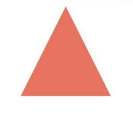

# 绘制几何图形 (Shape)

绘制组件用于在页面绘制图形，Shape组件是绘制组件的父组件，父组件中会描述所有绘制组件均支持的通用属性。具体用法请参考[Shape](../../../API_Reference/source_zh_cn/arkui-cj/cj-graphic-drawing-shape.md)。

## 创建绘制组件

绘制组件可以由以下两种形式创建：

- 绘制组件使用Shape作为父组件，实现类似SVG的效果。接口调用为以下形式：

  ```cangjie
  init()

  init(target: PixelMap)
  ```

  该接口用于创建带有父组件的绘制组件，其中target用于设置绘制目标，可将图形绘制在指定的PixelMap对象中，若未设置，则在当前绘制目标中进行绘制。

  ```cangjie
  Shape() {
      Rect().width(300).height(50)
  }
  ```

- 绘制组件单独使用，用于在页面上绘制指定的图形。有7种绘制类型，分别为[Circle](../../../API_Reference/source_zh_cn/arkui-cj/cj-graphic-drawing-circle.md)（圆形）、[Ellipse](../../../API_Reference/source_zh_cn/arkui-cj/cj-graphic-drawing-ellipse.md)（椭圆形）、[Line](../../../API_Reference/source_zh_cn/arkui-cj/cj-graphic-drawing-line.md)（直线）、[Path](../../../API_Reference/source_zh_cn/arkui-cj/cj-graphic-drawing-path.md)（路径）、[Rect](../../../API_Reference/source_zh_cn/arkui-cj/cj-graphic-drawing-rect.md)（矩形）。以Circle的接口调用为例：

  ```cangjie
  Circle()

  Circle(width!: Length, height!: Length)
  ```

  该接口用于在页面绘制圆形，其中width用于设置圆形的宽度，height用于设置圆形的高度，圆形直径由宽高最小值确定。

  ```cangjie
  Circle(width: 150, height: 150)
  ```

  

## 形状视口viewport

```cangjie
viewPort(x!: Length, y!: Length, width!: Length, height!: Length)
```

形状视口viewport指定用户空间中的一个矩形，该矩形映射到为关联的SVG元素建立的视区边界。viewport属性的值包含x、y、width和height四个可选参数，x和y表示视区的左上角坐标，width和height表示其尺寸。

以下3个示例讲解viewport具体用法：

- 通过形状视口对图形进行放大与缩小。

 <!-- run -->

  ```cangjie
  package ohos_app_cangjie_entry

  import ohos.base.*
  import ohos.arkui.component.*
  import ohos.arkui.state_management.*
  import ohos.arkui.state_macro_manage.*

  @Entry
  @Component
  class EntryView {
      func build() {
          Column() {
              Row() {
                  Column {
                      // 画一个宽高都为75的圆
                      Text('原始尺寸Circle组件')
                      Circle(width: 75, height: 75).fill(0XE87361)
                  }
              }
              Row() {
                  Column {
                      // 创建一个宽高都为150的shape组件，背景色为黄色，一个宽高都为75的viewport。用一个蓝色的矩形来填充viewport，在viewport中绘制一个直径为75的圆。
                      // 绘制结束，viewport会根据组件宽高放大两倍
                      Text('shape内放大的Circle组件')
                      Shape() {
                          Rect().width(100.percent).height(100.percent).fill(0X0097D4)
                          Circle(width: 75, height: 75).fill(0XE87361)
                      }
                      .viewPort(x: 0, y: 0, width: 75, height: 75)
                      .width(150)
                      .height(150)
                      .backgroundColor(0XF5DC62)
                  }
                  Column {
                      // 创建一个宽高都为150的shape组件，背景色为黄色，一个宽高都为300的viewport。用一个绿色的矩形来填充viewport，在viewport中绘制一个直径为75的圆。
                      // 绘制结束，viewport会根据组件宽高缩小两倍。
                      Text('Shape内缩小的Circle组件')
                      Shape() {
                          Rect().width(100.percent).height(100.percent).fill(0XBDDB69)
                          Circle(width: 75, height: 75).fill(0XE87361)
                      }
                      .viewPort(x: 0, y: 0, width: 300, height: 300)
                      .width(150)
                      .height(150)
                      .backgroundColor(0XF5DC62)
                  }
              }
          }.width(100.percent)
      }
  }
  ```

  

- 创建一个宽高都为300的shape组件，背景色为黄色，一个宽高都为300的viewport。用一个蓝色的矩形来填充viewport，在viewport中绘制一个半径为75的圆。

 <!-- run -->

  ```cangjie
  package ohos_app_cangjie_entry

  import ohos.base.*
  import ohos.arkui.component.*
  import ohos.arkui.state_management.*
  import ohos.arkui.state_macro_manage.*

  @Entry
  @Component
  class EntryView {
      func build() {
          Column() {
              Shape() {
                  Rect().width(100.percent).height(100.percent).fill(0X0097D4)
                  Circle( width: 150, height: 150 ).fill(0XE87361)
              }
              .viewPort(x: 0, y: 0, width: 300, height: 300)
              .width(300)
              .height(300)
              .backgroundColor(0XF5DC62)
          }.width(100.percent)
      }
  }
  ```

  .jpg)

- 创建一个宽高都为300的shape组件，背景色为黄色，创建一个宽高都为300的viewport。用一个蓝色的矩形来填充viewport，在viewport中绘制一个半径为75的圆，将viewport向右方和下方各平移150。

 <!-- run -->

  ```cangjie
  package ohos_app_cangjie_entry

  import ohos.base.*
  import ohos.arkui.component.*
  import ohos.arkui.state_management.*
  import ohos.arkui.state_macro_manage.*

  @Entry
  @Component
  class EntryView {
      func build() {
          Column() {
              Shape() {
                  Rect().width(100.percent).height(100.percent).fill(0X0097D4)
                  Circle( width: 150, height: 150 ).fill(0XE87361)
              }
              .viewPort(x: -150, y: -150, width: 300, height: 300)
              .width(300)
              .height(300)
              .backgroundColor(0XF5DC62)
          }.width(100.percent)
      }
  }
  ```

  .jpg)

## 自定义样式

绘制组件支持通过各种属性对组件样式进行更改。

- 通过fill可以设置组件填充区域颜色。

  ```cangjie
  Path()
      .width(100)
      .height(100)
      .commands('M150 0 L300 300 L0 300 Z')
      .fill(0xE87361)
      .strokeWidth(0)
  ```

  

- 通过stroke可以设置组件边框颜色。

  ```cangjie
  Path()
      .width(100)
      .height(100)
      .fillOpacity(0.0)
      .commands('M150 0 L300 300 L0 300 Z')
      .stroke(Color.Red)
  ```

  

- 通过strokeOpacity可以设置边框透明度。

  ```cangjie
  Path()
      .width(100)
      .height(100)
      .fillOpacity(0.0)
      .commands('M150 0 L300 300 L0 300 Z')
      .stroke(Color.Red)
      .strokeWidth(10)
      .strokeOpacity(0.2)
  ```

  

- 通过antiAlias设置是否开启抗锯齿，默认值为true（开启抗锯齿）。

  ```cangjie
  // 开启抗锯齿
  Circle()
      .width(150)
      .height(200)
      .fillOpacity(0.0)
      .strokeWidth(5)
      .stroke(Color.Black)
  ```

  

  ```cangjie
  // 关闭抗锯齿
  Circle()
      .width(150)
      .height(200)
      .fillOpacity(0.0)
      .strokeWidth(5)
      .stroke(Color.Black)
      .antiAlias(false)
  ```

  

## 场景示例

### 绘制封闭路径

在Shape的(-80, -5)点绘制一个封闭路径，填充颜色0x317AF7，线条宽度3，边框颜色红色，拐角样式锐角（默认值）。

 <!-- run -->

```cangjie
package ohos_app_cangjie_entry

import kit.ArkUI.*
import ohos.arkui.state_macro_manage.*

@Entry
@Component
class EntryView {
    func build() {
        Column(space: 10) {
            Shape() {
                Path().width(200).height(60).commands('M0 0 L400 0 L400 150 Z')
            }
            .viewPort( x: -80, y: -5, width: 500, height: 300 )
            .fill(0x317AF7)
            .stroke(Color.Red)
            .strokeWidth(3)
            .strokeLineJoin(LineJoinStyle.Miter)
            .strokeMiterLimit(5.0)
        }.width(100.percent).margin( top: 15 )
    }
}
```


### 绘制圆和圆环

绘制一个直径为150的圆，和一个直径为150、线条为红色虚线的圆环（宽高设置不一致时以短边为直径）。

 <!-- run -->

```cangjie
package ohos_app_cangjie_entry

import kit.ArkUI.*
import ohos.arkui.state_macro_manage.*

@Entry
@Component
class EntryView {
    func build() {
        Column(space: 10) {
            //绘制一个直径为150的圆
            Circle( width: 150, height: 150 )
            //绘制一个直径为150、线条为红色虚线的圆环
            Circle()
                .width(150)
                .height(200)
                .fillOpacity(0.0)
                .strokeWidth(3)
                .stroke(Color.Red)
                .strokeDashArray([1, 2])
        }.width(100.percent).margin( top: 15 )
    }
}
```


